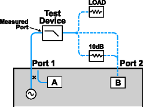
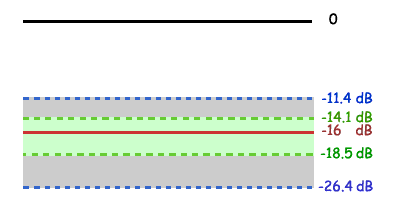

# Reflection Accuracy on Low-Loss 2-Port Devices

* * *

To make accurate reflection measurements that have a 1-port calibration, you
should terminate the unmeasured port.

  * [Why Terminate the Unmeasured Port](Refl_Accy.md#Why)

  * [How to Terminate the Unmeasured Port](Refl_Accy.md#How)

  * [Resulting Measurement Uncertainty](Refl_Accy.md#Resulting)

[Other topics about Optimizing Measurements](Optimize.md)

Why Terminate the Unmeasured Port

A 2-port calibration corrects for all 12 twelve error terms. A 1-port
calibration corrects for directivity, source match and frequency response, but
not load match. Therefore, for highest accuracy, you must make the load match
error as small as possible. This especially applies for low-loss, bi-
directional devices such as filter passbands and cables. You do not need to be
concerned with load match when you are measuring a device with high reverse
isolation, such as an amplifier.

How to Terminate the Unmeasured Port

Use one of the following methods:

  * Connect a high-quality termination load (from a calibration kit, for example) to the unmeasured port of your device. This technique yields measurement accuracy close to that of a Full SOLT 2-port calibration.

  * Connect the unmeasured port of your device directly to the analyzer, inserting a 10 dB precision attenuator between the device output and the analyzer. This improves the effective load match of the analyzer by approximately twice the value of the attenuator, or 20 dB.

Resulting Measurement Uncertainty

The following graph illustrates the measurement uncertainty that results from
terminating with and without a precision 10 dB attenuator on the output of the
test device.

Legend

* * *

|  Filter Reflection  
---|---  
\------------- |  Uncertainty with attenuator  
................ |  Uncertainty without attenuator  
  
The calculations below show how adding a high-quality 10 dB attenuator
improves the load match of the analyzer.

Note: The corresponding linear value is shown in parentheses.

Network Analyzer: |   
---|---  
Load match (NALM) |  = 18 dB (.126)  
Directivity (NAD) |  = 40 db (.010)  
Filter: |   
---|---  
Insertion loss (FIL) |  = 1dB (.891)  
Return loss (FRL) |  = 16 dB (.158)  
Attenuator: |   
---|---  
Insertion loss (AIL) |  = 10 dB (.316)  
SWR (ASWR) |  = 1.05 (.024)  
32.26 dB Return Loss  
  
* * *

Calculations:

|  Without Attenuator |  With Attenuator  
---|---|---  
rNA |  = (FIL)*(NALM)*(FIL)  
= (.891)*(.126)*(.891)  
=.100 |  = (FIL)*(AIL)*(NALM)*(AIL)*(FIL)  
= (.891)*(.316)*(.126)*(.316)*(.891)  
= .010  
rAttenuator |  NA |  = (FIL)*(ASWR)*(FIL)  
= (.891)*(.024)*(.891)  
= .019  
Worst Case Error (EWC) |  = rNA  
=.1 |  = rNA + rAttn.  
=.01+.019  
=.029  
  
* * *  
  
Uncertainty Adds |  = -20log(FRL)+(EWC)+(NAD)  
= -20log(.158)+(.100)+(.010)  
= 11.4 dB |  = -20log(FRL)+(EWC)+(NAD)  
= -20log(.158)+(.029)+(.010)  
= 14.1 dB  
  
* * *  
  
Uncertainty Subtracts |  = -20log(FRL)-(EWC)-(NAD)  
=-20log(.158)-(.100)-(.010)  
= 26.4 dB |  = -20log(FRL)-(EWC)-(NAD)  
= -20log(.158)-(.029)-(.010)  
= 18.5 dB  
  
* * *

