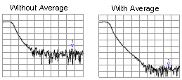
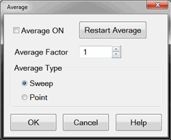
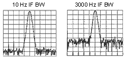
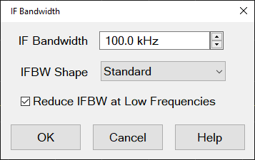
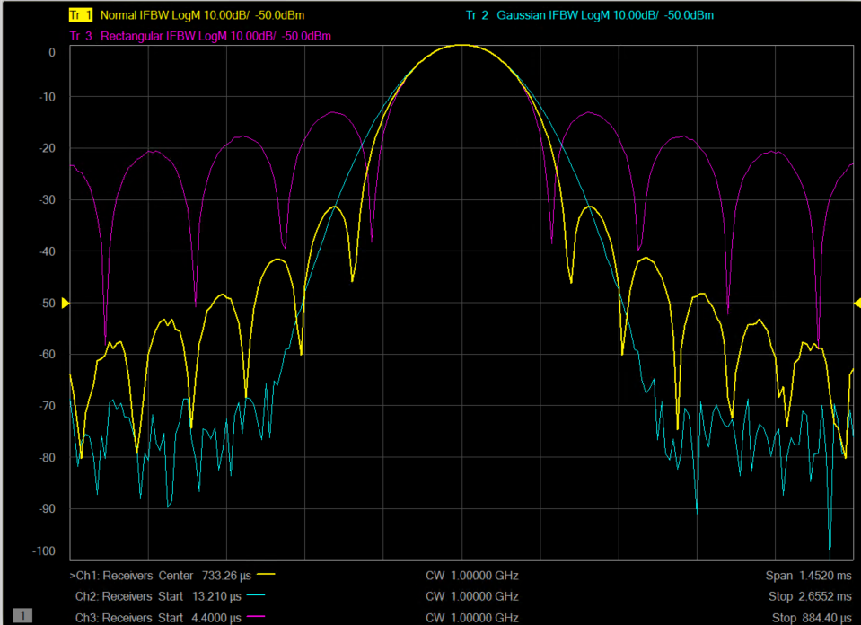
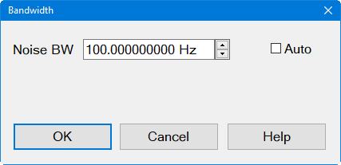
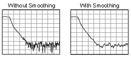

# Noise Reduction Techniques

* * *

Random electrical noise which shows up in the analyzer receiver chain can
reduce measurement accuracy. The following features help reduce trace noise
and the noise floor which can lead to better dynamic range and more accurate
measurements.

Note: The trace noise in microwave VNAs becomes worse below 748 MHz and is
especially obvious between 10 MHz and 45 MHz. See [Reduce
IFBW](Trce_Noise.htm#IFDiag).

  * [Averaging](Trce_Noise.md#averaging)

  * [IF Bandwidth](Trce_Noise.md#Variable_IF_Bandwidth)

  * IF Bandwidth Shape

  * Modulation Distortion Bandwidth Settings (Option S93070xB,A9x070A/B Modulation Distortion only)

  * LF Auto BW

  * [Trace Smoothing](Trce_Noise.md#Smoothing)

See Also

[Group Delay](../Tutorials/Group_Delay6_5.md)

[Increase Dynamic Range](Dyn_Rge.md)

[VNA data processing map.](../Programming/DataMapSet.md)

[Other topics about Optimizing Measurements](Optimize.md)

Averaging

Averaging is a feature that reduces the effects of random noise on a
measurement. There are two types of averaging: Point or Sweep.

The Point averaging type computes averaging on each data point before stepping
to the next data point. You determine the number of measurements by setting
the averaging factor (enabled by clicking the Averaging button). The higher
the averaging factor, the greater the amount of noise reduction.

The Sweep averaging type computes averaging on subsequent sweeps until the
required number of averaging sweeps are performed.

See also this Keysight support article: [HOW TO ACQUIRE DATA USING AVERAGES ON
A VNA WITH SCPI EXAMPLE IN
PYTHON](https://support.keysight.com/KeysightdCX/s/knowledge-article-
detail?language=en_US&keyid=How-to-acquire-data-using-averages-on-a-VNA-with-
SCPI-example-in-Python)

### Effects of Sweep Average

Both Averaging and [IF Bandwidth](Trce_Noise.md#Variable_IF_Bandwidth) can be
used for the same benefit of general noise reduction. For minimizing very low
noise, Averaging is more effective than reducing IF bandwidth. Generally,
Averaging takes slightly longer than IF bandwidth reduction to lower noise,
especially if many averages are required. Also, changing the IF bandwidth
after calibration results in [uncertain
accuracy.](../S3_Cals/Error_Correction_and_Interpolation.htm#Viewing)

#### How to Set Averaging  
  
---  
Using Hardkey/SoftTab/Softkey |  Using a mouse  
  
  1. Press Avg BW > Main > Averaging.
  2. Enter the Averaging number.

|

  1. Click Response.
  2. Select Avg BW.
  3. Select Averaging....

  
Average dialog box help |    
---|---  
 Average ON Check to enable Averaging.
Average Factor Specifies the number of measurements that are averaged. Range
of 1 to 65536 (2^16). Average Type Sweep Each data point is based on the
average of the same data point measured over consecutive sweeps. When the
number of sweeps = Average Factor, the averaging continues following the
[Sweep Averaging formula](Trce_Noise.md#formula). (Sweep) Restart Begins a
new set of measurements that are used for the average. Applies only to Sweep
averaging - NOT Point. Point Each data point is measured the number of times
specified by the Average Factor, and then averaged, before going to the next
data point.

  * On subsequent sweeps, averaging is automatically restarted by measuring each data point again the number of times specified by the Average Factor.
  * Because measurements occur quickly in the background, the Average Counter is NOT updated.
  * Point averaging is NOT available in [Gain Compression](../Applications/Gain_Compression_Application.md), or [Noise Figure](../Applications/Noise_Figure.md) Apps.

### Notes

  * An Average Counter appears on the screen when Sweep averaging is selected, displaying the number of sweeps that has been averaged. The effect on the signal trace can be viewed as the Average Factor increases. This can assist in the selection of the optimum number of sweep averages. The Average Counter is NOT updated for Point averaging.
  * Channel-wide scope- Averaging is enabled and the factor is set for all measurements in a channel. The Average counter is displayed for each channel.
  * Calibration \- Because averaging is a mathematical process that occurs after the raw measurement is made, averaging can be turned ON before or after calibration without invalidating the error correction terms. If averaging is ON before calibration, the measurement of calibration standards are averaged measurements. More time is needed to perform the calibration, but there will be less noise in the resulting error correction terms. Subsequent corrected measurements will also have less noise error. In addition, noise is further reduced by turning Averaging ON after calibration.
  * [Triggering](../S1_Settings/Trigger.md) is implemented separately from Averaging. For example, setting averaging factor to 4 has NO effect on the number of triggers that are required to achieve 4 sweeps or 4 data points.
  * Unratioed measurements - Although averaging unratioed (single receiver) measurements is allowed, you may see unexpected results.

  * The noise floor does not drop when averaging unratioed measurements as on ratioed measurements.
  * Phase results may tend toward 0. This is because phase measurements are relative by nature. Measuring absolute phase with a single receiver appears random. Averaging random positive and negative numbers will tend toward 0.

### Sweep Averaging Formula

NewAvg = (NewData/n) + [OldAvg*(n-1/n)] 'where n = average factor From the
formula, you can see that data from the first n sweeps continues to be
included in the results of subsequent sweeps. Its effect is increasingly
smaller but never diminishes to zero. For example, with n = 5, the average of
the 5 sweeps is displayed. On the 6th sweep, you see 4/5 the average of the
first 5 sweeps plus 1/5 the new sweep. The effects of older data can be
eliminated by clicking Restart. [Learn more about
Averaging](Trce_Noise.htm#averaging) (scroll up)  
  
IF Bandwidth

The received signal is converted from its source frequency to a lower
intermediate frequency (IF). The bandwidth of the IF bandpass filter is
adjustable down to a minimum of 1 Hz. The maximum IF varies depending on the
VNA model.

Reducing the IF receiver bandwidth reduces the effect of random noise on a
measurement. Each tenfold reduction in IF bandwidth lowers the noise floor by
10 dB. However, narrower IF bandwidths cause longer sweep times.

  * Channel \- IF bandwidth can be set independently for each channel

  * Segment sweep \- IF bandwidth can be set independently for each segment of segment sweep.

  * Calibration \- Changing the IF bandwidth after calibration will cause a ['C-delta' correction level](../S3_Cals/Error_Correction_and_Interpolation.md#Viewing), which means that calibration accuracy is uncertain.

### Effect of Reducing IF Bandwidth

How to set IF Bandwidth  
---  
Using Hardkey/SoftTab/Softkey |  Using a mouse  
  
  1. Press Avg BW > Main > IF BW.
  2. Enter the IF bandwidth value.

|

  1. Right click on the BW icons on the status bar.
  2. Select an IF bandwidth value from the list or click IF Bandwidth... to open the IF Bandwidth dialog.

or...

  1. Click Response.
  2. Select Avg BW.
  3. Select IF Bandwidth... to open the IF Bandwidth dialog.

  
IF Bandwidth dialog box help |    
---|---  
Right click on the BW icons on the status bar then select IF Bandwidth... to display the IF Bandwidth dialog:  IF Bandwidth Specifies the IF (receiver) bandwidth. The value of IF bandwidth is selected by scrolling through the values available in the IF bandwidth text box. The IF BW is set independently for each channel. The following IFBW values are common to all models: 1 | 2 | 3 | 5 | 7 | 10 | 15 | 20 | 30 | 50 | 70 | 100 | 150 | 200 | 300 | 500 | 700 | 1k | 1.5k | 2k | 3k | 5k | 7k | 10k | 15k | 20k | 30k | 50k | 70k | 100k | 150k| 200k | 280k | 360k | 600k | 1M | 1.5M | 2M | 3M | 5M | 7M | 10M | 15M For the highlighted IFBW settings (1 MHz and above):

  1.      * 7 MHz to 15 MHz settings are available ONLY with [DSP version](../S0_Start/HelpAbout.md#DSPchanges) 5.0 and above.
     * The primary use for IFBW > 600 KHz is for wideband pulsed and pulse profile measurements. They do NOT provide faster sweep speeds for non-pulsed measurements.
     * A slight shift (1dB or more) in Log Mag traces may be seen when switching in and out of these bandwidths.
     * Available in [Step sweep](../S1_Settings/Sweep.md#Stepped) mode only - NOT available in Analog sweep.
Note: The IFBW is limited to 600 kHz when performing Swept IMD measurements
even if the [Wide IF path](../IFAccess/IF_Path_Configuration.md#IFFrquencies)
is selected.

IFBW Shape Selects the digital filter (window) to apply to the time domain IF
signal. The filter effectively "shapes" the signal before application of the
DFT to help avoid discontinuities which add unwanted frequency content to the
spectrum. Each filter has its own advantages and disadvantages. Gaussian
filter shapes have much lower side lobe levels than the standard VNA filters,
and so measurements with them will be less sensitive to closely spaced
signals. Normally, in standard S-parameters this is not important and these
filters show no benefit. But in cases such as mixer measurements, they may
reduce spurious responses when spurious signals are close to the main signal
to be measured. They have already been implemented in the spectrum analyzer
mode. Standard \- Legacy filter. This filter has a good tradeoff between
frequency selectivity and side lobes, which rise to approximately -32 dBc.
Gaussian \- This filter takes longer to acquire a point but has very low side
lobes. Rectangular \- This is the fastest filter, but with high side lobes
that rise to approximately -13 dBc. The image below compares traces for the
Standard, Gaussian, and Rectangular 100-kHz filters:
 [Learn about IF
Bandwidth](Trce_Noise.htm#Variable_IF_Bandwidth) (scroll up)  
  
Modulation Distortion Bandwidth Settings (Option S9x070xB, S9x070A/B
Modulation Distortion only)

How to access Bandwidth settings  
---  
Using Hardkey/SoftTab/Softkey |  Using a mouse  
  
  1. Press Avg BW > Main

|

  1. Click Response.
  2. Select Avg BW.
  3. Select Bandwidth....

  
Bandwidth dialog box help |    
---|---  
 Noise BW is equal to the
Resolution BW divided by the Vector Average factor. You cannot directly set
the Resolution BW or Vector Average in a Modulation Distortion channel.
Resolution BW is always set to its maximum value for the given signal chosen.
Vector Average is automatically set depending on the Noise BW setting. Auto \-
Check to set the Noise BW to its maximum possible value. This results in the
fastest possible sweep but increases the noise floor. If Auto is checked, then
the Vector Average is set to 1, resulting in the widest Noise BW. The Noise BW
is displayed in the Softkey and in the middle of the display x-axis
annotation.  
  
LF Auto BW

How to enable/disable LF Auto BW  
---  
Using Hardkey/SoftTab/Softkey  
  
  1. Press Avg BW > Main > LF Auto BW.
  2. ON enables and OFF disables LF Auto BW.

  
  
[See VNA models / maximum frequencies.](../Support/Configurations.md)

When LF Auto BW is ON, the VNA uses a smaller IF Bandwidth than the selected
value at frequencies indicated below.

LFE ([Low Frequency
Extension](../IFAccess/Low_Frequency_Extension/Overview.htm)) also uses a
smaller IF Bandwidth than the selected value at low frequencies but does not
use the same tables. Instead, LFE selects the IF Bandwidth based on the
following:

  1. User set IF Bandwidth.
  2. Closest IF Bandwidth less than or equal to (Receiver Frequency / 4).

For example:

  * User set IF Bandwidth : 100 kHz

  * Receiver Frequency : 180 kHz

180 kHz / 4 = 45 kHz is lower than User set IF bandwitdth 100 kHz. Hence 45
kHz is chosen.

Then, next lower IF Bandwidth is 30 kHz. 30 kHz IF bandwidth is applied for
this point.

In the following table and example, the next band starts at .01 Hz above the
Stop Frequency. This is indicated with '+'.

For Broadband systems (N5290A, N5291A), use the values corresponding to the
base VNA (N522xB or N524xB).

|  VNA Model  
---|---  
Stop Frequency |  N5241B  
N5242B |  N5221B  
N5222B |  N5244B  
N5245B |  N5224B  
N5225B |  N5247B |  N5227B |  N5234B  
N5235B |  N5249B  
19 MHz |  0.05 |  0.05 |  0.005 |  0.005 |  0.005 |  0.005 |  0.025 |  0.05  
38 MHz |  0.05 |  0.05 |  0.01 |  0.005 |  0.01 |  0.005 |  0.025 |  0.05  
53 MHz |  0.05 |  0.05 |  0.015 |  0.005 |  0.015 |  0.005 |  0.025 |  0.05  
75 MHz |  0.1 |  0.1 |  0.025 |  0.025 |  0.025 |  0.025 |  0.025 |  0.1  
105 MHz |  0.1 |  0.1 |  0.05 |  0.025 |  0.05 |  0.025 |  0.025 |  0.1  
146 MHz |  0.14 |  0.1 |  0.1 |  0.025 |  0.1 |  0.025 |  0.025 |  0.14  
175 MHz |  0.29 |  0.1 |  0.15 |  0.025 |  0.15 |  0.025 |  0.025 |  0.29  
205 MHz |  0.29 |  0.29 |  0.15 |  0.15 |  0.15 |  0.15 |  0.025 |  0.29  
250 MHz |  0.5 |  0.29 |  0.25 |  0.15 |  0.25 |  0.15 |  0.025 |  0.5  
396 MHz |  1 |  1 |  0.5 |  0.5 |  0.5 |  0.5 |  1 |  1  
500 MHz |  1 |  1 |  1 |  0.5 |  1 |  0.5 |  1 |  1  
500+ MHz  
and above |  1 |  1 |  1 |  1 |  1 |  1 |  1 |  1  
  
Example:

On a N5224B, the selected IF BW is 30 KHz.

With Reduce IF BW at Low Frequencies checked, the actual IF Bandwidths used
are:

  * From 53+ MHz to 175 MHz: 30,000 Hz * 0.25 = 750 Hz (next higher selectable value: 1 kHz.)

  * From 175+ MHz to 250 MHz: 30,000 Hz * .15 = 4.5 kHz (next higher selectable value: 5 kHz.)

  * From 250+ MHz to 500 MHz: 30,000 Hz * .5 = 15 kHz

  * From 500+ MHz to stop sweep = 30 kHz

  
  
---  
|  
|  
|  
|  
|  
|  
|  
|  
|  
|  
  
Trace Smoothing

Trace smoothing averages a number of adjacent data points to smooth the
displayed trace. The number of adjacent data points that get averaged together
is also known as the smoothing aperture. You can specify aperture as either
the number of data points or the percentage of the x-axis span.

Trace Smoothing reduces the peak-to-peak noise values on broadband measured
data. It smooths trace noise and does not increase measurement time
significantly.

Because Trace Smoothing follows Format in the data processing map, the
formatted data is smoothed. Smoothing is automatically turned off if the
format is Polar or Smith Chart.

[Learn more about Data Format Types.](../S1_Settings/Data_Format.md)

[See the data processing map.](../Programming/DataMapSet.md)

Tips:

  * Start with a high number of display points and reduce until you are confident that the trace is not giving misleading results.

  * Do not use smoothing for high-resonance devices, or devices with wide trace variations. It may introduce misleading information.

  * Smoothing is set independently for each trace.

### Effects of Smoothing on a Trace

How to set Trace Smoothing  
---  
Using Hardkey/SoftTab/Softkey  
  
  1. Press Avg BW > Smoothing > Smoothing ON|OFF.

  
  
  
Smoothing ON When checked, applies smoothing to the displayed trace.

Percent of Span Specify percent of the swept stimulus span to smooth. For
example, for a trace that contains 100 data points, and specify a percent of
span = 11%, then the number of data points that are averaged is 11.

Points Specify the number of adjacent data points to average.

[Learn about Trace Smoothing](Trce_Noise.md#Smoothing) (scroll up)

* * *

