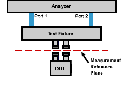

# Accurate Measurement Calibrations

* * *

Calibration accuracy is affected by the type of calibration, quality of the
calibration standards, and the care with which the calibration is performed.
This section provides additional information about how to make accurate
calibrations.

  * [Measurement Reference Plane](Accurate.md#refplane)

  * [Effects of Using Wrong Calibration Standards](Accurate.md#wrong)

  * Data-based versus Polynomial Calibration Kits

  * [Accuracy Level of Interpolated Measurement](Error_Correction_and_Interpolation.md#InterpolationAccuracy)

  * [Effects of Power Level](Accurate.md#powerLevel)

  * [Using Port Extensions](Accurate.md#portext)

  * [Isolation Portion of 2-Port Calibration](Accurate.md#iso)

  * Choosing a Thru Method

Learn how to [determine the validity of your calibration](Quest_Cal.md).

[See other Calibration Topics](Calibration.md)

Measurement Reference Plane

Most measurement setups will NOT allow you to connect a device under test
(DUT) directly to the analyzer front panel test ports. More likely, you would
connect your device to test fixtures, adapters, or cables that are connected
to the analyzer.

A calibration takes place at the points where calibration standards are
connected during the calibration process. This is called the measurement
reference plane (see graphic). For the highest measurement accuracy, make the
calibration reference plane the place where your DUT is connected. When this
occurs, the errors associated with the test setup (cables, test fixtures, and
adapters used between the analyzer ports and the reference plane) are measured
and removed in the calibration process.

Effects of Using Wrong Calibration Standards

Normally, a calibration is performed using a calibration kit that contains
standards with connectors of the same type and sex as your DUT.

However, your calibration kit may not always have the same connector type and
gender as your device. For example, suppose your device has 3.5mm connectors,
but you have a Type-N calibration kit. If you use an adapter to connect the
Type-N standards to the 3.5mm test port, then the adapter becomes part of the
calibration and NOT part of the test setup. This will result in significant
errors in your reflection measurements.

Data-based versus Polynomial Calibration Kits

The [Select DUT Connectors and Cal Kits](Calibration_Wizard.md#GuidConnKit)
dialog box offers a data-based model and a polynomial model for the newest
high-frequency cal kits. See [Analyzer
Accessories](../Support/Analyzer_Accessories.htm). The data-based models
provide higher accuracy for describing calibration standards than the
polynomial models. It is RECOMMENDED that the data-based model be used if the
most accurate results are desired.

| Data-Based Model | Polynomial Model  
---|---|---  
How accurate is the model? | Provides highest calibration accuracy. Eliminates the errors that can be the result of polynomial model approximations. | Provides high calibration accuracy.  
How does the model define calibration standards? | Uses S-Parameter measurements. | Uses traditional four-term polynomial calibration standard modeling parameters.  
How do I manually edit the definitions of the calibration standards when using the model? | Use the [Advanced Modify Cal Kit](ModifyCalKits.md#HowtoMod) function. | Use the [Advanced Modify Cal Kit](ModifyCalKits.md#HowtoMod) function.  
How do I use the Calibration Wizard with the model? | Use only the SmartCal (Guided) Calibration method. | Use the SmartCal (Guided) or the Unguided Mechanical Calibration methods.  
  
Learn about the [“Expanded Math”](SOLT_Tab.md#expanded_math) feature.

Effects of Power Level

To attain the most accurate error correction, do NOT change the power level
after a calibration is performed. However, when changing power within the same
attenuator range at which the measurement calibration was performed,
S-parameter measurements can be made with only a small degradation of
accuracy. If a different attenuator range is selected, the accuracy of error
correction is further degraded.

A best practice is to calibrate so that the receiver power is the desired
power you want to calibrate at when you are making a measurement. For example,
if you are testing an amplifier with 20 dB of gain, and a max input of -20
dBm, then calibrate at 0 dBm (it is the power that will hit the receiver when
you are testing). After the calibration, lower the source power to measure
your amplifier. In this way you will have less noise in the calibration. The
noise degradation by calibrating at a lower power will completely swamp the
small dynamic accuracy error. For most of the time, the uncertainty calculator
assumes 10 Hz BW which does effectively eliminate the noise from the
uncertainty computation, but it is rarely used in practice. And, note the R
receiver is more linear (by design, it has extra padding in it) compared to
the test receivers so the dynamic accuracy or linearity error is more
substantial on the test receivers (B receiver for example). Therefore,
calibrating at near its target power will reduce the dynamic error at the test
receiver. The reference receiver has almost no error at all. In fact, it is so
small it cannot be measured, so the uncertainty calculator uses the
specification value which is, in fact, limited by our linearity test system
and not the receiver. The Reference channel linearity is less than 0.015 dB
from -120 dBm to about 0 dBm, but the specification is probably 3 times
higher.

To check the accuracy of a calibration, see [Validity of a
Calibration](Quest_Cal.htm).

Using Port Extensions

Use the port extensions feature after calibration to compensate for phase
shift of an extended measurement reference plane due to additions such as
cables, adapters, or fixtures.

Port extensions is the simplest method to compensate for phase shift,
mismatch, and loss of the path between the calibration reference plane and the
DUT.

Learn how to apply [port extensions](Port_Extensions.md).

Learn about characterizing a test fixture.

Isolation Portion of 2-Port Calibration

The isolation portion of a calibration corrects for crosstalk, the signal
leakage between test ports when no device is present. When performing an
UNGUIDED 2-port calibration, you have the option of omitting the isolation
portion of the calibration.

Note: Isolation can be performed on a Smart (Guided) Calibration ONLY

Note: Isolation is supported only when the receiver gain are set at LOW for
both ports.

The uncorrected isolation between the test ports of the analyzer is
exceptional (typically >100 dB). Therefore, you should only perform the
Isolation portion of a 2-port calibration when you require isolation that is
better than 100 dB. Perform an isolation calibration when you are testing a
device with high insertion loss, such as some filter stopbands or a switch in
the open position.

The isolation calibration can add noise to the error model when the
measurement is very close to the noise floor of the analyzer. To improve
measurement accuracy, set a narrow IF Bandwidth.

### How to perform an Isolation Calibration

Isolation is measured when the Load standards are connected to the analyzer
test ports. For best accuracy, connect Load standards to BOTH test ports each
time you are prompted to connect a load standard. If two Loads are not
available, connect the untested analyzer port to any device that will present
a good match.

Important Notes:

  1. For best results, the average factor should be increased while measuring the isolation standards. Doing an isolation without increasing averaging you are generally adding noise to the measurement rather than correcting for isolation. This PNA automatically increases the average factor by 8 during the isolation steps of a calibration to minimize the noise degradation that would otherwise be present.
  2. The PNA crosstalk is generally below the noise floor which means if you do an isolation calibration is usually not required.
  3. SmartCal did not add the ability to do an isolation calibration from the GUI because it is usually only needed in special cases. The isolation calibration can be done using the following commands:
     * [SENSe<ch>:CORRection:COLLect:GUIDed:ISOLation:AVERage:INCRement](../Programming/GP-IB_Command_Finder/Sense/CorrGuided.md#IsoAvg) or [IsolationAveragingIncrement](../Programming/COM_Reference/Properties/IsolationAveragingIncrement_Property.md)
     * [SENSe<ch>:CORRection:COLLect:GUIDed:ISOLation:PATHs](../Programming/GP-IB_Command_Finder/Sense/CorrGuided.md#IsolPaths) or [GetIsolationPaths](../Programming/COM_Reference/Methods/GetIsolationPaths_Method.md) and [SetIsolationPaths](../Programming/COM_Reference/Methods/SetIsolationPaths_Method.md)
  4. Doing an isolation calibration is generally only useful when crosstalk is an issue—this may happen if the fixture added contributes significant crosstalk.

Choosing a Thru Method

When calibrating for a non-insertable device, you must choose a method to
calibrate for the THRU error terms. This can have a significant effect on
measurement accuracy. Learn more about [choosing a thru
method.](Calibration_THRU_Methods.htm)

* * *

* * *

