# Automatic Fixture Removal (AFR)

* * *

Note: This feature requires Option S9x007A/B or 007.

In this topic:

  * [Overview](Auto_Fixture_Removal.md#Overview)

  * [Requirements](Auto_Fixture_Removal.md#Requirements)

  * Automatic Fixture Removal Wizard

### Overview

Fixtures are often used for DUTs that have non-coaxial interfaces. This
feature allows you to mathematically remove, or de-embed, a characterized test
fixture from displayed measurement results of the test fixture and DUT.

Before starting the AFR process, Perform a calibration at the connectors of
the test fixture (red lines in images below).

The AFR Wizard will guide you through these steps:

  1. Press Cal > Fixtures > Auto Fixture Removal....

  2. Describe your fixturing situation.

  3. Specify How the Thru fixture characterization will occur.

  4. Do characterization.

  5. Remove the effects of the test fixture. Leaves ONLY the displayed results of the DUT.

  6. Touchstone files are saved that characterize the two halves of the test fixture.

### Requirements

  * Test fixture and either a complete Thru OR Left and Right Thru halves, all shown below.

  * Both the Test fixture and Thru are made of the exact same medium; preferably fabricated ON the same piece of medium.

### Single-ended Fixtures

Test fixture |  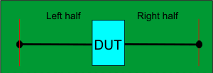  
---|---  
Thru standard OR |    
Left and Right halves of Thru standard |     
Supports both 1-port (not shown) and 2-port single-ended DUT configurations.
When used with a 4-port DUT configuration, the trace coupling is not removed.  
  
### Differential (Balanced) Fixtures

Test fixture |  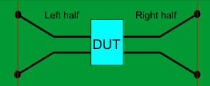  
---|---  
Thru standard OR |    
Left and Right halves of Thru standard |     
Supports 4-port DUT configuration ONLY which includes removing the effects of
coupling between the differential traces.  
  
### How to start the Automatic Fixture Removal Wizard

With a calibrated measurement of the DUT in the test fixture present:

Click Response, then Cal, then Fixtures, then Automatic Fixture Removal

Note: The dialogs below show images for a Single ended DUT, but Differential
works exactly the same, only with Differential S4P files.

Automatic Fixture Removal Wizard |  .md)  
---|---  
For best results, follow the AFR Wizard tabs from steps 1 through 5 by either
clicking Next > or clicking the tabs. In this section:

  1. [Describe Fixture](Auto_Fixture_Removal.md#Describe)
     * AFR Configuration Dialog
  2. [Specify Standards](Auto_Fixture_Removal.md#Specify)
  3. [Measure Standards](Auto_Fixture_Removal.md#Measure)
  4. [Remove Fixture](Auto_Fixture_Removal.md#Remove)
  5. [Save Fixture](Auto_Fixture_Removal.md#Save)
  6. Batch Display

* * *

### 1\. Describe Fixture

The choices that you make in the dialog are reflected in the diagram and text
(red box in following image). 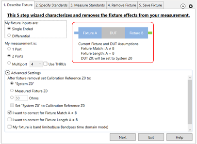
My fixture inputs are:

  * Single Ended \- The fixture and DUT have single-ended inputs and outputs.
  * Differential \- The fixture and DUT have differential inputs and outputs.

My measurement is (Single Ended):

  * 1-port \- such as S11

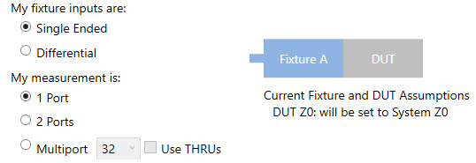

  * 2-port \- such as S21

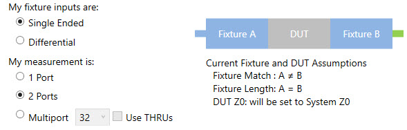

  * Multiport / Use THRUs \- select up to 64 ports. Check Use THRUs to use THRU fixture.

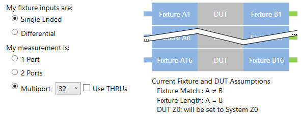 My measurement is
(Differential):

  * 2-port \- such as SDD11

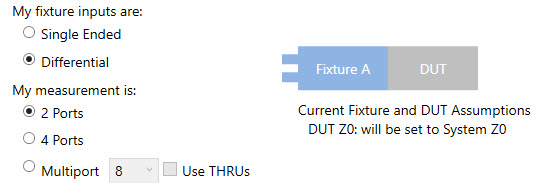

  * 4-port \- such as SDD21

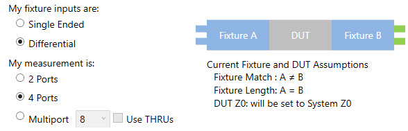

  * Multiport / Use THRUs\- select up to 64 ports. Check Use THRUs to use THRU fixture.

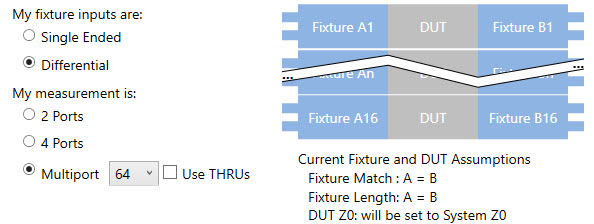

### Advanced Settings (click ^ to show and hide)

After fixture removal set Calibration Reference Z0 to: (Choose one of these
settings)

  * System Z0 \- Sets impedance to the System Impedance setting. [Learn how to set System Z0](../System/System_Impedance.md).
  * Measured Fixture Z0 \- Sets impedance to the value that is measured during the AFR process. Not allowed when 'band limited' is selected below.
  * <nn> ohms \- Sets impedance to an arbitrary value.
  * Set 'System Z0" to Calibration Reference Z0 \- When the impedance is measured or set to an arbitrary value, check to also set the System Z0 to the same value.

Select all that apply:

  * Check if this is true: I want to correct for when the match (Return Loss) of Fixture A is NOT equal to the match of Fixture B.
  * Check if this is true: I want to correct for when the electrical length of Fixture A is NOT equal to the electrical length of Fixture B.
  * Check if this is true: My fixture is band limited. Bandpass mode will be used during the Time Domain measurement. If NOT checked, then Lowpass mode is used. Because Lowpass mode includes impedance in the calculation, it renders the best accuracy. [Learn more about these settings.](../Time/TimeDomain.md#Modes)

|  Note When using Lowpass mode and an error message appears ("Measurement
settings are not adequate..."), change the start frequency and the number of
points so that the frequency span between data points equals the start
frequency. This can be done by selecting values using the following logic:
Start freq = 10 MHz then either: Stop freq = 20 GHz Number of points = 2000 or
Stop freq = 50 GHz Number of points = 5000 In either case, the frequency span
between data points equals 10 MHz, the start frequency.  
---  
  
### AFR Configuration Dialog

The AFR Configuration dialog can be launched by clicking on the AFR Config
icon (shown below).

Access the following settings in the General tab of the AFR Configuration
dialog.

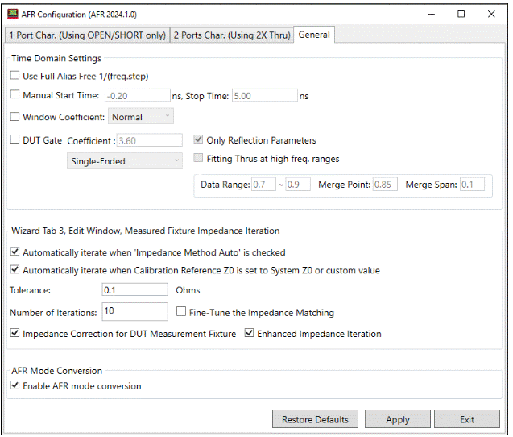

Set manual time domain start and stop settings for corner cases shown under
**Time Domain Settings**.

**Use Full Alias Free 1/(freq.step)** \- Check to set the stop time of
impedance trace from 1/(2*freq.step) to 1/(freq.step) on dialogue Measure
Fixture Impedance TDR data.

**Manual Start/Stop Time** \- Check to set the manual start/stop time of
impedance trace on dialogue Measure Fixture Impedance TDR data.

**Window Coefficient** \- Check to use the manual window type.

**DUT Gate** \- AFR fixture characterization is based on time domain gating.
This can cause high frequency rippling of characterized fixture if the
impedance of fixture and DUT doesn't match very well. AFR DUT gating can apply
gating on the DUT after de-embedding the fixture from fixtured DUT. This
option can smooth the high frequency rippling of DUT. Check to use DUT gate
coefficient settings.

**Coefficient** \- Times of fixture length which is used to calculate the stop
time of gating window.

Select **Single-Ended** or **Balanced**.

**Only Reflection Parameters** \- Check to apply DUT gate on reflection
parameters only. If this option is on, only reflection parameters of DUT will
be gated, otherwise all parameters of DUT will be gated.

**Fitting Thrus at high freq. ranges** \- Check to compensate for roll off at
high frequency range.

**Data Range** \- Sets the data range.

**Merge Point** \- Sets the merge point.

**Merge Span** \- Sets the merge span.

The Tolerance (in ohms) and Number of Iterations can be set under Wizard Tab
3, Edit Window, Measured Fixture Impedance Iteration. Also, two conditions for
automatic iterations can be enabled via checkbox:

  * Automatically iterate when Impedance Method Auto is checked

  * Automatically iterate when Calibration Reference Z0 is set to System Z0 or custom value

Also, check the **Automatically Iterate when Calibration Reference Z0 is set
to System Z0 or custom value** box to automatically iterate in that condition.

**Fine-Tune the Impedance Matching** \- Check to apply advanced algorithm to
fixture impedance mismatching cases for better results.

**Impedance Correction for DUT Measurement Fixture** \- Check to correct the
fixture impedance when the impedances of fixture and fixture-DUT don’t match.

AFR Mode Conversion \- AFR mode conversion will turn on or off automatically
to make the AFR result more precise with non-single ended data.

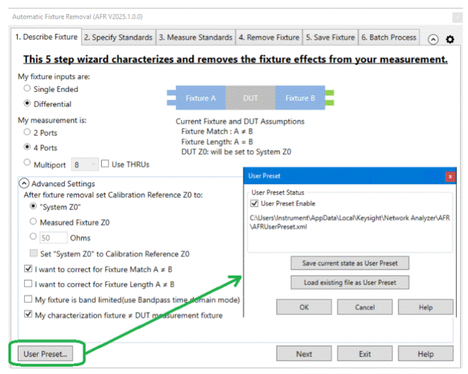

**User Preset** This button opens the User Preset dialog where you can save,
load, and enable your fixture settings as an AFR User Preset.

* * *

### 2\. Specify Standards

Note: AFR Config and 2X Thru for N is a Licensed Feature. Learn more about
[Licensed Features](../Support/Software_Support.md).

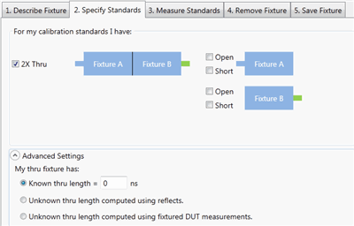

Selecting 2 single-ended ports, or 4 differential ports allows a 2X Thru
choice.

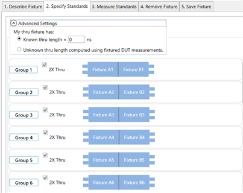

Checking Use THRUs in the 1\. Describe Fixture tab allows 2X Thru choice for a
Multiport measurement.

If My characterization fixture ≠ DUT measurement fixture is checked in the 1\.
Describe Fixture tab, the Fixtured DUT choice is displayed and checked.

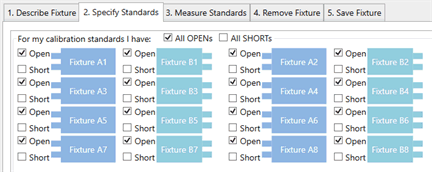

Otherwise, the fixture MUST be characterized using 1-port fixture measurements
using either OPEN or SHORT terminations.

Note: The term 'Standards' is used here because this process can be thought of
as the second in a '2-tier' calibration. The first tier of the calibration
must already be performed (the VNA calibrated) before starting the AFR
process. Another way of describing this step would be:

"How will you be measuring or loading the characterization of the Thru
standard?"

  * 2X Thru \- Both halves together in one fixture.

  * Both 1X Thru halves separately (also known as 1-port AFR). Specify either Open and/or Short at the end of each half of the standard.

Notes:

  * This image: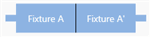appears as the 2X Thru when you select 1\. Describe Fixture, My measurement is 1 port. This means the left and right fixtures are mirror images of each other and have the same S-parameters. The cascaded combination of the two fixtures are Fixture A + Reversed Fixture A, or A'.

  * If both halves are identical and you do not have a 2X Thru, then only Fixture A measurements are necessary.

Advanced Settings

This setting is used to describe any ADDITIONAL length between the halves of
the Thru or added to either of the individual halves.

If the electrical length of the Thru standard is identical to the test
fixture, then make no changes to the default settings (Known length = 0).

My Thru fixture has:

  * Known thru length \- Enter the length in nanoseconds. See a simulated length in the diagram between the two halves of the Thru.

  * Unknown thru length computed using reflects. This setting requires the two halves of the Thru fixture be characterized separately with a reflect standard.

  * Unknown thru length computed using fixtured DUT measurements. This setting requires an additional characterization of the Fixture + DUT.

* * *

### 3\. Measure Standards

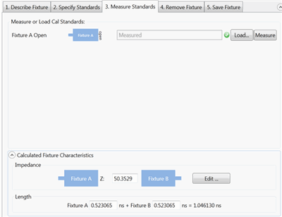

The following dialog is for Multiport 2X Thru measurements when Use THRUs is
checked in the 1\. Describe Fixture tab.

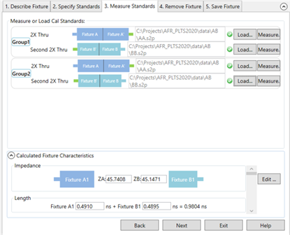

This step characterizes the 1X or 2X Thru standards. This is done by either
performing measurements or by loading one or more *.snp files that describe
the characterization of the fixtures.

Note: When loading standards from files, the typical system characterization
impedance (Z0) value is used, which is 50 Ω.

Click Measure to see the following dialog:

For best results, the analyzer should be calibrated. Also, the measurement
Start and Step frequencies should be equal. This is necessary for TDR
measurements.

Connect the specified standard at the PNA port. Then click Measure.

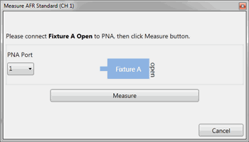

OR click Load and navigate to the *.snp file that describes the standard.

For 2X Thru standards, the following dialog allows you to optionally remap the
fixture ports.

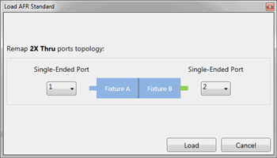

Calculated Fixture Characteristics

Note: The fixture length must be 4 times the rise time. If not, an error
message will be displayed. For example, a measurement at 26.5 GHz has a rise
time of 37.7 ps. Therefore, the fixture length must be 4 * 37.7 ps = 151 ps.

The loaded or measured Impedance and Electrical Length of the fixture are
calculated and displayed here.

The preview button allows you to visualize the time domain characteristics of
the fixture model that will be used for de-embedding. By using the editing
features noted below, the output match, length, and impedance of the fixture
model can be optimized. This allows flexibility for including or excluding
physical characteristics such as excess inductance of plug fingers, excess
capacitance of receptacle pads or any other anomalies not desired in the
fixture model. This advanced feature should be used with care as misuse could
cause passivity or causality errors in the resultant fixture model.

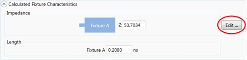

Click Edit to start the following, interactive Measure Fixture Impedance TDR
Data dialog.

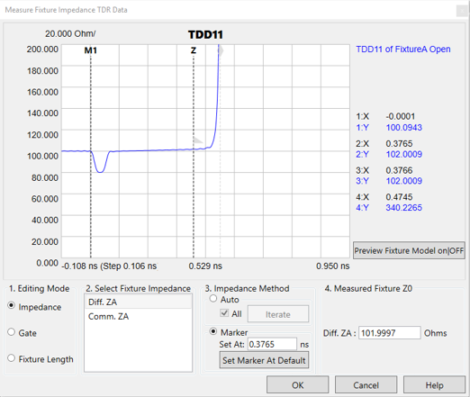

This dialog allows you to change the Impedance and/or Fixture Length of the
saved *.snp data by moving a marker to the desired location on the TDR plot.

Tips

  * The TDR X-axis shows the 1-way electrical length of the fixture in time.
  * Right-click the plot, then click Autoscale.
  * Click and drag to zoom the display on specific details of the plot.

  
---  
  
Editing Mode. (For 2X Thru, Fixture Length can NOT be changed.)

Choose one or more of the following to edit the data in resulting *.snp files:

  * Impedance \- move the M1 marker to edit the data as though the measurement was made in the specified characteristic impedance. The Z marker is used to measure the fixture impedance.

  * Gate \- move the flag to 'gate out' a part of the fixture measurement, usually close to the transition. The Z marker automatically changes to the location of the gate. The gate flag cannot move further than the fixture length diamond marker.

  * Fixture Length \- move the diamond marker to change only the electrical length of the fixture. The fixture length cannot be shortened to a value less than the current gate value. In this way, the gate value will never be greater than the electrical length.

Impedance Editing Mode

Select Fixture Impedance \- Select the A or B fixture.

Impedance Method \- Select Auto then click Iterate to measure the fixture Z0
automatically and return fixture impedance back to 50 Ω. If more than one
fixture impedance needs to be measured, check All to measure all impedances
listed in Select Fixture Impedance. Select Marker to measure the fixture Z0
manually using the Z marker. The Set At field shows the X-axis position of the
Z marker in ns. The Set Marker At Default returns the Z marker and fixture
impedance to the default value.

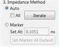

Measured Fixture Z0 \- Shows the measured fixture impedance. When Marker is
selected as the Impedance Method, this field displays the current Z marker
value or a value can be entered directly in this field. When Auto is selected
as the Impedance Method, this field displays the fixture impedance value that
was found automatically after clicking the Iterate button. In Auto, moving the
Z marker will not change this value.

Diff: ZA: - Enter the AFR fixture impedance manually using the text box.

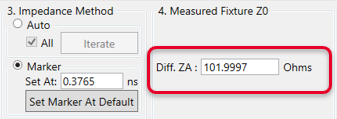

Fixture Length Editing Mode

Select Fixture Impedance \- Select the A or B fixture.

Set Marker Position, Gate Position, or Fixture Length depending on the
selected Editing Mode. Move the marker (M1, Gate flag, or diamond) to the
desired response on the trace.

Set At Default \- PLTS chooses an appropriate length at which to set the
initial impedance or length. Click to return the marker to this location.

Preview ON/off \- Select Off, then ON to preview the new measurement.

Click OK when finished. When saved, the new Impedance and Length results are
copied to the *.snp files.

* * *

### 4\. Remove Fixture

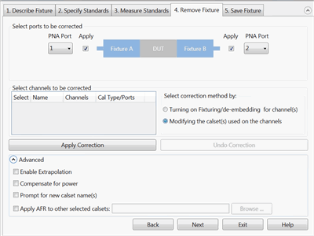

Note: First choose Select correction method, then make other selections, then
click Apply Correction.

Both operations can be performed, but only one at a time.

  * Turning on Fixturing/de-embedding for channels. Usually only one channel is being used on the VNA, so only one channel will appear in the choices of channels to be corrected. 

  *     * Select the channels to be corrected.

    *       * Fixturing and de-embedding will be enabled for the selected channels in the VNA. If the new fixturing UI is used, these de-embedding blocks will place to the left of any existing circuit elements. See [Using Fixture Simulator](../Programming/Using_Fixture_Simulator.md) for more details.

    * Advanced settings

    *       * Enable Extrapolation \- When fixture data is loaded from a file and the frequency span of the data is not as wide as that of the channel, check this box to calculate and use linearly-extrapolated fixture data.

      * Compensate for power \- When checked, test port power is increased to compensate for loss in the fixture.

  * Modifying the calset(s) used on the channels. Usually only one calset is in use on the VNA, so only one choice would be available.

  *     * Advanced settings

    *       * Enable Extrapolation \- When fixture data is loaded from a file and the frequency span of the data is not as wide as that of the measurement, check this box to calculate and use linearly-extrapolated fixture data.

      * Compensate for power \- When checked, test port power is increased to compensate for loss in the fixture.

      * Prompt for new calset name(s) \- When cleared, when you apply AFR to a calset, the calset is overwritten. Once done, this process is NOT reversible. When checked, you are prompted to enter a new calset name and the original is preserved. The new calset is written with AFR correction.

      * Apply AFR to other selected Calsets \- When checked, allows you to apply AFR correction to other calsets not currently in use on the VNA. Click Browse, then navigate to the calsets to be corrected.

* * *

### 5\. Save Fixture

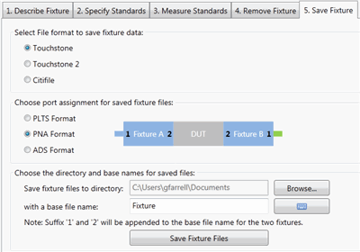

Select File format to save fixture data:

  1.      * Touchstone (*.snp)

     * Touchstone 2 (*.ts)

     * Citifile (*.cti)

Choose port assignment for save fixture files:

The port assignments are interpreted differently when the file is opened in
each program.

Choose which program software you will be using to open the saved file: PLTS,
VNA, ADS.

Choose the directory and base names for the saved files:

Click Browse to navigate to a directory folder.

With a base file name: The resulting filename will appear as follows (assuming
a Touchstone format):

  * <base file name>_1.S4P - The left half of a Differential fixture.

  * <base file name>_2.S4P - The right half of a Differential fixture.

  * <base file name>_1.S2P - The left half of a single-ended fixture.

  * <base file name>_2.S2P - The right half of a single-ended fixture.

Click Save Fixture Files to save the files to the specified directory.

* * *

### 6\. Batch Process

Batch AFR facilitates the AFR when you have multiple fixtured-DUTs with the
same 2x-Thru standards. You do not need to repeat the AFR wizard steps with
batch process.

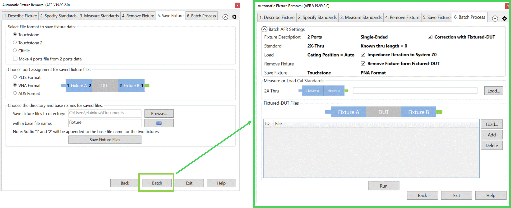

Batch AFR use the settings summary from previous AFR wizard steps.

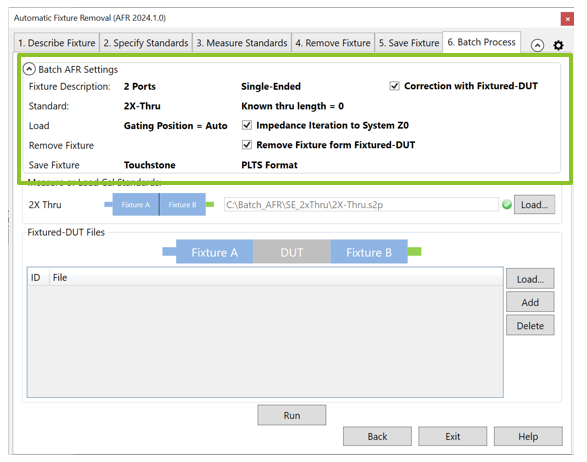

Measure or Load standards are the 2x-Thru standards of fixture. The default is
the standard specified by previous AFR wizard. You can also load a different
one by clicking the Load button.

Click Load to import all the fixtured-DUT files.

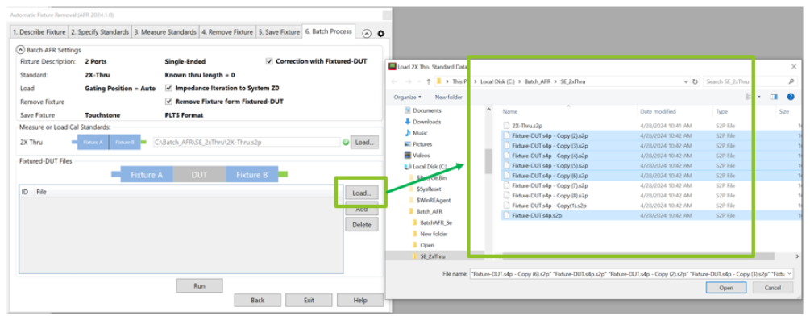

Click Load to import all the fixtured-DUT files. All fixtured-DUTs will use
the same topology.

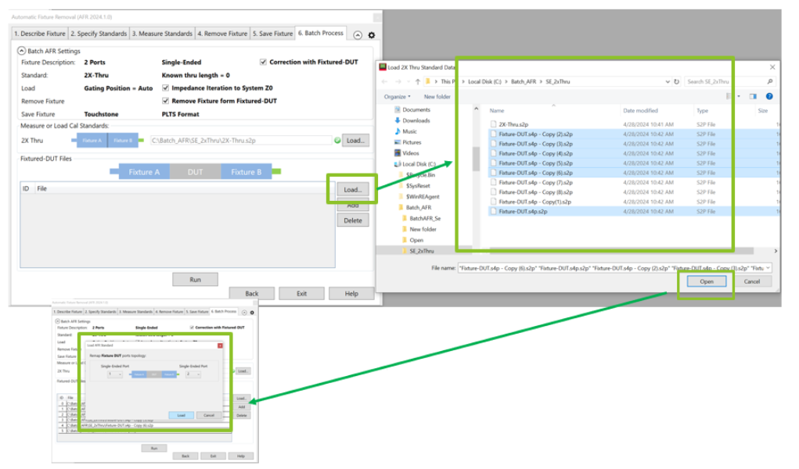

Click Run. The batch process saves the fixture with appendix _afr_1 as left
fixture , _afr_2 as right fixture, and _afr_DUT as de-embedded DUT.

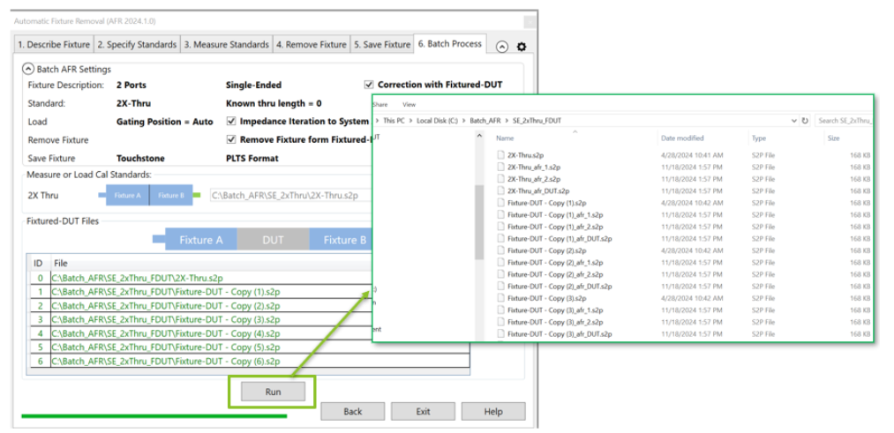  
  
* * *

