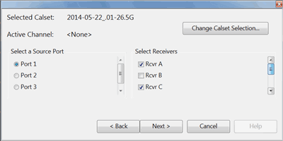
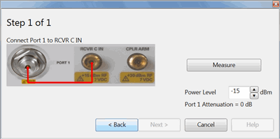
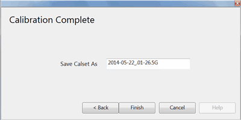
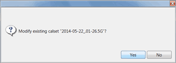

# CPM Direct Receiver Calibration

* * *

Use this selection to modify an existing Cal Set with a calibration path
through the front-panel jumper loops (direct access receiver configuration).

For example, this might occur on a [Differential IQ
channel](../Applications/Differential_IQ.htm) when using more than four ports.
If only the source is being used for the measurement, the receiver can be
accessed and calibrated using the front-panel jumper cables.

Note: Only corrected scalar magnitude measurements are possible at the direct-
access receiver. The original phase data is preserved in the Cal Set and is
NOT modified by the Direct Access Receiver Cal.

See the [Cal Plane Manager](Cal_Plane_Manager.md) main help page.

CPM Direct Receiver Calibration dialog box help  
---  
 Choose Direct Receiver Calibration, then
click Next >  
  
Source Port and Receiver Selection dialog box help  
---  
 Select a Cal Set to modify. By
default, the Cal Set for the active channel is selected. A valid Cal Set has
the following attributes:

  * The Cal Set has at least one reference receiver Response Tracking error term AND the test port receiver Response Tracking error term in it. These must cover the same frequency range. The Differential IQ Cal All Cal Set will meet this requirement.
  * If the active Cal Set does not meet the above criteria the Next button is NOT available.

Select a Source Port to be used for Direct Receiver Calibration. The ports
that are listed have a calibrated reference receiver in the selected Cal Set.
Select (one or more) Receivers to be calibrated through a front-panel access
port. The Receivers that listed are have the same corrected frequency ranges
as the selected Source Port. For convenience, both standard and [logical
receiver notation](../S1_Settings/Measurement_Parameters.htm#RecNotation) are
used in the list of receivers.  
  
CPM Direct Receiver Calibration dialog box help  
---  
 Using the same cable for this
calibration that is used in the measurement, connect the cable as shown in the
diagram. If an additional adapter is used to connect the cable to the source
port, the very small magnitude effects of that adapter will not be removed
from the Cal Set. Power Level: If needed, change the power level of the source
for this measurement only.  
  
CPM Direct Receiver Calibration dialog box help  
---  
 The Cal Set that you selected in
the first dialog appears. You can modify that Cal Set, or enter a new Cal Set
name to be created. Click Finish. The following warning message appears.
  
  
* * *

