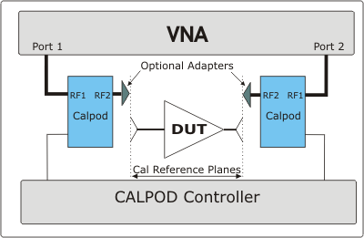
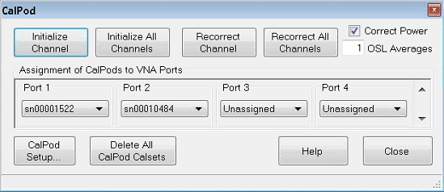
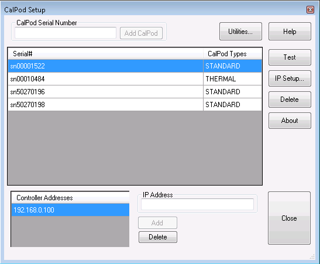
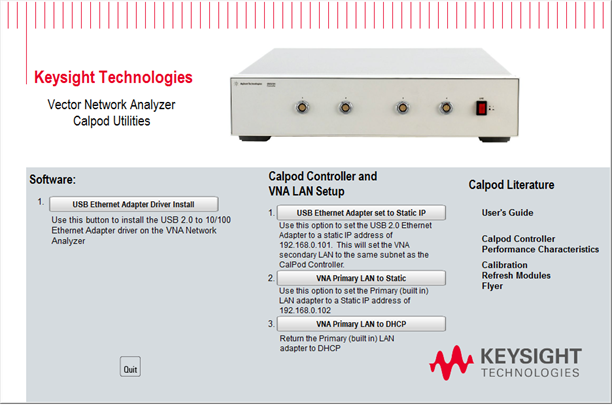

# CalPod

* * *

CalPod is a system that simplifies the process of recalibrating the VNA
without requiring the removal of the DUT or the physical connection of
standards. This allows recalibration from a remote location such as when the
DUT is in a temperature chamber.

Note: This feature is available to
[GCA](../Applications/Gain_Compression_Application.md),
[GCX](../Applications/Gain_Compression_for_Converters.md),
[IMS](../Applications/IMSpectrum.md), [IMD](../Applications/Swept_IMD.md),
[NF](../Applications/Noise_Figure.md),
[NFX](../Applications/Noise_Figure_on_Converters.md), [SMC +
Phase](../FreqOffset/SMC_plus_Phase.htm), and standard (S-Parameter) channels.

Note: Before using a CalPod module, ensure that Factory Cal is set to OFF (Cal
> Main > Factory Cal OFF).

In this topic:

  * Sweep Averaging Versus CalPod Averaging

  * [Process Overview](CalPod.md#Overview)

  * [How to start the CalPod dialog](CalPod.md#How)

  * CalPod dialog

  * [CalPod Setup dialog](CalPod.md#SetupDiag)

### See Also

[CalPod as ECal](CalPod_as_ECal.md)

[Other Calibration topics](Calibration.md)

### Sweep Averaging Versus CalPod Averaging

Averaging helps to find the mean of an incoherent variation, but the source
and “coherence time” of the variation are important.

There are three sources of variation in a CalPod corrected measurement:

  1. Noise due to receiver noise floor. This tends to be fast variation and IFBW reduction (IFBW reduction is really just more averaging of the ADC readings, and point averaging, since it occurs in a similar time scale, is very similar to IFBW reduction) will reduce this to a mean value. 

  2. Variation due to instability in the cables, connectors, etc. This can be due to things like vibrational stability due to fans, air currents moving past, ringing from cars, trucks, and people moving about. These tend to be longer in time scale (a few seconds) and so sweep-to-sweep averaging will remove this long-time-scale variation.

  3. Variation due to slight imperfections in the setting of the CalPod states, due to changes in line-voltage, regulation, and timing. This is helpful in the reduction of these imperfections (plus it also has a longer time scale than sweep-to-sweep averaging) as it accounts for very minor random variations in the setting of the states of the CalPod. By averaging several states (each state containing an average of the sweeps, each sweep contains an average of the IFBW acquisitions, each IFBW acquisition contains an average of the ADC readings, each ADC reading being independent), another source of variation is removed. Generally sweep averaging is not needed with CalPod averaging. But sweep averaging during calibration can help remove stability variation during calibration; so turn on sweep-averaging during calibration; but turn off sweep averaging during Initialization and Recorrection, and use CalPod averaging instead. Since initialization is done only once, double its averaging factor relative to that used for Recorrection.

### Process Overview

Note: The following overview assumes the CalPod system has been installed and configured. See the CalPod Operations and Service Guide for installation instructions at: [Technical Support: 85523B CalPod Controller | Keysight](https://www.keysight.com/us/en/support/85523B/calpod-controller.html) .

The following process assumes a 2-port DUT connected to the VNA ports 1 and 2
through CalPod modules as follows:

The  Blue boxes represent CalPod modules with internal Thru and Reflection
states.

  1. After configuring and assigning CalPod modules to VNA ports 1 and 2, connect the CalPod modules to the VNA, directly or using short cables. [Learn how to configure CalPod.](CalPod.md#SetupDiag)

  2. Setup measurements on a channel. 

Note: CalPod does not support measurements at frequencies below 100 MHz.

  3. An IFBW of 1 kHz or lower with eight averages is recommended.

  4. Press Avg BW > Main > Averaging and set averaging as follows:

     * Averaging Factor: 8
     * Average Type: SWEEP
     * IF Bandwidth: 1 kHz
     * Turn sweep averaging on
  5. Perform a full 2-port calibration for the channel with the CalPod outputs as the reference plane.

Note: Be sure to save the calibration to a user calset.

  6. Turn off sweep averaging. It will not need to be used during Initialize Channel nor Recorrect Channel because the OSL Averages will be used for those.
  7. Set OSL Averages number to 2x the value that was used for sweep averaging. This will provide a more-than-adequate averaging for the **Initialize Channel** , which is only performed once for each calibration. 

  8. Click Initialize Channel to automatically perform the following steps:

     1. The Reflection states of both Calpod modules are switched in and S11/S22 are measured.

     2. The resulting measurements are stored in the channel's Cal Set as additional standard measurements. These measurements are used to characterize the Calpod states - they are NOT used at this time to change the error correction.

Notes:

  * Because the Reflection states in the CalPods are measured, it is not important what is connected to the CalPod when Initialize is pressed. Therefore, for highest accuracy, click Initialize IMMEDIATELY and ONLY ONCE after performing the calibration - before causing ANY cable movement.
  * If an adapter is required to connect the DUT to a CalPod, use a high-quality adapter. Any temperature drift due to the adapter is NOT recorrected.
  * Always connect the DUT as close as possible to the CalPod modules.

  
---  
  
  9. Connect the DUT to the CalPod outputs.

  10. Set **OSL Averages** number to the value that was used for sweep averaging. Use this value for all subsequent Recorrections of this calibration.

  11. Click Recorrect Channel or Recorrect All Channels whenever necessary. Any of the following actions will cause the current calibration to become invalid and require recorrection:

     1. Moving the CalPod modules to the ends of long cables.

     2. Changing the cables.

     3. Extreme temperature variations.

     4. Measurement drift over long time periods.

The following steps occur automatically during recorrection for the active
channel:

  1. The Reflection states of both CalPod modules are switched in and S11/S22 are measured.

  2. Additional (de-embedded) error terms are computed to compensate for changed conditions from the Initialize measurements.

  3. Another Cal Set is created using the original name with the CalPod number appended. The modified error terms are saved to that Cal Set and applied to the channel. The measurements are now fully corrected.

Note: Re-correction is not supported with a descending list of frequencies,
such as the output from a frequency-down converter with LO frequency higher
than input frequency.

### How to start the CalPod dialog  
  
---  
Using Hardkey/SoftTab/Softkey  
  
  1. Press Cal > Cal Sets & Cal Kits > Cal Pod....

  
  
CalPod dialog box help  
---  
[Learn all about the CalPod process.(Scroll up)](CalPod.md#Overview)
 Initialize Channel Calibrated
measurements of the CalPod states are performed as initial reference data
points for the active channel. Initialize All Channels Calibrated measurements
of the CalPod states are performed as initial reference data points for all
current channels. This command is not recommended, it is generally preferable
to initialize each channel immediately following calibration. Recorrect
Channel Recorrects the active channel Cal Set to match the initial reference.
Recorrect All Channels Recorrects the Cal Sets on ALL channels that were
initialized. Correct Power This checkbox causes power to be recorrected ONLY
when source power correction data is stored as error terms in the CalSet. This
occurs only when a [Guided Power Cal](Guided_Power_Calibration.md) is
performed (on the standard channel) OR when an app channel is calibrated such
as a FCA, GCA, IMD, and Noise Figure channel. This checkbox has NO effect when
a S-parameter (only) Cal or a standard [Source Power Cal](PwrCalibration.md)
has been performed, because source power correction data is not stored in the
CalSet. To see if the source power cal can be modified, examine the Calset for
"SourcePowerCorrection(n)" terms where "n" is the port number. When any of the
above power cals have been performed, and when this box is checked, the power
output at the VNA port is adjusted to compensate for any change in path loss
when Recorrect is performed. For example, if the path loss between the VNA
port and the CalPod was increased by two dB following initialization, then the
VNA output power will be increased by two dB upon recorrection. Do this when
you add a significant amount of loss in the calibration path, or when the
power level at the DUT is important. When a significant amount of loss is
introduced in the calibration path, it may not be possible to increase the
source power enough to overcome the loss. In this case, an Unleveled source
message may appear on the VNA screen. When the checkbox is cleared, the source
power level is not corrected. OSL Averages Controls the number of sweeps worth
of raw measurements to be measured and averaged together for the recorrection
computations for each state of each CalPod.

### Assignment of CalPods to VNA Ports

For each VNA port, select a CalPod module. Note: A CalPod can be assigned up
to 16 test ports in each measurement channel in multiport PNA mode. CalPod
Setup Starts the [CalPod Setup](CalPod.md#SetupDiag) dialog Delete All CalPod
Cal Sets Deletes all recorrection Cal Sets and reinstates the Initialization
Cal Set.  
  
CalPod Setup dialog box help  
---  
 To start this dialog, click CalPod
Setup in the [CalPod](CalPod.md#RefreshModuleConfigDiag) dialog box. CalPod
Serial Number Type the CalPod module (without 'sn'), then click Add CalPod.
The new module is added to the list of available CalPod modules. Serial # and
CalPod Types Shows the list of available CalPod modules. A CalPod module type
may be STANDARD or THERMAL (include temperature correction). A CalPod module
will be listed as a STANDARD type unless the thermal characterization data was
previously loaded into the PNA from the USB flash drive that came with the
CalPod. Once thermal characterization data has been loaded into the PNA, the
CalPod is automatically listed in the CalPod Setup dialog.  Note: Loading
thermal characterization data from the USB flash drive is the only method of
setting up a THERMAL CalPod. Simply entering the serial number in the CalPod
Setup dialog will set the CalPod Type to be STANDARD. STANDARD and THERMAL
data files are stored in C:\e-trak\adapters.

### Buttons

Utilities Launches the VNA CalPod Utilities used to configure the CalPod
Controller and VNA over LAN. Note: Before using a CalPod Controller, the LAN
MUST be set up using the CalPod Utilities or an error message will be
displayed indicating that the VNA is unable to communicate with the CalPod
Controller.  USB Ethernet Adapter
Driver Install Installs the USB 2.0 to 10/100 Ethernet Adapter driver on the
VNA. USB Ethernet Adapter set to Static IP Sets the USB 2.0 Ethernet Adapter
to a static IP address of 192.168.0.101. This sets the VNA secondary LAN to
the same subnet as the CalPod Controller. VNA Primary LAN to Static Sets the
Primary (built in) LAN adapter to a Static IP address of 192.168.0.102. VNA
Primary LAN to DHCP Returns the Primary (built in) LAN adapter to DHCP. This
option is used when the CalPod Controller is connected directly to the VNA's
LAN adapter using an RJ-45 LAN crossover cable. CalPod Controllers do not
support DHCP networking. Test Click to test the connection between the
controller and the selected CalPod module. The message box displays the
connection status and temperature for both Ambient and Thermal modules. Only
the Thermal module will apply test temperature for recorrection. IP Setup
Starts the IPSetup dialog box to confirm the CalPod controller settings.
Delete Removes the selected STANDARD CalPod module from the list. To delete a
THERMAL CalPod from the list:

  1. Navigate to the c:/e-trak/adapters/itm directory.
  2. Delete the .xml file associated with the CalPod serial number.
  3. Exit all CalPod dialog boxes and restart the CalPod dialog.
  4. The CalPod may now be removed using the **Delete** button.

About Shows the CalPod software version information. Controller Addresses Each controller can support 4 modules directly, and up to 48 modules using external splitters. Additional controllers may be required if more than 48 CalPod modules are needed.  IP Address Enter the IP Address of the Controller, then click Add. The IP address is configured using the IPSetup Utility. The default IP=192.168.0.100, but different static network settings can be configured if required.  Delete Select the Controller Address, then click Delete to remove the address from the list.  For more CalPod Setup information, see the CalPod web site: [Technical Support: 85523B CalPod Controller | Keysight](https://www.keysight.com/us/en/support/85523B/calpod-controller.html). Click CalPod Controller Configuration.  
  
## CalPod Operator's Check

This program is provided as a convenience to help determine the operational
status of each 855xxA Series CalPod and its associated CalPod Controller.
While this check is not intended to be a complete test, it does check each
unit enough to provide greater than 95% confidence that the CalPod is
functioning properly.

  * When the max frequency of the CalPod is higher than the max frequency of the VNA, the full frequency range of the CalPod is not tested.

  * Up to four CalPod modules may be checked at once. All four devices must be of the same frequency range.

  * The software revision for the Operator’s Check code is displayed in the upper left-hand corner of the window.

### **Before** running Op Check

The CalPod system must be installed and configured on the VNA.

See the CalPod Operations and Service Guide for instructions at: [Technical Support: 85523B CalPod Controller | Keysight](https://www.keysight.com/us/en/support/85523B/calpod-controller.html).

Required equipment:

  * An appropriate ECal or mechanical Cal Kit.

  * A high-quality cable.

  * A female-female adapter of the calibration connector type.

  * A fixed attenuator up to 10 dB (3 dB preferred) or other frequency insensitive device with similar loss.

* * *

