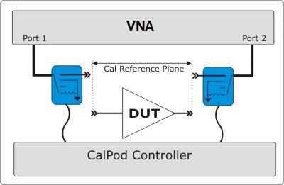
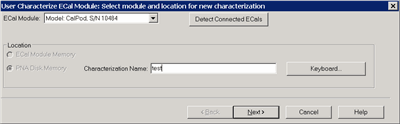
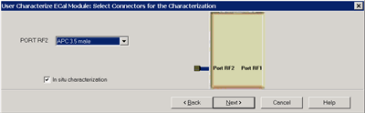
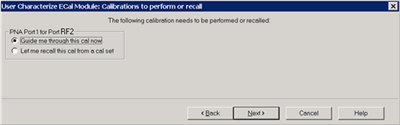
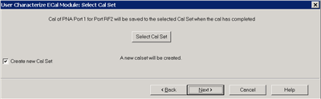
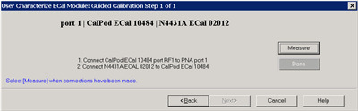
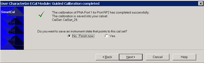
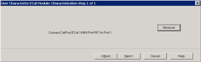
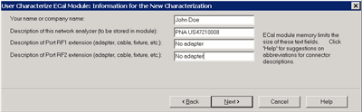
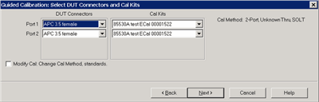

# CalPod as ECal

* * *

A [CalPod module](CalPod.md) can be used as 1-port ECal module to calibrate
channels for all measurement classes. In addition, the CalPod module can be
left in place during measurements in order to refresh calibrations.

Note: Before using a CalPod module, ensure that Factory Cal is set to OFF (Cal
> Main > Factory Cal OFF).

In this topic:

  * [Overview](CalPod_as_ECal.md#Overview)

  * Characterizing the CalPod module

  *     * [Summary](CalPod_as_ECal.md#Characterizing)

    * [Detailed Steps](CalPod_as_ECal.md#DetailedUser)

  * [Calibrating with CalPod](CalPod_as_ECal.md#Calibrating)

[More Calibration topics](Calibration.md)

### Overview

To use a CalPod module as a calibration device:

  1. The CalPod module must be configured using the CalPod software. [Learn how](CalPod.md#How).

  2. Unlike an ECal module, a CalPod module has no internal memory and therefore, no internal characterization data. Before a CalPod can be used as an ECal module, its internal standards must first be characterized using the ECal User Characterization wizard. In addition, the characterization data can ONLY be stored in VNA disk memory.

  3. After these steps have been performed, connect the CalPod modules to the controller to perform a VNA calibration. The CalPod modules will appear in Cal Wizard dialogs just like an ECal module.

This image shows TWO CalPod modules after both have been characterized. An
additional thru connection is required to complete a 2-port calibration.
Subsequent ‘refresh’ calibrations can occur without making additional
connections.

### Characterizing the CalPod module - Summary

When performing a User Characterization for a CalPod module, you can establish
the Calibration reference plane at the input connector, or at the output
connector, depending on how you plan to use CalPod.

  1. Initially calibrate the VNA.

  2. After the calibration, the internal CalPod OPEN, SHORT, and LOAD standards are measured.

  3. The measurements are saved to VNA disk memory. They are used when performing calibrations using the CalPod module.

#### Detailed steps to Perform a User Characterization

Note: If you have more than one CalPod module, each module must be
characterized separately.

  1. Perform a one-time CalPod configuration. [Learn how](CalPod.md#How).
  2. Connect the CalPod module to the CalPod controller.
  3. Preset the analyzer.
  4. [Set up the measurement](../S1_Settings/Select_a_Measurement_State.md).  For best accuracy, the IF bandwidth should be set to 1 kHz or less.
  5. Start the User Characterization Wizard as follows:

  
---  
Using Hardkey/SoftTab/Softkey  
  
  1. Press Cal > Cal Sets & Cal Kits > ECal > Characterize ECal....

  
  
  
Select Module and Location dialog box help  
---  
 ECal Module Select a CalPod from
list of connected modules and registered CalPods. Detect Connected ECals Click
to rescan CalPod/ECal modules.

### Location

  * ECal Module Memory NOT available for CalPod modules.
  * VNA Disk Memory Enter a Characterization Name. This name appears when selecting a User Characterization to be used with subsequent calibrations.
  *     * [Learn how to manage characterizations that are stored to VNA disk memory.](ECal_User_Characterization.md#ManageDiskMem)
    * [See the benefits of storing the User Characterization to VNA Disk Memory.](ECal_User_Characterization.md#UserToDiskBenefits)

Keyboard Launches a keypad that can be used to type a characterization name
from the VNA front panel. Next Click to continue to the Select Connectors for
the Characterization dialog box. [See note regarding extended frequency
use.](ECal_User_Characterization.htm#ExtendedUser)  
  
Select Connectors for the Characterization dialog box help  
---  

### In situ characterization

When Checked:

  * This initial calibration, and all DUT measurements are performed WITH the CalPod module THRU path in place (In Situ).
  * Only the port with the switchable states is characterized (open, short, load, and offset short). The THRU state is not characterized.
  * Select the RF2 (output) connector type and Cal Kit.
  * The Cal Kit standards are connected to the RF2 Output connector, making it the reference plane. This calibration removes everything in front of the output connector from subsequent measurements.
  * The User Char description will show "In Situ".
  * The CalPod’s states physically switch in at its RF1 port, but for an in-situ characterization the calibration used for measuring the characterized data for those states has its reference plane at-or-beyond the CalPod’s RF2 port. So, for all calibrations subsequently performed using the [in-situ CalPodAsECal user characterization](Using_ECal.md#Select), those calibrations also establish the reference plane at that same connector interface at-or-beyond that CalPod’s RF2 output port.

When Cleared:

  * This initial calibration, and all DUT measurements are performed WITHOUT the CalPod module in place. This is similar to an ECal calibration.
  * Select the RF1 (input) connector type and Cal Kit. The Cal Kit standards are connected at this location, making it the reference plane.

Next Click to continue to the Calibrations to perform or recall dialog box.  
  
Calibrations to perform or recall dialog box help  
---  
 Perform or load a 1-port cal.
Guide me through this cal now Click to perform a Guided calibration. A
calibration kit is required for each connector type. Note: Some PNA-L models
cannot perform TRL calibration during the calibration portion of a User
Characterization. However, this type of Cal can be performed using the Cal
Wizard, saved to a Cal Set, then recalled at this point in the User
Characterization. Let me recall this cal from a cal set Click to select an
existing Cal Set. You cannot select a Cal Set that is currently in use. Learn
more about [Using Cal Sets](Cal_Sets.md). Next Click to continue to either
the Select Cal Kits (Perform Cal) or Select Cal Set (Recall Calset).  
  
Select Cal Kits dialog box help  
---  
 When 'In situ' is selected, a
cal kit is selected for port "RF2", as this will be the calibration reference
plane (where standards are connected). Provides a list of calibration kits to
perform the calibration. Select the Cal Kit you will use for the port. Next
Click to continue to the Select Cal Set dialog box.  
  
Select Cal Set dialog box help  
---  
 The calibration that you perform
will be written to a Cal Set. This dialog box allows you to select a Cal Set
to overwrite, or to write to a new Cal Set. The current choice is visible
below the Select Cal Set button. Select Cal Set Click to open the Select A Cal
Set dialog box. Create new Cal Set Check to create a new Cal Set to store the
calibration. Clear to select and overwrite a stored Cal Set. Next Click to
continue to the Guided Calibration Steps dialog box. Note: Remember the Cal
Set name for future reference.  
  
Guided Calibration Steps dialog box help  
---  
 The first Measure page. Connect
each calibration standard to the location in the prompt. Measure Click to
measure the standard. Back Click to repeat one or more calibration steps. Done
Click after a standard is re-measured and all measurements for the calibration
are complete. Next Click to continue to the next calibration step. (Does not
measure the standard.) Cancel Exits Calibration Wizard.  
  
Guided Calibration completed dialog box help  
---  
 Allows you to finish the
calibration and continue to the next characterization steps. No. Finish now
Select to save Cal Set data. Yes Allows selection of Save options. Next Click
to continue to the Exit to Inspect Quality of Calibration dialog box.  
  
Exit to Inspect Quality of Calibration dialog box help  
---  
 Allows you to exit User
Characterization to [validate the
calibration](Quest_Cal.htm#ECal_Confidence_Check_help) before proceeding with
the characterization. Back Allows you to repeat calibration. Next Click to
continue to the Characterization Steps dialog box. Cancel Exits the
Calibration.  To return to the current step:

  1. Start User Characterization.
  2. In the Select Connectors for Characterization dialog box, click Next. (Previous entry is stored in memory.)
  3. In the Calibrations to perform or recall dialog box, recall the Cal Set that you just performed.

  
  
Characterization Steps dialog box help  
---  
 After the initial VNA calibration,
the CalPod internal states are measured. Connect the CalPod if not already
connected. Measure Measures the CalPod module. Next Click to continue to the
Information for the New Characterization dialog box when measurements are
complete.  
  
Information for the New Characterization dialog box help  
---  
 Enter descriptive information that
will be stored in the characterization file. This description will be viewable
in the several VNA dialogs when the CalPod is selected. Next Click to continue
to the Write Characterized Data dialog box.  
  
###

Write Characterized Data dialog box help  
---  
 The VNA writes User Characterization data to
the VNA disk memory. Write Click to write data.  
  
Summary of new User Characterization dialog box help  
---  
 Summary page of characterization
wizard after characterization is complete. Cancel Click to exit
(characterization complete). Finish Click to exit (characterization complete).  
  
### Calibrating with CalPod

The CalPod module is now characterized and ready to be used in a VNA
calibration.

When CalPod modules are selected for ALL ports of an N-port cal, Unknown Thru
is the only selectable Thru method for all paths. [Learn more about Unknown
Thru](Calibration_THRU_Methods.htm#UnknownThru).

The above image is the Connectors and Cal Kits page as seen during a SmartCal
on a standard channel. A similar version of this page is shown in the
Calibration Wizard for all Application channels (FCA, GCA, NFA and so forth).

* * *

