# Cal Plane Manager (CPM)

* * *

Adapters, fixtures, and probes are often used for DUTs that have non-coaxial
interfaces. This could make it difficult to calibrate with traditional cal
standards. Cal Plane Manager (CPM) allows you to mathematically remove (de-
embed), a characterized adapter, test fixture, or probe head from
measurements.

In this topic:

  * [Features](Calibrate_All_Channels.md#Features)

  * [Using Cal Plan Manager](Cal_Plane_Manager.md#Using)

  *     * [Cal Plane Manager](Cal_Plane_Manager.md#Main)

    * [Characterize Adapter/Fixture and Apply](Cal_Plane_Manager.md#Characterize)

    * [Calset Selection](Cal_Plane_Manager.md#CalSetSelect)

    * [Port Selection](Cal_Plane_Manager.md#PortSelect)

    * [Phase Pivot](Cal_Plane_Manager.md#Phase)

    * [Select Files](Cal_Plane_Manager.md#selectFiles)

    * [Apply De-embedding](Cal_Plane_Manager.md#ApplyDeembedding)

    * [Select Channels to De-embed](Cal_Plane_Manager.md#SelectChannels)

    * [Select Calsets to De-embed](Cal_Plane_Manager.md#CalSetSelect)

  * [Direct Receiver Calibration](CPM_Direct_Receiver_Calibration.md) (separate topic)

  * [Other Actions](Cal_Plane_Manager.md#OtherActions)

  *     * [Reverse Port Order](Cal_Plane_Manager.md#Reverse)

    * [Create a Transmission Only S2P File](Cal_Plane_Manager.md#Transmission)

    * [Cascade Two S2P Files](Cal_Plane_Manager.md#Cascade)

    * [Cascade an ENR file with an S2P file](Cal_Plane_Manager.md#CascadeENR)

[Other Cal Topics](Calibration.md)

### Features

  * Characterizes adapters and fixtures in SnP files.

  * Applies the characterizations to existing Cal Sets and channels.

  * Writes to VNA power loss table using the S2P files of fixtures/adapters.

  * Reverses the port order of an existing S2P file.

  * Creates a forward-only S2P file from an existing S2P file.

  * Cascades two S2P files.

Important Notes

  * Adapter/fixture definition: Any physical 2-port device or component that is to be mathematically removed from channel measurements or Cal Sets.
  * The adapter/fixture to be characterized MUST be reciprocal (S21 = S12).
  * Two Tier-1 cals must be performed and saved to Cal Sets BEFORE performing the CPM characterization.

  
---  
  
### Using Cal Plan Manager

#### How to start Cal Plane Manager  
  
---  
Using Hardkey/SoftTab/Softkey |  Using a mouse  
  
  1. Press Cal > Fixtures > Cal Plane Manager....

|

  1. Click Response
  2. Select Cal
  3. Select Fixtures
  4. Select Cal Plane Manager

  
  
Cal Plane Manager dialog box help |    
---|---  
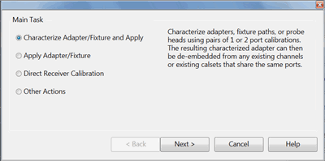 Choose from the following, then click
Next >:

  * [Characterize Adapter/Fixture and Apply](Cal_Plane_Manager.md#Characterize) \- Given that you have already performed calibrations both before and after the adapter/fixture, SNP files are generated which characterize the adapter/fixture. These files are then used to de-embed the fixture from the channel and a new calset. Learn how.
  * [Apply Adapter/Fixture](Cal_Plane_Manager.md#ApplyDeembedding) \- The *.SNP files are already saved. Use these files to de-embed the fixture from the channel and a new Cal Set.
  * [Direct Receiver Calibration](CPM_Direct_Receiver_Calibration.md) (separate topic)
  * [Other Actions](Cal_Plane_Manager.md#OtherActions)

  
  
Characterize Adapter/Fixture and Apply dialog box help  
---  
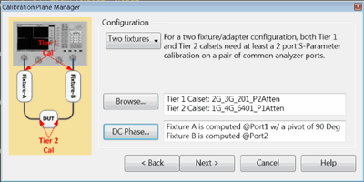

### Requirements

  * You must have already performed a Tier 1 calibration at the input of the fixture/adapter(s) AND a Tier 2 calibration at the output of the fixture/adapter(s) as in the above image.
  * In addition, the calibrations must have been saved to Cal Sets on the analyzer.

Note: The mechanical switch / attenuator settings of the Tier 1 and Tier 2
cals for CPM MUST be the same settings. Also, when the span or number of
points are different between the two cal tiers, there must be sufficient data
points to ensure that phase wrapping does NOT occur. This is accomplished when
the delta frequency for either calset is less than 12/combined length of the
test port cables in meters.

### Applications

The following images show the calibration planes of the Tier 1 and Tier 2 calibrations: |  Probe Head on Wafer |  Probe Head on Fixture |  Waveguide Adapter  
---|---|---  
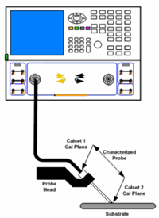 |  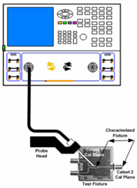 |  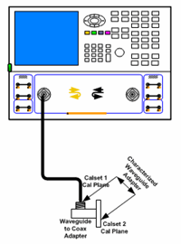  
  
### Procedure

Configuration Select the number of adapter/fixtures to be characterized and
de-embedded.

  * Choose One fixture when you have a single fixture/adapter on either the input or output of the DUT.

  * Choose Two fixtures when you have a fixture/adapter on BOTH the input AND output of the DUT.

Browse \- Starts the following [Calset
Selection](Cal_Plane_Manager.htm#CalSetSelect) dialog.

DC Phase \- Starts the [Phase Pivot dialog](Cal_Plane_Manager.md#Phase).

Click Next >  
  
Calset Selection dialog box help  
---  
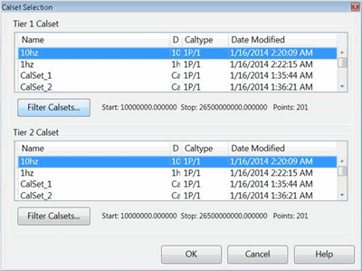 Choose from the listed Cal Sets
on the analyzer to use for the Tier 1 and Tier 2 calibrations.

  * The Tier-1 calset MUST be from a calibration that was performed at the input to the adapter/fixture.
  * The Tier-2 calset MUST be from a calibration that was performed at the DUT reference plane.

Click Filter Calsets to start the following dialog.
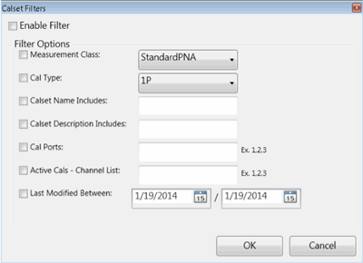 Check Enable Filter, then provide advanced
filter requirements to narrow the search for appropriate Cal Sets.

### Filter Options

Measurement Class \- The classes listed are those that are enabled on the
analyzer. Cal Type \- Filter for 1P (one-port) or 2P (two-port) Cal Sets.
Calset Name Includes \- Filter to include any text that appears in the calset
name. Calset Description Includes \- Filter to include any text that appears
in the calset description. Cal Ports \- Filter to include only the analyzer
ports to be de-embedded. Active Cals \- Filter to include only the Cal Sets
that are currently in use on the analyzer. Last Modified Between \- Filter to
include only the Cal Sets that were last modified between the two specified
dates.  
  
Port Selection dialog box help  
---  
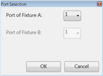 In the previous dialog, when a
multiport calset is selected for a characterization that involves fewer ports,
then select the port in the calset that is used to characterize the
fixture/adapter.  
  
Phase Pivot dialog box help  
---  
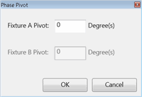 For most devices, the projected phase of
S21 at DC crosses the X-axis between 0° and -180°. The phase pivot point
specifies the center of the phase window. It is normally 1 Pi wide. The
default value of 0° should be adequate for the majority of adapters. However,
when characterizing electrically long cables, cables with significant
mismatch, or high noise in the measurements, it is possible that the
projection of phase goes above 0°. This results in a 180° phase difference
between the results computed by CPM versus the results you might get by
measuring the same adapter with a 2-port calibration. In these cases, you may
have to change the default value to capture the projected phase of S21 at DC.  
  
Select Files dialog box help  
---  
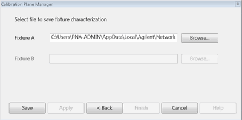 For each Fixture (A and B):

  * Click Browse, then navigate to the folder to where the S2P files are to be saved.
  * Enter a filename, then click S2P Format, then choose the format in which the data is to be saved:
  *     * Log Magnitude & Angle (default)
    * Lin Magnitude & Angle
    * Real & Imaginary

Click Apply to continue to de-embed the fixture. Click Finish to end with the
characterization and close the dialog.  
  
Apply De-embedding dialog box help  
---  
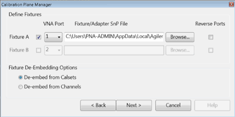 Given one S2P file for each
fixture/adapter, this dialog will remove the effects of the fixture/adapter
from either:

  * one or more Calsets
  * or one or more channels.

For each Fixture (A and B)

  1. Check to enable fixturing.
  2. Select the VNA port the fixture is connected to.
  3. Click Browse, then navigate to the S2P file that represents the fixture/adapter.
  4. Reverse Ports - S2P files that are created using CPM ALWAYS reference port 1 of the fixture/adapter on the side closest to the analyzer and port 2 of the fixture/adapter ALWAYS on the DUT side of the device as in the following image. The application of the S2P file (this dialog) assumes this same orientation. If your S2P files were created using a different (external) application, check the orientation and check Reverse Port Order if necessary.  
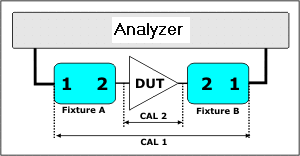

  5. Choose one of the following De-embed Options

  1.      * De-embed from Calsets \- Starts the [Select Calsets to De-embed](Cal_Plane_Manager.md#CalSetSelect) dialog box.
     * De-embed from Channels \- Starts the following [Select Channels to De-embed](Cal_Plane_Manager.md#SelectChannels) dialog.

  
  
Select Channels to De-embed dialog box help  
---  
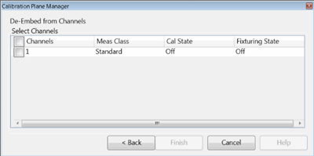 De-embedding is performed and
applied to specified channels on the analyzer. Select one more channels
currently displayed on the analyzer from which to de-embed the
adapter/fixture.  
  
Select Calsets to De-embed dialog box help  
---  
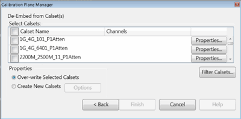 This dialog appears when De-
embed from Calsets is selected in the previous dialog. De-embedding is
performed and applied to specified Cal Sets. This allows you to easily apply
de-embedding in the future by simply applying the de-embedded calset to any
channel. Select Calsets: Select the Cal Sets to which de-embedding will be
applied. Properties View information about the corresponding calset.

### Properties

  * Overwrite Selected Calsets \- The selected Cal Sets are overwritten with the adapter/fixture de-embedded.
  * Create New Calsets \- Select the Cal Sets from which new Cal Sets will be created.

Click Options to start the following dialog.
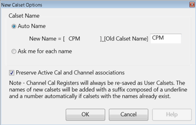

### Calset Name

Auto Name \- By default, a new calset will be created using the old calset
name with the specified text ("CPM" by default) appended to the beginning of
the name. You can change the specified text. Ask me for each name \- Starts
the following dialog when OK is pressed. Preserve Active Cal and Channel
associations \- When checked (default) the new de-embedded Cal Sets will be
used to correct the same displayed channels as the current Cal Sets.
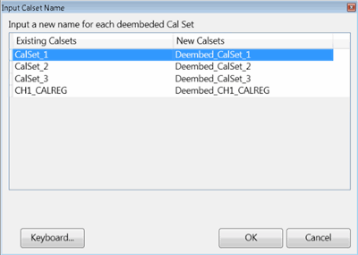 The Existing Calsets that you
selected for de-embedding appear in the left column. The proposed New Calset
names appear in the right column. To change the new Calset name, select, then
edit the name. When finished, click OK.  
  
Other Actions dialog box help  
---  
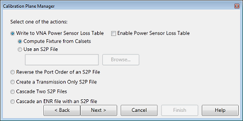 Select one of the actions:

  * [Reverse the Port Order of an S2P File](Cal_Plane_Manager.md#Reverse).
  * [Create a Transmission Only S2P File.](Cal_Plane_Manager.md#Transmission)
  * [Cascade two S2P files](Cal_Plane_Manager.md#Cascade).
  * [Cascade an ENR file with an S2P file](Cal_Plane_Manager.md#CascadeENR)

Write to VNA power sensor loss table. Loads the S2P Frequency / Loss pairs
into the VNA [Power Loss Compensation table](PwrCalibration.md#LossCompDiag)
to compensate for losses that occur when using the device to connect a power
sensor to the measurement port during a Source Power Cal.

  * Enable Power Sensor Loss Table
  * Then choose from the following:
  *     * Compute fixture from Calsets. Computes the transmission loss of the fixture based on the selected Cal Sets. This choice is NOT available until two valid Cal Sets are selected.
    * Use an S2P file. Uses the S21 data in an existing S2P file to build the VNA’s power loss table. Select, then click Browse, then navigate to the S2P file, then click Next >.

Note: In the VNA Power Loss Compensation table, loss is expressed as a
positive number. CPM assumes that any negative S21 value in the S2P file is a
loss and therefore multiplies the S21 values in the file by -1 to express that
value as a positive number. This ensures proper handling of the offset during
a source power cal.  
  
Reverse Port Order dialog box help  
---  
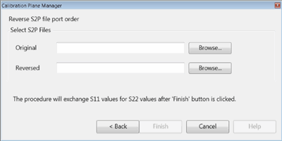 S2P files that are created using CPM
ALWAYS reference port 1 of the fixture/adapter on the side closest to the
analyzer and port 2 of the fixture/adapter ALWAYS on the DUT side of the
device as in the following image.   This
action causes ports to be reversed on an existing S2P file.

  * The data for S11 becomes the data for S22 and vice versa.
  * The data for S21 becomes the data for S12 and vice versa.

The resulting file is written in the standard [S2P file
format.](../S5_Output/SaveRecall.htm#sNp)

  1. Original \- Navigate to the S2P file to be reversed.
  2. Reversed \- Navigate to the folder where the new reversed S2P file will be saved. Enter a filename. By default, the file is saved to the same folder using the filename: <old filename>_Reversed.s2p
  3. Click Finish. The Reversed file is saved to the specified location.

  
  
Create a Transmission Only S2P File dialog box help  
---  
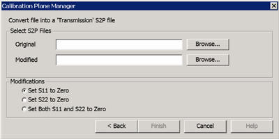 From an existing S2P file, this
feature allows you to zero the S11, S22, or both data columns. The original
S21 and S12 data are preserved. This is useful for Enhanced Response
calibration / de-embedding. Original \- Click Browse, then navigate to the
file to be modified. Modified \- Click Browse, then navigate to the folder and
enter or change the filename of the resulting S2P file. The file select dialog
allows you to change the format of the data. Click Format, then choose from
the following:

  * Log Magnitude & Angle (default)
  * Lin Magnitude & Angle
  * Real & Imaginary

### Modifications

Choose to Zero the S11, S22, or both data columns. Click Finish. The
transmission only file is saved to the specified location.  
  
Cascade Two S2P Files dialog box help  
---  
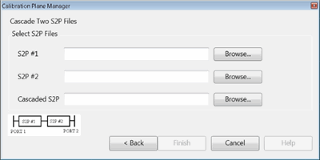 This dialog combines the losses and phase
shift of two S2P files into a single S2P file. The stimulus settings of the
two input S2P files need not be identical. The frequency range of the cascaded
S2P file will be the frequency range that is common between the two input
files. In addition, the cascaded S2P file will use the data points of the
input file with the denser data points. For example: S2P #1: Frequency range =
1 GHz to 5 GHz; 201 pts. S2P #2: Frequency range = 2 GHz to 6 GHz; 1001 pts.
Cascaded S2P: Frequency range = 2 GHz to 5 GHz using the data points of S2P
#2. S2P #1 \- Click Browse, then navigate to one of the S2P files to be
cascaded. S2P #2 \- Click Browse, then navigate to the other S2P file to be
cascaded. Cascaded S2P \- Click Browse, then navigate to a folder and enter
the filename of the resulting S2P file. Click Finish. The cascaded file is
saved to the specified location.  
  
Cascade ENR Files dialog box help  
---  
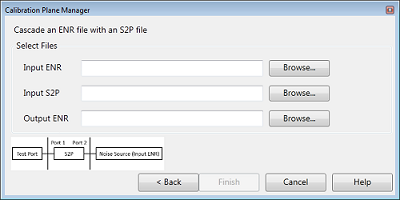 This dialog generates a new ENR file
by embedding an adapter to an existing ENR file. Input ENR \- Click Browse,
then navigate to ENR files to be cascaded. Input S2P \- Click Browse, then
navigate to the S2P file to be cascaded. Output ENR \- Click Browse, then
navigate to a folder and enter the filename of the resulting ENR file. Click
Finish. The cascaded file is saved to the specified location.  
  
* * *

