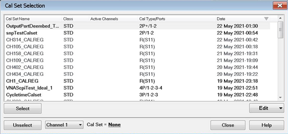
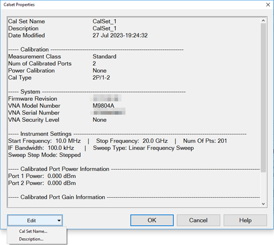
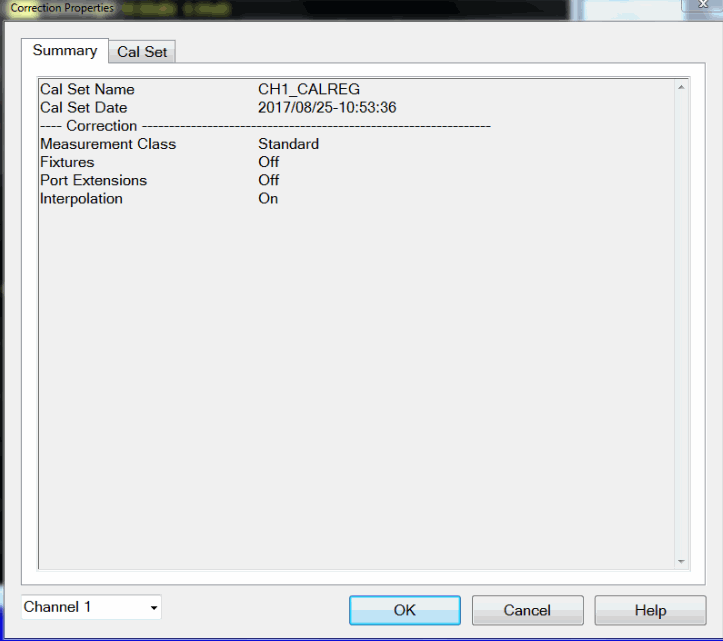
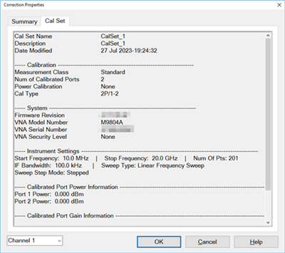
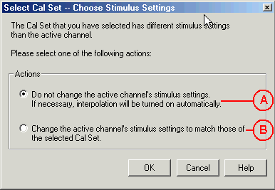
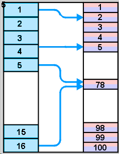

# Using Calibration Sets

* * *

  * What are Cal Sets

  * [Cal Registers and User Cal Sets](Cal_Sets.md#Registers)

  * How to Manage and Apply Cal Sets

  *     * [Cal Set Selection dialog box help](Cal_Sets.md#context)

    * [Cal Set Properties dialog box help](Cal_Sets.md#CalSetProps)

    * [Select Cal Set -- Choose Stimulus Settings dialog box help](Cal_Sets.md#Interpolation)

  * [Examples of Cal Set Usage](Cal_Sets.md#Examples)

  * Archiving Cal Sets using .cal files

### See Also

Save and Recall: [Instrument States and Cal Set
Data](../S5_Output/SaveRecall.htm#State)

[See other Calibration Topics](Calibration.md)

What are Cal Sets

At the completion of a calibration, all calibration data is stored to a Cal
Set. The Cal Set can be applied later to any channel that has the same
stimulus settings as the Cal Set, thereby saving the time it takes to perform
another calibration. The following data is saved to a Cal Set:

  * Name

  * Cal Set Description

  * Cal Set Attributes - stimulus settings, cal type, port association

  * Standards data - _The “Standards data” container in the Cal Set is intended for internal use only. External access is provided for use in diagnosing calibration problems. Users should not form any expectations as to the presence of the data or the naming conventions used._

  * [Error term](JavaScript:hhctrl.TextPopup\(Error_Terms,'Arial,8',10,10,00000000,0xc0ffff\)) data

  * GUID (Globally Unique IDentifier)

Cal Registers and User Cal Sets

There are two types of Cal Sets:

  * Cal Registers (channel specific)

  * User Cal Sets

Calibration data is automatically saved to a Cal Register at the end of every
calibration. You can also choose to save the cal data to a User Cal Set.

Preset clears all PNA settings but the data inside a Cal Set is not volatile
until, for example, another calibration is performed. Also, preset will
disassociate all Cal Sets from any channel. But the process of calibration
will reestablish that association.

### Calibration Registers

Calibration Registers are designed to simplify calibrations for most users.
When a calibration is complete, the data is automatically saved to the
channel's Cal Register, overwriting (or [appended to](Cal_Sets.md#Append))
the previous cal data stored in that register. This concept is similar to
'legacy' Vector Network Analyzers.

  * Every channel has ONE dedicated Cal Register. They are named CHn_CALREG, where n is the channel number. The name cannot be changed.

  * Data in Cal Registers are less permanent than User Cal Sets because they are the default container for a new calibration. However, preset never clears the contents of any Cal Set.

  * Cal Registers can be applied to other measurements, but ONLY on the same channel as the Cal Register.

### User Cal Sets

At the end of a calibration, you can choose to also save cal data to an
existing or new User Cal Set.

  * User Cal Sets can be applied to any number of channels simultaneously.

  * User Cal Sets are named by you for easy identification.

  * You can have an unlimited number of User Cal Sets.

  * At any time, you can copy Cal Register data to create a User Cal Set. See [Cal Set Properties.](Cal_Sets.md#CalSetProps)

  * User Cal Sets are never cleared unless the user deletes them or uses them in a new calibration.

### Appending Data in a Cal Set

At the end of a calibration, data is saved to the channel's Cal Register and,
if you choose, to a User Cal Set. When you choose to save to an existing User
Cal Set, the analyzer attempts to append the new error terms to the existing
User Cal Set. The existing Cal Set data is completely overwritten UNLESS the
new data can coexist with the existing data according to the following two
rules:

  * The stimulus settings between the two Cal Sets must be identical. Otherwise, the new cal will overwrite the old cal and one will not be able to append to the existing calibration. The comparison is strict, and includes the leveling mode and the source power state (including AUTO vs ON). In addition, frequencies, IFBW, source and receiver attenuators, source power value, power slope, IF Path, Shift LO mode, and any path settings are also compared. Therefore, it is highly recommended that immediately before starting the second calibration, recall the first calibration and choose to change the stimulus to match the Cal Set. Once you have a complete Cal Set, you can perform normal operations such as turning on receiver leveling, etc.

  * The new cal must involve different ports from the existing cal.

Note: The reason for this behavior is that the S-parameter channel, unlike
most of the applications, supports multiport. Therefore, it is possible that a
user may need to accumulate separate calibrations for different subsets of
ports

For example:

Case 1 \- An existing Cal Set contains a full 2-port cal between ports 1 and
2. Using the same stimulus settings, you perform a 1-port cal on port 3. At
the end of the cal, you click [Save As User Cal
Set](Calibration_Wizard.htm#SaveAs) and select the existing full 2-port User
Cal Set.

Result: The 1-port cal is appended to the 2-port User Cal Set. There is NO
overlap between them.

Case 2 \- Same situation as Case 1, except the 1-port cal is performed on port
1.

Result: The Cal Set will contain a 1 port cal on port1 and a 1 port cal on
port 2. The overlapping tracking terms are removed rendering the original full
2 port cal invalid.

How to Manage and Apply Cal Sets and Cal Types

The analyzer attempts to apply a Cal Set and turn error correction ON for ALL
of the measurements on the active channel. This may not always be possible.
For example, suppose a channel contains both S11 (reflection) and S21
(transmission) measurements. If a Cal Set that contains only an S11 Cal Type
is applied to that channel, the Cal Set does not contain the error terms to
correct the S21 measurement. Error correction is turned ON for the S11
measurement and NOT turned on for the S21 measurement.

There are two ways to apply an existing Cal Set (Cal Register or User Cal Set)
to a measurement:

  1. Recalling an Instrument State with Cal data ([.cst file](../S5_Output/SaveRecall.md#SaveAsDiag)) - A .cst file contains an Instrument State with all measurement attributes AND a 'pointer' to the Cal Set that was used to calibrate the measurement. Before saving a .cst file, be sure that a User Cal Set (NOT a Cal Register) is being used for the measurement. Because Cal Registers are automatically overwritten when a new calibration is performed, it is likely that the Cal Register data will change before the .cst file is recalled.

  2. Create a new measurement and select a Cal Set to apply to the active channel.

Note: NEVER copy or modify Cal Sets from Windows Explorer or other
applications. Cal Sets should only be accessed through the VNA Application.

#### How to select and apply a Cal Set to the active channel  
  
---  
Using Hardkey/SoftTab/Softkey  
  
  1. Press Cal > Cal Sets & Cal Kits > Cal Set....

  
  
  
Cal Set Selection dialog box help  
---  
 This dialog allows you to
manage and apply Cal Sets Since the number of Cal Sets you can have is limited
by the amount of analyzer memory, old Cal Sets (with 'stale' data) should be
deleted or overwritten.

  * Learn about [Cal Registers](Cal_Sets.md#Registers).
  * Learn how to [View the Error Terms of a Cal Set.](Errors.md#Monitoring)

To apply a Cal Set to the active channel, click a row to select that Cal Set,
then click OK. The Cal Set used by the currently active channel is indicated
with dotted outline. Currently selected Cal Set is indicated with blue
highlight.  Note: A Cal Set must have been generated from the same
[measurement class](../S1_Settings/Measurement_Classes.md) as the active
channel in order for it to Applied. Columns click a heading to sort by that
column Cal Set Name Name to identify the Cal Set. Class Indicates the type of
channel that created the calset. Active Channels Channel numbers that are
currently using this Cal Set. A blank entry means it is not currently in use.
CalType / Ports Type of Cal contained in the Cal Set. [Learn about applying
appropriate Cal Types.](Cal_Sets.htm#ApplyingCalSet) Cal Type Abbreviations:
1P, 2P, 3P, 4P... \- Port list indicating which ports were calibrated.  + \-
Indicates source and receiver Power Correction is included for the ports that
are listed. So 2P+(2,3) means that the test and reference receivers on ports 2
and 3 are power calibrated. R \- Response (parameter). ER/x-y [Enhanced
Response](Select_Cal.htm#Enhanced), where **x** is the receive port; **y** is
the source port. ER/2-3, therefore, corrects S23.  ER+/x-y Enhanced response
plus power. Also contains tracking terms for bx and ay. VMC [Vector Mixer
Cal](../FreqOffset/VMC_Measurements.htm) SMC [Scalar Mixer
Cal](../FreqOffset/SMC_Measurements.htm) Date Date and time the Cal Set was
last modified. Buttons Select Applies the selected Cal Set to the active
channel. If the stimulus settings of the Cal Set and channel are different, [a
choice must be made](Cal_Sets.htm#Differences). This button is greyed-out if
the highlighted Cal Set is not compatible with the active channel. Unselect
Available ONLY if the selected Cal Set is being used by the active channel.
Click 'Unselect', then click OK to exit with the Cal Set un-applied.  Close
Exit the dialog box. Performs no further action. Drop-Down Selector Channel To
choose the active channel. Edit This includes Properties, Copy, Delete and
Delete All. Properties Starts the [Cal Set
Properties](Cal_Sets.htm#CalSetProps) dialog box. This allows you to view all
of the Cal Set properties. Copy Invokes the [Copy Cal
Set](Calibration_Wizard.htm#SaveAs) dialog box. Type a name for the copy of
the selected Cal Set data. Delete Permanently deletes the Cal Set after you
choose OK to a warning prompt. Delete All Permanently deletes ALL listed Cal
Sets and Cal Registers after you choose OK to a warning prompt.  
  
Cal Set Properties dialog box help  
---  
  
 Allows you to view all of the Cal Set
properties. Drop-Down Selector Edit This includes Cal Set Name and
Description. Cal Set Name Edit name of the User Cal Set. You CANNOT change the
name of a Cal Register. Description Descriptive text to further identify the
Cal Set. Buttons OK Applies the changes on Cal Set name or description if any
and then closes the dialog box. Cancel Discard changes made to the Cal Set
name or description.  Learn how to [View the Error Terms of a Cal
Set.](Errors.htm#Monitoring) Note: Only temperature compensated calibrations
show the temperature in the Calset Properties dialog.  
  
Correction Properties dialog box help  
---  
  
### Tabs

Summary  Allow you to view
summary of correction properties including Correction, Receiver Power, Source
Power and Correction Level. Channel Selector Select the channel that you want
to view the summary of correction properties.  Cal Set
 Allow you to view the Cal
Set properties. Shows the same data as shown in the [Cal Set Properties
dialog](Cal_Sets.htm#CalSetProps) accessed from the [Cal Set Selection
dialog](Cal_Sets.htm#context).  Channel Selector Select the channel that you
want to view the Cal Set properties.  
  
Stimulus Setting Different between Cal Set and Measurement

Select Cal Set -- Choose Stimulus Settings dialog box help  
---  
 The Cal Set contains the channel
stimulus settings that were in place when the Cal Set was saved. This dialog
appears when the Cal Set channel settings are different than those of the
channel to which the Cal Set is being applied. Choose between the following
options.. (See above image).

  * A. Keep the Active Channel Stimulus settings. Interpolate if possible.
  *     * If the Cal Set frequency range is greater the active channel, then Interpolation will be turned ON. Learn more about [Interpolation Accuracy](Error_Correction_and_Interpolation.md#InterpolationAccuracy)
    * If the Cal Set frequency range is less than the active channel, then this option is not available.
  * B. Keep the Cal Set Stimulus settings. The Active Channel stimulus setting are changed.

OK Make the change. Cancel Cal Set will NOT be applied.  
  
Examples of Cal Set Usage

The following examples show how Cal Sets increase flexibility and speed in
making analyzer measurements.

  * Using one User Cal Set with many Channels

  * Using one Measurement with many Cal Sets

Using one User Cal Set with many Channels

It is possible to do one calibration, then apply it to several channels.

An example:

During a manufacturing process, you may have many calibrated channels. You may
wish to continuously cycle through the measurements and examine them
individually. Occasionally, you may wish to refresh the calibration without
having to recreate all the measurement state files.

Here is how: Examine the stimulus settings for each channel. Then make the
User Cal Set stimulus range a super-set of the whole group. Each channel can
then use the same User Cal Set. Some calibrations will be interpolated. Note:
Make sure that interpolation is turned on.

Notice in the following image, Cal Set 78 is used on more than one channel, in
this case Channel 5 and 16 .

####  Channel Cal Set

Using one Measurement with many Cal Sets

The drawback with having one very large User Cal Set associated with many
instrument states could be a loss of accuracy due to interpolation. In such
cases, consider using one User Cal Set for each stimulus setting.. The
stimulus conditions can then be changed for a channel by applying different
User Cal Sets. Other settings (window setups, measurement definitions,
scaling, limits, markers) will not change. This may result in faster state
changes than if you saved and recalled *.cst files for each set of stimulus
conditions.

Example #1: An amplifier needs to be measured at several input power levels.
Calibrate at several power levels and save each calibration in a separate User
Cal Set. Then, apply the User Cal Sets to the single measurement
consecutively.

Example #2: Making an S21 Measurement, you need to measure both wide span and
narrow span characteristics of the device. One Cal Set covers the wide span
setup; another the narrow span setup.

Archiving Cal Sets using .cal or .csa files

Because User Cal Sets can easily be deleted, provide extra backup by also
saving your calibration as a .cal or .csa file ([see saving a .cal
file](../S5_Output/SaveRecall.htm#About_Saving)).

Example:

One person performs a calibration, names and saves it as a User Cal Set. This
Cal Set is available for any other person to use. A second user could
accidentally delete or modify the User Cal Set requiring the originator to
repeat the calibration.

Security can be provided for calibration data by saving the Cal Set to a .cal
file or .csa file. At a later time, the file could be recalled and the
original calibration restored.

* * *

