# Calibrate All Channels

* * *

"Cal All" allows you to calibrate multiple channels in a single calibration
session. This not only reduces the number of connections that need to be made,
but also the number of cal standard measurements that must be performed.

In this topic:

  * [Features](Calibrate_All_Channels.md#Features)

  * [Limitations](Calibrate_All_Channels.md#Limitations)

  * [How to perform a Cal All Channels Calibration](Calibrate_All_Channels.md#How)

  *     * [Select Channels dialog](Calibrate_All_Channels.md#SelectChansDiag)

    * [Measurement Class Cal Properties dialog](Calibrate_All_Channels.md#propertiesDiag)

    * Setting Up an Independent Power Calibration

    * Split Port Cal Channels

    * Independent Calibration Channels

    * [Calibration Attenuator Settings dialog](Calibrate_All_Channels.md#CalAttnSettingsDiag)

    * [Select DUT Connectors and Cal Kits dialog](Calibrate_All_Channels.md#SelectDUTConnect)

    * [Power Cal Settings dialog](Calibrate_All_Channels.md#PowerCal diag)

    * [Cal Steps dialog](Calibrate_All_Channels.md#CalSteps)

    * [Finish](Calibrate_All_Channels.md#Finish)

[Other Cal Topics](Calibration.md)

### See Also

  * [Cal All Channels Calibration](../Programming/GPIB_Example_Programs/Perform_a_CalAllChannels_Calibration.md) (links to SCPI Cal All Channels programming examples)

  * [COM Examples](../Programming/COM_Example_Programs/COM_Example_Intro.md) (links to COM programming examples)

### Features

Cal All offers a single, optimized calibration procedure for all channels
(with some limitations, see below). The optimizations include:

  * Minimizing the number of physical connection of standards.

  * Minimizing the number of power meter calibration sweeps.

  * User-settable power levels for S-Parameter as well as power calibration steps.

  * Accounting for different switch and attenuator settings among different channels. This reduces the number of measurements required to characterize different switch/attenuator settings (channel setup differences).

  * Cal All will produce the same number and format of Cal Sets (error terms) that would be realized had the calibrations been performed one at a time.

  * Calibrate External Sources that are connected to the analyzer using [Configure an External Source](../System/Configure_an_External_Source.md).

  * [ECal Extrapolation](../Applications/Swept_IMD.md#ECalExtrap) is supported on Swept IMD and IMDx channels.

  * [mm Wave measurements](../IFAccess/External_Test_Head_Configuration.md) are supported.

Beginning with the A.12.80 release, Cal All has been extended in order to deal
with the new [Low Frequency
Extension](../IFAccess/Low_Frequency_Extension/Low_Frequency_Extension.htm)
option. If a user has a mixture of LFE and non-LFE channels and they would
like to use Calibrate All to calibrate them at the same time, two calibration
channels are created to account for the hardware differences between the two
situations. When using the GUI or COM to set calibration and stimulus
conditions, the settings are applied to both calibration channels. With SCPI,
the user can query the primary guided calibration channel using
[SYST:CAL:ALL:GUID:CHAN:VAL?](../Programming/GP-
IB_Command_Finder/SystCalAll.htm#GuideChan). This will return the primary
calibration channel. When subsequent Guided Cal commands are used, settings
will be transferred to the second calibration channel. If there is a desire to
set these settings separately, the user should query for all Cal All
Calibration channels with [SYST:CAL:ALL:GUID:CHAN:LIST?](../Programming/GP-
IB_Command_Finder/SystCalAll.htm#SYSTem:CALibrate:ALL:GUIDed:CHANnel:CATalog).
The user should set values for the primary calibration first, and then
secondary calibrations. When initializing the calibration and acquiring steps,
use the primary cal all channel number.

Beginning with the A.18.40 release, Cal All supports the following internal
setting difference. Call All takes all required calibration data for each
setting below during the Call All sequence.

  *   * A port of Split Port Calibrations

  * 

### Limitations

  * [VMC](../FreqOffset/VMC_Measurements.md) channels are NOT supported.

  * [SMC+ Phase](../FreqOffset/SMC_plus_Phase.md) with phase enabled is supported using a known delay mixer or a phase reference cal set. S2P file characterized mixers are NOT supported.

  * For non-IMD channels, the wideband IF path is used during Cal All. Therefore, non-IMD channels that use the narrowband IF path (for [Narrow band pulse](../Applications/Narrowband_Pulsed_Application.md) measurements for example) or have [manually-selected IF frequencies](../IFAccess/IF_Path_Configuration.md#Manually) will not be properly calibrated.

  * Starting the VNA in [Multiport mode](../System/External_Testset_Control.md#Restart) is NOT supported.

  * Cal All is performed at one IFBW.

  * All channels that are calibrated are forced into [stepped sweep mode](../S1_Settings/Sweep.md#Stepped). 

  * All channels to be calibrated MUST have the same [cal reference plane](Accurate.md#refplane). In other words, Cal All cannot compensate for any path changes that occur external to the analyzer.

  * Cal All cannot be used for the following configurations with Swept IMD and IM Spectrum (for these configurations use the Cal Wizard instead):

  *     * Port 3 as input and port 4 as output using an external combiner.

    * Using an N5242B with external combiner that has a large path loss difference from the internal combiner.

  * Cal All nominally uses preset conditions for path configuration switches and attenuators during the calibration (unless you change them via the Cal All Wizard pages). The benefit of the Cal All approach is that it measures all the switch path differences between channels and compensates the error terms appropriately for each channel. However, the “Port 2 Source” configuration setting is not something that Cal All can automatically remove. Therefore, if you are attempting to calibrate a channel with an alternate Port 2 Source configuration, you will need to modify the Cal All settings as follows:  
  
If the [Configuration](../S1_Settings/Path_Configurator.md#Configuration) is
set to Src2 out Port 2, the Cal All settings must be changed to match the RF
Path configuration settings for the channel. Use the Mechanical Devices dialog
in the Cal All Wizard for this purpose. The dialog on the left shows the
default Cal All settings at Preset and the channel settings when
[Configuration](../S1_Settings/Path_Configurator.md#Configuration) is set to
Src2 out Port 2. The dialog on the right shows the edited (highlighted) Cal
All settings to match the channel settings.  
  
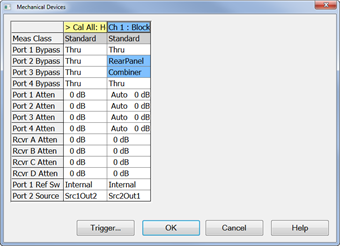
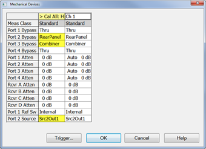

  * When calibrating systems with a mix of internal and external couplers, the Cal All attenuator settings must be set to match the client channels, otherwise the Source Power Calibration may be incorrect.

#### How to perform a Cal All Channels Calibration  
  
---  
Using Hardkey/SoftTab/Softkey  
  
  1. Press Cal > Other Cals > Cal All....

  
  
  
Selected Channels dialog box help  
---  
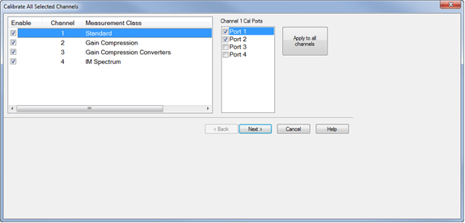

  1. Check the channels to be calibrated.
  2. Check the ports to be calibrated. Click on the Apply to all channels button to apply the port selections to all channels.
  3. Click Next>

. Then select that port in this dialog.  
  
Measurement Class Cal Properties dialog box help  
---  
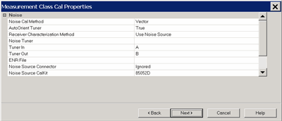 Confirm or change the following
unique cal properties for each channel to be calibrated. Click a link to learn
about these properties. The properties with (NOT available in Cal All) are NOT
available in a Cal All calibration as they are in a stand-alone calibration.

### Differential IQ

|  |  Programming  
---|---  
UI Setting |  Property |  Value  
Enable Extra Power Cals |  "Enable Extra Power Cals" |  "Port 1", "Port 2", "Port 3", "Port 4", "Port 1 Src2", and/or Source3  
Independent Calibration Channels |  "Independent Calibration Channels" |  Any selected channels that support SmartCal.  
  
### Spectrum Analyzer

|  Programming  
---|---  
UI Setting |  Property |  Value  
Calibration Span |  Calibration Span |  "User Span" or "Instrument Span"  
Calibration Points |  Calibration Points |  Integer indicating number of calibration points.  
Enable Extra Power Cals |  "Enable Extra Power Cals" |  "Port 1", "Port 2", "Port 3", "Port 4", "Port 1 Src2", and/or Source3  
Independent Calibration Channels |  "Independent Calibration Channels" |  Any selected channels that support SmartCal.  
  
### Gain Compression

|  Programming  
---|---  
UI Setting |  Property |  Value  
Enable Extra Power Cals |  "Enable Extra Power Cals" |  "Port 1", "Port 2", "Port 3", "Port 4", "Port 1 Src2", and/or Source3  
Independent Calibration Channels |  "Independent Calibration Channels" |  Any selected channels that support SmartCal.  
  
### GCX (Gain Compression Converters)

|  Programming  
---|---  
UI Setting |  Property |  Value  
Enable Extra Power Cals |  "Enable Extra Power Cals" |  "Port 1", "Port 2", "Port 3", "Port 4", "Port 1 Src2", and/or Source3  
Independent Calibration Channels |  "Independent Calibration Channels" |  Any selected channels that support SmartCal.  
Split Port Cal |  "Split Port Cal" |  "true" or "false"  
  
### Noise Figure and NFX

Note: Calibrate All Channels for Noise Figure measurement channels is not
supported on M980xA, P50xxA/B and E5080B.

|  Programming  
---|---  
UI Setting |  Property |  Value  
[Cal Method](../Applications/Noise_Cal.md#SelectMethodDiag) |  "Noise Cal Method" |  "Scalar" "Vector"  
[Noise Tuner](../Applications/Noise_Cal.md#SelectMethodDiag) (used with Vector Cal Method) |  "AutoOrient Tuner" |  "true" \- AutoOrient "false" \- Do NOT autoOrient  
When "AutoOrient Tuner" = false  
(Manually Orient) |  "Tuner In" "Tuner Out" |  Tuner port connected to DUT input Tuner port connected to DUT output For example: "A" or "B"  
[Receiver Characterization Method](../Applications/Noise_Cal.md#SelectMethodDiag) |  "Receiver Characterization Method" |  "Use Power Meter" "Use Noise Source" Note: When selecting "Use Power Meter", the power cal step must be completed first when acquiring the calibration. Furthermore, the power cal port must be the same as the input port on the NF channel.  
[Specify the Noise Source connector](../Applications/Noise_Cal.md#SelectDutConn) \- used for the 1 port cal if needed. |  "Noise Source Connector" |  String name of valid connector type. To query valid connector types: COM: [ValidConnectorTypes](../Programming/COM_Reference/Properties/ValidConnectorType_Property.md) SCPI: [SENS:CORR:COLL:GUID:CONN:CAT?](../Programming/GP-IB_Command_Finder/Sense/CorrGuided.md#gConnCat)  
[Specify the Noise Source cal kit](../Applications/Noise_Cal.md#SelectDutConn) \- used for the 1 port cal if needed. |  "Noise Source CalKit" |  String name of valid cal kit. To query valid cal kits names: COM:[GetCompatibleCalKits](../Programming/COM_Reference/Methods/GetCompatibleCalKits_Method.md) SCPI: [SENS:CORR:COLL:GUID:CKIT:CAT?](../Programming/GP-IB_Command_Finder/Sense/CorrGuided.md#gKitCat)  
[Specify ENR file](../Applications/Noise_Cal.md#ConfigureNSDiag) |  "ENR File" |  String path and filename of the ENR file.  
[Include Power Calibration](Guided_Power_Calibration.md#IncludePwrCal) |  "Include Power Calibration" "Enable Extra Power Cals" "Port 1 Src2 Cal Power" |  "true" or "false" "Port 1", "Port 2", "Port 3", "Port 4", and/or "Port 1 Src2" Integer indicating valid calibration power. For example, "-20" indicates a power level of -20 dBm. Only valid if an independent port calibration on Port 1 Src2 is selected.  
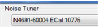 |  "Noise Tuner" |  Tuner description in the form of <model> ECal <serialNumber>, as in “N4691-60004 ECal 10775”.  
 |  “Force Thru Adapter De-embed” |  “true” – Always measure and de-embed the thru adapter. “false” – Only measure and de-embed the thru adapter if no flush thru is possible.  
 |  “Force Noise Source Adapter De-embed” |  “true” – Always measure and de-embed the noise source adapter. “false” – Only measure and de-embed the adapter if no direct connection is possible.  
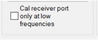 |  “Cal Receiver Port Only at Low Frequencies” |  _Only available when doing scalar downconverter calibrations on PNAs with a max frequency of 40 GHz or higher._ “true” – only make receiver port measurements during cal at downconverted frequencies. “false” – make receiver port measurements during cal at both input and output frequencies  
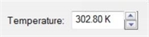 |  “Noise Source Temperature” |  The cold temperature of the noise source, in Kelvin.  
USB Noise Source |  "USB Noise Source" Note: This property available when noise figure channels are included. |  “usbNsSrcID” (example: “U1831C MY12345678”) Note: This indicates to use the specified USB Noise Source. If “ENR File” is not specified, will use the internal USB  
[Meas Noise Params](../Applications/Noise_Cal.md#MeasNoiseParams)  
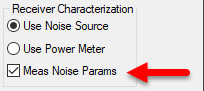 |  "Measure Noise Receiver Parameters" |  “true” – Measure the noise parameters of the noise receiver “false” – Do not measure the noise parameters of the noise receiver  
  
### Swept IMD and IMDX

|  Programming  
---|---  
UI Setting |  Property |  Value  
[Max Product Order](../Applications/Swept_IMD.md#CalMaxNTone) |  "Max Product Order" |  Integer indicating desired product order.  
[Include 2nd Order](../Applications/Swept_IMD.md#CalMaxNTone) |  "Include 2nd Order" |  "true" or "false"  
[Exclude 2nd Order](../Applications/Swept_IMD.md#CalMaxNTone) |  "Exclude Channels From 2nd Order" |   
Enable Extra Power Cals |  "Enable Extra Power Cals" |  "Port 1", "Port 2", "Port 3", "Port 4", "Port 1 Src2", and/or Source3  
Independent Calibration Channels |  "Independent Calibration Channels" |  Any selected channels that support SmartCal.  
[Response only](../Applications/Swept_IMD.md#CalSelectTones)  
(NOT available in Cal All) |  |   
[Center Frequencies only](../Applications/Swept_IMD.md#CalSelectTones)  
(NOT available in Cal All) |  |   
  
### MOD (Modulation Distortion) and MODX (Modulation Distortion Converters)

|  Programming  
---|---  
UI Setting |  Property |  Value  
Enable Extra Power Cals |  "Enable Extra Power Cals" |  "Port 1", "Port 2", "Port 3", "Port 4", "Port 1 Src2", and/or Source3  
Independent Calibration Channels |  "Independent Calibration Channels" |  Any selected channels that support SmartCal  
Calibration Span (MOD only) |  "Calibration Span" |  "User Span" or "Instrument Span"  
Calibration Points (MOD only) |  "Calibration Points" |  Integer indicating number of calibration points  
Enable Phase Correction (MODX only) |  "Enable Phase Correction" |  "true" or "false"  
Phase Correction Method (MODX only) |  "Phase Correction Method" |  "Use Mixer Delay" "Use Receiver Characterization Calset"  
Calset (MODX only) |  "Calset" |  String of Cal Set Name  
  
### PN (Phase Noise)

|  Programming  
---|---  
UI Setting |  Property |  Value  
Use Smart Cal Order |  "Use Smart Cal Order" |  true or false Cal All optimizes the order of the calibration standards for acquisition to improve calibration results. This may result in a different order than a single channel Smart Calibration. Use “True” to have Cal All attempt to preserve the order of Smart Cal. Important note: depending on the client channels selected for calibration, this may not be possible due to incompatible order between channels.  
Enable Extra Power Cals |  "Enable Extra Power Cals" |  "Port 1", "Port 2", "Port 3", "Port 4", "Port 1 Src2", and/or Source3  
Independent Calibration Channels |  "Independent Calibration Channels" |  Any selected channels that support SmartCal  
Calibration Span |  "Calibration Span" |  "User Span" or "Instrument Span" If “User Span” is selected, Cal All will calibrate +/- 30 MHz around the carrier frequency (calibrated at a 10 MHz spacing).  
Calibration Points |  "Calibration Points" |  Integer indicating number of calibration points Note that this option is only available if “Instrument Span” is selected. If “User Span” is selected, 7 points will be used (every 10 MHz).  
  
### IMSpectrum

|  Programming  
---|---  
UI Setting |  Property |  Value  
Enable Extra Power Cals |  "Enable Extra Power Cals" |  "Port 1", "Port 2", "Port 3", "Port 4", "Port 1 Src2", and/or Source3  
Independent Calibration Channels |  "Independent Calibration Channels" |  Any selected channels that support SmartCal.  
  
### SMC (VMC is NOT offered)

|  Programming  
---|---  
UI Setting |  Property |  Value  
Use Smart Cal Order |  "Use Smart Cal Order" |  true or false Cal All optimizes the order of the calibration standards for acquisition to improve calibration results. This may result in a different order than a single channel Smart Calibration. Use “True” to have Cal All attempt to preserve the order of Smart Cal. Important note: depending on the client channels selected for calibration, this may not be possible due to incompatible order between channels.  
[Enable Phase Correction](../FreqOffset/SMC_plus_Phase.md#HowEnableSMCPhase) |  "Enable Phase Correction" |  "true" or "false"  
[Phase Correction Method](../FreqOffset/SMC_plus_Phase.md#SMCCalSetup) |  "Phase Correction Method" |  "Use Mixer Delay" "Use Characterized Mixer" "Use Receiver Characterization Calset"  
Mixer Delay |  "Mixer Delay" |  Real number indicating delay value.  
Receiver Characterization Cal Set |  "Calset" |  String of Cal Set Name  
Enable Extra Power Cals |  "Enable Extra Power Cals" |  "Port 1", "Port 2", "Port 3", "Port 4", "Port 1 Src2", and/or Source3  
Independent Calibration Channels |  "Independent Calibration Channels" |  Any selected channels that support SmartCal.  
Split Port Cal |  "Split Port Cal" |  "true" or "false"  
[Characterized mixer (s2p file)](../FreqOffset/SMC_plus_Phase.md#SMCCalSetup)  
(NOT available in Cal All) |  |   
Phase Import Port |  "Phase Import Port" |  "Autoselect", "Port 1", "Port 2", etc.  
  
### Standard Channel

|  Programming  
---|---  
UI Setting |  Property |  Value  
[Include Power Calibration](Guided_Power_Calibration.md#IncludePwrCal) |  "Include Power Calibration" "Enable Extra Power Cals" "Port 1 Src2 Cal Power" |  "true" or "false" "Port 1", "Port 2", "Port 3", "Port 4", "Port 1 Src2", and/or Source3 Integer indicating valid calibration power. For example, "-20" indicates a power level of -20 dBm. Only valid if an independent port calibration on Port 1 Src2 is selected.  
Independent Calibration Channels |  "Independent Calibration Channels" |  Any selected channels that support SmartCal.  
  
The power cal is optional only if none of the selected channels require a
power cal.

Setting Up an Independent Power Calibration  
---  
Independent Power Calibration Several applications control internal and
external sources in a mode that is often decoupled from the span over which
the receivers are swept. This includes, for instance, Differential IQ, and
Spectrum Analyzer. Cal All can add a power calibration for any port (including
external sources) over an arbitrary frequency span defined by the user. For
all ports selected for an independent power calibration (except for Port 1 Src
2, see below), a power sensor calibration measurement is performed. The
resulting source match correction terms are added to the calsets for ALL
channels selected for the Cal All calibration. The power calibrations used in
Cal All have all the same features as typical power calibrations. These
include the ability to specify power offsets, the power at which the
calibration is completed, and the ability to use multiple power sensors (note
that using multiple power sensors is a feature only available on regular PNA
ports – that is, not external sources or auxiliary ports). Port 1 Src2
Calibration The Port 1 Src2 calibration is a special case: In this case, a
calibration is requested for situations where the Port 1 Bypass Switch is in
“Combiner Path” mode and either the “Port 3 Bypass Switch” (4-port PNA-X) or
the “Source 2 out 1 Bypass Switch” (2-port 2-source PNA-X) is also in
“Combiner Path”. Therefore, if a user requests a calibration of this port:

  1. Port 1 will also be calibrated at the same frequencies in the combiner path (*note: The user can still elect to add more Port 1 independent cal ranges, but this will be done in “Bypass” mode, not “Combiner mode.”
  2. The calibrations for both Port 1 and Port 1 Src2 will be done with both sources on, but offset by 10MHz (to more accurately characterize the behavior during use).
  3. These calibrations will ONLY be applied to user channels in which both the Port 1 Bypass Switch and either the Port 3 or Source 2 Out 1 Bypass Switches are set to “Combiner Path.”

Important Notes:

  * If a user selects an independent power calibration on a port also used for the typical S-parameter calibration, then the frequencies calibrated will be _in addition_ to those frequencies used via the typical calibration (a separate measurement will be completed at the time).
  * Previously a user could select a similar calibration of “LO” ports for application channels (for instance, in a GCX measurement with Port 3 used for LO1, a user can select (via GUI or remote) to do an “LO1” calibration. This will do a power sensor calibration of LO1 (port 3) at the frequencies specified by the channel. This is still available, but if the user selects to do an Independent Power Calibration instead, this will override the selection by the channel.
  * If the user has a mixture of LFE ([Low Frequency Extension](../IFAccess/Low_Frequency_Extension/Low_Frequency_Extension.md)) and non-LFE channels the calibration will be done by default in the NON-LFE configuration (this is because most applications do not support LFE and external sources and sources like Src2 Out 1 do not have LFE paths). Instead, if it’s desired to do these calibrations in LFE mode, the user must select _only_ LFE channels over which to do the cal all calibration.
  * If setting up the calibration remotely, it is not necessary to set the power cal state for the extra power calibrations (for example, “SENS200:CORR:COLL:GUID:PSEN2 ON”). These state commands should only be used to specify the power cal port for the main calibration.

Independent Power Calibration for Cal All Setup

  1. Start the Cal All Wizard.
  2. In the Measurement Class Cal Properties dialog, enable Independent Power Calibration by selecting the port(s) to cal then clicking OK.

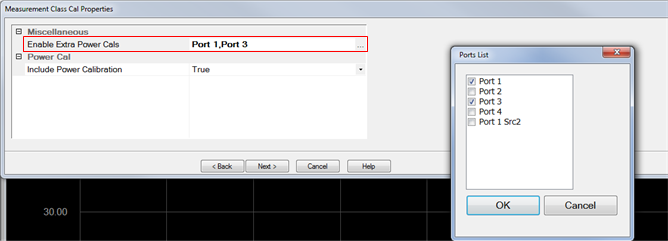

  3. If Port 1 Scr2 is a selected port, the Port 1 Src2 Cal Power level is displayed allowing a calibration power level to be entered.

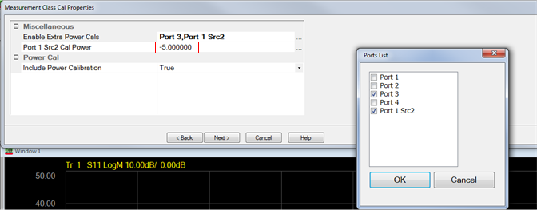

  4. To enter the Port 1 Src2 Cal Power level, click in the field then enter a valid calibration power level.

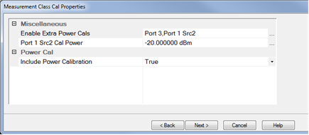

  5. In the Power Cal Settings for Port<n> dialog, select the port from the Power cal at dropdown.
  6. To add a new Cal range, click the New button.
  7. Specify a frequency range for each Range Name by clicking in the corresponding Settings field then clicking on the Edit button that appears.

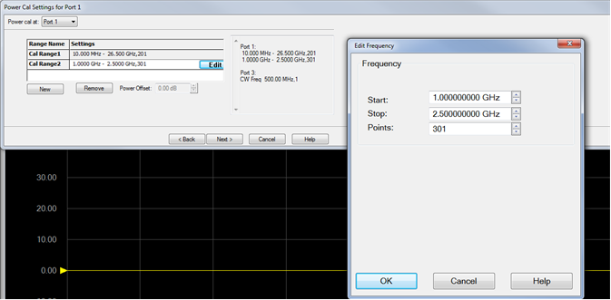

  8. Enter the Start and Stop frequency and the number of Points then click OK.
  9. Continue the Cal All process by clicking on the Next button.

  
  
Split Port Cal  
---  
Beginning with firmware revision A.18.40, there are new attributes called
Split Port Cal that allow channels to perform the calibrations without a thru
calibration. When a thru calibration is difficult to take, it is possible to
execute 1 port calibration only for each port. This is called as "Split Port"
Cal. This feature is available in GCX, SMC, DIQ, IMDX, and MODX measurement
classes only. DIQ, IMDX, and MODX are available starting in A.19.10. Note:
This feature replaces "Split Cal," which was available between A.13.67 and
A.17.60. Note: Frequencies chosen for DIQ channels will be:  
a. Source Frequencies, if source is Auto ON or Always ON  
b. Frequencies used in parameter definitions  
If frequency range for calibration is unexpected, examine parameter
definitions. 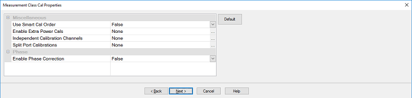 When you click ..., the
channel which supports Split Port cal is displayed. Select the channel which
you want to execute the calibration without thru.
 On the last Cal All Wizard page, the
Description column specifies whether the channel is being calibrated by Cal
All or performing its own calibration: If it is being calibrated by Cal All,
it displays which Cal All channel is performing the calibration.  
  
(Scrolled to the left)  
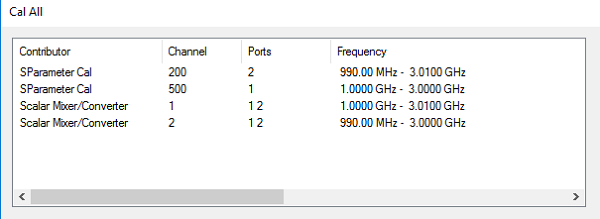  
  
(Scrolled to the right)  
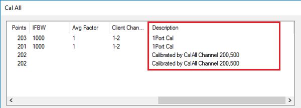  
  
Independent Calibration Channels  
---  
Beginning with firmware revision A.13.67,there are new attributes called
Independent Calibration Channels that allow channels to perform the
calibrations as a independent calibration a SmartCal. This is an advanced
feature. For example, it can make the calibration better by avoiding
additional calculations associated with path difference betweem channels on
the PNA. Any selected channels will perform their own SmartCal instead of
importing the calibration from the SmartCal performed on the special Cal All
channel (typically Channel 200). Note: Channels that do not support their own
SmartCal cannot be Independent Calibration Channels. They will be filtered out
if selected as Independent Calibration Channels.
 Example of Cal All Process The
following is an example showing the typical Cal All process using three
standard channels: Ch 1: 1-2 GHz, 101 points Ch 2: 2-3 GHz, 101 points Ch 3:
3-4 GHz, 101 points Cal All process without Independent Calibration Channel
selections:

  1. Creates a Cal All channel (typically Channel 200), which goes from 1-4 GHz, 303 points. 
  2. Cal All tells the Cal All channel to perform a SmartCal.
  3. When the calibration is done, the SmartCal on the Cal All channel computes the error terms, and passes them to Ch1, Ch2, and Ch3.

Cal All process with channel 3 selected as an Independent Calibration Channel:

  1. Creates a Cal All channel (typically Channel 200), which goes from 1-3 GHz, 202 points. 
  2. Cal All tells the Cal All channel to perform a SmartCal.
  3. Cal All tells Ch 3 to perform its own SmartCal.
  4. When the calibration is done:
     1. Channel 200 SmartCal computes error terms, and passes them to Ch1 and Ch2.
     2. Ch 3 computes its own error terms (since it performed its own SmartCal).

For any channels that are 1) Split Port Cal (SMC/GCX/MODX), 2) Cal Receiver
Port Only at Low Frequency (banded noise only), or 3) Independent Calibration
Channels, note the following:

  * These channels will be performing their own SmartCal calibrations and will NOT inherit a calest from the Cal All calibration.
  * Connection lists will be organized such that even if several channels are performing the same connection as part of their calibration the user will be prompted only once. For example, if channels 2, 3, and 200 (CalAll channel) will be needing a power sensor on port one, then the user will be prompted once for this connection, and channels 2,3, and 200 will take power sweeps consecutively.
  * Settings made from the GUI apply to all active calibrations. If a user wants to set different calibration settings, use the remote UI (with the appropriate channel number). The only exception is that the user may choose specific calibration powers (if allowed) for each channel performing its own Calibration. This is accomplished using the [SENSe:CORRection:COLLect:GUIDed:PSENsor:POWer:LEVel](../Programming/GP-IB_Command_Finder/Sense/CorrCollGuidPSens.md#PsenPowLevel) SCPI command and the [PowerCalibrationPowerLevel](../Programming/COM_Reference/Properties/PowerCalibrationPowerLevel_Property.md) COM command. From the GUI, this is accomplished in the following Power Cal Page:   
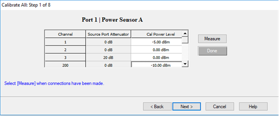

Note: Some channels do not support setting the cal power level. If this is the
case, then the field will be disabled. On the last Cal All Wizard page, the
Description column specifies whether the channel is being calibrated by Cal
All or performing its own calibration: If it is being calibrated by Cal All,
it displays which Cal All channel is performing the calibration.  
  
(Scrolled to the left)  
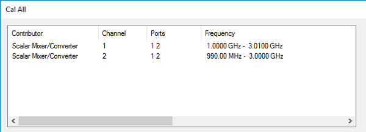  
  
(Scrolled to the right)  
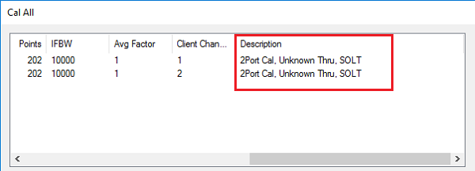 Note: If a user chooses to
Enable Extra Power Cals, then the only client channels that are participating
in Cal All as normal will inherit the corresponding power calibration terms
(this is most often used with SA, which cannot be an Independent Calibration
Channel).  
  
Calibration Attenuator Settings dialog box help  
---  
 This dialog shows the Power,
Attenuator, and IFBW settings for the Cal All calibration. The default values
for the Cal All session are the preset values of a standard S-parameter
channel. These values are not necessarily the same as those of the channels
that are selected for calibration. When there are differences in measurement
path (switch) settings between the Cal All channel and the selected channels,
these differences are detected by Cal All and additional measurements are made
for each path condition. These additional measurements allow Cal All to
produce error terms appropriate for each of the selected channels. In general,
the Cal All session should be performed at a power level that is high enough
to prevent noise in the error terms. However, an increase in power could cause
compression or damage to the analyzer receivers. The following settings allow
you to increase the power level ONLY during the Cal All session. **Note** :
The following settings do not apply to Independent Calibration Channels. Those
calibrations are performed using the power and attenuation settings as
configured in the channel. Power Limit (Disable) Cal All shows you when power
limits are enabled. This setting provides you a convenient way to TEMPORARILY
disable these limits in order to take advantage of the power settings
available in Cal All. If power limits are on, your DUT is probably a high-gain
device and the attenuator settings in your channels are high resulting in
lower power at the cal reference plane. This lower signal can result in
noisier measurements during the acquisition of cal. This situation is
precisely what Cal All is intended to improve. Cal All allows you to configure
the calibration conditions for better signal-to-noise performance during the
cal while leaving your DUT conditions alone. You can elect to clear the
“Disable Power Limits during cal” checkbox when you prefer to calibrate at a
higher power level than is allowed by your limit. The limit is restored after
the Cal All session. Source / Receiver Attenuator By default, the Cal All
calibration is performed with Source and Receiver attenuators set to 0. Change
the Source or Receiver attenuator settings when external hardware (such as a
booster amplifier) would cause the analyzer receivers to be compressed or
damaged. You may also want to change the attenuator or path configuration
settings to force the cal channel to match settings of the selected channels.
If all of the selected channels are set to identical hardware settings, it may
be better to apply these settings to the cal channel. For example, if your
channels all use a 5 or 10 dB attenuator step at port 1, you might elect to
change the Cal All channels to use the same low attenuator settings. This will
result in the cal measurements being made under the same path conditions as
the channel and it will eliminate the need to mathematically compensate for
the difference. However, if large attenuator values are used, the default Cal
All settings will likely improve your results. S-Parameter Cal Port Power Set
the power level at which the S-Parameter cal is performed. Power Offsets Power
Offsets are channel-scoped. Consequently, offsets that you already set are NOT
automatically copied to the Cal All session. This setting allows you to also
apply a Power Offset during the Cal All session. [Learn about Power
Offsets](../System/Power_Limit_and_Power_Offset.htm). Noise Reduction This
button accesses the following dialog for settings that help reduce trace noise
and the noise floor which can lead to better dynamic range and more accurate
measurements. [Learn more](../S2_Opt/Trce_Noise.md).
 IF Bandwidth Set the IFBW
used to perform the Cal All calibration. The default IFBW setting of 1 kHz is
a good nominal setting for most measurements. Lowering the IFBW removes noise
from the calibration measurement, but also causes slower sweeps. Always ON
Check to enable averaging. Average Factor Specifies the number of measurements
that are averaged. Range of 1 to 65536 (2^16). Average Type Sweep Each data
point is based on the average of the same data point measured over consecutive
sweeps. (Sweep) Restart Begins a new set of measurements that are used for the
average. Applies only to Sweep averaging - NOT Point. Point Each data point is
measured the number of times specified by the Average Factor, and then
averaged, before going to the next data point. Reduce IF BW at Low Frequencies
When this box is checked, the VNA uses a smaller IF Bandwidth than the
selected value. [Learn more](../S2_Opt/Trce_Noise.md#ReduceIFBW). Mechanical
Devices This button accesses a dialog that shows the settings for all active
channels. These settings are shown side-by-side for easy comparison. [Learn
more](../System/Mechanical_Devices.htm).  
  
Select DUT Connectors and Cal Kits dialog box help  
---  
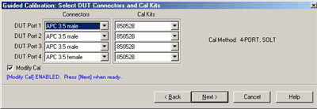 For each DUT port:

  * Select the connector at the calibration reference plane (where the cal standards will be connected).
  * Select the cal kit to be used.

Check Modify Cal to change the Thru method. An Unknown Thru cal is performed
by default. [Learn about THRU methods](Calibration_THRU_Methods.md). [Learn
more about this dialog](Calibration_Wizard.htm#GuidConnKit).  
  
Power Cal Settings dialog box help  
---  
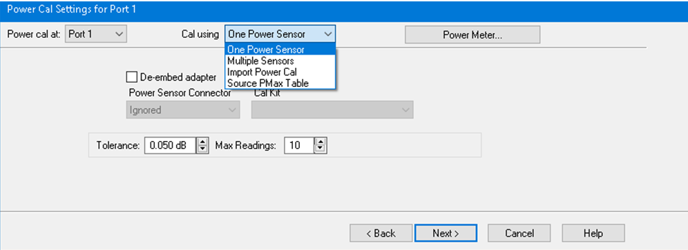 A guided power cal is performed on
the source ports for the Cal All calibration. This dialog is displayed for
each source port to receive a power cal. To perform an LO power cal for a
mixer channel, set the LO port to a VNA or external source in the [Mixer Setup
dialog](../Applications/MixerConverter_Setup.htm#MixerSetupTab). Then select
that port in the [Selected Channels
dialog](Calibrate_All_Channels.htm#SelectChansDiag).

  * To use the same power sensor for all power cals, select **One Power Sensor** under **Cal using** pulldown list. 
  * To use different power sensors, select Multiple Sensors under **Cal using** pulldown list. The sensor must be configured as a PMAR device. [Learn how](../System/Configure_a_Power_Meter_As_Receiver.md).
  * To **import** the power calibration error terms from an existing calset that contains power calibration, select **Import Power Cal** under **Cal using** pulldown list. 
  * Select **Source PMax Table** under **Cal using** pull down list, this primarily used to calibrate the source of the millimeter head when no sensor is available. 

[Learn about this dialog box](Guided_Power_Calibration.md#PowerCalSettings).  
  
Cal All Summary dialog box help  
---  
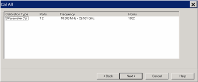 This page is a summary of the Cal All
settings. Confirm the settings, then click Next > or < Back to change
settings.  
  
Cal Steps dialog box help  
---  
 Follow the prompts to connect each
standard. Then click Measure. Click Re-measure if necessary. Then click Next >  
  
Finish Cal dialog box help  
---  
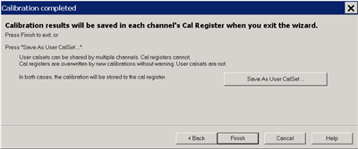 Click Finish to save the Cal All
session results to Cal Registers. Or click Save As User CalSet, then enter a
prefix title. The Meas Class and channel number are appended to this prefix to
save to a User Cal Set for each calibrated channel. [Learn more about this
dialog.](Calibration_Wizard.htm#Calibration_Completed_help)  
  
* * *

