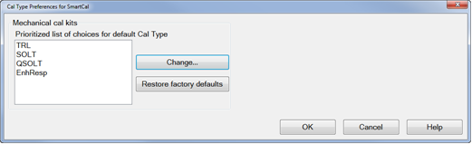
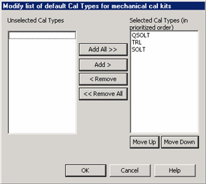

# Calibration Preferences

* * *

Cal type preferences are set from this dialog.

How to change Cal Preferences Programming commands are NOT available for the
preference settings discussed in this topic, although there are other [Cal
Preferences](../Programming/CF_System_Commands.htm#System_Setup_Tab_Commands)
that can be set remotely.  
---  
Using a mouse  
  
  1. Click Response
  2. Select Cal
  3. Select Cal Sets & Cal Kits
  4. Select Cal Preferences...

  
  
Cal Type Preferences dialog box help  
---  
 This dialog is used to set
which Cal Types are available, and the order in which they are selected as the
default choice, during a SmartCal with Mechanical Standards. This setting is
also used to set the default Cal Type for Guided calibrations using SCPI or
COM. Note: Your Cal Type settings are saved only until the NA application is
closed. When re-opened, the factory default settings are restored. The
specified Cal Type order should allow you to make fewer changes to the Cal
Type during a SmartCal with Mechanical Standards. For example, in the above
image, the first Cal Type on the list is TRL. When doing a SmartCal with
Mechanical Standards:

  * If a TRL Cal Kit is available for the specified DUT connectors, then TRL becomes the default Cal Type.
  * If a TRL Cal Kit is NOT available, then the second Cal Type on the list (SOLT) is evaluated for compatibility with the available Cal Kits, and so forth with the Cal Types that remain on the list.
  * If TRL is removed from the list, that Cal Type is NOT available for selection during a SmartCal with Mechanical Standards.

[Learn more about Cal Types.](Select_Cal.md) [See where you choose Cal Type
during a SmartCal](Calibration_Wizard.htm#ModifyCal) Prioritized list of
choices for default Cal Type Shows the current list of Cal Types and the order
in which they will be selected for Mechanical calibrations. Change Click to
invoke the [Modify list of default Cal
Types](Calibration_Preferences.htm#Modify) dialog. Restore factory defaults
Returns the list to the original selections and order. The factory defaults
are in order of accuracy from highest (TRL) to lowest (QSOLT). Cancel Closes
the dialog without making changes.  
  
Modify list of default Cal Types dialog box help  
---  
 Use this dialog to Add, Remove, and
re-order the available Cal Types. There must be at least ONE selected Cal Type
to perform a SmartCal with Mechanical Standards. Unselected Cal Types Cal
Types in this list will not be presented as a choice during a Calibration.
Selected Cal Types Cal Types in this list will be presented, in order, as the
default choice during a Calibration. Click a Cal Type to select it, then click
the following buttons to perform that operation. Add / Remove buttons Click to
Add and Remove the selected Cal Types from the Selected Cal Types list. Move
Up / Down Click to re-order the Selected Cal Types list.  
  
* * *

