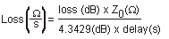

# Calibration Standards

* * *

This following section explains the general principles and terms regarding
calibration kit files. To learn how to modify calibration kit files, See
[Modify Calibration Kits](ModifyCalKits.md).

  * About Calibration Kits

  * Calibration Standards

  * Standard Type

  * Standard Definitions

  * Class Assignments

[See other Calibration Topics](Calibration.md)

About Calibration Kits

A calibration kit contains a set of physical devices called standards. Each
standard has a precisely known or predictable magnitude and phase response as
a function of frequency. All Keysight Cal Kits and their standard definitions
are stored in the analyzer. For a list of Keysight calibration kits, see
[Analyzer Accessories](../Support/Analyzer_Accessories.md).

Calibration Standards

Calibration standards provide the reference for error-corrected measurements
in the network analyzer. Each standard has a precisely known definition that
includes electrical delay, impedance, and loss. The analyzer stores these
definitions and uses them to calculate error correction terms.

During measurement calibration, the analyzer measures standards and
mathematically compares the results with the definitions ("ideal models") of
those standards. The differences are separated into error terms that are later
removed from device measurements during error correction. [See Systematic
Errors.](Errors.htm#errsys)

Standard Type

A standard type is one of four basic types that define the form or structure
of the model to be used with that standard. The following are the four basic
standard types:

#### Standard

|

#### Terminal Impedance  
  
---|---  
SHORT |  zero ohms  
OPEN |  infinite ohms  
LOAD |  system impedance, Z0  
THRU/LINE |  no terminal impedance  
  
### Learn about other Calibration Standards:

  * [Data-Based Standard](Standards_Tab.md#DataBased)

  * [Sliding Load](Standards_Tab.md#Sliding)

  * [Offset Load](Standards_Tab.md#Offset)

  * [Arbitrary Impedance Load](Standards_Tab.md#Arbitrary)

Standard Definitions

Standard definitions describe the electrical characteristics of the standards
and the frequencies they will be used. Standard definitions can be viewed from
the [Advanced Modify Cal Kit](ModifyCalKits.md) menu selection. Standard
definitions include:

  * Minimum Frequency Specifies the minimum frequency the standard is used for calibration.

  * Maximum Frequency Specifies the maximum frequency the standard is used for calibration.

  * Z0 Specifies the characteristic impedance of the standard (not the system characteristic impedance or the terminal impedance of the standard).

  * Delay Specifies a uniform length of transmission line between the standard being defined and the actual calibration plane.

  * Type Specifies type of standard (SHORT, OPEN, THRU/LINE, LOAD, ARBITRARY).

  * Loss Specifies energy loss, due to skin effect, along a one-way length of coaxial cable.

#### Loss model equation:

  * The value of loss is entered as ohms/second at 1 GHz.

  * To compute the loss of the standard, measure the delay in seconds and the loss in dB at 1 GHz. Then use the following formula:

#### Capacitance model equation:

C0, C1, C2, C3. Specifies the fringing capacitance for the open standard.

  * C = (C0) + (C1 x F) + (C2 x F²) + (C3 x F³)

  * (F is the measurement frequency).

  * The terms in the equation are defined when specifying the open as follows:

  *     * C0 term is the constant term of the third-order polynomial and is expressed in Farads.

    * C1 term is expressed in F/Hz (Farads/Hz).

    * C2 term is expressed in F/Hz².

    * C3 term is expressed in F/Hz³.

#### Inductance model equation:

L0, L1, L2, L3. Specifies the residual inductance for the short standard.

  * L = (L0) + (L1 x F) + (L2 x F²) + (L3 x F³)

  * (F is the measurement frequency).

  * The terms in the equation are defined when specifying the short as follows:

  *     * L0 term is the constant term of the third-order polynomial and is expressed in Henries.

    * L1 term is expressed in H/Hz (Henries/Hz)

    * L2 term is expressed in H/Hz².

    * L3 term is expressed in H/Hz³.

Class Assignments

Once a standard is characterized, it must be assigned to a standard "class". A
standard class is a group of standards that are organized according to the
calibration of the network analyzer error model.

The number of classes needed for a particular calibration type is equal to the
number of error terms being corrected.

A class often consists of a single standard, but may be composed of multiple
standards. These may be required for accuracy or to cover a wide frequency
range.

Example: A response calibration requires only one class, and the standards for
that class may include an OPEN, or SHORT, or THRU. A 1-port calibration
requires three classes. A 2-port calibration requires 10 classes, not
including two for isolation.

The number of standards assigned to a given class may vary from one to seven
for unguided calibrations. Guided calibrations allow as many standards as
needed.

Calibration Classes are assigned in the Advanced Modify Cal Kit menu,
[SOLT](SOLT_Tab.md) or [TRL](TRL_Tab.md) tab.

## The different classes used in the analyzer

#### S11A, S11B, S11C (S22A, S22B, S22C and so forth)

These are the three classes for port 1-reflection calibrations (three classes
also for S22 and S33). They are used in the one-port calibrations and the full
two-port calibration. They are required in removing the directivity, source
match, and reflection tracking errors. Typically, these classes might consist
of an open, a short and a load standard for each port.

#### Transmission and Match (forward and reverse)

These classes are used to perform a full two-port calibration. The
transmission class relates primarily to the transmission tracking, while the
match class refers to load match. For both of these classes, the typical
standard is a thru or delay.

#### Isolation

The isolation classes are used to perform a full two-port and the TRL two-port
calibrations. The isolation classes apply to the forward and reverse crosstalk
terms in the network analyzer error model.

#### TRL THRU

These are used to perform a TRL two-port calibration. The TRL thru class
should contain a thru standard or a short line. If it contains a non-zero
length thru standard, then the calibration type is called LRL or LRM.

#### TRL REFLECT

This class is used to perform a TRL two-port calibration. The TRL reflect
class should contain a standard with a high reflection coefficient, typically
an open or short. The actual reflection coefficient need not be known, but its
phase angle should be specified approximately correctly (± 90 deg). The exact
same reflection standard must be used on both ports in the TRL calibration
process.

#### TRL LINE or MATCH

These are used to perform a TRL two-port calibration. The TRL line or match
class should contain line standards, load standards, or both. If a line
standard is used, its phase shift must differ from that of the TRL THRU
standard by 20° to 160°. This limits the useable frequency range to about 8 to
1. Two or more line standards of different lengths may be specified to get
broader frequency coverage. It is also common to include a load standard for
covering low frequencies, where the line's length would be impractically long.
When a load is used, the calibration type is called TRM or LRM.

Note: For more information, read [Specifying Calibration Standards and Kits
for Keysight Vector Network Analyzers (Application Note
1287-11](http://literature.cdn.Keysight.com/litweb/pdf/5989-4840EN.pdf))

* * *

