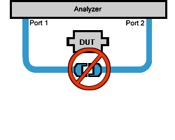
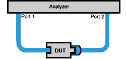
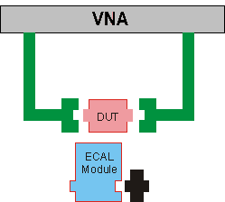

# Calibration Thru Methods

* * *

  * [What is a Non-Insertable Device](Calibration_THRU_Methods.md#definition)

  * [Choosing a Thru Method](Calibration_THRU_Methods.md#Choosing)

  * [Flush Thru](Calibration_THRU_Methods.md#Flush)

  * [Adapter Removal](Calibration_THRU_Methods.md#AdapterRemoval)

  * [Swap Adapters and Offset Delay](Swap_Adapters_Method.md) (separate topic)

  * [Defined Thru](Calibration_THRU_Methods.md#Defined)

  * [Unknown Thru](Calibration_THRU_Methods.md#UnknownThru)

  * [ECal Thru Method Choices](Calibration_THRU_Methods.md#ECal)

[Other Cal Topics](Calibration.md)

What is a Non-Insertable Device

To understand the Thru method choices, you must first understand what is meant
by "Non-Insertable device". These definitions also apply to ECal modules.
Substitute "ECal module" for "device". Then see [ECal Thru Method
Choices.](Calibration_THRU_Methods.htm#ECal)

A non-insertable device is one whose connectors could NOT mate together. They
either do not have the same type of connector or they have the same gender.
This also means that the test port cables would not mate together, as in the
following diagram.

  
---  
  
An insertable device is one whose connectors could mate together. They have
the same type of connector and opposite,or no, gender. This also means that
the test port cables would mate together, as in the following diagram.

  
---  
  
Choosing a Thru Method of Calibration

The Thru method is selected from the Cal Wizard. Select the  Modify checkbox
in the [Select DUT Connectors and Cal
Kits](Calibration_Wizard.htm#GuidConnKit) dialog box.

Notes: For ECal, the following choices have different meanings. See [THRU
methods for ECal.](Calibration_THRU_Methods.htm#ECal) For 4-port calibration,
see [How can we measure only 3 THRU connections?](Errors.md#4-Port)  
---  
  
### Choice for Insertable Devices: FLUSH Thru (also known as Zero-length Thru)

When calibrating for an insertable device, the test ports at your measurement
reference plane connect directly together. This is called a zero-length THRU,
or Flush THRU meaning that the THRU standard has zero-length: no delay, no
loss, no capacitance, and no inductance. Your calibration kit may not have a
physical THRU standard because it is assumed you have an insertable device and
will be using a zero-length THRU.

### Choices for Non-Insertable Devices

The following methods calibrate for a non-insertable device:

  * [Adapter Removal](Calibration_THRU_Methods.md#AdapterRemoval) Accurate, but least convenient.

  * [Defined Thru](Calibration_THRU_Methods.md#Defined)

  * [Unknown Thru Cal](Calibration_THRU_Methods.md#UnknownThru) Preferred method.

### Adapter Removal Calibration

The accuracy of the Adapter Removal calibration is very similar to the
accuracy of the Unknown Thru calibration. However, the Unknown Thru
calibration has fewer connections and therefore has the potential of being
more accurate than the Adapter Removal calibration.

Two full 2-port calibrations are performed: one with the adapter connected at
port 1, and the other with the adapter connected to port 2. The result of the
two calibrations is a single full 2-port calibration that includes accurate
characterization and removal of the mismatch caused by the adapter.

Performing an Adapter Removal Cal requires:

  * a THRU adapter with connectors that match those on the DUT.

  * calibration standards for both DUT connectors.

To select Adapter Removal during a SmartCal, select the  Modify checkbox in
the [Select DUT Connectors and Cal Kits](Calibration_Wizard.md#GuidConnKit)
dialog box. The Cal Wizard will guide you through the steps.

Learn how to perform an [Adapter Removal Cal using
ECal.](Calibration_THRU_Methods.htm#ECalAdapterRemoval)

### Defined Thru (also known as Known Thru, Cal Kit Thru, ECal Thru,
Characterized Thru)

Defined Thru uses the THRU definition that is stored in the Cal Kit file or
ECal module. The THRU standard may have worn over time, making it not as
accurate as when it was new. Defined Thru is usually more accurate than
Adapter Removal, but not as accurate as [Unknown
Thru](Calibration_THRU_Methods.htm#UnknownThru) method.

Notes

  * If performing an ECal, this is the THRU standard in the ECal Module.
  * If Defined Thru appears as a potential THRU method in the [SmartCal Wizard](Calibration_Wizard.md#ModifyThru), this means that there is a defined THRU standard in the selected Cal Kit. This could be a [Zero-length Thru](Calibration_THRU_Methods.md#Flush). The SmartCal Wizard will prompt you to connect the required standard when appropriate.

  
---  
  
To define a THRU standard in a Cal Kit (not ECal module):

  1. Click Cal > Cal Sets & Cal Kits.

  2. Click [Cal Kit...](ModifyCalKits.md#HowtoMod).

  3. Select the Cal Kit from the list.

  4. Click Edit....

  5. Select the Standards tab.

  6. Click Add....

  7. Select THRU.

  8. Complete the dialog box.

The next time you perform a Guided Cal, this Defined THRU standard will be
available if the DUT connector types match the THRU standard.

### Unknown Thru Cal

Unknown Thru Cal is the preferred THRU method of calibrating the analyzer to
measure a non-insertable device.

The Unknown Thru calibration is also known as Short-Open-Load-Reciprocal Thru
(SOLR) calibration.

  * Very easy to perform.

  * Better accuracy than [Defined Thru](Calibration_THRU_Methods.md#Defined) and usually better than [Adapter Removal](Calibration_THRU_Methods.md#AdapterRemoval).

  * Does not rely on existing standard definitions that may no longer be accurate.

  * Causes minimal cable movement if the THRU standard has the same footprint as the DUT. In fact, the DUT can often BE the THRU standard.

  * NOT recommended when there is 40 dB or more of combined loss in the Unknown Thru and calibration path. This would NOT allow enough signal to accurately measure at the receiver.

About the Unknown Thru Process

SmartCal guides you through the process. Although the following process
describes ports 1 and 2, Unknown Thru can be performed on any two ports when
using a multiport analyzer.

  1. Perform 1-port cal on port 1.

  2. Perform 1-port cal on port 2.

  3. Connect Unknown Thru between ports 1 and 2.

  4. Measure Unknown Thru.

  5. [Confirm Estimated Delay](Calibration_Wizard.md#Nominal). This estimate may be wrong if there are too few frequency points over the given frequency span. You can measure the delay value independently and enter that value in the dialog box.

The Unknown Thru Standard

  * Can have up to 40 dB of combined loss in the Unknown Thru and calibration path.

  * Must be reciprocal: S21=S12.

  * Must know the phase response to within 1/4 wavelength (see step 5 above).

  * Can be the DUT if it meets these conditions.

Unknown Thru Limitations

  * Unknown Thru is NOT supported during a TRL calibration from the GUI.

  * Unknown Thru CAN be performed using a 4-port PNA-L that does NOT have a [reference receiver for each test port](../Support/Configurations.md). However, a [Delta Match Calibration](Delta_Match_Calibration.md) is usually required before the Unknown Thru is measured.

  * Cable movement introduces measurement errors.

ECal Thru Method Choices

Note: For N4433D ECal module (DC/300 kHz-26.5 GHz), known THRU is limited to
20 GHz. Only unknown THRU is supported above 20 GHz for the N4433D.

When the ECal module connectors exactly match the DUT connectors, choose from
the following THRU methods:

### ECal Thru as Unknown Thru [Learn more about Unknown
Thru](Calibration_THRU_Methods.htm#UnknownThru).

  * Measures the THRU state of the ECal module as an Unknown Thru.

  * The default method when the ECal module connectors match the DUT.

  * Very accurate and easy.

  * May require a [Delta Match Cal.](Delta_Match_Calibration.md)

### Flush Thru (zero-length Thru) [Learn more about Flush
Thru](Calibration_THRU_Methods.htm#Flush)

  * Requires an insertable ECal module / DUT.

  * Remove the ECal module and connect the two reference planes directly together for a zero-length thru.

  * Accurate, but not as easy as 'ECal Thru as Unknown Thru'.

### ECal (Defined Thru)

  * Measures the THRU state of the ECal module.

  * Very easy, but not as accurate as 'ECal Thru as Unknown Thru'

  * TransResp forward and reverse can be selected for Thru measurement only for Ecal. Only 2 port-cal is supported. 

### Unknown Thru

  * Remove the ECal module.

  * Then connect a Thru adapter to be measured as Unknown Thru.

  * May require a [Delta Match Cal.](Delta_Match_Calibration.md)

When the ECal module connectors do NOT exactly match the DUT connectors,
choose from the following two methods:

### Adapter Removal

  * Can be used with ECal when your DUT is [NON-insertable](Calibration_THRU_Methods.md#definition). However, the ECal module MUST be insertable, and the adapter connectors must exactly match the connectors of the DUT as in the following diagram.

  * Adapter removal performs 2-port measurements on both sides of the adapter.

### ECal User Characterization

In cases when adapter removal cannot be performed, ECal [User
Characterization](ECal_User_Characterization.htm) is ALWAYS possible if you
have the right adapters. A User Characterization is performed once and stored
in the ECal module. However, accuracy is compromised every time you remove,
then reconnect, the adapter with the ECal module.

* * *

