# Calibration Wizard

* * *

The Calibration Wizard allows you to choose a Calibration method and then
perform the calibration.

  * How to Start Calibration Wizard

  * SmartCal (Guided Calibration)

  * [Basic Calibration](calibration_wizard.md#BasicCal)

  * Unguided Calibration

  * Saving a Calibration

[Other Cal Topics](Calibration.md)

How to start Calibration Wizard  
---  
Using Hardkey/SoftTab/Softkey  
  
  1. Press Cal > Main > Smart Cal....

  
  
  
### The Calibration Window / Channel

During a Guided Calibration, a 'Cal Window' is created for you to view the
connection of calibration standards before standards are measured. This Cal
Window uses a new Cal channel that is created and duplicates the settings in
the channel being calibrated. [Correction is ALWAYS
OFF](error_correction_and_interpolation.htm#ErrorCorrection) for the displayed
calibration channel. At the completion of the calibration, the calibration
channel and window are deleted. The measurement of calibration standards can
be performed while viewing any VNA window configuration you choose. The Cal
Window is appended to your Custom Cal Window setting, and all windows are
visible and sweeping below the Cal Wizard before the Measure (cal standard)
button is pressed. The windows to be viewed and channels to be swept during
the cal process are specified using [Remote
commands](../Programming/CF_Cal_Commands_-_Standard.htm). [See an
example](../Programming/GPIB_Example_Programs/Show_Custom_Window_during_Calibration.htm).  
---  
  
SmartCal (Guided Calibration)

A Guided Calibration automatically determines the calibration type and
suggests a calibration kit that matches your DUT connectors.

Guided Calibration can perform the following Cal Types:

  * ALL Cals EXCEPT Open, Short, and Thru Response Cals.

  * ECal on one or more ports.

  * TRL - [Learn how to do TRL cals](TRL_Calibration.md)

Note: SmartCal DOES allow you to measure calibration standards in any order.
However, you must click Next and Back without measuring standards until you
get to the standard you want to measure.

The following dialog boxes appear when performing a Guided calibration on
standard channels.

To learn about Calibrations for Application channels, refer to the help topic
for the [Application](../Applications/Applications.md).

Select Ports for Guided Calibration dialog box help  
---  
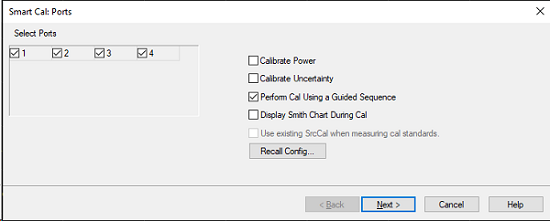 Allows you to select ports to
calibrate. Select Ports All ports are selected by default. User can select
which port to calibrate. Calibrate Power  Disabled by default. [Learn
more.](Guided_Power_Calibration.htm#PowerCalSettings) Calibrate Uncertainty
(Available PNA only) nclude measurement uncertainties from calibration.
Perform Cal Using Guided Sequence Check to perform a Guided Power Calibration.
[Learn more.](Guided_Power_Calibration.md) Display Smith Chart During Cal
When enabled, reflection measurements will be displayed on Smith Chart during
calibration. Use existing SrcCal when measuring cal standards When enabled,
and the following conditions are met, the user's existing source power
calibration array will be used when acquiring calibration standard data:

  * The user is performing a vector calibration only (no power).
  * A valid source cal is present in the channel being calibrated.
  * The user has elected to enable this feature (via GUI or SCPI).

Recall Config...  Opens a standard file-browser window for selecting a
previously saved calibration configuration data file (*.cfd). For greater than
4-port cals, see [External Test Set calibration - Select Cal
Type](../System/External_Testset_Control.htm#Calibration).  
  
Select DUT Connectors and Cal Kits dialog box help  
---  
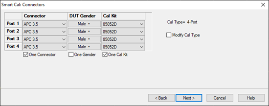 Allows you to select the
connector type and Cal Kit for each DUT port to be calibrated. Connectors To
change selection, click the connector field for each DUT port. If your DUT
connectors are not listed, you can create your own connector type and
calibration kit file. The VNA includes the following example cal kits that can
be used as a template. See [Calibration kits](ModifyCalKits.md#CalKitManager)
for more information.

  * If using a gendered (male and female) connector type, select Type A as the connector type.
  * If using a connectorless device such as on-wafer probes., select Type B as the connector type.

One Connector If enabled, then all connectors will be set the same and changing any one of them will change the others. DUT Gender To select gender of the connector. If the connector has no gender, the pulldown displays "None". One Gender  If enabled, then all genders will be set the same, and changing any one of them will change the others. Cal Kit Select the Cal Kit to be used to calibrate each test port. The list for each DUT Port displays kits having the same connector type as the DUT. One Cal Kit If enabled, then all Cal Kits will be set the same, and changing any one of them will change the others. Identical ECal models connected? ECal modules can be distinguished by serial number. This can have implications on your remote [SCPI](../Programming/GP-IB_Command_Finder/Sense/CorrGuided.md#gKit) programs. | 

### Cal Kit Notes

85056K The 85056K definitions in the analyzer are for 2.92mm standards (2.4mm
plus 2.92 adapters). To calibrate 2.4 mm connectors using the 85056K cal kit,
select 85056A as the cal kit when you need the sliding load. Otherwise, select
85056D as the cal kit. Both the 85056A and the 85056D kits contains exactly
the same standards as the 85056K cal kit WITHOUT the adapters. TRL

  * To perform a [TRL Cal,](TRL_Calibration.md) assign a TRL Cal Kit to the lowest port number of each port pair.
  * When selecting a TRL Cal Kit on a PNA-L model that requires a Delta Match Cal, and a [Global Delta Match Cal](Delta_Match_Calibration.md) is not available, the Cal type will be set to SOLT and a "Could not find a Global Delta Match Cal." message is displayed on the dialog box. If the selected Cal Kit will not support SOLT, the Next button will not be available. Then you must select a different Cal Kit to proceed or Cancel and perform a Global Delta Match Cal.

  
---  
  
Modify Cal Check, then click Next, to [Modify
Cal](Calibration_Wizard.htm#ModifyCal) (Standards AND Thru Method).

For greater than 4-port cals, see External Test Set calibration - Select DUT
Connectors.  
  
Error dialog box help  
---  
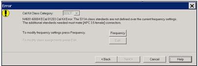 The current cal kit does not cover the
current frequency range of the measurement. Do one of the following to correct
the problem: Cal Kit Class Category Choose from SOLT and TRL. Not available
with ECal modules. Click Edit to modify the appropriate class assignments.
Frequency Change the frequency range of the active channel. Edit Modify the
class assignments so that a different standard is selected. Back Select a
different Cal Kit that covers the required frequency range. Cancel Exit the
Cal Wizard  
  
Modify Cal dialog box help  
---  
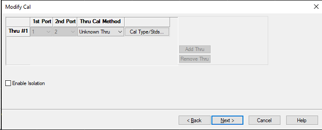

### Thru #n

Lists the proposed Thru connections to be made during the calibration process.
You can change these Thru connections to better suit your test setup.

  * The proposed Thru connections are listed automatically.
  * Additional Thru connections can be selected for higher accuracy. [Learn more](Errors.md#HowOnly3Thrus).

### Add Thru

Click to add a Thru connection. [Learn more](Errors.md#HowOnly3Thrus)

### Remove Thru

Select a Thru by clicking the "Thru #N" field or the "1st Port / 2nd Port"
field. Then click "Remove Thru". This selection is NOT available if the
selected Thru is required for the calibration.

### 1st Port / 2nd Port

Click to select the two ports to be included in the Thru connection. The order
of the port numbers is not critical.

### Thru Cal Method

Lists the available Thru Cal methods for the specified port pairs. [Learn
about the Thru Cal Method choices.](Calibration_THRU_Methods.htm)

### Cal Type/ Stds

Click to invoke the [View / Modify Properties of Cal dialog
box](Calibration_Wizard.htm#ModifyCal)

### Do orientation - Appears ONLY if an ECal module is selected for use.

When this box is checked (default) the analyzer automatically senses the model
and direction in which an ECal module port is connected to the test ports. If
power to the ECal module is too low, it will appear as if there is no ECal
module connected. If you use low power and are having this problem, clear this
check box to provide the orientation manually. Orientation occurs first at the
middle of the frequency range that you are calibrating. If a signal is not
detected, it tries again at the lowest frequency in the range.

### Choose delta match - Available when a Delta Match Cal is required.

  * Check, then click Next to invoke the [Select Cal Set for Delta Match](Calibration_Wizard.md#SelectDMCalSet) dialog box.
  * Clear - The Cal Wizard uses the [Global Delta Match Cal](Delta_Match_Calibration.md) if available.

### View/Detect ECal Characterizations - Appears ONLY if an ECal module is
selected for use.

Click to invoke the [View ECal Modules and
Characterizations](Using_ECal.htm#SelectModuleAndChar) dialog box. Displays a
list of connected ECal modules.

### Enable Isolation \- Appears ONLY if the [guided calibration
sequence](Calibration_Wizard.htm#PerformGuidedCal) is turned off in 2 port
calibration using a mechanical cal kit.

"Isolation" calibration can be added.  
  
Calibration Summary dialog box help  
---  
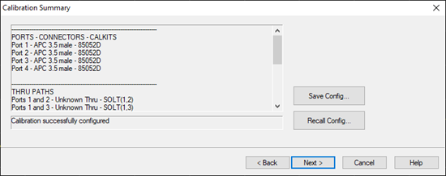 This dialog
appears in three possible scenarios during the your progression through the
Smart Cal wizard:

  * After you click Next in the "Smart Cal: Connectors" dialog and you did not enable Modify Cal Type.
  * After you click Next in the "Modify Cal" dialog.
  * Whenever you recall a configuration.

It summarizes the current calibration configuration and reports whether or not
it is valid.

### Save Config...

Opens a standard file-browser window for saving the current calibration
configuration to a calibration configuration data file (*.cfd) that you can
recall later.

### Recall Config...

Opens a standard file-browser window for selecting a previously saved
calibration configuration data file (*.cfd).  
  
View/Modify Properties of Cal for Ports... dialog box help  
---  
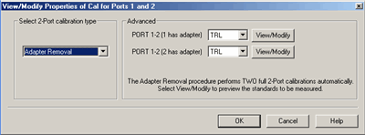

### Select calibration type

Another chance to change the Thru method. [Learn about the Thru Cal Method
choices.](Calibration_THRU_Methods.htm)

### Advanced

Select the cal method for each connector of the Thru pair.

  * [TRL](Select_Cal.md#trl) \- Available ONLY when a TRL cal kit was selected for the lowest port number of the port pair.
  * [QSOLT](Select_Cal.md#QSOLT) Available ONLY when "Defined Thru" or "Flush Thru" is selected. "QSOLT 2 <= 1" refers to the receive port 2 and source port 1(where reflection standards are connected).
  * [Enhanced Response](Select_Cal.md#Enhanced) Available ONLY when "Defined Thru" or "Flush Thru" is selected."EnhResp 2 <= 1" refers to the receive port 2 and source port 1.
  * [Transmission Response](Select_Cal.md#thru) Available ONLY when "Defined Thru" or "Flush Thru" is selected, when Mechanical Cal is selected, and when 2 ports are being calibrated. "TransResp 2 <= 1" refers to the receive port 2 and source port 1.

View Modify Click to invoke the [Preview and Modify Calibration
Selections](SOLT_Tab.htm) dialog box. Note: Changes made to the Cal Kit
through this dialog are temporary that last only for this calibration. To make
permanent changes to the Cal Kit, perform [Advanced Modify Cal
Kits](ModifyCalKits.htm#HowtoMod).  
  
Select Cal Set for Delta Match dialog box help  
---  
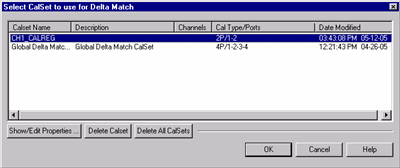 This dialog box appears when a Delta Match
Cal is required and [Choose delta match](Calibration_Wizard.md#ModifyThru)
was selected. [Learn more.](Delta_Match_Calibration.md) Displays the Cal Sets
that meet the requirements of the Delta Match Cal. Select either a User Cal
Set or [Global Delta Match Cal](Delta_Match_Calibration.md#Global). If there
is no suitable choice for a Delta Match Cal:

  1. Click Cancel, then Cancel again to quit the Cal Wizard.
  2. Perform either a [Global Delta Match Cal](Delta_Match_Calibration.md#Global) or a SOLT cal and save the result in a User Cal Set.
  3. Start the Cal Wizard to re-initiate this calibration.
  4. Select the Global Delta Match Cal or User Cal Set.

  
  
Calibration Steps dialog box help  
---  
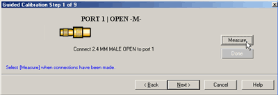 Note: Calibration can be performed with
External triggers. [Learn
more.](../S1_Settings/External_Triggering.htm#ExternalDiag) As each new cal
step prompt appears, the traces are setup for the next standard measurement.
Also, sweeps are triggered continuously until the Measure button is pressed.
This way you can view the integrity of the standard connection. Prompts for
standards to be measured. Measure Click to measure the standard. Done Click
after a standard is re-measured and all measurements for the calibration are
complete. Next Click to continue to the next calibration step. Does NOT
measure the standard. If a standard is NOT measured, a warning appears and
Done will not be available after the last Cal step. Note: Smart (Guided) Cal
allows you to measure calibration standards in any order. However, you must
click Next and Back without measuring standards until you get to the standard
you want to measure.  
  
Sliding Load Measurement dialog box help  
---  
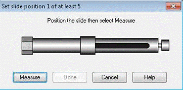 Allows you to measure the sliding load
standard.

### To Measure a Sliding Load:

  1. Connect the sliding load to the measurement port following the procedure described in the Calibration Kit User’s and Service Guide.

Note: Do NOT set the center conductor to be an interference fit with the
center conductor of the testport.

  2. Position the sliding element, then click **Measure**. Do not move the sliding element until measurement is complete.

Note: The direction in which the slide moves is NOT important. You can start
with the slide at the front and move it backward or start at the back and move
it forward. To minimize stability errors it is important to start at one end
and move it in the same direction for each of the measurement steps.

  3. Measure the sliding load for at least **five** positions for best accuracy.

Note: The positions of the sliding element should cover the full length of the
slide, but be unequally spaced to reduce the possibility of overlapping data
points. Most sliding loads have marks for each slide position.

  4. Click **Done** after the final measurement.
  5. Disengage sliding load lock (if available), and remove sliding load from the measurement port.
  6. Measure the remaining standards.

### **How to Verify Sliding Load Calibration Measurements**

Once the calibration is completed, the sliding load can be measured again. The
magnitude of the return loss should remain nearly constant as the slide is
moved. If the slide spacing was not adequate due to slide position selections,
there will be frequency ranges where the magnitude will not remain nearly
constant.  
  
Specify delay dialog box help  
---  
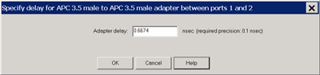 This dialog appears ONLY when
[Adapter Removal](Calibration_THRU_Methods.md#AdapterRemoval) or [Unknown
Thru](Calibration_THRU_Methods.htm#UnknownThru) calibrations are performed.
The following values were estimated from the measurement. Most of the time,
they are adequate. However, for CW sweep or frequency sweep with large step
sizes, the accuracy of the values may be improved. Adapter delay To improve
this value, measure and record the delay of the adapter with a dense step
size. Enter that value here. The required precision value is the accuracy that
is required to characterize the delay value. Nominal phase offset (Waveguide
ONLY). To improve this value, measure and record the phase offset of the
Waveguide adapter with dense step size. Enter that value here. When one
connector is coax and the other connector is waveguide, the phase offset has
an ambiguity of 180 degrees. For consistency, the estimate provided here is
always between 0 and 180 degrees. You can change this estimate to any value
between -180 degrees and +180 degrees. For FCA/Mixer calibrations, this dialog
box appears twice: once for the input frequencies and once for the output
frequencies. The values can be slightly different.  
  
Unguided Cal dialog box help  
---  
When the [Perform Guided Cal](Calibration_Wizard.md#PerformGuidedCal) is
unchecked, this dialog box is displayed. Connect the each standard one by one
and click the corresponding standard button.
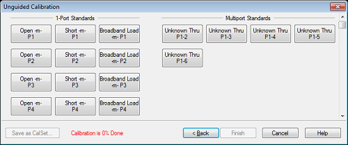 Save As Calset... Its grayed out when
calibration is incomplete. Once the calibration is completed, press this
button to save the calibration.  
  
The [Calibration Complete](Calibration_Wizard.md#SavingAll) dialog box
appears after all standards are measured.

## Basic Calibration

### Basic Calibration  
  
---  
Using Hardkey/SoftTab/Softkey  
  
  1. Press Cal > Main > Basic Cal....

  
  
  
It provides basic calibration. The limitations of basic calibration are:

  * one connector type

  * one cal kit

  * one cal type

  * no isolation cal

  * no power calibration

Basic Cal dialog box help  
---  
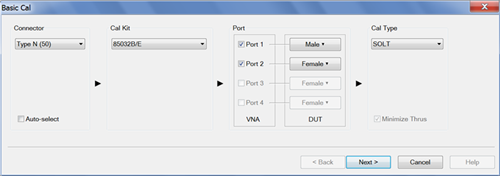 Connector Type Allows user to select
single connector type. Cal Kit Allows users to select single Cal Kit. The
displayed selection options are according to the selected connector type. Port
Allows users to select the port gender. _No Connect_ indicates that no port is
connected to the VNA. Cal Type Allows users to select calibration type. The
displayed selection options are according to the selected cal kit, connector
type and gender. 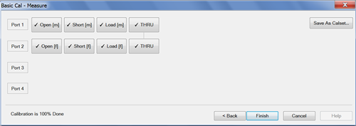 Save As Calset... Its
grayed out when calibration is incomplete. Once the calibration is completed,
press this button to save the calibration.  
  
## Unguided Calibration (Response Cal)

### Unguided Calibration  
  
---  
Using Hardkey/SoftTab/Softkey  
  
  1. Press Cal > Main > Other Cals > Response Cal....

  
  
  
The following dialog boxes appear when performing an Unguided calibration:

Select Calibration Type for Mechanical Standards dialog box help  
---  
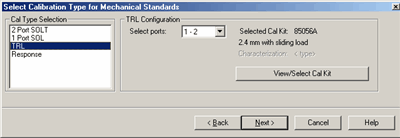 Unguided calibration does NOT
support cals greater than 2 ports or ECal calibrations. Calibration Type
Selection

  * 2-Port SOLT
  * 1-Port SOL
  * TRL - [Learn more about TRL](TRL_Calibration.md)
  * Response - Reflection and Thru (if the active measurement is transmission)

Cal Configuration If not calibrating all test ports, specify which ports to
calibra te. Back Return to [Cal Wizard
Begin](Calibration_Wizard.htm#Calibration_Wiz_help) dialog. View/Select Cal
Kit Click to invoke the [Select Cal Kit dialog
box](Calibration_Wizard.htm#Select_V1_Cal_Kit_help). Note: When selecting a
Cal Kit with an impedance other than 50 ohms (Waveguide = 1 ohm), it is NO
LONGER NECESSARY to change the [System
Impedance](../System/System_Impedance.htm) setting before performing a
calibration. The impedance for the calibration is now derived from the Cal Kit
impedance. Next Click to continue to Measure Mechanical Standards dialog box.  
  
Select Cal Type dialog box help  
---  
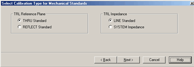 This dialog box appears ONLY when the
selected Cal Type is TRL in the previous dialog box. TRL Reference Plane
Select which standard to use to establish the position of the measurement
reference plane. THRU Standard Select if the THRU standard is zero-length or
very short. REFLECT Standard Select if the THRU standard is not appropriate
AND the delay of the REFLECT standard is well defined. TRL Impedance LINE
Standard Specifies that the characteristic impedance of the LINE standard
should be used as the system impedance. This ignores any difference between
Offset Z0, Offset Loss, and System Z0. SYSTEM Impedance Transforms the LINE
standard impedance and loss to that of the system impedance for use with the
calibration error terms. The TRL calibration will first compute the error
terms assuming the LINE standard impedance is the system's characteristic
impedance (same as previous LINE selection), then modify the error terms to
include the impedance transformation. This should only be used with coax since
the skin effect model used is a coaxial model. [Learn how to change System
Z0.](../System/System_Impedance.htm) To learn to substitute other calibration
kits, see [Advanced Modify Cal Kits](ModifyCalKits.md)  
  
Select Cal Kit dialog box help  
---  
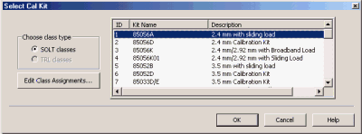 Displays the calibration kit files
available for Unguided calibration. Select the desired calibration kit file
and click OK. Choose class type Edit Class Assignments Allows modification of
the selected Cal Kit class assignments.

  * To learn to substitute other calibration kits, see [Advanced Modify Cal Kits](ModifyCalKits.md)
  * Unguided Cal can access only mechanical cal kits #1 through #95, although more cal kits can imported. [Learn how.](ModifyCalKits.md#Import)

Note: When selecting a Cal Kit with an impedance other than 50 ohms (Waveguide
= 1 ohm), it is NO LONGER NECESSARY to change the [System
Impedance](../System/System_Impedance.htm) setting before performing a
calibration. The impedance for the calibration is now derived from the Cal Kit
impedance.  
  
Measure Mechanical Standards dialog box help  
---  
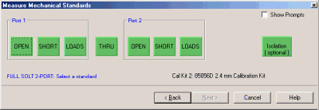 Note: Calibration can be performed with
External triggers. [Learn
more.](../S1_Settings/External_Triggering.htm#ExternalDiag) Displays the
calibration kit file and standards required for the calibration.

  * Standards may be connected and measured in any order.
  * Connect the standard to the measurement port and click its associated green button. A check mark indicates the standard has been measured.
  * If a standard type contains multiple standards, the [Multiple Standards dialog box](Calibration_Wizard.md#Multiple_Standards_help) opens to display the multiple standards included in the calibration kit file.
  * If a sliding load is included in the calibration kit file, the [Sliding Load dialog box](Calibration_Wizard.md#Sliding_Load_help) opens to perform the measurement with the standard.
  * Reflection Response Select EITHER Open or Short standard, then click Next.
  * Isolation Requires one load for each test port. [Learn more about Isolation.](Errors.md#erriso) Use when your measurement requires maximum dynamic range (> 90 dB). See also [Isolation Portion of 2-Port Calibration](Accurate.md#iso).
  * Normalize Available when performing a response cal for any measurement. After Normalize is pressed and the Cal is complete, the data trace is flat when the same physical connections are present on the port. This is similar to [Data/Memory](../S4_Collect/Math_Operations.md#math), except that the response cal is [saved with Cal data](Calibration_Wizard.md#SavingAll) and can be applied to other like measurements. Data/Memory is still available after using Normalize. You would usually connect a THRU standard when calibrating a transmission measurement, and a SHORT standard when calibrating a reflection measurement.

Show Prompts Check to provide a reminder for the required connection when you
click on the standard.  
  
Multiple Standards dialog box help  
---  
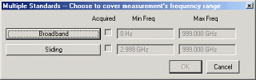 Select the standards to be
measured. Note: You may see both male and female standards. The Unguided cal
has no knowledge of the gender of your connector types. Choose the gender of
your DUT connector; NOT the test port. Then click OK. To modify this
calibration class to show only one standard, on the Calibration menu, click
Advanced Modify Cal Kits. Select the Cal kit and click Edit Kit. In Class
Assignment, click Edit. Learn more about [Modify Calibration Class
Assignments](SOLT_Tab.htm).

  * Connect the standard to the measurement port and click its associated button. A check mark in the Acquired box indicates the standard has been measured.
  * To cover the entire frequency range, you may need to measure more than one standard. The order in which the standards are measured is important. The last standard that is measured will override the others in respect to the frequency range of the standard definition. Example: In the case of measuring both a broadband load and a sliding load, you would measure the sliding load last. This is because the frequency range of the sliding load is a subset of the broadband load.

  
  
Saving a Calibration

SmartCal, ECal, and Unguided Calibrations end with the following dialog box:

Calibration Completed dialog box help  
---  
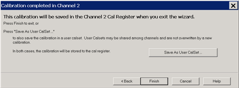 Finish Save to the channel's
calibration register. Save As User Cal Set Invokes the Save as User Cal Set
dialog box AND save to the channel's calibration register. Cancel Calibration
is NOT applied or saved. Learn about [Calibration
Registers](Cal_Sets.htm#Registers). Learn about [User Cal Sets](Cal_Sets.md)  
  
Copy Cal Set dialog box help  
---  
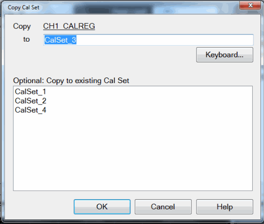 Existing Cal Sets \- Lists the
previously-saved Cal Set names. to Specify a name for the new Cal Set. Either
accept the suggested new name, type a new name, or select a name from the list
to overwrite an existing name. OK Saves the Cal Set to the new Cal Set name
and exit the dialog message. Learn about [User Cal Sets](Cal_Sets.md)  
  
* * *

