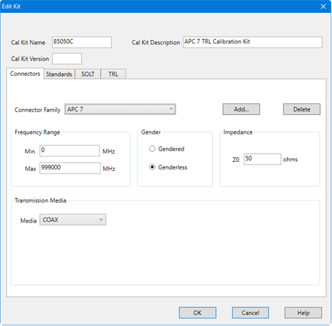
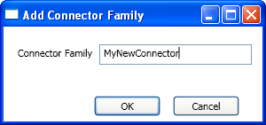

# Connectors Tab

* * *

Cal Kit Name Allows you to change the Name of the selected calibration kit.

Cal Kit Description Allows you to change the description of the selected
calibration kit.

Cal Kit Version Allows you to add version information.

* * *

Connector Family .Click the down arrow to select the connector family
associated with the Cal Kit.

Add Starts the [Add Connector](Connectors_Tab.md#Addconnect) dialog box which
allows you to add new connector type to the calibration kit.

Delete Deletes - WITHOUT WARNING \- the selected connector family.

Note: To modify a connector family or name, Add a new connector, then delete
the old connector.

The following is the list of Factory-defined connector type strings:

APC 3.5 female APC 3.5 male APC 2.4 female APC 2.4 male APC 7 |  Type N (50) female Type N (50) male Type N (75) female Type N (75) male Type F (75) female Type F (75) male Type A (50) female Type A (50) male Type B |  7-16 female 7-16 male 2.92 mm female 2.92 mm male 1.85 mm female 1.85 mm male 1.0 mm female 1.0 mm male |  X-band waveguide P-band waveguide K-band waveguide Q-band waveguide R-band waveguide U-band waveguide V-band waveguide W-band waveguide  
---|---|---|---  
  
### Frequency Range

Min Allows you to define the lowest frequency at which the standard is used
for calibration.

Max Allows you to define the highest frequency at which the standard is used
for calibration.

### Gender

Gendered \- The connector family contains both Male and Female connectors.

Genderless \- The connector family does NOT contain Male and Female
connectors. 7 mm connectors are an example of this connector type.

### Impedance

Specify the impedance of the standard.

### Media

The medium (or 'geometry') of the connector (COAX or WAVEGUIDE).

Cutoff Frequency If Media is Waveguide, type the low-end cutoff frequency.

Height/Width Ratio Used to calculate waveguide loss. This value is usually on
the data sheet for waveguide devices.

### About Waveguide Cal Kits

If modifying or creating a waveguide cal kit, be sure to make the following
settings. You can [create a custom waveguide cal
kit](How_to_Create_a_New_CalKit_from_an_Existing_CalKit.htm) using an existing
factory waveguide Cal kit as a starting point. The factory cal kits already
have these settings.

  * Frequency Range: Min. frequency = Cutoff frequency.

  * Gender: No Gender

  * Impedance Z0: 1 ohm

  * Media: Waveguide

For waveguide, choose TRL (Thru-Reflect-Line) calibration type . These
calibration types are more accurate and take fewer steps than SOLT.

### Add Connector Family

Enter a name for the new connector family. Then click OK.

* * *

