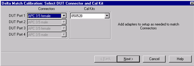
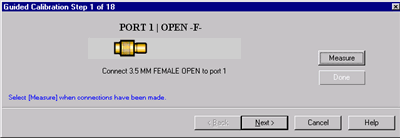
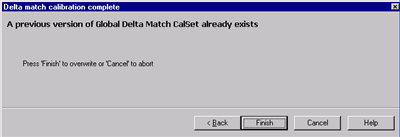

# Delta Match Calibration

* * *

A [TRL Cal](TRL_Calibration.md), [QSOLT](Select_Cal.md#QSOLT), or [Unknown
Thru](Calibration_THRU_Methods.htm#UnknownThru) Cal requires simultaneous,
valid measurements of the reference receivers for the test ports being
calibrated. This is not possible for both the 2-port AND 4-port versions of
the N5231B, N5232B, and N5239B PNA-L models.

This is also NOT possible with older N5230C 4-port models, nor for certain
port pairs when an [external test
set](../System/External_Testset_Control.htm#Calibration) is connected to ANY
VNA model. With external test sets, some pairs of ports share the same
receiver. In general these are the port pairs where one port is directly above
the other. Therefore, TRL, QSOLT, and Unknown Thru are NOT possible in the
context of a 2-port cal for any of those port pairs.

A Delta Match Calibration can be thought of as a software method used to
overcome this hardware limitation. The Delta Match Calibration characterizes
the [source match](Errors.md#errsrcmtch) and [load match](Errors.md#errload)
of the VNA test ports, and then calculates the differences, or "delta", of the
two match terms. The delta term is combined with directivity and reflection
tracking to compute a switch correction term. The switch correction error
terms for each port are then used during subsequent TRL, QSOLT, or Unknown
Thru calibrations.

There are several ways to acquire the Delta Match Calibration:

  1. From an existing User Cal Set that meets the following Delta Match criteria:

  1.      * Must have been performed using ECal or as a guided mechanical Cal (not Unguided).

     * Must have the same start frequency, stop frequency, and number of points as the channel being calibrated.

     * Must calibrate the ports that require the delta match terms.

  2. From a [Global Delta Match Calibration](Delta_Match_Calibration.md#Global).

  3. From a 'Self Delta Match' when other portions of the calibration fully characterize all ports using SOLT with [Defined Thru](Calibration_THRU_Methods.md#Defined) or [Flush Thru](Calibration_THRU_Methods.md#Flush). For example, when calibrating all four ports of a PNA-L, perform a SOLT between ports 1 and 2, and also between ports 3 and 4, then Unknown Thru could be used between any combination of the remaining ports. This is allowed with an [external test set](../System/External_Testset_Control.md#Calibration).

Which to use? A Self Delta Match Cal will always be used when possible.
Otherwise, the Cal Wizard will use a GDM Cal when available unless you select
[Choose Delta Match](Calibration_Wizard.md#ModifyThru).

## Global Delta Match (GDM) Cal

A GDM Cal is an "all-inclusive" calibration that can be applied whenever the
delta match terms are required.

### Factory GDM Cal

Beginning with A.09.80, a factory-performed GDM calibration is installed on
2-port PNA-L models. This GDM Cal is identical to one that you would perform,
except that it is likely to be more accurate than a GDM Cal that would be
performed by most PNA-L customers. The factory GDM is used when a Self Delta
Match Cal is not possible, just like a user-performed GDM.

  * If you choose to perform a GDM Cal, it will overwrite the Factory GDM Cal.

  * A backup copy of the factory GDM Cal is saved on the PNA-L at D:\calfiles\ Global Delta Match Calset.pcs.

  * To restore the original file, copy it to the original location at: C:\ProgramData\Agilent\Network Analyzer\UserCalSets\Global Delta Match Calset.pcs.

  * If the original file is deleted, it will be restored automatically from the backup location.

User GDM Cal

When a GDM Cal is required, and your PNA-L model does NOT have a factory GDM,
it must be performed at least once in order to use TRL, Unknown Thru, or QSOLT
calibrations

  * To attain the highest accuracy, the following settings are automatically used to perform a GDM Cal. When applied, it will likely be [interpolated](Error_Correction_and_Interpolation.md#Interpolation).

  *     * Performed over the entire frequency range of the VNA.

    * If using an external test set, perform GDM with the external test set connected. There will be a separate GDM calibration stored for different PNA configurations. It is possible to have a GDM for the standalone system side by side with GDM calibrations for each type of external test set used.

    * Uses very dense data points, particularly at low frequencies.

    * Uses 100 Hz IF Bandwidth.

  * The measurement conditions (cabling or adapters) of the subsequent calibration do NOT have to match the conditions under which the GDM Cal was performed. Because the GDM Cal characterizes the switch correction at each VNA port, those terms are NOT affected by differences in cabling or adapters.

  * For highest accuracy when using an ECal module to perform the GDM Cal, the test ports of the ECal module should permit an [insertable connection](Calibration_THRU_Methods.md#Noninsertable) (for example 3.5mm male on one port and 3.5 mm female on the other). The frequency range of the ECal module must cover the entire frequency range. When using mechanical standards, the GDM Cal will force an insertable connection.

  * Upon completion, the GDM Cal is stored as a special type of Cal Set and should be used ONLY as a Delta Match Cal. It provides Delta Match error terms, but does NOT provide all of the standard error correction terms.

  * Experience has shown that a GDM Cal may require updating only once every year depending on environmental conditions and how heavily the instrument is used.

#### How to perform a GDM Cal

Note: 2-port PNA-L models have a Factory GDM Cal, which means it is NOT
necessary to perform a GDM Cal. If you perform a GDM, the Factory GDM will be
overwritten. These selections will only be available if the VNA hardware
requires a Delta Match Calibration.  
---  
Using Hardkey/SoftTab/Softkey | Using Menus  
  
  1. Press Cal
  2. then Start Cal
  3. then Global Delta Match

|

  1. Click Response
  2. then Cal
  3. then Start Cal
  4. then Global Delta Match

  
  
  
Delta Match Calibration. Select DUT Connectors and Cal Kit dialog box help  
---  

  * Only one Cal Kit is specified and necessary to perform a Delta Match Cal. However, ALL of the VNA test ports are calibrated in a Delta Match Cal.
  * You must configure ALL test ports to terminate in the specified connector / gender using the necessary adapters. The errors from adapters are removed during calibration, but when using mechanical standards, the GDM Cal will force an insertable connection.
  * For highest accuracy when using an ECal module to perform the GDM Cal, the test ports of the ECal module should permit an [insertable connection](Calibration_THRU_Methods.md#Noninsertable) (for example 3.5mm male on one port and 3.5 mm female on the other). The frequency range of the ECal module must cover the entire frequency range. When using mechanical standards, the GDM Cal will force an insertable connection. If you select an ECal module that does NOT cover the entire frequency range of the VNA, your selection will change to a different Cal Kit.

  
  
Guided Calibration Steps dialog box help  
---  
 Follow the prompts to connect standards to
the calibration plane. Then click Measure. When all standards have been
measured, click Done to complete the measurement steps.

### THRU Connections

  * ONLY 2 Thru connections are required for a 4-port Cal. This is less than the minimum number of Thrus of a standard 4-port Cal.
  * GDM Cal is always performed using a Flush Thru, a Known Thru, or an insertable ECal module. You can NOT use an Unknown Thru in the calibration process. For highest accuracy, perform GDM Cal using an insertable ECal module and select Flush-thru as the Calibration Thru method. [Learn about Calibration Thru methods.](Calibration_THRU_Methods.md)

  
  
Delta Match Calibration Complete dialog box help  
---  
 Click Finish to store the GDM Calibration
as a special type of Cal Set. By default, it will be used when a Delta Match
Calibration is required. It can ONLY be used as a Delta Match Cal. It does NOT
provide all of the standard error correction terms.  
  
* * *

