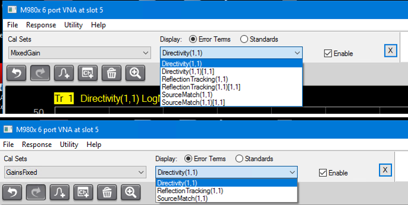
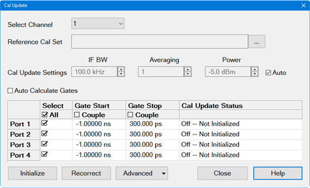

# Cal Update

* * *

Note: Cal Update is a Licensed Feature. Learn more about [Licensed
Features](../Support/Software_Support.htm).

Cal Update recorrects reflection errors between the VNA and the calibration
reference plane after a user calibration has been performed. After calibrating
the VNA, an initialization is performed that captures the time domain response
of the measurement path. As temperature changes over time, a recorrection is
manually performed that will remeasure the path and de-embed any difference.

Cal Update is an update of the existing user calibration, so a user
calibration must be performed prior to running Cal Update.

On PXI, Streamline, and ENA network analyzers, Cal Update can only be applied
to cal sets that are at a single receiver gain setting, per receiver, and the
receiver gain needs to be the same for each receiver. Different receivers can
have different gains, but per receiver, the gain needs to be the same.

A cal set that is created for mixed gain settings will have brackets if the
error terms or standards are viewed. A cal set that is created for a fixed
gain setting does not have brackets. This can be seen in the images below.

So Cal Update requires the user cal set to be at a fixed gain setting; that
is, not have any brackets when the cal set is viewed. If the user tries to
apply Cal Update to a cal set with mixed gain settings, the following error
message is displayed:

"The user calset [Name of calset or register] a switch gain cal set. Please
ensure that source ports for a given receiver have the same switch gain
value."

To create a fixed-gain cal set, Smart Cal should be used. Cal All cannot be
used as Cal All calibrates ALL gain settings. Additionally, within Smart Cal,
the receiver gain settings need to be fixed for all receivers. Each individual
receiver can have a different gain setting, but within each column, the gain
needs to be the same.

The analyzer’s default gain setting is Auto, so it must be changed prior to
performing the user calibration that Cal Update will be updating.

## Cal Update Dialog

#### Accessing Cal Update  
  
---  
Using Hardkey/SoftTab/Softkey | Using a mouse  
  
  1. Press Cal > Main > Other Cals.
  2. Select Cal Update....

|

  1. Click Response.
  2. Select Cal.
  3. Select Other Cals.
  4. Select Cal Update....

  
  
Cal Update dialog box help |   
---|---  
 Select Channel \- Select a
measurement channel. The channel must have a user cal set.  Reference Cal Set
\- Loads the wide bandwidth cal set file that will be used as the reference.
On the PNA family, it attempts to auto select a file with the name "System
Default".  On Streamline, PXI, and ENA network analyzers, in standard mode,
selection of a Reference Cal set is not required. If Direct receiver access
(DRA) is used, then a reference cal set needs to be created. A start frequency
of 10 MHz is recommended for the reference cal set. IF BW \- Sets the IF
bandwidth used during initialization and recorrection.  Averaging \- Sets
averaging used to improve noise errors during initialization and recorrection.
Power \- Sets the source power for the initialization and recorrection.  Auto
\- Check to use a channel's existing IF BW, Averaging, and Power value
settings or uncheck to enter values manually. If entering these parameters
manually, the same value is used for all channels.  Auto Calculate Gates \-
Check to calculate the gate values automatically when the Initialize button is
pressed. When checked, the Gate Start/Stop are grayed-out and the Couple check
boxes are disabled. Select\- Check the boxes corresponding to the ports that
will be initialized when the Initialize button is pressed or recorrected when
the Recorrect button is pressed. All \- Check to select all ports. Gate Start
\- Check to set the gate start value for time domain gating. Couple \- Check
to couple all gate start times to the same value. Gate Stop \- Check to set
the gate stop value for time domain gating. Couple \- Check to couple all gate
stop times to the same value. Cal Update Status \- Displays the current
calibration status of each port. The following are example status messages:
Not Initialized \- Drift cal has not been initialized.  Initialized 2/1/21,
10:00am \- Initialization has been performed on the date/time displayed in the
message. Recorrected 2/1/21, 10:00am \- Recorrection has been performed on the
date/time displayed in the message. Initialize button - Press to measure and
save the base correction data. This button should be pressed immediately after
the user calibration to save a base data set. The measurement is performed on
the ports having the **Select** check box checked. If the **Auto-Calculate
Gates** check box is selected, then the **Start** and **Stop Gates** will be
calculated, displayed in the table, and saved in the User Cal Set. A new Cal
Set called **UserCalSet_CalUpdate** is created for the Update Cal if it does
not yet exist, where **UserCalSet** is the original name of the User Cal Set.
If **UserCalSet_CalUpdate** already exists, then it will be updated with the
new initialization data. Recorrect button - Press to measure the receivers and
compare to the data saved when the **Initialize** button was pressed. The
recorrection is performed on the ports having the **Select** check box
checked. The **UserCalSet_CalUpdate** file will be updated with the new
recorrected data. This button should be pressed before the measurement.
Advanced Enable All Cal Updates \- Enables all Cal Update settings for all
channels. Disable All Cal Updates \- Disables all Cal Update settings for all
channels. Delete All Cal Update Cal Sets \- Deletes all Cal Update settings
for all channels. Set Dialog to Defaults \- Restores Cal Update default
values.

