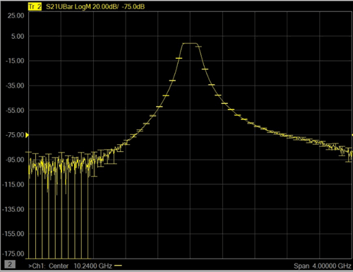
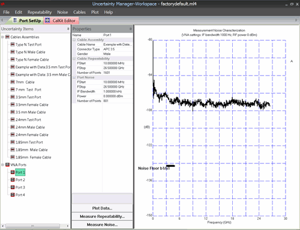
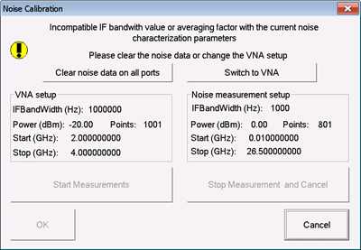
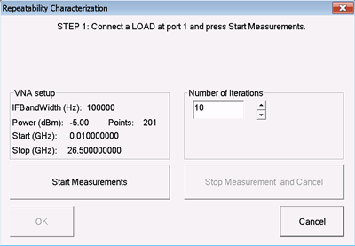
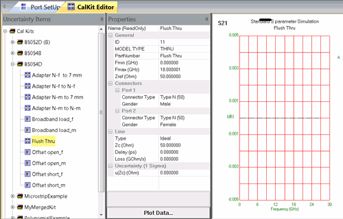
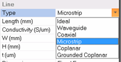
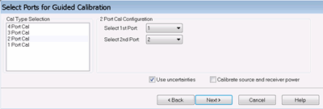
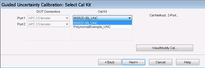
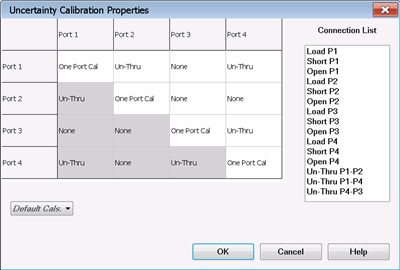
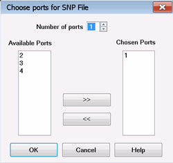

# Real-time S-Parameter and Power Measurement Uncertainty - Option S9x015A/B

* * *

All VNA measurements have some level of uncertainty. The Keysight Uncertainty
Calculator has always provided a method to calculate the uncertainty of your
measurement based on measurement settings, connectors, and a specified Cal
Kit. Now, with S9x015A/B, you can display the measurement uncertainty
dynamically ('real-time') on the same screen as the measurement trace and get
more reliable uncertainty estimates.

  * [Overview](Dynamic_Uncertainty.md#Overview)

  *     * [Summary: How to show Uncertainties](Dynamic_Uncertainty.md#Summary)

    * [Limitations](Dynamic_Uncertainty.md#Limitations)

  * [The Uncertainty Manager](Dynamic_Uncertainty.md#Welcome_to_Uncertainty_Manager)

  *     * [Uncertainty Workspace](Dynamic_Uncertainty.md#Uncertainty_Workspace)

    * [Port Noise Characterization](Dynamic_Uncertainty.md#Perform_Port_Noise_Characterization)

    * [Cable Repeatability Characterization](Dynamic_Uncertainty.md#Perform_Cable_Repeatability_Characterization)

    * [Uncertainty Cal Kits](Dynamic_Uncertainty.md#Uncertainty_Cal_Kits)

    * [Options](Dynamic_Uncertainty.md#Options)

    * [Plot Characterizations](Dynamic_Uncertainty_Plots.md) (separate topic)

  * [Perform an Uncertainty Calibration](Dynamic_Uncertainty.md#Perform_an_Uncertainty_Calibration)

  * [Display Uncertainties](Dynamic_Uncertainty.md#Display_Dynamic_Uncertainties)

  * [Save Uncertainty Measurement Data](Dynamic_Uncertainty.md#Saving_Uncertainty_Data)

  * [Set Up Power Sensor Uncertainty](../System/Configure_a_Power_Meter_As_Receiver.md#Power_Meter_Uncertainties) (separate topic)

[Other Calibration Topics](Calibration.md)

## Overview

The following three sources of uncertainty are characterized and accounted
with Dynamic Uncertainty for S-Parameters:

  * Calibration Standards \- For select Keysight Cal Kits, the standards have already been characterized to a known degree of uncertainty. Alternatively, custom Cal Kits with custom uncertainty can be used. [Learn more](Dynamic_Uncertainty.md#Uncertainty_Cal_Kits).
  * Noise \- The noise at each test port must first be characterized using LOAD and SHORT standards at measurement settings (frequencies, RF power, IF bandwidth, averaging factor) that are similar to the final uncertainty measurements. These characterization measurements are stored with workspace files and can be included in subsequent uncertainty measurements. [Learn more](Dynamic_Uncertainty.md#Perform_Port_Noise_Characterization)
  * Cable and connector repeatability \- The repeatability of test port cables must first be characterized using LOAD and SHORT standards as terminations. These characterization measurements are stored with workspace files and can be included in subsequent uncertainty measurements. [Learn more](Dynamic_Uncertainty.md#Perform_Cable_Repeatability_Characterization).

### Summary: How to measure and display Uncertainties

Highlighted steps are required ONLY for noise and repeatability
characterizations. They are NOT required if already completed prior to
calibration.

  1. Setup the instrument for characterization.

  2. In Uncertainty Manager, assign Cal Kits, ports, and cables for measurement.

  3. Perform noise characterization.

  4. Complete a standard calibration of the system.

  5. Perform repeatability characterization.

  6. Setup the VNA for the measurement.

  7. Perform an uncertainty calibration using an Uncertainty Cal Kit. [Learn how](Dynamic_Uncertainty.md#Perform_an_Uncertainty_Calibration).

  8. Set Uncertainty Trace Properties to control what and how uncertainties are displayed. [Learn how](Dynamic_Uncertainty.md#UncertTraceDialog).

Note: When recalling a Uncertainty Cal Set, it is also necessary to turn
Correction ON.

Filter S21 measurement with uncertainty bars.

### Limitations

  * ONLY single-ended S-parameter and Power (Standard class) measurements are supported.
  * SOLT calibrations are NOT supported. Instead, the preferred choices are SOLR (unknown THRU) and QSOLT.
  * Multiple Cal Kits per calibration are NOT supported. For multiple Cal Kit scenarios, create a custom Cal Kit using existing standards. [Learn how.](Dynamic_Uncertainty.md#Create_a_Custom_Cal_Kit)
  * ONLY the following ECal families are currently supported:
  *     * N4433A 3.5 mm 20 GHz 4-port
    * N4690C Type-N 300 kHz to 18 GHz 2-port
    * N4691B 3.5 mm 26.5 GHz 2-port
    * N4692A 2.92 mm 40 GHz 2-port
    * N4693A 2.4 mm 50 GHz 2-port
    * N4694A 1.85 mm 70 GHz 2-port
    * All N469xD ECal modules are supported, except all DC options (0DC)
  * ECal User Characterizations are NOT supported.
  * Sliding Load Cal standards are NOT supported, even though some Uncertainty Cal Kits contain sliding load standards.
  * Multiport Testsets are NOT supported.
  * Cal All Channels is NOT supported.
  * This application does not support banded millimeter systems.

When Programming Dynamic Uncertainty

  * Calibrations can be performed for ONLY ONE channel at a time.
  * Putting Error Term data into Uncertainty Cal Sets using [remote commands](../Programming/DataTopic.md#putCalData) is NOT supported.

## Uncertainty Manager

Uncertainty Manager is used to perform Noise and Cable Repeatability
characterizations, to edit Uncertainty Cal Kits, and make settings that are
used during a subsequent uncertainty calibration. Once completed, the
characterizations and settings can be saved to a workspace file for future
calibrations.

Uncertainty Manager is a separate application that runs at the same time as
the VNA application. It is closed ONLY when the VNA application is closed.

Important: To return to the VNA from Uncertainty Manager, click File, then
Switch to VNA.

How to start Uncertainty Manager  
---  
Using Hardkey/SoftTab/Softkey | Using a mouse  
  
  1. Press Cal > Cal Sets & Cal Kits > Uncertainty Setup....

|

  1. Click Response
  2. Select Cal
  3. Select Cal Sets & Cal Kits
  4. Select Uncertainty Setup....

  
  
  

Most Uncertainty Manager settings can be made both from the Menu and by right-
clicking an item.

### Uncertainty Manager Workspace

The Uncertainty Manager Workspace contains all of the settings and
characterizations that are used in an Uncertainty Calibration.

  * The title bar on the Uncertainty Manager dialog shows the current workspace (*.ml4) filename.
  * When an uncertainty calibration is performed, the workspace is automatically saved. This file is automatically reloaded when Uncertainty Manager is started.

  * To save the current workspace, click File, then Save, then enter a name. The factorydefault.ml4 (workspace) file can NOT be overwritten. If you do NOT change the filename while saving with factorydefault.ml4, then _copy is appended to the filename before it is saved.
  * [Plot settings](Dynamic_Uncertainty_Plots.md) are NOT saved to the workspace file.

### Perform Port Noise Characterization

The Noise characterization measures the VNA source and receiver noise for a
pair of test ports.

#### Measurement Settings

  * When included in uncertainty analysis, the Noise Characterization is interpolated over frequency, but NOT extrapolated. Therefore, the characterization should be performed over the entire frequency span of the VNA with a point spacing of about 1600 points for the entire span. Avoid very dense point spacing as this slows the characterization and puts a burden on VNA memory.

  * The IFBW for the characterization should be within 10x of the IFBW of the uncertainty calibration. For example, a characterization performed at 10 kHz will allow the IFBW for the uncertainty calibration to be between 1 kHz to 100 kHz.

  * The power level is generally tolerant of variation, so performing the characterization within +/- 10 dB of the power level of the uncertainty calibration is acceptable.

  * The averaging factor of the characterization should be within a ratio of 1:100 of the uncertainty calibration. For example: an averaging factor of 100 for the characterization would allow an averaging factor of between 1 and 1000 for the uncertainty calibration.

#### How to Perform Noise Characterization

It is NOT necessary to perform or recall a VNA calibration before performing a
noise characterization.

Start the noise characterization by doing either of the following:

  * From the menu, select Noise, then Measure Noise
  * Right-click a VNA Port, then select Measure Noise

If the current VNA settings (frequencies, RF power, IF bandwidth) are NOT the
same as that with which the current noise data was measured, then the
following dialog appears:

Select one of the following:

  * Clear noise data on all ports \- Use the current VNA settings to perform a new Noise characterization.
  * Switch to VNA (screen) - Manually change the VNA settings to match those with which the current noise data was measured. Do this to recharacterize the noise using the previous settings.

Click (Start) Measure. The VNA port noise characterization is performed using
a 2-step measurement process involving two ports at the same time:

  1. The noise floor is characterized with a LOAD (or low-reflective device) connected to each test port. If test cables will be used in your uncertainty measurement, connect them for the noise characterization to get a better noise estimate, especially when the cables are lossy.

  2. Trace noise is characterized with a SHORT (or high-reflective device) connected to each test port.

Press OK when finished.

#### Save the Noise Characterization

The noise data can now be saved and later recalled for use with uncertainty
measurements.

  * To store the entire workspace which includes the noise characterization, click File, then Save.
  * To store the JUST noise data, in the menu bar, click Noise, then Save Noise. Enter a descriptive filename. The noise data is saved to a *.ndf file. You would do this if you plan to share the data with another VNA. This ASCII (csv) file can be accessed using Windows Explorer.

### Cable Repeatability Characterization

Uncertainty Manager comes preloaded with a database of uncharacterized cables.
In addition, there are also some 'Example' cables which include repeatability
characterization data. However, you should perform your own repeatability
characterization for cables which you intend to include in the uncertainty
analysis.

It is likely that you will need to add new cables to the list. For example:

  * If the cable requires an adapter to connect your DUT, you should create a new cable entry and characterize it. Adapters do have an impact on how the repeatability propagates.
  * To connect your DUT directly to the VNA front panel connector or connector saver, create and then assign a "zero-length Test Port" cable.
  * [Learn how to add new cables and connectors](Dynamic_Uncertainty.md#Add_a_New_Cable).

#### BEFORE performing the repeatability characterization

  1. Assign the cable to at least one VNA port. This is done ONLY to perform the characterization. During uncertainty measurements, the cable can be assigned to any VNA port. The characterization is performed at the lowest port number to which it is assigned.

  * To associate a single cable with all ports, select the cable. Then right-click, then select Assign Cable to All Ports.
  * To associate a single cable with a single port, select the port. Then in the Properties pane, select Cable Name, then click  next to the current cable name, then select a cable.
  * To perform an independent repeatability characterization for each port, ensure that the assigned cable or test port name is unique.

  2. Perform or recall a valid calibration at the test port. To achieve the best characterization: 

  * Select the entire frequency span over which the cable is specified or the frequency span of the VNA if it is smaller. When performing the uncertainty calibration over a smaller span, it will be interpolated.
  * Select a point spacing or about 1600 points. Avoid very dense point spacing as this slows the characterization and puts a burden on VNA memory.
  * Select an IFBW of 1 kHz or less.
  * Select a high power level without exceeding the VNA linearity specification.

#### Perform the repeatability characterization

  1. Select the cable to characterize.

  2. If there is already repeatability data associated with the cable, right-click the cable, then click Clear Repeatability.

  3. At the bottom of the Properties pane, click Measure Repeatability. The following dialog appears:  

  4. Choose Number of Iterations (20 is recommended). An Iteration is a measurement with each termination. A set of iterations are performed first with the LOAD (or low-reflective device), and then again with the SHORT (or high-reflective device). For 20 iterations, a total of 40 measurements are performed.

  5. Connect the cable to the specified test port, connect the terminating LOAD, and click Start Measurements.

  6. Between each measurement, either move the cable, or remove and reconnect the standard, or both (recommended). Do NOT remove and reconnect the cable from the VNA test port as this will impair the calibration. Use the same torque wrench as you use during ordinary calibrations and measurements.

  7. Follow the prompts at the top of the dialog. When finished, press OK.

#### Save the repeatability characterization

The repeatability data can now be saved and later recalled for use in an
uncertainty calibration. The repeatability data can be used over any subset of
the characterized frequency range. When used in an uncertainty calibration,
measurement settings such as power and IFBW are NOT relevant.

  * To store the entire workspace which now includes the repeatability measurements, click File, then Save.
  * To store JUST the repeatability data, click Save Repeatability and enter a descriptive filename. The repeatability data is saved to a *.rep file. You would do this if you plan to share the data with another VNA. This file can be accessed using Windows Explorer.

#### Add New Cables and Connectors

  * Click Cables, then New Cable. 'New Cable' appears in the list of connectors.
  * Use the Properties pane to change the Name and assign a Connector Type and Gender.
  * To add a new connector, add it using the Uncertainty Manager CalKit Editor.

* * *

## Uncertainty Cal Kit Editor

From Uncertainty Manager, you can access the Uncertainty Cal Kit Editor by
clicking the CalKit Editor tab. Also from the [VNA Cal Kits
dialog](ModifyCalKits.htm), click Uncertainty Cal Kits button.

The Uncertainty Cal Kit Editor

### Uncertainty Cal Kits and Standards

To see Cal Kit uncertainty contributions in an Uncertainty calibration, the
standards must include uncertainty data. This is best done with 'databased'
standards. This means that the standard definitions include characterized
data, not just polynomial values as in typical Keysight Cal Kits. Polynomial
standards can include mechanical dimension uncertainties. [Learn
more](Dynamic_Uncertainty.htm#Mechanical_Dimensioning_Uncertainties).

As shown in the above image, three of the Keysight 8505x Cal Kits have already
been 'databased' for use with Dynamic Uncertainty. In addition to being
databased, the standards include uncertainty data.

  * Keysight Uncertainty Cal Kits can NOT be edited.
  * No Keysight Waveguide Cal Kits have been databased.
  * If you own a Cal Kit other than those that have been databased, you can either:
  *     * Characterize your own uncertainty standards. [Learn how](http://na.support.keysight.com/pna/dbcal.html) (internet connection required).
    * Add uncertainty values to represent the mechanical uncertainties of your cal standard. [Learn how](Dynamic_Uncertainty.md#Mechanical_Dimensioning_Uncertainties).

All standards have properties as shown in the Properties pane above.

All standards have the General information shown, and Connector Type and
Gender.

All standards have an icon preceding its Name in the Items list. This gives a
hint as to the type of standard.

 \- Signifies a databased standard. The
characterization data is stored in the workspace file. See [How to
Characterize Uncertainty
Standards](Dynamic_Uncertainty.htm#Characterizing_Uncertainty_Standards).

 \- Signifies an adapter. Adapters are
NOT databased. They include only nominal 'delay'. This delay value can be
edited if it is in a custom Cal Kit.

 \- Signifies an OPEN. All other icons
represent a specific type of polynomial-based standard.

#### Connectors

To add a new connector, right-click on Connectors, then New Connector.
"New_Connector" appears in the list of connectors. Edit the name in the
Properties pane. It will now appear in the Connector Type selector for a
standard.

### Create a Custom Cal Kit

You may need to create a custom Cal Kit for one or more of the following
reasons:

  * When performing an uncertainty calibration, only ONE Cal Kit can be selected for all ports. For multiple Cal Kit scenarios, create a custom (combined) Cal Kit which contains standards with different connector types using the uncertainty Cal Kit Editor.
  * Create a Cal Kit to contain new standards.

#### Procedure

  1. On the CalKit Editor tab, click CalKits, then New CalKit.
  2. In the Properties pane, change the Name and PartNumber.
  3. Fill the new Cal Kit with standards the following methods. There can be more than one connector type in a Cal Kit.

  1.      1. Copy standards from other Cal Kits. Standards can simultaneously belong to different Cal Kits. 
        1. Select the standard in a different Cal Kit to be copied.
        2. Click Edit, then Copy (or Ctrl+C)
        3. Select the new Cal Kit.
        4. Click Edit, then Paste (or Ctrl+V)
        5. Make edits to the standard as necessary. You can not edit databased standards that have been copied from Keysight standards.

  1.      2. Create new databased or polynomial standards. 
        1. Click CalKits, then New standard
        2. Select the standard type. Choose from: Short, Open, Load, Line, Thru (defined), Reciprocal (Unknown Thru), DatabaseStd.
        * DatabaseStd is the ONLY standard type for which you can upload uncertainty characterization data. These Database standards can be renamed and associated with a Equivalent Model. See the following section [Characterize Uncertainty Standards](Dynamic_Uncertainty.md#Characterizing_Uncertainty_Standards).
        * All other standard types allow only polynomial data. These standards can include dimension uncertainties. See [Mechanical Dimensioning Uncertainties](Dynamic_Uncertainty.md#Mechanical_Dimensioning_Uncertainties)

  4. Click Edit CalKits, then Edit Class. Learn more about editing Cal Kit Classes from the [VNA Cal Kit Editor](ModifyCalKits.md).

### Characterize Uncertainty Standards

To be used in an Uncertainty calibration, the standards must include
uncertainty data. This is best done with a 'databased' standard. This means
that the standard definitions include characterized data, not just polynomial
values.

Select Keysight Cal Kits have already been characterized with uncertainty
data. If you own one of these Cal Kits, shown by name in the Cal Kit editor,
there is nothing more required.

If you do NOT own one of these Cal Kits, you can characterize your own
uncertainty standards.

Procedure

  1. Perform an uncertainty calibration using a Keysight Uncertainty Cal Kit.
  2. Measure the device to be used as a standard.
  3. Save the data as *.dsd file [Learn how](Dynamic_Uncertainty.md#Saving_Uncertainty_Data).
  4. Import this file at the New Standard dialog.

### Mechanical Dimension Uncertainties

For Cal Kits that include polynomial standards to be used for PCB, on wafer,
or coaxial applications, you can describe the mechanical dimensions and
tolerances. From these, Uncertainty Manager will calculate the electrical
uncertainties. An example of this type of standard is provided in the
Uncertainty Manager Microstrip Example Cal Kit.

#### How to enter physical dimensions and tolerances

  1. Select the polynomial standard.
  2. In the Properties pane, change Type any of the selections other than Ideal or Waveguide.  

  3. Enter the relevant physical dimensions accordingly to the manufacturer's specifications.
  4. For each dimension, in the Uncertainty section, provide reasonable estimates of the standard parameters. By default, the uncertainty probability density function is assumed to be Gaussian. All uncertainty values are assumed to be standard deviations (1 sigma uncertainties).

* * *

### Calibration Options

Calibration Options dialog box help  
---  
To start this dialog, in Uncertainty Manager, click File, then Uncertainty Options.  Check each to include Noise, Cable Repeatability and Standard Definition in the uncertainty calibration. You can later decide to NOT include these in the measurements using the [Trace Properties dialog](Dynamic_Uncertainty.md#Display_Dynamic_Uncertainties). Max Uncertainty Pts \- Because of limited VNA memory, uncertainty is computed for a maximum of 501 equally-spaced data points. When applied to a measurement, the data points within each step is assumed to have the same uncertainty. To save VNA memory, reduce this number. | Important Notes

  * These settings control the contributions used ONLY during the uncertainty calibration. They are independent from the [trace properties settings](Dynamic_Uncertainty.md#UncertTraceDialog), which control the contributions used during the DUT measurement.
  * These settings are NOT saved with the workspace file, but to a hidden 'global' file.

  
---  
  
Service Mode \- When requested by Keysight service personnel, check this box
before calibration to save uncertainty data for troubleshooting purposes.  
  
## Perform an Uncertainty Calibration

Important: BEFORE starting an uncertainty calibration, ensure that the current
Uncertainty Manager workspace contains ALL of the settings that will be used
for the uncertainty calibration. Here are the critical settings:

  * For each port to be calibrated, select the Connector Type and Port / Cable assignment.
  * To include Noise data and Cable Repeatability data in the calibration:
  *     * The data must be available in the current workspace.
    * Be sure that the data covers the frequency range of the calibration.
    * Check the appropriate 'include' boxes in [Options dialog](Dynamic_Uncertainty.md#Options).

  
---  
  
Start Cal Wizard, then select Guided Cal.

  1. At the Select Ports for Guided Cal dialog, select the ports to be calibrated, then check Use Uncertainties, then Next >.  

  2. At the Select Cal Kit dialog:  

  * The connectors that you chose from the Uncertainty Manager are selected automatically and can NOT be changed.
  * Select the (Uncertainty) Cal Kit if more than one exists.

  3. Optionally, click View/Modify Cal to view / change the Cal Types and connection steps for the pending calibration. The following dialog appears:

Uncertainty Calibration Properties dialog box help  
---  

  * The port configurations with selected Cal Types appear in a matrix.
  * 1-port Cals appear at the intersection of the same port number. For example Port 1 and Port 1.
  * 2-port 'Thru' Cal Types appear at all other intersections.
  * The dark-shaded areas are a mirror image of the selectable 2-port intersections. They can NOT be edited.

#### How to change Cal Types

  * Click in any white box, then make a selection.
  * The Connection List (cal steps) change accordingly.
  * Invalid appears when the Cal Types are NOT sufficient to perform a valid calibration. One or more of the Cal Types must be changed.
  * None appears when no Cal Type is required at that port intersection.

2-port (Thru) Cals are selected by default based on the following (in order):

  1. The standards in the selected Cal Kit. ECal always appears when a supported ECal module with the corrected connector type and gender is connected to USB. NOT all ECal modules have been databased. [Learn more](Dynamic_Uncertainty.md#Limitations).
  2. The most recent multiple-port calibrations.
  3. If the most recent calibration is NOT possible, then priority is given to Cal Types in the following order:

  1.      1. LRM (Line-Reflect-Match) The 'Line' (L) standard is used as a Thru by defining it in the Thru Class.
     2. TRL (Thru-Reflect-Match) - [Learn more about TRL](TRL_Calibration.md)
     3. SOLR (Un-Thru) \- [Learn more about Unknown Thru](Calibration_THRU_Methods.md#UnknownThru)
     4. QSOLT (Quick SOLT) - Only ONE 1-port Cal is performed (on the lower port number by default). Then a Defined Thru. To perform the 1-port cal on the higher port number, select 'Thru' between the ports, then change the higher port number to 'One-port Cal'.

#### 1-port Cals

  * One-port Cal appears at the intersection of the same port numbers. The above image shows this for all four ports.
  * Automatic indicates that the selection is flexible. The connection list reflects the port numbers on which to perform 1-port cals. However, any of the Automatic selections can be changed to 'One-port Cal'.

#### Default Cals

Select your Cal Type preference for the current calibration.  
  
  4. Follow the remaining connection prompts to complete the calibration.
  5. Save the calibration and apply the resulting Cal Set with uncertainties as you would any Cal Set.

Important: Add a descriptive prefix to the Uncertainty Cal Set name such as
"UNC<calset name>". This will help identify it as an Uncertainty Cal Set. This
does not occur automatically.

## Set Uncertainty Trace Properties

You have performed Noise and Cable Repeatability (optional).

You have performed a calibration using an Uncertainty Cal Kit.

Now, you want to show the uncertainties on the displayed trace.

Start the Trace Uncertainty Properties dialog by doing one of the following:
1\. Right-click on the trace status above the grid, then click Uncertainty.  
---  
Using Hardkey/SoftTab/Softkey | Using Menus  
  
  1. Press Math > Analysis > Uncertainty Analysis....

|

  1. Click Response
  2. Select Math
  3. Select Uncertainty Analysis...

  
  
  
Uncertainty Trace Property dialog box help  
---  
 Trace \- Choose the displayed
trace to which the settings on this dialog will be applied. Or check Apply to
all traces to override this selection.

#### Trace Type

ONLY Ellipse is supported in Smith Chart or Polar display format. Normal \-
Display the trace without uncertainties. UMax – Display the trace as the
uncertainty maximum (measured or memory data PLUS upper limit uncertainty
values).  UMin \- Display the trace as the uncertainty minimum (measured or
memory data MINUS lower limit uncertainty values).  UBars – Display the
uncertainties as “error bars” around the trace.  Shade – Display the
uncertainties as a shaded region around the trace.  Ellipse – Display the
uncertainties in ellipse form. Supported ONLY in Smith Chart or Polar display
format.

#### Settings

Coverage Factor \- Sets the level of confidence used in computing the
specified measurement uncertainties. The higher the coverage factor, the
higher the confidence that the computed uncertainty region includes the "true"
measured data of the DUT. To include Noise and Cable Repeatability
uncertainties, the characterization must have already been performed. [Learn
how](Dynamic_Uncertainty.htm#Welcome_to_Uncertainty_Manager).

  * Noise \- Check to include characterized noise data contribution in the displayed uncertainties.
  * Repeatability \- Check to include cable and connector repeatability contribution in the displayed uncertainties.
  * Calibration \- Check to include Cal Standard uncertainty contribution in the displayed uncertainties.

Apply to all traces \- Check to apply the above settings to ALL traces. Clear
to use the 'Trace' selector to choose traces to which settings will be
applied.

#### Add Trace

A trace is added to the channel. Choose from the following:

  * UMax \- The uncertainty maximum data (measured or memory PLUS upper limit uncertainty values).
  * UMin \- The uncertainty maximum data (measured or memory PLUS upper limit uncertainty values).

Cancel \- Closes the dialog just like clicking OK. All changes are applied.  
  
### Saving Uncertainty Data

Once an Uncertainty Calibration has been performed and you are making
measurements, you can then save Uncertainty data.

Before saving, an Uncertainty Calibration MUST be applied to the active
measurement.

Click File, then Save Data As. ([See the Save
Data](../S5_Output/SaveRecall.htm#SaveAsDiag) dialog).

Then choose from the following formats:

  * (*.u*p) S-parameter Uncertainty File \- Very similar to *.SnP files except this format includes uncertainty data.

Sample header:

!Coverage factor: k=1

Freq(Hz), S1_1 mag (linear), S1_1 phase (deg), US1_1 mag (linear), US1_1 phase
(deg)\

  * (*.dsd) S-parameter Data Standard Definition file \- Used by Dynamic Uncertainty (Opt S93015A/B) as the file type that is used to characterize standards.
  * (*.sdatcv) METAS S-parameter Covariance File \- Used by Swiss Federal Institute of Metrology software for save/recall of measurement uncertainties.

  * (*.unc) Uncertainty Parametric Data \- Contains the uncertainty contributions of the measured quantities (power and S-parameters).

Choose ports for Uncertainty Data dialog box help |   
---|---  
 This dialog appears when any of the
following conditions exist while attempting to save data to any of the
Uncertainty data types:

  * when requesting less data than is available.
  * when requesting data for more than 4 ports.

Number of ports Select the number of ports for which data will be saved. | Notes

  * When saving a *.dsd file, only data for 1-port or 2-ports per file are allowed. An error is returned when attempting to save data for more than 2 ports per file.
  * When saving a *.u*p file, with Number of ports = 2, *.u2p data is saved; with Number of ports = 3, .u3p data is saved, and so forth.

  
---  
  
Arrow buttons Click to Add or Remove ports from or to the following columns:

Available Ports All test set ports are listed. There may NOT be valid data
available for all of these ports. [Learn more.](../S5_Output/SaveRecall.htm#An
*.s3p)

Chosen Ports When OK is clicked, uncertainty data is saved for these ports.

OK Becomes available when the number of Chosen ports = the Number of ports to
save. Click to save the uncertainty file.  
  
* * *

