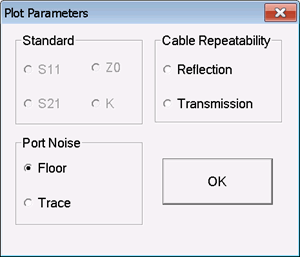
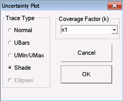
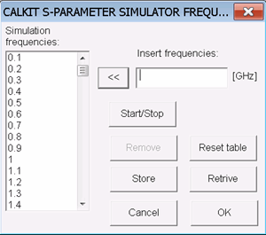
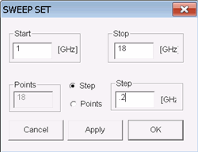
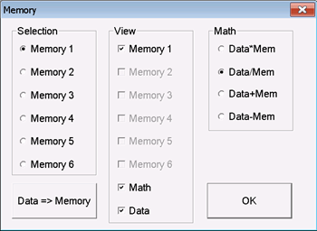
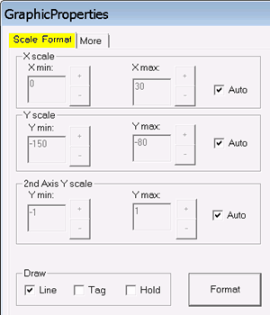
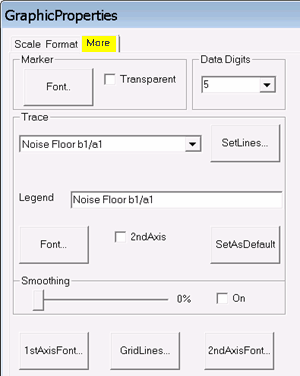
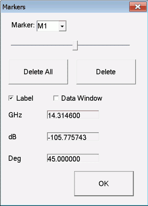
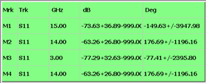

# Plotting Data in Uncertainty Manager

* * *

The following selections appear in Uncertainty Manager under the Plot menu:

  * [Plot Data](Dynamic_Uncertainty_Plots.md#Plot_Parameters)

  * [Show Uncertainty](Dynamic_Uncertainty_Plots.md#Show_Uncertainty)

  * [Format](Dynamic_Uncertainty_Plots.md#GraphicProps)

  * [Frequency](Dynamic_Uncertainty_Plots.md#Show_Uncertainty)

  * [Scale](Dynamic_Uncertainty_Plots.md#GraphicProps)

  * [Memory](Dynamic_Uncertainty_Plots.md#Memory)

  * [Marker](Dynamic_Uncertainty_Plots.md#Marker)

  * [Copy Plot to ClipBoard](Dynamic_Uncertainty_Plots.md#Labels)

  * [Labels and Colors](Dynamic_Uncertainty_Plots.md#Labels)

Note: Plot settings are NOT saved with a workspace (*.ml4) file.

Plot Parameters dialog box help  
---  
This choice can also be made by clicking Plot, then Plot Data, then select a
parameter.  A parameter is available
when the selected Uncertainty Item has data to plot. For example, Standard is
available when a standard is selected on the Cal Kit Editor tab. Click one of
the selections, then click OK to plot the data. Learn more about
[Standards](Dynamic_Uncertainty.md#Uncertainty_Cal_Kits), [Port
Noise](Dynamic_Uncertainty.htm#Perform_Port_Noise_Characterization), or [Cable
Repeatability](Dynamic_Uncertainty.htm#Perform_Cable_Repeatability_Characterization)
data.  
  
###

Show Uncertainty dialog box help  
---  
This dialog is available ONLY when plotting Cal Kit standard data.
 Allows you to plot the
uncertainty associated with the selected standard data.

### Trace Type

Normal \- Display the trace without uncertainties. UMax – Display the trace as
the uncertainty maximum (measured or memory data PLUS upper limit uncertainty
values).  UMin \- Display the trace as the uncertainty minimum (measured or
memory data MINUS lower limit uncertainty values).  UBars – Display the
uncertainties as “error bars” around the trace.  Shade – Display the
uncertainties as a shaded region around the trace.  Ellipse – Display the
uncertainties in ellipse form. Supported ONLY in Smith Chart or Polar display
format. Coverage Factor \- Sets the level of confidence used in computing the
specified measurement uncertainties. The higher the coverage factor, the
higher the confidence that the computed uncertainty region includes the "true"
measured data.  
  
###

Show Uncertainty dialog box help  
---  
This dialog is available ONLY when plotting Cal Kit standard data.
 This dialog is used to set the
frequencies for plotting Cal Kit standards.

  * When a standard is selected, the response is plotted at these frequencies
  * When the standard is databased, the data is interpolated.
  * When the standard is polynomial, the model is computed at each of these frequencies.
  * When a standard response is exported as touchstone or DSD file, the data will contain these frequencies.

Simulation Frequencies \- Shows the current list of frequencies.

### To add or remove a few frequencies:

Insert frequencies \- To add frequencies, enter a value in GHz, then click <<
Remove \- To remove frequencies, select the value, then click remove.

### To quickly replace the values with a evenly-spaced step size/data points:

  1. Click Reset table to remove all frequencies.
  2. Click Start/Stop to show the following dialog:  

  3. Enter the Start and Stop frequencies.
  4. Select, then enter either the (number of) Points or the Step size in GHz.
  5. Click OK

Store \- Saves the frequency list to a text file. Retrieve \- Loads the
frequency list from a text file.  
  
### Perform Math on Plotted Characterization Data

Noise or Repeatability characterization data can be stored in Uncertainty
Manager memory, then math can be performed on the Data vs. Memory.

To show this dialog, first plot data, then click Plot, then Memory.

Memory dialog box help  
---  
 Selection \- Choose a memory location,
then click Data => Memory. The current characterization data can be stored in
up to 6 memory locations. View \- Select one or more of the following:

  * Check a Memory location to view on the plot. Only the locations with memory saved to them are available for selection.
  * Check Math to view an additional trace of the selected math operation.
  * Check Data to view the original data trace

Math \- Select one of the following math operations to perform on the Data and
Memory location. [Learn about Data Math
operations](../S4_Collect/Math_Operations.htm#MathMemorydialogbox).  
  
Graphic Properties dialog box help  
---  
  
### Scale / Format tab

 To manually change scale on the X,
Y, or 2nd Y axis:

  1. Clear (uncheck) Auto.
  2. Enter or use the +/- buttons to set the Min and Max scale of the plot. Each rectilinear plot has 10 vertical and 10 horizontal divisions.

### Draw

Choose one or more of the following:

  * Line \- Data points are connected with a line.
  * Tag \- Each data point is highlighted.
  * Hold \- Traces remain visible after plotting new traces. The scale becomes fixed, although the plot can be rescaled manually. This is useful for comparing similar traces.

Format

  * For Noise and Repeatability, choose from Linear or Log.
  * For Standards, choose from all formats.
  * [Learn about these formats](../S1_Settings/Data_Format.md).

### More tab

### Marker

Font \- Select the size and font for the marker readout. Transparent \- Check
to make the traces and grid show through the marker label. Data Digits \-
Select the resolution of the readout.

### Trace

Select the trace for which the following settings will be made. Set Lines \-
Sets the trace width, color, and type. Legend \- Edit the legend that appears
in the upper left corner of the chart. Font \- Select the size and font for
the trace title. 2nd Axis \- Check to associate this trace with the 2nd
(right) Y-axis. Set as Default \- Check to make the settings apply to all
traces.

### Smoothing

Drag the slider to achieve the desired amount of trace smoothing. On \- Check
to quickly turn ON / OFF the smoothing value.

### Buttons

1st Axis Font \- Click, then set the size, color, and font for the primary
Y-axis. Grid Lines \- Click, then set the style, color, and thickness of the
grid lines. 2nd Axis Font \- Click, then set the size, color, and font for the
2nd Y-axis.  
  
Marker dialog box help  
---  
To show this dialog, first plot data, then click Plot, then Marker.
 You can add up to 4 markers for each
trace.

  * To add a marker \- Select a marker from the drop-down selector. The marker that is selected when this dialog is closed is the ACTIVE marker.
  * Move the marker using the slider. You can also move the ACTIVE marker by clicking on the plot with a mouse. The marker moves to the X-axis location of the mouse cursor when clicked.
  * Click Delete All or Delete to remove markers.
  * Label \- Check to show a readout just above the selected marker.
  * Data Window \- Check to show readouts for all four markers in a sizeable and movable window as shown below.  

  
  
Labels and Colors dialog box help  
---  
To show this dialog, first plot data, then click Plot, then Labels and Colors.
 Application Look \- Select a
color scheme for the entire Uncertainty Manager workspace. Legend On \- Check
to show the legend on the current plot. Titles On \- Check to show Titles on
the current plot. Set Plot Titles \- Starts a dialog that allows you to change
all of the titles for the current plot. Copy Plot to Clipboard \- Copies an
image of the current plot. You can then paste it into a word processing or
image editing software.

