# ECal User Characterization

* * *

  * [Overview](ECal_User_Characterization.md#Overview)

  * [How to Perform a User Characterization](ECal_User_Characterization.md#How)

  * [Manage Disk Memory](ECal_User_Characterization.md#ManageDiskMem)

  * [Restore ECal Module Memory](ECal_User_Characterization.md#Restore)

### See Also

[Using ECal](Using_ECal.md)

[Perform a 4-Port Cal with a 2-Port ECal
Module](Perform_a_4-Port_Cal_with_a_2-Port_ECal_Module.htm)

Other [Calibration Topics](Calibration.md)

## Overview

A user-characterized ECal module allows you to add adapters to the ECal
module, re-measure the standards in the ECal module, INCLUDING the adapters,
then add that data to ECal memory or save it to disk memory. This extends the
reference plane from the module test ports to the adapters.

Compared to legacy ECal modules, the new N755xA ECal modules have greater
flash memory.

Important Note: DO NOT connect/disconnect USB devices during ECal
calibrations. Doing so may cause problems with the calibration.

Important Note: This feature is only available on Ports 1 and 2 of the VNA.

Note: N756xA Multi-port ECal module does not support this function.

### Why perform a User Characterization?

  * If you need to use adapters with your ECal module, you could characterize your ECal module with the adapters attached and perform subsequent ECals in a single step.

  * If you have a 4-port ECal module, you could configure the module with adapters of different connector types, then perform a User Characterization of the module. When you need to test a DUT with a pair of the connector types on your module, calibrate the analyzer with a 1-step ECal using the same two connectors on the User-characterized module.

  * If you test devices in a fixture, you could embed the characterization of the fixture in the characterization of the module. To do this, during the mechanical calibration portion of the User Characterization, calibrate at the reference plane of the device as you would normally calibrate. Then remove the fixturing to be embedded and insert the ECal module to be characterized. When measuring the ECal module, the analyzer removes the effects of the fixturing and stores the measurement results in the user characterized ECal module. Subsequent calibrations with that user-characterized module will also remove the fixture effects.

Notes:

  * Both 2-port and 4-port ECal modules support User Characterization.

  * User Characterization does not delete the factory characterization data. The factory data is saved in the ECal module in addition to the User Characterization data.

  * The ECal Data Wipe Utility is the only way that data can be deleted from the module. 

  * A User Characterization can be performed beyond the frequency range of the ECal module. Although this practice is allowed, calibration accuracy with the extended User Characterization is likely to be degraded. To determine the level of degradation, compare measurements of a variety of devices with a mechanical cal kit calibration versus an ECal extended User Characterization calibration.

  * You can save up to 12 User Characterizations in a single ECal module. Previous releases allowed up to 5. There are memory limitations. The analyzer will determine if the contents of a User Characterization will fit inside the module before it is performed.

  * A User Characterization can be performed remotely. [See programming commands.](../Programming/CalTopic.md#UserChar)

User Characterizations can be saved to Disk Memory. [Learn
how](ECal_User_Characterization.htm#DetailedUser). This feature provides the
following benefits:

  * A User Characterization using connectors that are NOT included in the [supported connector table](ECal_User_Characterization.md#Information_Characterization_help) can NOT be stored to the ECal module. But when stored to disk memory, ANY connector type is allowed by firmware using a description of any length for the User Characterization.
  * There is NO limit to the number of data points allowed in a User Characterization stored to disk memory. When stored in the ECal module, the number of data points is limited to a maximum of 65535 per characterization, or less as dictated by the remaining free memory in the module.
  * The number of User Characterizations that can be stored to disk memory is limited only by available disk space.
  * User Characterizations stored to disk memory can be freely shared between analyzers.

[Learn how to Manage User Characterization in Disk
Memory](ECal_User_Characterization.htm#ManageDiskMem).  
---  
  
How to Perform a User Characterization

SUMMARY (A detailed procedure follows.)

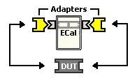 |  1\. Select adapters for the module to match the connector configuration of the DUT.  
---|---  
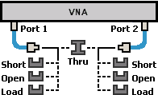 |  2. Either calibrate the analyzer using mechanical standards or recall an existing Cal Set.  
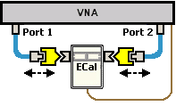 |  3\. Measure the ECal module, including adapters, as though it were a DUT.  
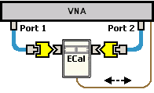 |  4. The measurement results are the characterization data that then gets stored inside the module or to disk.  
  
Note A 2-port analyzer can be used to perform a User Characterization on a
4-port ECal module. However, a 4-port ECal module has SIX different port
pairs. The analyzer must be recalibrated for each port pair that uses unique
connecter types or gender.

  * If all 4 ECal module ports have the same connector type and gender, then only one calibration is required to measure all six port pairs.
  * If all 4 ECal module ports have different connector types or gender, then 6 calibrations are required.

When more than one calibration is required during a User Characterization,
then ALL calibrations must be performed using the standard Cal Wizard, saved
to Cal Sets, and then [recalled from Cal
Sets](ECal_User_Characterization.htm#Calibrations_to_Perform_help) DURING the
User Characterization.  
---  
  
Detailed steps to Perform a User Characterization

  1. Connect the ECal module to the network analyzer with the USB cable. See [Connect ECal Module USB to the analyzer USB](Using_ECal.md#Connect).
  2. Allow the module to warm up until it indicates READY.
  3. Preset the analyzer.
  4. [Set up the measurement](../S1_Settings/Select_a_Measurement_State.md).  For best accuracy, the IF bandwidth should be set to 1 kHz or less.
  5. Start and complete the Characterize ECal Module Wizard:

  
---  
Using Hardkey/SoftTab/Softkey  
  
  1. Press Cal > Cal Sets & Cal Kits > ECal > Characterize ECal....

  
  
  
Select Module and Location dialog box help  
---  
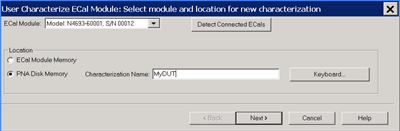 ECal Module Select one of the
ECal modules that are connected to the analyzer. Detect Connected ECals Click
to rescan the USB for ECal modules.

### Location

  * ECal Module Memory Click Next to see the following dialog.
  * Disk Memory Enter a Characterization Name. This name appears when selecting a User Characterization to be used with subsequent calibrations.
  *     * [Learn how to manage characterizations that are stored to disk memory.](ECal_User_Characterization.md#ManageDiskMem)
    * [See the benefits of storing the User Characterization to disk Memory.](ECal_User_Characterization.md#UserToDiskBenefits)

Keyboard Launches a keypad that can be used to type a characterization name
from the analyzer front panel. Next Click to continue to the Select Connectors
for the Characterization dialog box. [See note regarding extended frequency
use.](ECal_User_Characterization.htm#ExtendedUser)  
  
Select User Number for new characterization dialog box help  
---  
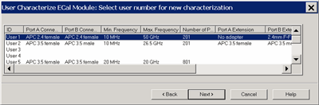 Scroll to view all of the parameters
of the stored characterizations. Select an empty location or select to
overwrite an existing characterization. Next Click to continue to the Select
Connectors for the Characterization dialog box. [See note regarding extended
frequency use.](ECal_User_Characterization.htm#ExtendedUser)  
  
Select Connectors for the Characterization dialog box help  
---  
 |  Connector Notes When performing an ECal User Characterization, do NOT use a [custom connector name](Connectors_Tab.md#Connectors) that you added to this list. If you need to use a custom-defined connector type, select "Type B", or one of the "Type A" variations from the list of connectors for each port. A User Characterization using connectors that are NOT included in the [supported connector table](ECal_User_Characterization.md#Information_Characterization_help) can NOT be stored to the ECal module. But when stored to disk memory, ANY connector type is allowed. [Learn more about storing to Disk Memory](ECal_User_Characterization.md#UserToDiskBenefits).  
---  
  
Select the adapters for the ECal module test ports. Select No adapter if no
adapter is used on a port.

PORT A Lists the connector types available for Port A.

PORT B Lists the connector types available for Port B.

PORT C Lists the connector types available for Port C (available with a 4-port
ECal module).

PORT D Lists the connector types available for Port D (available with a 4-port
ECal module).

Next Click to continue to the Calibrations to perform or recall dialog box.  
  
Calibrations to perform or recall dialog box help  
---  
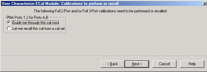 The analyzer must be calibrated
before measuring the ECal module and necessary adapters. This dialog box
displays the number and types of mechanical calibrations required for the
characterization. Guide me through this cal now Click to perform a Guided
calibration. A calibration kit is required for each connector type. Note: Some
PNA-L models cannot perform TRL calibration during the calibration portion of
a User Characterization. However, this type of Cal can be performed using the
Cal Wizard, saved to a Cal Set, then recalled at this point in the User
Characterization. If more than one calibration is required, the following
selection is not available. [See
Note.](ECal_User_Characterization.htm#4portNote) Let me recall this cal from a
cal set Click to select an existing Cal Set. You cannot select a Cal Set that
is currently in use. Learn more about [Using Cal Sets](Cal_Sets.md). Next
Click to continue to either the Select Cal Kits or the Select Cal Set dialog
box.  
  
Select Cal Kits dialog box help  
---  
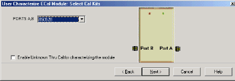 Provides a list of calibration kits
to perform the calibration. Select the Cal Kit you will use for each port.
Enable Unknown Thru for characterizing the module Check to enable. This
reduces the number of steps required to characterize the THRU standard.  This
setting is available only on VNA models with [one reference receiver per test
port](../Support/Configurations.htm).  Next Click to continue to the Select
Cal Set dialog box.  
  
Select Cal Set dialog box help  
---  
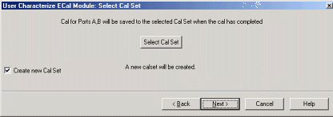 The calibration that you perform
will be written to a Cal Set. This dialog box allows you to select a Cal Set
to overwrite, or to write to a new Cal Set. The current choice is visible
below the Select Cal Set button. Select Cal Set Click to open the Select A Cal
Set dialog box. Create new Cal Set Check to create a new Cal Set to store the
calibration. Clear to select and overwrite a stored Cal Set. Next Click to
continue to the Guided Calibration Steps dialog box. Note: Remember the Cal
Set name for future reference.  
  
Guided Calibration Steps dialog box help  
---  
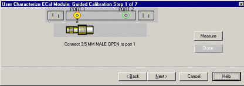 Instructs you to connect each
calibration standard to the measurement port. Measure Click to measure the
standard. Back Click to repeat one or more calibration steps. Done Click after
a standard is re-measured and all measurements for the calibration are
complete. Next Click to continue to the next calibration step. (Does not
measure the standard.) Cancel Exits Calibration Wizard. The Specify nominal
delay or Guided Calibration completed dialog box appears when the steps are
completed.  
  
Specify nominal delay dialog box help  
---  
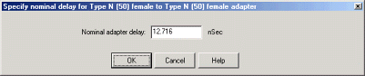 This dialog ONLY appears when
[Adapter Removal](Calibration_THRU_Methods.md#AdapterRemoval) or [Unknown
Thru](Calibration_THRU_Methods.htm#UnknownThru) calibrations are performed.
The following values were estimated from the measurement. Most of the time,
they are adequate. However, for CW sweep or frequency sweep with large step
sizes, the accuracy of the values may be improved. Nominal adapter delay To
improve this value, measure and record the delay of the adapter with a dense
step size. Enter that value here. Nominal phase offset (Waveguide ONLY). To
improve this value, measure and record the phase offset of the Waveguide
adapter with dense step size. Enter that value here. When one connector is
coax and the other connector is waveguide, the phase offset has an ambiguity
of 180 degrees. For consistency, the estimate provided here is always between
0 and 180 degrees. You can change this estimate to any value between -180
degrees and +180 degrees.  
  
Guided Calibration completed dialog box help  
---  
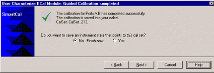 Allows you to finish the calibration
and continue to the next characterization steps. No. Finish now Select to save
Cal Set data. Yes Allows selection of Save options. Next Click to continue to
the Exit to Inspect Quality of Calibration dialog box.  
  
Exit to Inspect Quality of Calibration dialog box help  
---  
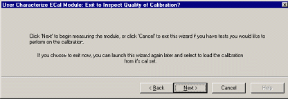 Allows you to exit User
Characterization to [validate the
calibration](Quest_Cal.htm#ECal_Confidence_Check_help) before proceeding with
the characterization. Back Allows you to repeat calibration. Next Click to
continue to the Characterization Steps dialog box. Cancel Exits the
Calibration.  To return to the current step:

  1. Start User Characterization.
  2. In the Select user number for new characterization dialog box, click Next.
  3. In the Select Connectors for Characterization dialog box, click Next. (Previous entry is stored in memory.)
  4. In the Calibrations to perform or recall dialog box, recall the Cal Set that you just performed.

  
  
Characterization Steps dialog box help  
---  
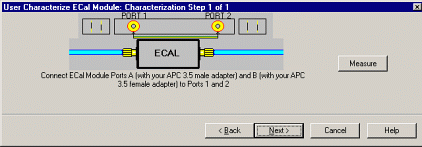 Describes the instructions for
each measurement required for characterization. Measure Measures the ECal
module. Next Click to continue to the Information for the New Characterization
dialog box when measurements are complete.  
  
Information for the New Characterization dialog box help  
---  
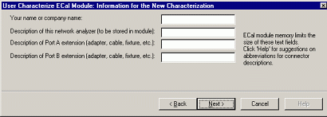 Allows you to describe the properties
of the User Characterization.

### Suggestions for connector abbreviations

To minimize the number of characters, we suggest using the following 3-character codes to describe the connectors listed. A User Characterization using connectors that are NOT included on this list can NOT be stored to the ECal module. But when stored to disk memory, ANY connector type is allowed. [Learn more about storing to Disk Memory](ECal_User_Characterization.md#UserToDiskBenefits). |  Connector Type |  3-Character Code  
---|---  
1.0 mm female |  10F  
1.0 mm male |  10M  
1.85 mm female |  18F  
1.85 mm male |  18M  
2.4 mm female |  24F  
2.4 mm male |  24M  
2.92 mm female |  29F  
2.92 mm male |  29M  
3.5 mm female |  35F  
3.5 mm male |  35M  
7-16 female |  16F  
7-16 male |  16M  
Type F female |  F7F  
Type F male |  F7M  
N50 female |  N5F  
N50 male |  N5M  
N75 female |  N7F  
N75 male |  N7M  
APC 7 |  7MM  
K-band waveguide |  KBW  
P-band waveguide |  PBW  
Q-band waveguide |  QBW  
R-band waveguide |  RBW  
U-band waveguide |  UBW  
V-band waveguide |  VBW  
W-band waveguide |  WBW  
X-band waveguide |  XBW  
  
Next Click to continue to the Write Characterized Data to the ECal module
dialog box.  
  
Write Characterized Data dialog box help  
---  
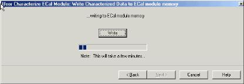 User Characterization and factory
characterization data is written to either the disk memory or the ECal module
memory. Write Click to write data. The Summary of new User Characterization
dialog box opens after data is saved to module.

  * Existing data will be overwritten is you selected a User Characterization number that already has data. [Learn more](ECal_User_Characterization.md#SelectUserNumber)
  * For more information, see Restore ECal module memory.
  * The ECal Data Wipe Utility is the only way that data can be deleted from the module. 

  
  
Summary of new User Characterization dialog box help  
---  
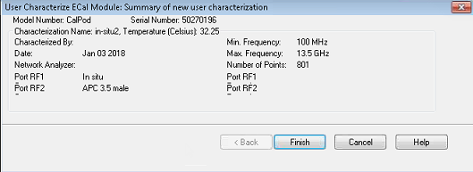 Verify the status of the ECal User
Characterization.

  * ECal module model number
  * summary from User Characterization

Cancel Click to exit (characterization complete). Finish Click to exit
(characterization complete).  
  
Manage ECal User Characterizations in Disk Memory

Normally, User Characterizations that are stored in disk memory can be used
indefinitely without needing them to be managed. However, this dialog allows
you to backup the characterizations in case they are accidentally erased, or
to save them to a file that can be moved to another analyzer.

How to Manage ECal User Characterizations in Disk Memory  
---  
Using Hardkey/SoftTab/Softkey  
  
  1. Press Cal > Cal Sets & Cal Kits > ECal > Manage ECal Disk Memory....

  
  
  
Manage ECal User Characterizations in Disk Memory dialog box help  
---  
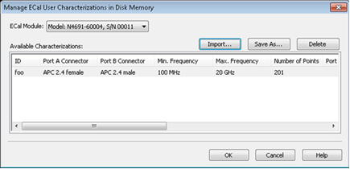
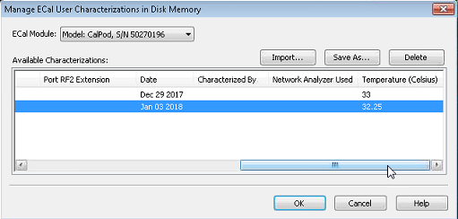 This dialog allows you to do
either of the following:

  * Save an existing User Characterization in disk memory to an *.euc file.
  * Load a previously saved *.euc file for use on the analyzer with the specified ECal module.

[Learn more about User Characterizations stored to Disk
Memory.](ECal_User_Characterization.htm#UserToDiskBenefits) ECal Module Select
an ECal Module from the list for which User Characterizations are currently
stored in disk memory. Save As Saves a User Characterization that is currently
in disk memory to a *.euc file. This file can be used as a backup in case the
archive file is accidentally deleted, or allows you to move the file to
another analyzer to be used with the selected ECal Module. Import Loads a
previously saved *.euc file for use on the analyzer with the specified ECal
module. Delete Removes a User Characterization from disk memory. Note: If a
temperature is shown in the Temperature column, then the temperature during
characterization was measured and recorded. For VNA ports on which a
CalPodAsECal user characterization is used during a calibration, the cal error
terms for those ports in the CalSet will have been computed with compensation
for temperature at the time of calibration if the following two conditions are
true: 1) The user characterization must show a temperature value in the
Temperature column in this dialog box, and 2) the CalPod must be a Thermal or
TVAC CalPod whose factory temperature data has been installed on the VNA by
the installer package that was provided with the CalPod.  
  
Restore ECal Module Memory

When user-characterized data is written to the ECal module, the entire
contents of ECal memory is also written to the disk memory, including the
factory ECal data. In the unlikely event that your ECal module memory is lost,
you can restore all ECal data to ECal memory.

Caution: If a new factory cal was performed after the ECal memory was written
to disk memory, the new factory cal data will also be overwritten.

Note: An ECal Data Wipe Utility destroys all user data per US DoD 5220.22-M.

How to Restore ECal Module Memory  
---  
Using Hardkey/SoftTab/Softkey  
  
  1. Press Cal > Cal Sets & Cal Kits > ECal > Restore ECal Memory....

  
No Programming commands are available for this feature.  
  
Module to be restored dialog box help  
---  
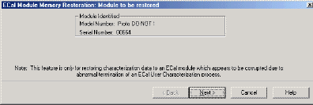 Verify the serial number of the
module to be restored. If two modules are connected, choose the one to have
data restored. Next  Click to write data to the module.  
  
* * *

