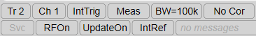
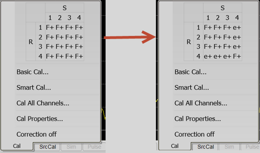

# Error Correction and Interpolation

* * *

Error Correction and Interpolation settings work together to provide you with
the highest level of calibration accuracy possible.

  * [How to set Error Correction](Error_Correction_and_Interpolation.md#How)

  * Error Correction

  * [Viewing Correction Levels](Error_Correction_and_Interpolation.md#Viewing)

  * [How to set Interpolation](Error_Correction_and_Interpolation.md#How)

  * [Interpolation Accuracy](Error_Correction_and_Interpolation.md#InterpolationAccuracy)

[See other Calibration Topics](Calibration.md)

#### How to set Error Correction  
  
---  
Using Hardkey/SoftTab/Softkey  
  
  1. Press Cal > Main > Correction > Channel Correction On|Channel Correction Off.

  
  
  
Error Correction

The Error Correction ON setting means that the calibration error terms are
applied to the measurement. Error Correction is automatically turned ON when a
calibration is performed or if a Cal Set is applied to a measurement. The VNA
attempts to turn error correction ON for ALL of the measurements on the active
channel. This may not always be possible when applying Cal Sets. For more
information, see [Applying Cal Sets](Cal_Sets.md#ApplyingCalSet).

When full 2-port error correction is ON, both forward and reverse sweeps are
required to gather all 12 error terms, even if only one reflection measurement
is displayed. This may result in a higher measurement speed than expected.
[Learn more.](../S2_Opt/Fast_Swp.md#cal)

You can always turn Error Correction OFF for the active measurement by
clicking Correction OFF. The VNA will turn Error Correction OFF automatically
when making stimulus changes [under some
conditions](Error_Correction_and_Interpolation.htm#nocor). To turn correction
back ON, click Correction ON. Then:

  * If Interpolation can NOT be performed, a dialog box will ask if you would like to [change the stimulus settings](Cal_Sets.md#Differences) to those of the applied calibration. Click OK or Cancel.

  * If Interpolation can be performed, the stimulus setting will change and correction turned ON.

#### How to set Factory Error Correction  
  
---  
Using Hardkey/SoftTab/Softkey  
  
  1. Press Cal > Main > Factory Cal On | Off

  
  
  
## Factory Calibration

The factory calibration is a calibration which is done at the factory shipment
or service centers for periodical calibration.

Viewing Correction Level

The correction level provides information about the accuracy of the active
measurement. Correction level notation is displayed on the status bar for
different calibration types like response, full 2-port, TRL, or power
calibration.

### To View Correction Levels:

Right-click in the display, select Customize Display, select Toolbars tab,
then select Status Bar. The status bar appears and displays the following
items:

Correction Level | Accuracy  
---|---  
C N-Port | Full N Port | Highest  
C Enh Resp | Enhanced Response |   
C Resp | Response  
Factory | Factory calibration at test port  
No Cor | No Correction | Lowest  
C* | Interpolated | Uncertain  
CD | Changed | Uncertain  
  
### C N-Port

Full N Port correction, where **_N_** is the number of fully calibrated ports.

This correction is applied to SParameters.

If the calibration was performed with a receiver power cal, this correction
can be applied to receiver measurements. (eg: a1, b1, A, R1, b1/a1). (See
[Correction Methods](Guided_Power_Calibration.md#MatchingDialog) for the
ability to control the level of calibration applied to receiver measurements).

### C Enh Resp

Enhanced response cal is an aggregate of a 1 Port calibration and a
transmission response cal.

This correction is applied to reflection and transmission parameters in either
the forward direction (S11, S21) or the reverse direction (S12, S22) depending
on how the calibration was performed.

For reflection measurements, Enhanced Response correction is equivalent to C
1-Port correction. For transmission measurements, the correction is equivalent
to a match-corrected transmission response cal.

### C Resp

Response calibrations are one term calibrations that correct for the frequency
response of the measurement. It does not correct for impedance mismatches.

### No Corr No Correction

The following will cause the VNA to turn Error Correction OFF for the channel:

  * Decrease the start frequency

  * Increase the stop frequency

  * Change start frequency, stop frequency, or number of points with Interpolation OFF.

  * [Change sweep type](../S1_Settings/Sweep.md#SweepTypeDiag)

The correction pop up pane, accessed by right-clicking on the Correction item
in the status bar, indicates port by port correction methods for a VNA with 12
or less test ports. This table is updated when the [port subset
correction](Guided_Power_Calibration.htm#MatchingDialog) is turned on to
reflect the correction methods being applied. In the image below, the pane
indicates a full 4-port calibration. On the **right** , the table indicates
the methods after the correction was devolved to ports 1, 2, and 3.

The F+ indicates that the port had the full error correction applied. The e+
indicates that the enhanced response correction method was applied to the
port.

Note: For more information about port sub-setting, refer to [Port Sub-Setting
Examples](Port_Sub-Setting.htm).

### C* Interpolated Correction

"C star" appears in the status bar when a measurement is being interpolated.
See Interpolation (above) and Interpolation Accuracy.

### CD Changed Settings

"C-delta" appears in the status bar when one or more of the following stimulus
settings change.

  * [Sweep Time](../S1_Settings/Sweep.md#sweepTimeDiag)

  * [IF Bandwidth](../S2_Opt/Trce_Noise.md#IFDiag)

  * [Stepped Sweep enabled/disabled](../S1_Settings/Sweep.md#Stepped)

  * [Attenuator Settings](../S1_Settings/Power_Level.md)

The calibration is uncertain when the attenuator setting has changed. On the
other hand, the other settings, such as sweep time or IF Bandwidth, do not
invalidate the calibration.

If lowering IF bandwidths below the calibration's IF bandwidth, any trace
noise present in the calibrated data due to the wider IF bandwidth will
persist.

#### How to set Interpolation  
  
---  
Using Hardkey/SoftTab/Softkey  
  
  1. Press Cal > Main > Interpolation ON|OFF.

  
  
  
Interpolation

Calibration interpolation adjusts calibration error terms to match changes to
the following settings that you make AFTER a calibration is performed or a
[Cal Set applied.](Cal_Sets.md#ApplyingCalSet)

The Interpolation ON setting means that interpolation is enabled for the
active measurement. This does not necessarily mean that the measurement is
interpolated. When enabled (ON), if interpolation becomes necessary because
you change any of the following stimulus settings, then interpolation will be
applied. When stimulus settings change while interpolation is OFF,
interpolation is NOT applied but instead, error correction is turned OFF.

Interpolation occurs (if enabled) when you change any of the following
settings:

  * Start frequency increased

  * Stop frequency decreased

  * Number of points

Note: Decreasing the start frequency, or increasing the stop frequency will
always turn correction OFF. (Exception: [Power
Calibration](PwrCalibration.htm#SourcePowerCal) DOES extrapolate to the start
and stop frequencies.)

## Interpolation Accuracy

When a measurement is interpolated, the accuracy of the measurements cannot be
predicted. It may be affected significantly or not at all. Identifying
measurement errors in these cases must be determined on a case-by-case basis.
In general, the magnitude and phase stimulus from the VNA and the response
from the DUT need to be smooth and continuous for measurement interpolation to
give accurate results.

Significant measurement inaccuracy WILL occur when the phase shift response
between measurement points increases changes more than 180 degrees. The VNA
will incorrectly interpolate the new phase data. For more information, see
[phase accuracy](../S2_Opt/Phase_Accy.md#space).

In general, the chances of significant inaccuracy increases when interpolating
measurements under the following conditions:

  * when frequency span between measurement points becomes much greater.

  * when measurement frequencies are above 10 GHz where phase changes happen more rapidly.

  * when interpolating across frequency band crossings. [Learn more about band crossings](../S1_Settings/Frequency_Range.md#BandCrossings).

Note: When the interpolation algorithm encounters an abrupt or large change in
the response magnitude or phase, such as can occur at band crossings, large
interpolation errors can be included in the displayed data. These errors can
be seen as steps or spikes. If this occurs, consider turning off
interpolation, changing the measurement parameters, or creating [sweep
segments](../S1_Settings/Sweep.htm#SegmentDiag) that skip over the band
crossings.

* * *

