# Measurement Errors

* * *

You can improve accuracy by knowing how errors occur and how to correct for
them. This topic discusses the sources of measurement error and how to monitor
error terms.

  * [Drift Errors](Errors.md#errdrift)

  * [Random Errors](Errors.md#errrand)

  * [Systematic Errors](Errors.md#errsys)

  *     * [3-Port Error Terms](Errors.md#3-Port)

    * 4-Port Error Terms

  * [Monitoring Error Terms](Errors.md#promouse)

[See other Calibration Topics](Calibration.md)

## Drift Errors

Drift errors are due to the instrument or test-system performance changing
after a calibration has been done.

Drift errors are primarily caused by thermal expansion characteristics of
interconnecting cables within the test set and conversion stability of the
microwave frequency converter and can be removed by re-calibrating.

The time frame over which a calibration remains accurate is dependent on the
rate of drift that the test system undergoes in your test environment.

Providing a stable ambient temperature usually minimizes drift. For more
information, see [Measurement Stability](../S2_Opt/Stable.md).

## Random Errors

Random errors are not predictable and cannot be removed through error
correction. However, there are things that can be done to minimize their
impact on measurement accuracy. The following explains the three main sources
of random errors.

### Instrument Noise Errors

Noise is unwanted electrical disturbances generated in the components of the
analyzer. These disturbances include:

  * Low level noise due to the broadband noise floor of the receiver.

  * High level noise or jitter of the trace data due to the noise floor and the phase noise of the LO source inside the test set.

You can reduce noise errors by doing one or more of the following:

  * Increase the [source power](../S1_Settings/Power_Level.md) to the device being measured - ONLY reduces low-level noise.

  * [Narrow the IF bandwidth](../S2_Opt/Trce_Noise.md#Variable_IF_Bandwidth).

  * Apply several measurement [sweep averages](../S2_Opt/Trce_Noise.md#averaging).

### Switch Repeatability Errors

Mechanical RF switches are used in the analyzer to switch the source
attenuator settings.

Sometimes when mechanical RF switches are activated, the contacts close
differently from when they were previously activated. When this occurs, it can
adversely affect the accuracy of a measurement.

You can reduce the effects of switch repeatability errors by avoiding
switching attenuator settings during a critical measurement.

### Connector Repeatability Errors

Connector wear causes changes in electrical performance. You can reduce
connector repeatability errors by practicing good connector care methods. See
[Connector Care](../Tutorials/Connector_Care.md).

Systematic Errors

Systematic errors are caused by imperfections in the analyzer and test setup.

  * They are repeatable (and therefore predictable), and are assumed to be time invariant.

  * They can be characterized during the calibration process and mathematically reduced during measurements.

  * They are never completely removed. There are always some residual errors due to limitations in the calibration process. The residual (after measurement calibration) systematic errors result from:

  *     * imperfections in the calibration standards

    * connector interface

    * interconnecting cables

    * instrumentation

Reflection measurements generate the following three systematic errors:

  * [Directivity](Errors.md#errdir)

  * [Source Match](Errors.md#errsrcmtch)

  * [Frequency Response Reflection Tracking](Errors.md#errfreqrefl)

Transmission measurements generate the following three systematic errors:

  * [Isolation](Errors.md#erriso)

  * [Load Match](Errors.md#errload)

  * [Frequency Response Transmission Tracking](Errors.md#errfreqtrns)

Notes about the following Systematic Error descriptions:

  * The figures for the following six systematic errors show the relevant hardware configured for a forward measurement. For reverse measurements, internal switching in the analyzer makes Port 2 the source and Port 1 the receiver. 'A' becomes the transmitted receiver, 'B' becomes the reflected receiver, and 'R2' becomes the reference receiver. These six systematic errors, times two directions, results in 12 systematic errors for a two port device.

  * For simplicity, it may be stated that ONE standard is used to determine each systematic error. In reality, ALL standards are used to determine ALL of the systematic errors.

  * The following describes an SOLT calibration. This does not apply to TRL or other types of calibration.

### Directivity Error

All network analyzers make reflection measurements using directional couplers
or bridges.

With an ideal coupler, only the reflected signal from the DUT appears at the
'A' receiver. In reality, a small amount of incident signal leaks through the
forward path of the coupler and into the 'A' receiver. This leakage path, and
any other path that allows energy to arrive at the 'A' receiver without
reflecting off the DUT, contributes to directivity error.

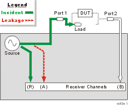

How the Analyzer Measures and Reduces Directivity Error.

  1. During calibration, a load standard is connected to Port 1. We assume no reflections from the [load](JavaScript:hhctrl.TextPopup\(Load,'Arial,8',10,10,00000000,0xc0ffff\)).

  2. The signal measured at the 'A' receiver results from the incident signal leakage through the coupler and other paths.

  3. Directivity error is mathematically removed from subsequent reflection measurements.

### Isolation Error

Ideally, only signal transmitted through the DUT is measured at the 'B'
receiver.

In reality, a small amount of signal leaks into the 'B' receiver through
various paths in the analyzer.

The signal leakage, also known as crosstalk, is isolation error which can be
characterized and reduced by the analyzer.

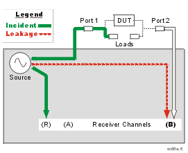

How the Analyzer Measures and Reduces Isolation Error

  1. During calibration, load standards are connected to both Port 1 and Port 2.

  2. The signal measured at the 'B' receiver is leakage through various paths in the analyzer.

  3. This isolation error is mathematically removed from subsequent transmission measurements.

### Source Match Error

Ideally in reflection measurements, all of the signal that is reflected off of
the DUT is measured at the 'A' receiver.

In reality, some of the signal reflects off the DUT, and multiple internal
reflections occur between the analyzer and the DUT. These reflections combine
with the incident signal and are measured at the 'A' receiver, but not at the
'R' receiver.

This measurement error is called source match error which can be characterized
and reduced by the analyzer.

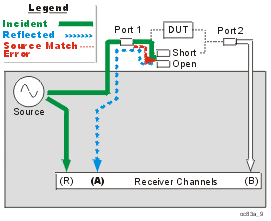

### How the Analyzer Measures and Reduces Source Match Error

  1. During calibration, all reflection standards are connected to Port 1. Known reflections from the standards are measured at the 'A' receiver.

  2. Complex math is used to calculate source match error.

  3. Source match error is mathematically removed from subsequent reflection and transmission measurements.

### Load Match Error

Ideally in transmission measurements, an incident signal is transmitted
through the DUT and is measured at the 'B' receiver.

In reality, some of the signal is reflected off of Port 2 and other components
and is not measured at the 'B' receiver.

This measurement error is called load match error which can be characterized
and reduced by the analyzer.

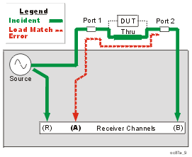

### How the Analyzer Measures and Reduces Load Match Error

  1. The Port 1 and Port 2 test connectors are mated together for a perfect zero-length thru connection. If this is not possible, a [characterized thru adapter](Calibration_THRU_Methods.md#Characterized) is inserted. This allows a known amount of incident signal at Port 2.

  2. The signal measured at the 'A' receiver is reflection signal off of Port 2

  3. The resulting load match error is mathematically removed from subsequent transmission and reflection measurements.

### Frequency Response Reflection Tracking Error

Reflection measurements are made by comparing signal at the 'A' receiver to
signal at the 'R1' receiver. This is called a ratio measurement or "A over R1"
(A/R1).

For ideal reflection measurements, the frequency response of the 'A' and 'R1'
receivers would be identical.

In reality, they are not, causing a frequency response reflection tracking
error. This is the vector sum of all test variations in which magnitude and
phase change as a function of frequency. This includes variations contributed
by:

  * signal-separation devices

  * test cables

  * adapters

  * variations between the reference and test signal paths

Frequency response reflection tracking error can be characterized and reduced
by the analyzer.

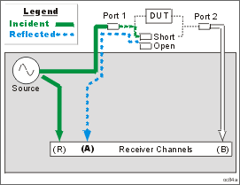

### How the Analyzer Measures and Reduces Frequency Response Reflection
Tracking Error.

  1. During calibration, all reflection standards are used to determine reflection tracking.

  2. The average 'A' receiver response is compared with the 'R1' receiver response.

  3. Complex math is used to calculate Frequency Response Reflection Tracking Error (see the following diagram). This frequency response reflection tracking error is mathematically removed from subsequent DUT measurements.

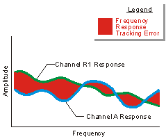

Note: In reflection response calibrations, only a single calibration standard
is measured (open or short) and thus only its contribution to the [error
correction](JavaScript:hhctrl.TextPopup\(Error_correction,'Arial,8',10,10,00000000,0xc0ffff\))
is used.

### Frequency Response Transmission Tracking Error

Transmission measurements are made by comparing signal at the 'B' receiver to
signal at the 'R1' receiver. This is called a ratio measurement or "B over R1"
(B/R1).

For ideal transmission measurements, the frequency response of the 'B' and
'R1' receivers would be identical.

In reality, they are not, causing a frequency response transmission tracking
error. This is the vector sum of all test variations in which magnitude and
phase change as a function of frequency. This includes variations contributed
by:

  1.      * signal-separation devices

     * test cables

     * adapters

     * variations between the reference and test signal paths

Frequency response transmission tracking error can be characterized and
reduced by the analyzer.

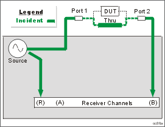

### How the Analyzer Measures and Reduces Frequency Response Transmission
Tracking Error.

  1. During calibration, the Port 1 and Port 2 test connectors are mated together for a perfect zero-length thru connection. If this is not possible, a [characterized thru adapter](Calibration_THRU_Methods.md#Characterized) is inserted. This allows a known amount of incident signal to reach Port 2.

  2. Measurements are made at the 'B' and 'R1' receivers.

  3. Complex math is used to calculate Frequency Response Transmission Tracking Error (see the following diagram). This frequency response transmission tracking error is mathematically removed from subsequent [DUT](JavaScript:hhctrl.TextPopup\(DUT,'Arial,8',10,10,00000000,0xc0ffff\)) measurements.

. 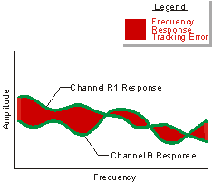

### 3-Port Error Terms

The following flow diagram displays the 3-port error term model:

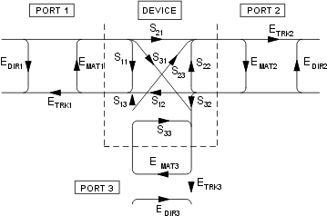

where:

E = error term

DIR = Directivity

MAT = Forward Source Match and Reverse Load Match

TRK = Forward Reflection Tracking and Reverse Transmission Tracking

### 4-Port error terms

A full 4-port calibration requires the following terms:

[Learn about the port numbering convention](Errors.md#PortNumber) for error
terms.

|  | Source Port  
---|---|---  
|  | 1 | 2 | 3 | 4  
R e c P o r t | 1 | DIR 1,1 RTRK 1,1 SRM 1,1 | LDM 1,2 TTRK 1,2 XTLK 1,2 | LDM 1,3 TTRK 1,3 XTLK 1,3 | LDM 1,4 TTRK 1,4 XTLK 1,4  
2 | LDM 2,1 TTRK 2,1 XTLK 2,1 | DIR 2,2 RTRK 2,2 SRM 2,2 | LDM 2,3 TTRK 2,3 XTLK 2,3 | LDM 2,4 TTRK 2,4 XTLK 2,4  
3 | LDM 3,1 TTRK 3,1 XTLK 3,1 | LDM 3,2 TTRK 3,2 XTLK 3,2 | DIR 3,3 RTRK 3,3 SRM 3,3 | LDM 3,4 TTRK 3,4 XTLK 3,4  
4 | LDM 4,1 TTRK 4,1 XTLK 4,1 | LDM 4,2 TTRK 4,2 XTLK 4,2 | LDM 4,3 TTRK 4,3 XTLK 4,3 | DIR 4,4 RTRK 4,4 SRM 4,4  
  
Reflection terms

  * DIR: Directivity

  * RTRK: Reflection Tracking

  * SRM: Source Match

Transmission terms

  * LDM:Load Match

  * TTRK: Transmission Tracking

  * XTLK: Cross Talk

### How can we measure only 3 THRU connections?

On a 4-port VNA, a full 4-port cal can be performed while measuring only 3
THRU connections. Measuring more than 3 THRU connections on a VNA with four
native ports can give higher accuracy under some conditions.

By measuring all of the reflection terms, and 3 transmission THRU connections,
there is adequate information available to calculate the remaining
transmission terms. The following is a high level explanation of the concept.
The actual calculations are much more complex.

To simplify, let's substitute letters (A,B,C,D) for port numbers from the
diagram above so that they can be combined without confusion. Also for
simplicity, let's assume that the source match and directivity errors are
zero.

| A | B | C | D  
---|---|---|---|---  
A | AA | AB | AC | AD  
B | BA | BB | BC | BD  
C | CA | CB | CC | CD  
D | DA | DB | DC | DD  
  
  * The reflection errors are all measured (AA, BB, CC, DD).

  * Lets assume we measure a THRU between ports AB, AC, AD. The reverse direction for these THRUs are also measured at the same time (BA, CA, DA).

  * The terms left to calculate are BC, CB, BD, DB, CD, DC.

The following shows how the BC term is calculated from BA and AC:

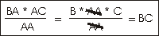

Similarly:

  * CB is calculated from CA and AB

  * BD is calculated from BA and AD

  * DB is calculated from AB and DA

  * CD is calculated from CA and AD

  * DC is calculated from DA and AC

Monitoring Error Terms using Cal Set Viewer

You can use Cal Set Viewer to monitor the measured data and the calculated
error term. This will help to determine the health of your VNA and the
accuracy of your measurements.

By printing or saving the error terms, you can periodically compare current
error terms with previously recorded error terms that have been generated by
the same VNA, measurement setup, and calibration kit. If previously generated
values are not available, refer to Typical Error Term Data in Appendix A,
"Error Terms", of the Service Guide.

Note: The service guide for your VNA is available at
<http://www.Keysight.com/find/pna>

  * A stable system should generate repeatable error terms over about six months.

  * A sudden shift in error terms over the same frequency range, power, and receiver settings, may indicate the need for troubleshooting system components. For information on troubleshooting error terms, see Appendix A , "Error Terms", of the Service Guide.

  * A subtle, long-term shift in error terms often reflects drift or connector and cable wear. The cure is often as simple as cleaning and gauging connectors or inspecting cables.

### Viewing Cal Set Data

  * Existing measurement traces are unaffected by the Cal Set Viewer.

  * The Cal Set data trace is presented in the highest unused channel number (usually 500) in the active window.

  * Only one Cal Set error term or standard data can be viewed at a time. However, a data trace can be stored into memory and then compared to other data traces.

[See the error terms equations](../Specs/u_curve_equations.md).

#### How to access Cal Set Viewer  
  
---  
Using Hardkey/SoftTab/Softkey  
  
  1. Press Cal > Cal Sets & Cal Kits > Cal Set Viewer ON|OFF

  
  
  
### How to use Cal Set Viewer

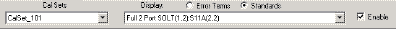

  1. Use the down arrow to select a Cal Set. Then click either:

  1.      * Error Terms \- calculated data.
     * Standards \- the raw measurement data of the Standard. 

  2. Use the down arrow to select an error term or standard to view.
  3. Select the Enable check box to view the data on the VNA screen.

Port numbering convention for error terms is the same as for S-Parameters: E
Term (Receiver, Source) with the following exceptions:

  * Load Match (2,1) - The match of port 2 which is measured by making an S11 measurement.
  * Load Match (1,2) - The match of port 1 which is measured by making an S22 measurement.
  * Transmission Tracking (2,1) - The port 2 receiver relative to the port 1 reference. (source=port 1).
  * Transmission Tracking (1,2) - The port 1 receiver relative to the port 2 reference. (source=port 2).
  * And so forth for multiport calibrations.

  
  
* * *

