# Fixture Simulator

* * *

This features allow you to mathematically add (embed) or remove (de-embed)
circuits to, or from, your measurements. The mathematical models are applied
to specific ports for all measurements on the channel.

New fixture simulator provides more flexible and intuitive GUI for multi-port
measurements. The multiple fixturing elements can be combined in any order,
creating infinite combinations.

Notes

  * The following features are available in [GCA](../Applications/Gain_Compression_Application.md), [GCX](../Applications/Gain_Compression_for_Converters.md), [Swept IMD](../Applications/Swept_IMD.md), [Swept IMDX](../Applications/Swept_IMDx.md), [Noise Figure](../Applications/Noise_Figure.md), [NFX](../Applications/Noise_Figure_on_Converters.md), [Diff IQ](../Applications/Differential_IQ.md), [Active Hot Parameters](../Applications/Active_Match.md), and [Spectrum Analyzer](../Applications/Spectrum_Analyzer.md) Apps:
  *     * [Port Extensions](Port_Extensions.md) (Not available in Swept IMD, IMDX, Noise Figure, NFX, or Diff IQ)
    * SnP file Embedding/De-embedding
    * Port Matching
    * Port Z Conversion
    * Power Compensation
  * All other Fixturing features are available ONLY in a [standard channel](../S1_Settings/Measurement_Classes.md#What).
  * SNP files can be used in many fixture features, including SNP file deembedding, ground loop embedding/de-embedding, port matching, and differential port matching. The contents of any SNP files used for fixturing are read and stored in memory when the file is selected. After selection, the file is not locked and contents may be changed. In order to pick up any updated content, it is necessary to re-apply the file through these means:

GUI: Re-select the file in the dialog. SCPI: Re-select the file and apply
updates: calc:fsim:draft:circ1:file "myFile.s2p" calc:fsim:apply Legacy SCPI:
Cycle the deembedding state for the feature using the file. For example:
calc:fsim:send:deem:stat OFF calc:fsim:send:deem:stat ON  
---  
  
### See Also

  * Procedures: To Embed or De-embed?

  * ["De-embedding and Embedding S-Parameter Networks Using a Vector Network Analyzer" App note.](http://literature.cdn.Keysight.com/litweb/pdf/5980-2784EN.pdf) for more conceptual information on Fixture Simulation.

  * See an example of how these functions can be used to de-embed unwanted effects of a test fixture, and then mathematically embed the DUT in the circuit in which it is used.

### Notes

  * The fixturing operations are applied to the measurement results.

  * In the [Data processing chain](../Programming/DataMapSet.md), the Fixture Simulator functions occur at the same time as the Apply Error Terms block.

  * When fixturing is enabled, all of the enabled fixturing features are applied when [snp files are saved](../S5_Output/SaveRecall.md#An *.s3p).

  * Source power compensation is then optionally applied to compensate for the aggregate loss through all enabled fixturing operations.

### How to select Fixturing Simulator

### About Fixturing ON/off

BOTH of the following must occur to turn a fixturing selection ON. EITHER ONE
will turn a fixturing selection OFF.

  1. Turn Apply Fixtures ON/off  
Port Extensions is NOT affected by Fixturing ON/off.

  2. Check Enable on the individual fixturing selection dialog box.

  
---  
Using Hardkey/SoftTab/Softkey  
  
  1. Press Cal > Fixtures > Apply Fixtures.

  
  
  
Fixture Generator dialog box help  
---  
You can configure your virtual fixtures on GUI. The calculation order is from
right to left. Note: The calculation order was from left to right for
A.14.70.01 to A.15.20.05. 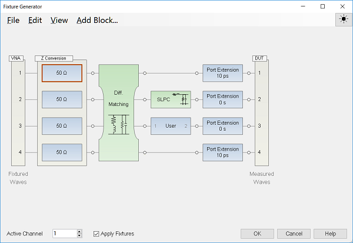
File: Save Topology... : Save the current setup into a topology setting file
(.topo). You can recall it by Load Topology. Save Topology as SnP... : Save
the whole embedding, de-embedding, and port extension blocks as a SNP file.
The portion of Port Z conversion is not included. The dimension N of the SNP
file will be the total number of VNA's test ports. This saved SNP file can be
used later in the Fixture Generator as a de-embedding block. Load Topology...
: Load the topology setting file (.topo). You can load the .totp file which
was saved with the VNA of equal or less number of test ports. Load Default
Topology: Reset the topology setting. Edit: Allow to
enable/edit/cut/copy/paste/delete/add for a block. Active Channel: Select the
channel to apply the fixture simulator. Apply Fixtures: Apply all fixture
blocks and all impedance transforms that are enabled. It does not affect port
extensions or balanced definitions Add Block... Opens the Add Block dialog to
add and define a new block. See the block types below. Right Click on each
block shows a pop-up menu. 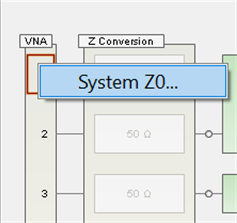

  * [System Z0...](../System/System_Impedance.md)

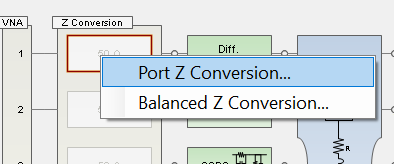

  * [Port Z Conversion...](../S1_Settings/Measurement_Parameters.md#Port_Z_Tab)
  * [Balanced Z Conversion...](../S1_Settings/Measurement_Parameters.md#Port_Z_Tab)

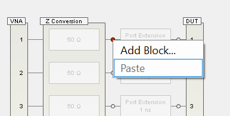
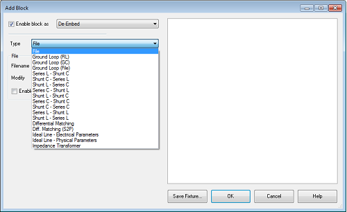

  * [SnP file](Fixture_Simulator.md#SnPEmbedDeembed)
  * [Ground Loop](Fixture_Simulator.md#GroundLoopDe-embeddingEmbedding)
  * [Port Matching](Fixture_Simulator.md#Matching)
  * [Differential Matching](Fixture_Simulator.md#DfffMatch)
  * Ideal Line
  * Impedance Transformer

#### Disable (Draft) State

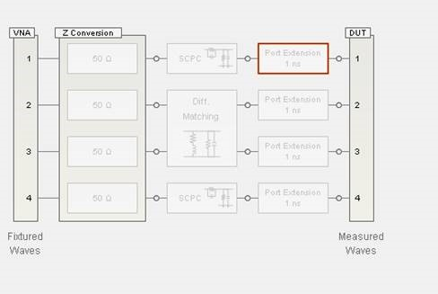

#### Enable (Active) State

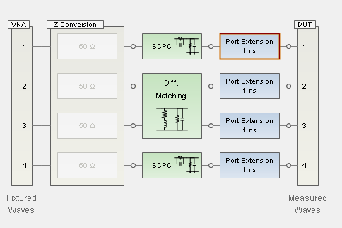 Blue: Embedded, Green: De-
embedded To change the ports on the fixturing device, you can drag and drop
the port numbers. The port numbers on the device are highlighted if they are
hovered on or selected: 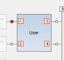
Then you can move them around:
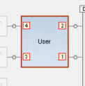  
  
SnP Embedding/De-embedding dialog box help  
---  
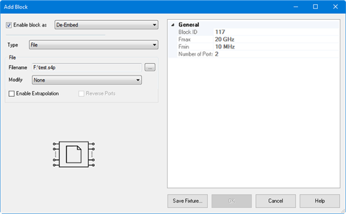 This function specifies a SnP file to embed
(add) or de-embed (remove) from the measurement results. Computation takes
place BEFORE Balanced conversion. The SnP file S-Parameter data is normalized
to a single File-Zo impedance as defined in the file. The VNA will re-
normalize the S-Parameter data from File-Zo to the VNA System-Zo. The VNA will
interpolate if the number of data points that are read is different from the
current VNA setting. Note: De-embedding a component with more than 20 dB of
loss becomes impractical because of an inability to accurately measure the
match of the DUT through such a device. The de-embedding operation recalls an
.s2p file (Touchstone format) which includes the electrical characteristics of
a 2-port fixture or device. The file can be in any standard format (real-
imaginary, magnitude-angle, dB-angle). Enable block as Check to apply the
settings to the measurement results. Must also enable Fixturing ON/off. De-
Embed/Embed Select the embed (adding the snp device virtually) or de-embedding
(removing the snp device). Note: Port Matching circuits can only be "embed".
File Name: Select the snp file for embeding or de-embeding Modify: If the
block has high loss, then it may cause transmission measurement errors when
full S-parameter correction is applied. The reason is that the DUT output
match cannot be measured accurately through a high-loss path; if the fixture
has a large mismatch then this error will cause errors in the transmission
measurement. Zeroing the fixture reflection at the DUT will reduce this error.
This problem is described in "Handbook of Microwave Component Measurements
with Advanced VNA Techniques", Joel Dunsmore, John Wiley & Sons, page 592 in
the First Edition and page 775 in the Second Edition.

  * None: does not modify the block.
  * Set Snn=0 @ DUT \- will set all reflection parameters on the DUT-side to zero.
    * For the 4-terminal fixture shown above, it will set S33=s44=0.
    * This is useful for fixtures that have low crosstalk between DUT-side ports.
  * Set Snn=XTalk=0 @ DUT \- will set all reflection and crosstalk parameters on the DUT-side to zero.
    * This selection is not available for a 2-terminal fixture.
    * For the 4-terminal fixture shown above, it will set S33=S44=S43=S34=0.
    * This is useful for multiport fixtures which have a lot of crosstalk between the DUT-side ports.

Enable Extrapolation Check to apply a simple extrapolation when the SnP file
has a narrower frequency range than the channel. The values for the first and
last data points are extended in either direction to cover the frequency range
of the measurement. The frequency ranges of the SnP file are displayed at the
right of the dialog. When extrapolation is necessary and enabled, a message is
displayed showing the frequency range to be extrapolated. When extrapolation
is necessary and disabled, a message is displayed offering to enable
extrapolation. Note: For DIQ application channels, the SnP file must cover all
specified frequency ranges, unless extrapolation is selected. Note: For IMD
and IMDX channels, you will be prompted for extrapolation as described above
if the S2P file does not meet the port frequency conditions. However, if the
file is valid, extrapolation will be enabled automatically. This is for
compatibility reasons with the IMD/IMDX calsets, which list all frequencies
for all ports. This applies only for the SnP section, NOT the ground loop
section. Ground loop is not for IMD/IMDX. General (Right side of Dialog box)
Block ID Block ID. This is the same number as the circuit number in SCPI. Fmax
show the maximum frequency of imported snp file Fmin show the minimum
frequency of imported snp file. Number of Port show the number of port of
imported snp file Reverse Ports Reverses the ports on an existing S2P file.

  * The data for S11 becomes the data for S22 and vice versa.
  * The data for S21 becomes the data for S12 and vice versa.

Save Fixture... Save the SnP file of the specified circuit. When the block is
defined as "Embed", the outputted SnP files is the inversed S-paramemter. When
you need normal SnP, put this circuit only in the Fixture Generator dialog box
and output SnP file by File > Save Topology As SnP.  
  
Ground Loop De-embedding / Embedding dialog box help  
---  
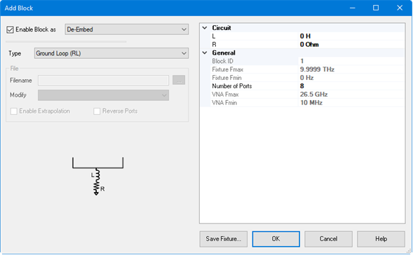 Ground loop de-embedding
removes the effect of a non-ideal ground connection between the DUT’s ground
and the analyzer's ground reference. Typically, the non-ideal component is the
parasitic inductance of the ground contacts. Ground loop embedding adds the
effect of a non-ideal component on the ground contacts. The Ground Loop De-
embedding / Embedding can be specified by circuit model type or touchstone
file. 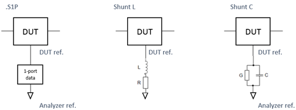 Enable block as Check to apply the
settings to the measurement results. Must also enable Fixturing ON/off. De-
Embed/Embed Select the embed (adding the snp device virtually) or de-embedding
(removing the snp device)

#### Ground Loop (RL) or (GC)

Circuit (Right side of Dialog box) Inductance(L), Resistance(R) /
Conductance(G),Capacitance (C)  Values for the specific components of the
circuit type that models your fixture. General (Right side of Dialog box)
Block ID Block ID. This is the same number as the circuit number in SCPI. Fmax
Fixed at 9.9999 THz Fmin Fixed at 0 Hz Number of Ports Define the number of
ports. Once the number of ports is set, it cannot be changed. VNA Fmax Maximum
frequency of the VNA. VNA Fmin Minimum frequency of the VNA.

#### Ground Loop (file)

Enable Extrapolation Check to apply a simple extrapolation when the SnP file
has a narrower frequency range than the channel. The values for the first and
last data points are extended in either direction to cover the frequency range
of the measurement. The frequency ranges of the SnP file are displayed at the
right of the dialog. When extrapolation is necessary and enabled, a message is
displayed showing the frequency range to be extrapolated. When extrapolation
is necessary and disabled, a message is displayed offering to enable
extrapolation. General (Right side of Dialog box) Block ID Block ID. This is
the same number as the circuit number in SCPI. Fmax show the maximum frequency
of imported snp file Fmin show the minimum frequency of imported snp file.
Number of Ports Define the number of ports. Once the number of ports is set,
it cannot be changed. Reverse Ports Reverses the ports on an existing S2P
file.

  * The data for S11 becomes the data for S22 and vice versa.
  * The data for S21 becomes the data for S12 and vice versa.

Save Fixture... Save the SnP file of the specified circuit. When the block is
defined as "Embed", the outputted SnP files is the inversed S-paramemter. When
you need normal SnP, put this circuit only in the Fixture Generator dialog box
and output SnP file by File > Save Topology As SnP.  
  
Port Matching dialog box help  
---  
This function specifies a circuit to embed (add) to the measurement results.
See Order of Fixture Operations.
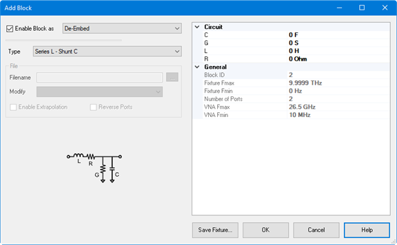 Enable block as Check to apply
the settings to the measurement results. Must also enable Fixturing ON/off.
De-Embed/Embed Select the embed (adding the snp device virtually). Type:
Choose a circuit model that best emulates your fixture at the selected VNA
port:The circuit diagram is shown in the dialog box. Circuit (Right side of
Dialog box) Capacitance (C), Inductance(L), Resistance(R), Conductance(G)
Values for the specific components of the circuit type that models your
fixture. General (Right side of Dialog box) Block ID Block ID. This is the
same number as the circuit number in SCPI. Fmax Fixed at 9.9999 THz Fmin Fixed
at 0 Hz Number of Ports Fixed at 2. VNA Fmax Maximum frequency of the VNA. VNA
Fmin Minimum frequency of the VNA. Note: A preference setting of "[Use legacy
behavior for Series-C & Shunt-L
fixtures](../System/Preferences.htm#PreferenceSeriesCShuntL) " is available
for backward compatibility. Save Fixture... Save the SnP file of the specified
circuit. When the block is defined as "Embed", the outputted SnP files is the
inversed S-paramemter. When you need normal SnP, put this circuit only in the
Fixture Generator dialog box and output SnP file by File > Save Topology As
SnP.  
  
Differential Port Matching dialog box help  
---  
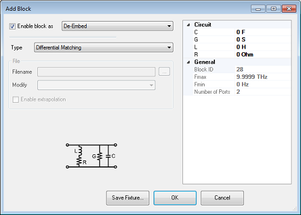 This function allows
the embedding/de-embedding of a differential matching circuit at a balanced
port. Enable block as Check to apply the settings to the measurement results.
Must also enable Fixturing ON/off. De-Embed/Embed Select the embed (adding the
snp device virtually) or de-embedding (removing the snp device)

  * Differential Matching Predefined circuit.

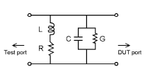 Circuit (Right side of Dialog box)
Define the values

  *     * C Capacitance value
    * G Conductance value
    * L Inductance value
    * R Resistance value
General (Right side of Dialog box) Block ID Block ID. This is the same number
as the circuit number in SCPI. Fmax Fixed at 9.9999 THz Fmin Fixed at 0 Hz
Number of Port Fixed at 2

  * VNA Fmax Maximum frequency of the VNA.
  * VNA Fmin Minimum frequency of the VNA.
  * Diff. Matching (s2p) Select an *.S2P file that represents the matching circuit. Then click Browse to navigate to the *.S2P file.

Note: For the *.S2P file:  
Port 1 of the circuit is assumed to be connected to the VNA  
Port 2 of the circuit is assumed to be connected to the DUT. Block ID Block
ID. This is the same number as the circuit number in SCPI. Fmax show the
maximum frequency of imported snp file Fmin show the minimum frequency of
imported snp file. Number of Ports Fixed at 2 VNA Fmax Maximum frequency of
the VNA. VNA Fmin Minimum frequency of the VNA. Save Fixture... Save the SnP
file of the specified circuit. When the block is defined as "Embed", the
outputted SnP files is the inversed S-paramemter. When you need normal SnP,
put this circuit only in the Fixture Generator dialog box and output SnP file
by File > Save Topology As SnP.  
  
Ideal Line dialog box help  
---  
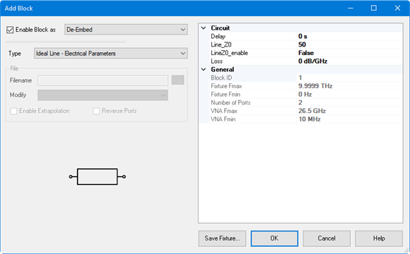 This function allows the
embedding/de-embedding of a ideal line. Enable block as Check to apply the
settings to the measurement results. Must also enable Fixturing ON/off. De-
Embed/Embed Select the embed (adding the snp device virtually) or de-embedding
(removing the snp device)

  * Electrical Parameter
  * Delay Delay in second
  * Line Z0 Line Characteristic Impedance
  * LineZO_enable Enable/Disable Line Z0
  * Loss Line Loss
  * Diff. Matching (s2p) Select an *.S2P file that represents the matching circuit. Then click Browse to navigate to the *.S2P file.
  * Length Length in meter
  * Line Z0 Line Characteristic Impedance
  * LineZO_enable Enable/Disable Line Z0
  * Loss Line Loss
  * Vel_Fact Velocity Factor

General (Right side of Dialog box) Block ID Block ID. This is the same number
as the circuit number in SCPI. Fmax Fixed at 9.9999 THz Fmin Fixed at 0 Hz
Number of Port Fixed at 2 VNA Fmax Maximum frequency of the VNA. VNA Fmin
Minimum frequency of the VNA. Save Fixture... Save the SnP file of the
specified circuit. When the block is defined as "Embed", the outputted SnP
files is the inversed S-paramemter. When you need normal SnP, put this circuit
only in the Fixture Generator dialog box and output SnP file by File > Save
Topology As SnP.  
  
Impedance Transformer dialog box help  
---  
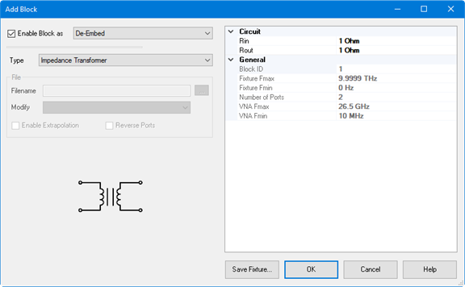 This function allows the
embedding/de-embedding of an impedance transformer. Enable block as Check to
apply the settings to the measurement results. Must also enable Fixturing
ON/off. De-Embed/Embed Select the embed (adding the snp device virtually) or
de-embedding (removing the snp device)

  * Circuit 
  * Rin, Rout Impedance for in and out

General (Right side of Dialog box) Block ID Block ID. This is the same number
as the circuit number in SCPI. Fmax Fixed at 9.9999 THz Fmin Fixed at 0 Hz
Number of Ports Fixed at 2 VNA Fmax Maximum frequency of the VNA. VNA Fmin
Minimum frequency of the VNA. Save Fixture... Save the SnP file of the
specified circuit. When the block is defined as "Embed", the outputted SnP
files is the inversed S-paramemter. When you need normal SnP, put this circuit
only in the Fixture Generator dialog box and output SnP file by File > Save
Topology As SnP.  
  
Power Compensation dialog help  
---  
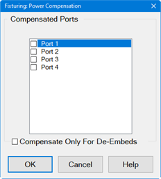 Note: This feature is
available in ALL [measurement
classes](../S1_Settings/Measurement_Classes.htm). This function adjusts the
source power at the specified port to compensate for the combined amount of
gain or loss through specific fixturing operations. Use this function to set
the power level at the DUT input. Power Compensation adjusts the source power
for the gain/loss through 2-port de-embedded fixture components.

  * It does not compensate for any port matching networks.
  *     * To work around this limitation, compute the anti-network of the matching circuit and use that data to generate an S2P file. Change the fixture type from port matching to De-embed. This should result in the same measurement data but will also enable the port power compensation feature.
  * It does not compensate for any fixture networks with more than 2 ports.
    * There is no work around for this limitation. There is a coarse adjustment for port power using Power Offsets. Calculate the loss through the fixture, use that number to set the power offset, and then set the desired power level at the port.

For example:

  * Your DUT requires a fixture on the input port which is connected to VNA port 1.
  * The fixture description (such as an S2P file at the [De-embed function](Fixture_Simulator.md#SnPEmbedDeembed)) indicates the fixture has approximately 2 dB of loss across the frequency span.
  * You set source power to 0 dBm. But you want 0 dBm at the DUT input (the fixture output).
  * Check Power Compensation on Port 1 and enable Fixturing.
  * Power Compensation causes the source power to be increased by approximately 2 dB so that the power at the fixture output plane will remain at 0 dBm.

Power Compensation affects all measurements in the channel. Enable Fixturing
to use Power Compensation. Compensate Only For De-Embeds \- If unchecked, the
entire fixture is used to compute the power compensation value (embed + de-
embed). If checked, then only the de-embed blocks are used to compute the
power compensation. Note: Use caution when applying power compensation. Always
test your setup without a DUT in place. If you are using S2P files,
[Recall](../S5_Output/SaveRecall.md#RecallingCTI) your S2P file into the VNA
so you can verify that the device your S2P file describes is what you intended
it to be. It is too easy to misalign data in S2P files if they are constructed
manually.  
  
Fixture Simulator Example

The following example shows a DUT and the matching circuit with which the DUT
will be used in its intended application. When the DUT is tested in a high-
volume manufacturing environment, multiple test fixtures are often required.
The most accurate way to test the DUT and ensure measurement consistency
between the different test fixtures is to use a simple, repeatable, test
fixture without the actual matching elements.

To get the desired performance data, the parasitic effects of the fixture must
first be removed (de-embedded) from the measured data. Then a perfect
"virtual" matching circuit must be simulated and added mathematically
(embedded) to the corrected, measured data. The result is an accurate display
of the DUT as though it was actually tested with a physical matching circuit,
but without the uncertainties of using real components.

Test Device and the circuit in which it will be used.  
---  
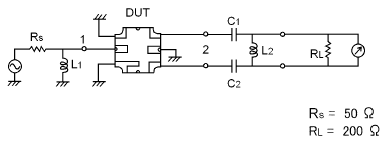  
  
Circuit Simulation  
---  
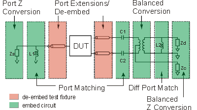  
  
This diagram does NOT refer to the order in which operations are performed.

  1. [Create a balanced measurement](../S1_Settings/Measurement_Parameters.md#NewTraceDiag) using single-ended to balanced (SE-Bal) [topology](../S1_Settings/Measurement_Parameters.md#topology). Include all relevant measurement settings (IFBW, number of points, and so forth). Once the measurement is created and calibrated, the measurement parameter can be easily changed. For example, Sdd22 to Sds21.

  2. Calibrate the measurement at the point where the simple test fixture is connected to the VNA. Use accurate calibration standards and definitions.

  3. Remove the effects of the three uncalibrated transmission lines of the simple test fixture. This can be done in several different methods. The easiest is to use manual or automatic [Port Extensions](Port_Extensions.md) to move the calibration reference plane to the DUT. This removes the electrical length and loss of the fixture’s transmission lines, but does not account for fixture mismatch. Another method is to de-embed previously-created *.S2p files of the 3 transmission lines. The files can be created using external ADS modeling software. Another alternative is to create the *.S2P files by independently measuring all 3 ports of the test fixture and [saving the results of each to an S2P file.](../S5_Output/SaveRecall.md#An *.s3p)

  4. With the test fixture connected to the VNA and a DUT inserted, the measurement results now appear as though calibration was performed at the connections to the DUT, and the device was measured in a 50-ohm single-ended test environment. The following steps will cause the results to reflect the performance of the device as though the device is embedded in the circuit in which it will be used.

  5. Port 1 of the device is a single-ended port and sees a source impedance the same as the VNA system impedance, so no change is required. However, if Rs were a value other than 50 ohms, Port 1 Impedance Conversion would be used to simulate the different impedance.

  6. Port Matching is used to simulate L1 inductance. Select any of the Shunt L circuits to embed (add) to the measurement results. Enter the value of L and R. The C and G values can be entered as 0 (zero).

  7. Port Matching is used to simulate C1 and C2 capacitance. For both port 2 and port 3, select any of the Series C circuits to embed (add) to the measurement results. Enter the value of C and G. The L and R values can be entered as 0 (zero).

  8. [Balanced Conversion](../S1_Settings/Balanced_Measurements.md) mathematically simulates the measurement in balanced mode.

  9. [Differential Port Matching](../S1_Settings/Measurement_Parameters.md#Port_Z_Tab) is used to simulate L2 inductance. Select Shunt L- Shunt C and enter the inductance / resistance value. The C and G values can be entered as 0 (zero).

  10. Finally, [Differential Z Conversion](../S1_Settings/Measurement_Parameters.md#Port_Z_Tab) is used to simulate a circuit termination of 200 ohms. If you are making Common Mode measurements, specify [Common Mode Z Conversion](../S1_Settings/Measurement_Parameters.md#Port_Z_Tab).

* * *

