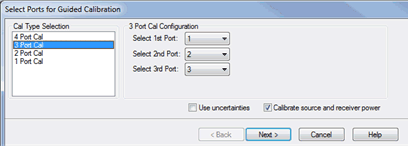
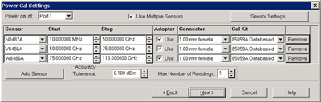
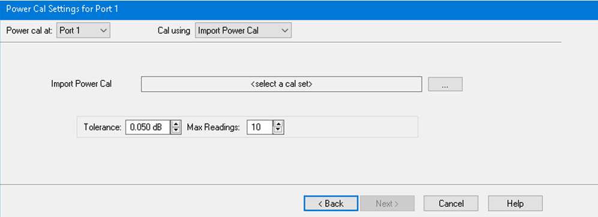
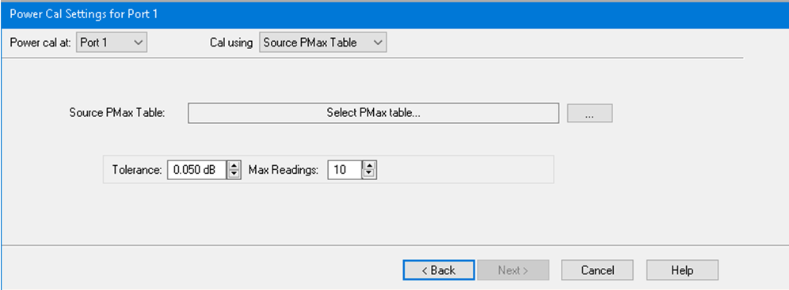
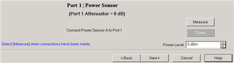
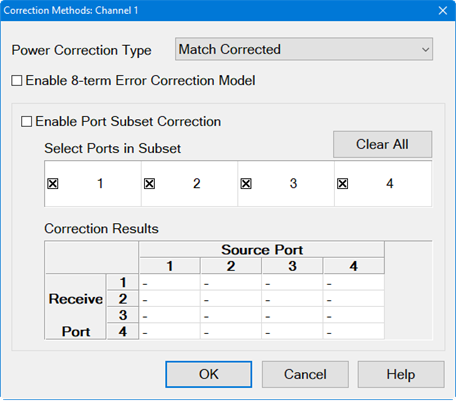
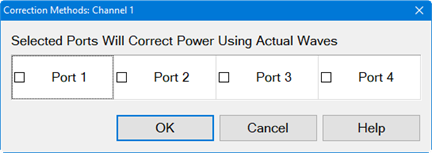
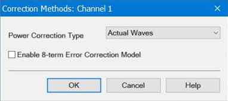
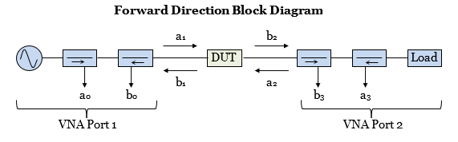

# Guided Power Calibration

* * *

Source and Receiver Power Calibration can be performed during a standard
S-parameter Guided Calibration. This power cal provides the following
enhancements over the standard source and receiver power calibration:

  * A source and receiver power cal can be performed for all PNA ports with a single power sensor connection.

  * [Multiple power sensors](Guided_Power_Calibration.md#MultipleSensors) can be used to cover wide frequency ranges.

  * The receivers are corrected automatically.

  * Optionally compensates for an adapter that may be used to connect the power sensor.

  * Provides [optional match-corrected power measurements](Guided_Power_Calibration.md#Matching).

  * Source and Receiver power correction is stored to the Cal Set along with S-parameter correction.

Note:  A Guided Power Calibration is not accurate when [Frequency Offset
Mode](../FreqOffset/Frequency_Offset_Mode.htm) is enabled.

Learn more about the standard [Source](PwrCalibration.md#Source) and
[Receiver](PwrCalibration.md#ReceiverPowerCal) Power Cals.

In this topic:

  * How to perform a Guided Power Cal
  * Power Cal Settings dialog box
  * Power Cal Settings - Use Multiple Sensors dialog box
  * Power Cal Settings - Import Power Cal dialog box
  * Power Cal Settings - Source PMax Table dialog box
  * Power Sensor Connection step dialog box
  * Correction Methods dialog box
    * [Port Subset Correction (Devolve Calibration)](Port_Subset_Correction.md) \- (separate topic)

#### How to perform a Guided Power Cal

  1. In a [Standard (S-parameter)](../S1_Settings/Measurement_Classes.md) channel, setup your measurements (sweep type, frequency range, IFBW, and so forth). A special version of this feature is available on mmWave SMC measurements. [Learn more](../IFAccess/External_Test_Head_Configuration.md#Mixer).
  2. Connect the Power Meter / Sensor the same as a standard Source Power Cal. [Learn more.](PwrCalibration.md#PerformSourcePowerCal)

  1.      * See [Supported Power Meters](javascript:BSSCPopup\('PwrCalibration.md#TestEquipmentRequired'\))
     * See [Important first-time USB connection note](../Front_Panel/XTour.md#FirstTimeNote).

  3. Start the Cal Wizard, then select Guided (Smart) Cal. [Learn how.](Calibration_Wizard.md)

  
---  
  
  
On the following Select Ports dialog, check Calibrate source and receiver
power, then click Next.

Two Cal Wizard pages later, complete the following dialog.

Power Cal Settings dialog box help  
---  
 Note: A Use Power Table checkbox
(not shown) is available when a mmWave SMC measurement is active. [Learn
more](../IFAccess/External_Test_Head_Configuration.htm#Mixer). Power Cal at:
Select the source port for which a Power Calibration will be performed. The
source and receiver correction will be transferred to all other sources and
receivers involved in the S-parameter measurements. Cal using Select the cal
method from the list below: **One Power Sensor** Default choice, use the
standard power meter. De-embed (power sensor) adapter When the power sensor
connector is NOT the same type and gender as the DUT connector for the
specified port, then for optimum accuracy, extra cal steps are required to
measure and correct for the adapter that is used to connect the power sensor
to the reference plane. Clear this box to NOT compensate for the added
adapter. Check this box to perform extra calibration steps to measure and
correct for the adapter. Then select the Power Sensor Connector type and
gender of the power sensor. "Ignored" does NOT compensate for the added
adapter, just as if the checkbox were cleared. When this connector matches the
DUT connector for the same port, then the PNA assumes that there is no
adapter. Extra cal steps are NOT required and the Cal Kit selection is not
available. Otherwise, select the Cal Kit to be used to calibrate at the
adapter.  **Multiple Sensors** Select this to use one or more power sensors
that are [configured as PMAR
devices](../System/Configure_a_Power_Meter_As_Receiver.htm). This dialog is
replaced with the Multiple Sensors dialog. See following image. **Import Power
Cal** Select this to import the power calibration error terms from an existing
calset that contains power calibration. Importing the power calibration allows
to skip the measurement of the power meter. This dialog is replaced with the
Import Power Cal dialog.  **Source PMax Table** Primarily used to calibrate
the source of the millimeter head when no sensor is available. This table is
referred to as a Source Pmax Table. It defines the head output power across
frequency for a given RF input power. This dialog is replaced with the Source
PMax Table dialog.  **Power Meter...** Click [Power Meter
Settings](PwrCalibration.htm#MeterSettings) to configure the power meter. See
Accuracy Settings below.  
  
Power Cal Settings - Use Multiple Sensors dialog box help  
---  
 |  Notes "Multiple sensors" are allowed ONLY on standard channels, SMC and [Cal All calibration](Calibrate_All_Channels.md). The power sensors that are used as "multiple sensors" MUST be configured [PMAR devices](../System/Configure_a_Power_Meter_As_Receiver.md).  
---  
  
Power Cal at: Select the source port for which a Power Calibration will be
performed. The source and receiver correction will be transferred to all other
sources and receivers involved in the S-parameter measurements.

Sensor Settings Click to start the Sensor Settings dialog, used to [ADD /
Configure an External
Device](../System/Configure_an_External_Device.htm#ExtDevConfig).

### Sensor Grid

Sensor Select the power sensor and the associated Start and Stop frequency
range.

Adapter When the power sensor connector is NOT the same type and gender as the
DUT connector for the specified port, then for optimum accuracy, extra cal
steps are required to measure and correct for the adapter that is used to
connect the power sensor to the reference plane.

Clear this box to NOT compensate for the added adapter.

Check this box to perform extra calibration steps to measure and correct for
the adapter. Then specify the Power Sensor Connector type and gender of the
power sensor. When this connector matches the DUT connector for the same port,
then extra cal steps are NOT required, and the Cal Kit selection is not
available. Otherwise, select the Cal Kit to be used to calibrate at the
adapter.

Remove Click to remove the power sensor from the list.

Add Sensor Click to add a new line, then click the down-arrow to select a
sensor. If a power sensor does NOT appear in the list, click the Sensor
Settings button to configure a power sensor.

### Accuracy

Tolerance When consecutive power sensor readings are within this value of each
other, then the reading is considered settled.

Max Readings Sets the maximum number of readings the power sensor will take to
achieve settling. Each power reading is "settled" when either:

  * Two consecutive readings are within this Tolerance value or

  * When the Max Number of Readings has been met.

The readings that were taken are averaged together to become the "settled"
reading.

Set Power For Best Accuracy Select to use the power level associated with the
best uncertainty for a specific power meter.  
  
  
  
Power Cal Settings -Import Power Cal dialog box help  
---  
 **Import Power
Cal** Use the** "..."** button to open the calset selection dialog, and import
the calset containing the power calibration.  The imported calset must contain
a Full + power calibration at the port specified by the** "Power cal at"**
pulldown list. The imported calset can contain different ports than the ones
currently being calibrated. If the stimulus frequencies are different,
interpolation is performed by default. Extrapolation is not allowed.  See
Accuracy Settings above..  
  
  
Power Cal Settings --Source PMax Table dialog box help  
---  
 **Select PMax
Table** Use the **"..."** button to open the PRN file that stores the power
table. File content requirements:

  * the file type is .prn
  * the first line of the file must indicate the RF input power to the head. Typically this is the power level that will drive the head into saturation.
  * The remainder of the file is a sequence of <frequency>,<power out> pairs.
  * Typically, this file is provided by the head manufacturer. 

See Accuracy Settings above..  
  
  
Power Sensor Connection step dialog box help  
---  
 Power Level Set the power
level at which the Source Power Cal is to be performed. It is usually best to
perform the Source Power Cal at 0 dBm because the power sensor is calibrated
at that level. If 0 dBm is not achievable for your measurement, then set to
the power level with the lowest level of measurement noise.  
  
## Correction Methods

#### Accessing Correction Methods  
  
---  
Using Hardkey/SoftTab/Softkey |  Using a mouse  
  
  1. Press Cal > Main > Correction Methods....

|

  1. Click Response.
  2. Select Cal.
  3. Select Correction Methods....

  
  
### Turn OFF Match Correction

During a Guided Power Cal, the match between the power sensor and the VNA
source port is measured. The source power correction array is compensated to
account for the measured mismatch. In addition, the reference receiver
measurement is also compensated to account for the mismatch of the DUT.

How to turn OFF match correction:

Click Cal > Main > Correction Methods.... then click on the Exclude all ports
button.

Correction Methods dialog box help |    
---|---  
 The following dialog
applies to the Spectrum Analyzer applications only.
 The following dialog
applies to the Modulation Distortion, Modulation Distortion Converters and
Intermodulation Distortion applications only. Note: Actual Wave and 8-term
error correction method in IMD/IMDX is a Licensed Feature. Learn more about
[Licensed Features](../Support/Software_Support.md).

### Power Wave Correction Type

Match Corrected \- These waves are calculated from the actual waves and the
S-parameters of the DUT to determine the waves if the VNA test ports were
perfectly matched. However, you may not want match correction in the following
cases:

  * When making non-traditional measurements, such as high-power or multiport configurations. Because of added components or reconfigurations, the mismatch measurement may not be valid.
  * When you have a remote program that already accounts for the match effects of the sensor.

Actual Waves \- These are the full error corrected actual waves at device
reference planes. Response Corrected \- These are raw measurements scaled with
the response terms and do not include any match correction. Selected Ports
Will Correct Power Using Actual Waves (Spectrum Analyzer applications only) -

  * Selected ports are corrected using both incident receiver and test receiver.
  * Waves on selected ports are corrected using the 8-term error correction model. See description below.

### 8-term Error Correction Model

Enable 8-term Error Correction Model \- Check to enable the 8-term error correction model for measurement calibration. Note: In trigger hold mode, acquired data may be inaccurate after transitioning from 10 to 8 term model. In this case, it is recommended to trigger a new sweep. The reverse transition (8 to 10 term model) is safe and does not require the new sweep. The VNA may correct S-Parameters by using either the 12-term or the 8-term error correction model. (The 12-term model is also known as the 10-Term model if the two crosstalk terms are ignored.) Changing the model will affect the S-Parameter and wave measurements. When measuring a DUT, the VNA will stimulate the DUT in the forward and reverse direction, measure the waves, then calculate the S-Parameters of the DUT. A 2-port VNA forward flow diagram is shown below and will be used to compare the two correction models.  For an 8-term model, the forward direction state will measure the waves (a0, b0, a3, b3) and will calculate the corrected waves (a1, b1, a2, b2) at the DUT test ports. For a 12-term model, the VNA will measure the waves (a0, b0, b3) and will calculate the corrected waves (a1, b1, a2, b2) at the DUT test ports. The 12-term model does not need to measure the a3 wave because its value is calculated from the b3 wave and the Port 2 load match characterized during calibration. The following table describes the tradeoffs between the 8-term and 12-term models: |  Model |  Advantages |  Disadvantages  
---|---|---  
12-Term |  Measures fewer waves so it may be faster and have lower noise. |  VNA load match changes after calibration will result in errors.  
8-Term |  VNA load match changes after calibration will not result in errors. |  Measures more waves so it may be slower and have higher noise.  
  
The VNA uses the 12-term model by default because it is fast, low noise, and
typically the VNA load match is very stable. However, there are several cases
where the 8-term model is a good choice:

  * Load Pull measurements vary the load match to determine its effect on the DUT's S-parameters. The 8-term error model is immune to these intentional changes in VNA load match.

  * High power test setups often include external couplers, preamps, and attenuators. During calibration the preamps and attenuators may be removed to avoid damaging the cal standards and to optimize signal levels. These components are reattached following calibration. If the components are removed and added on the VNA-side of the couplers, the 8-term model will correct for any changes.

  * A preamp may be added behind the couplers of one port to increase the output power. When that port is used as the load-side of the measurement, the load match presented by the output of the preamp may not be very stable over time. The 8-term error model will correct for this load match instability.

### Port subset correction

Enable Port Subset Correction \- Enabling port subset correction to reduce the
number of corrected ports.

Select Ports in Subset \- Selects which ports should be included in a full
N-port correction. Un-selected ports will be corrected on a “best effort”
basis: In other words, these ports will be corrected with an enhanced response
calibration if the error terms are available in the calset.

Clear All button - De-selects all ports from correction. The button will
change to Select All to include all ports for correction.

To learn more about Port subset correction, go to [Port Subset Correction
(Devolve Calibration)](Port_Subset_Correction.htm).

### Correction Results

Correction results are displayed in this table. This is the same table
displayed when the user right-clicks on the Cal pane of the status bar at the
bottom of the screen. The following indicate the correction applied:

F1 \- 1-port calibration.

eR \- Enhanced response.

Blank \- No correction applied.

F \- Multiport calibration.  
  
* * *

