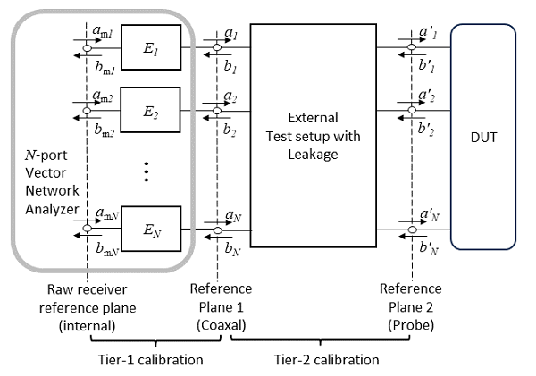
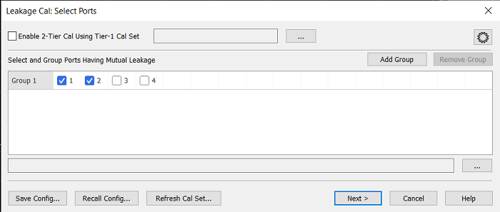
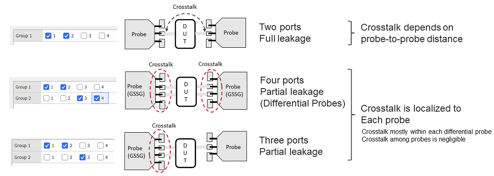
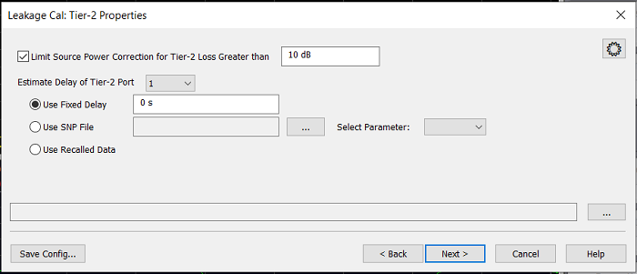
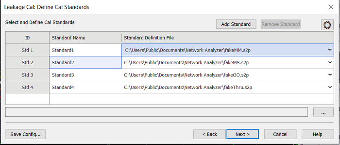
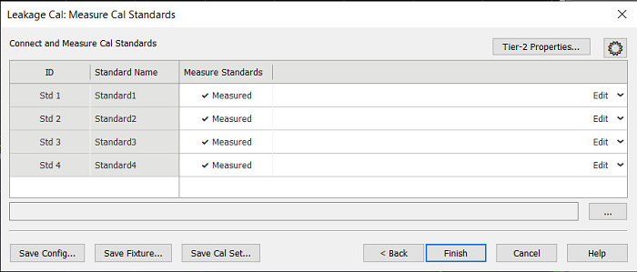

# Leakage Calibration (S9x008B)

## Overview

A Leakage Calibration will correct all crosstalk errors found in complex
configurations such as device probing solutions. In contrast, an Isolation
Calibration will only correct a small subset of the crosstalk errors.

#### How to execute the Leakage Calibration  
  
---  
Using Hardkey/SoftTab/Softkey |  Using a mouse  
  
  1. Press Cal > Other Cals > Leakage Cal...

|

  1. Click Response
  2. Select Cal
  3. Select Other Cals
  4. Select Leakage Cal...

  
  
  
Leakage Cal: Select Ports dialog box help  
---  
 Enable 2-Tier Cal Using Tier-1
Cal Set  
Selects whether the leakage calibration is single-tier (unselected) or two-
tier. The one-tier leakage calibration does not support power or switched gain
cals. A two-tier leakage calibration combines a second tier leakage cal with a
first tier Cal Set which may include power or switched gain cals. When
enabled, the user must select a first tier Cal Set by pressing the "..."
button to open the selection dialog. Select and Group Ports Having Mutual
Leakage  The ports to be calibrated are
organized in groups: each group defines a set of ports which have mutual
leakage; ports belonging to different groups do not have leakage among
them.Ports can be associated to a group by selecting the port in the group
row. Add Group \- Adds a new group row Remove Group \- Removes the last group
row Save Config  \- Saves all current settings to a configuration file.
Settings include the port selection, but also all other data like calibration
standard definitions and measurements. This is a convenient way to setup a
leaky calibration based on previous settings. For example, when you repeat the
same calibration on regular basis but you don't want to lose time re-
configuring the calibration each time. Recall Config  \- Recalls the
calibration settings from file; depending on the file content, the wizard will
move to the appropriate page. Refresh CalSet... \- This allows to recall the
calibration data (all settings, definitions and measurements) from an existing
calset that has a leakage cal. Then the user can re-perform the standard
measurements and save the new results. This feature may be used to repeat
selected measurements of a previous calibration. Using this feature, mistakes
made during the previous calibration, for example measuring the wrong cal
standard, can be quickly corrected  
  
Leakage Cal: Tier-2 Properties dialog box help  
---  
This dialog is available only when a two-tier calibration is selected. This
allows the user to specify the delay properties of the leakage error box.
\ Limit Source Power Correction
for Tier-2 Loss Greater than \- Enabling this feature will limit maximum
offset applied to the source power level for correcting the Tier-2 loss. This
prevents excessive power output in case the calibration is not accurate.
Estimate Delay of Tier-2 port \- Select the target port number. Use Fixed
Delay \- Enter a single value for the delay.  Use SNP file \- Select an SnP
file and specify which S-Parameter in the file will be used to determine the
delay. Use Recalled Data \- Use the delay data from the Cal Set being
refreshed. The rectangular area shows message. Clicking ... shows the message
history.  
  
Leakage Cal: Define Cal Standard dialog box help  
---  
This table is used to define the leakage calibration standards. For each
standard, the user must select the Standard Definition file and may assign a
custom name to each standard.
 To change the name, edit the
respective entry under the “Standard Name” column. To assign the definition
data, click on the pull-down menu under the “Standard Definition File” column:

  * Load File: loads the definition data as sNp file
  * Save File: saves the definition data to sNp file
  * Clear File: clears the definition data of the standard
  * Plot File: shows the file data as traces in the acquisition channel

Add Standard \- Adds a row in the table. Remove Standard \- Removes the last
row in the table.  
  
Leakage Cal: Measure Cal Standard dialog box help  
---  
This table allows the user to perform the measurements for a leakage
calibration. The results may be stored in a Cal Set or a fixture file.
 Connect and Measure Cal
Standards  
Each standard is measured by clicking on the respective entry in the “Measure
Standards” column. After the measurement, the entry is labeled as “Measured”.
The user can repeat the measurement by clicking a second time. Edit pulldown
menu

  * Load Measurement loads the measurement data from file (.sNp files)
  * Save Measurement saves the measurement data to file (.sNp files)
  * Clear Measurement clears the measurement data for the standard
  * Plot Measurement plots the measurement data as traces in the acquisition channel
  * Plot Definition Data plots the definition data as traces in the acquisition channel

Save Config \- Saves all current settings and data to a configuration file.
Save Fixture  \- If a two-tier calibration is enabled, then the user may save
the second tier correction data as an SnP file. Save Cal Set... \- Saves the
calibration results to user cal set  
  
* * *

Last modified:

28-5252-2025 |  New topic  
---|---  
  
* * *

