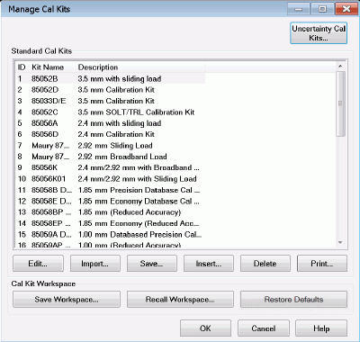
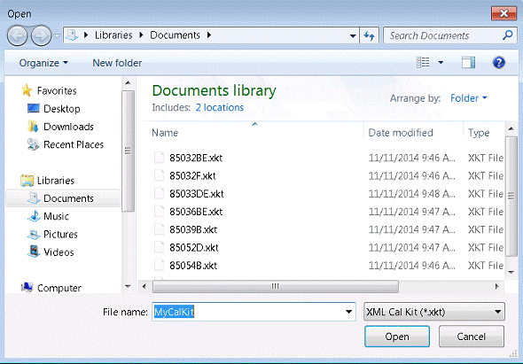

# Modify Calibration Kits

* * *

The following topics discuss Modifying Calibration Kits:

### In this Topic

  * [How to Modify Cal Kits](ModifyCalKits.md#HowtoMod)

  * [Manage Cal Kits dialog](ModifyCalKits.md#EditKitDiagHelp)

  * [Cal Kits and Firmware Upgrades](ModifyCalKits.md#FirmwareUpgrades)

  * [Import Kit dialog](ModifyCalKits.md#Import)

### Using VNA CalKit Editor

  * [Connectors Tab](Connectors_Tab.md)

  * [Standards Tab](Standards_Tab.md)

  * [SOLT Tab](SOLT_Tab.md)

  * [TRL Tab](TRL_Tab.md)

### Concepts

  * [Why Modify a Cal Kit](Why_Modify_a_Cal_KIt.md)

  * [VNA Cal Kit File Types](VNA_Cal_Kit_File_Types.md)

### Procedures

  * [How to Create a New Cal Kit from an Existing Cal Kit](How_to_Create_a_New_CalKit_from_an_Existing_CalKit.md)

  * [Creating Custom Calibration Kits using a New Connector Family](Creating_Custom_Calibration_Kits_using_a_New_Connector_Family.md)

  * [Noise Figure and TRL Cal](../Applications/Noise_Figure_and_TRL_Cal.md) (separate topic)

#### How to Modify Cal Kits

The series of dialog boxes that follow allow you to modify the standard
definitions or class assignments of calibration kit files.  
---  
Using Hardkey/SoftTab/Softkey |  Using a mouse  
  
  1. Press Cal > Cal Sets & Cal Kits > Cal Kit...

|

  1. Click Response
  2. Select Cal
  3. Select Cal Sets & Cal Kits
  4. Select Cal Kit...

  
  
  
Manage Cal Kits

Manage Cal Kits dialog box help  
---  
 The Manage Cal Kits dialog allows you to define the cal kits in the active workspace. These cal kits may be edited, created, or saved to a cal kit file. |  Cal Kits and Firmware Upgrades

  * If the firmware upgrade includes factory cal kits that are formatted differently than the factory cal kit files in the instrument, then:

  * The factory cal kit files will be overwritten.
  * The custom cal kit files will not be changed.
  * A backup of the active workspace will be saved.
  * A new active workspace will be created and will contain only the new factory cal kit definitions.
  * Under these conditions, if you want to use your custom cal kit definitions, you will need to import these files into the active workspace. Learn how to import cal kit files.

  
---  
  
### Uncertainty Cal Kits (Only for PNA)

Uncertainty Cal Kits... Opens the Uncertainty Cal Kit Manager (Option
S93015A/B enabled). [Learn more about Dynamic
Uncertainty](Dynamic_Uncertainty.htm).

### Standard Cal Kits

This group box lists all cal kits in the active workspace.

Edit... Starts the [Connectors tab](Connectors_Tab.md) of the Edit Kit dialog
box to modify selected calibration kit definitions.

Import... Starts the Import Kit dialog box to add a cal kit definition from a
file into the active workspace.

Save... Saves the selected calibration kit definition into a cal kit file
(using .xkt, .ckt, or .prn file type). See [VNA Cal Kit File
Types](VNA_Cal_Kit_File_Types.htm).

Insert... Starts a blank [Edit Kit dialog box](Connectors_Tab.md) to create a
new calibration kit.

Delete Deletes selected calibration kit from the active workspace.

Print... Prints the contents of the selected cal kit to a .prn file.

### Cal Kit Workspace

The active cal kit workspace is a collection of standard cal kits that are
accessible by the VNA for calibrations.

Save Workspace... Saves the active workspace to a workspace file (*.xkw or
*.wks).

Recall Workspace... Recalls a workspace file into the active workspace.

Restore Defaults Restores the active workspace and the factory cal kit files
(*.xkt) to their factory default definitions.

For more information see [Creating Custom Calibration Kits using a New
Connector
Family](Creating_Custom_Calibration_Kits_using_a_New_Connector_Family.htm).  
  
Import Cal Kit dialog box help  
---  
 Note: There is no limit to the number of
cal kits that can be imported. However, during an [Unguided
cal](Calibration_Wizard.htm#unguided), you can access ONLY mechanical cal kits
#1 through 95. Imports a cal kit file into the active cal kit workspace. Files
of type Select the file type of your Cal Kit. Learn more about [VNA Cal Kit
File Types](VNA_Cal_Kit_File_Types.htm) File name Navigate and select your cal
kit file name. Open Loads the selected file into the active cal kit workspace.
Note: See Cal Kits and Firmware Upgrades

### Importing Cal Kits from "legacy" network analyzers

Cal kit files from "legacy" network analyzers (such as the 8510 or 8753) may
not contain information that this VNA requires. Therefore, this VNA may modify
the cal kit name, description, standards, and class assignments. You may need
to correct these modifications after importing your legacy cal kit to meet
your specific requirements.

  * "Legacy" cal kit files are referenced to the VNA test port gender while modern cal kit files are referenced to the Device Under Test (DUT) connector gender. Therefore, when a legacy cal kit is imported, the genders of the standards in the legacy cal kit will be automatically reversed in the new cal kit.
  * Legacy cal kits do not contain connector definitions. If a coaxial legacy kit is imported, then male and female coax connector definitions will be added to the kit. If a waveguide legacy kit is imported, then a genderless waveguide connector definition will be added to the kit.

  
  
* * *

