# Multiline TRL Calibration

This topic describes the Keysight vector network analyzers (VNA)
implementation of the NIST Multiline Thru Reflect Line (TRL) calibration
algorithm. The Keysight implementation also supports a Multiline Thru Short
Delay (TSD) calibration algorithm. This topic describes how to set up and use
a calibration kit definition that will cause the VNA to do a Multiline TRL. It
also discusses the various options that can be specified and how they interact
with the standards as defined in Keysight calibration kits.

In this topic:

  * Multiline TRL
  * TRL Kit Classes
    * TRL THRU
    * TRL LINE/MATCH
    * TRL REFLECT
  * Calibration Standards
    * Relationship Between Delay and Physical Length
  * Calibration Reference Z0
    * Line Z0
    * Connector Z0
  * Testport Reference Plane
    * Legacy TRL
    * Multiline TRL
  * Multiline TRL Diagnostic Traces
  * Procedure to Define the Calibration Kit
  * References

## Multiline TRL

The Multiline TRL algorithm is based on the NIST Multiline TRL calibration
algorithm called MultiCal[1][2]. It provides an over-determined solution when
multiple _LINE_ standards are used. The TRL algorithm (Legacy TRL) that
existed prior to Multiline TRL being added is still available for use. If the
Multiline TRL check box is selected, then the Multiline TRL algorithm will be
used when the defined calibration kit is used for TRL calibration. The Legacy
TRL algorithm allowed multiple _LINE_ standards to be used, but for any given
frequency only one _LINE_ standard is used with the _THRU_ and _REFLECT_
standards.

The dialog shown below is the TRL tab that comes up when editing the class
definitions of the calibration kit. Its purpose is to define which standards
are to be used during the TRL calibration. Both Legacy TRL or Multline TRL
automatically use a Thru Reflect Match (TRM) calibration when the frequency is
below the lowest start frequency of the _LINE_ standards defined in the
calibration kit if there are _MATCH_ standards defined. The Multiline TSD
algorithm differs from the Multiline TRL in how the algorithm uses the _SHORT_
/_REFLECT_ standard. The _SHORT_ is assumed to be fully known and only
connected to one port while the _REFLECT_ only needs to be partially known but
has to be connected to both ports; the _LINE_ and _DELAY_ standards are
equivalent.

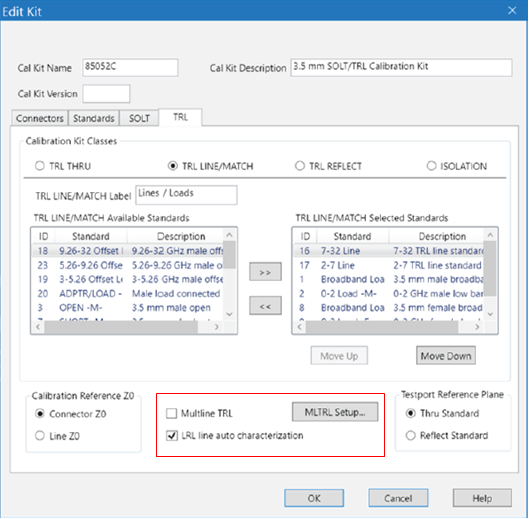

### TRL Kit Classes

For TRL there are four categories of standards called Calibration Kit Classes.
They are TRL THRU, TRL LINE/MATCH, TRL REFLECT and ISOLATION. The ISOLATION
kit class is optional.

#### TRL THRU

The TRL THRU kit class should be set up so that only a single standard is
defined for a given set of port connectors.

Note: Generally this means that for Multiline TRL calibrations there will only
be one standard defined in the TRL THRU kit class that is intended to be used
over the entire frequency range. Sometimes users define calibration kits to
cover multiple different port pairs; for example, if a calibration kit is
created to support an on-wafer TRL calibration the user might define different
ports that correspond to the topology of the set of probes that are used to
touch down on the standards. The kit may have multiple pairs of ports. Giving
each port a unique name allows the user to restrict which port pairs can be
automatically set up to do a TRL calibration. In this case, you would have
multiple THRU standards in the TRL THRU kit class. But only one of them would
be used for a given TRL calibration between a pair of testports. It should be
noted that the legacy TRL algorithm still may benefit from using multiple THRU
standards in order to provide the best phase margin over different frequency
ranges.

#### TRL LINE/MATCH

This actually represents two kit classes that share a similar purpose during
calibration. A _LINE_ standard needs to have a distinct response from the
_THRU_ standard. Typically the _LINE_ standard is chosen such that the phase
of 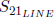 is different from the phase
response of 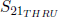 by at least 20 degrees.
This becomes prohibitive at low frequencies so _MATCH_ standards are used with
a TRM calibration at frequencies where it is impractical to create _LINE_
standards. Both the Legacy TRL and Multiline TRL calibrations use _MATCH_
standards and TRM calibration to cover the low frequency portion as needed. In
those cases, the calibration is actually a mix of TRM and TRL. The TRM portion
of the calibration is not over-determined when Multiline TRL is selected. A
fundamental assumption of the TRL algorithm is that the characteristic
impedance of the _THRU_ standard is the same as the characteristic impedance
of each of the _LINE_ standards. The match standard can be defined as an
idealized fixed load standard or it can be defined as a databased standard
which can be used to adjust for the actual reflection coefficient of the
standard. Both Legacy TRL and Multiline TRL assume the databased standards
have the same reflection coefficient applied to both ports.

Note: The NIST implementation does not permit having a calibration that mixes
both TRM and TRL.

#### TRL REFLECT

The TRL REFLECT kit class contains standards to be used by both the Legacy TRL
and Multiline TRL calibrations. When doing a TRL calibration there is a
fundamental assumption that the _REFLECT_ standard is the same on both ports.
It doesn’t have to be fully known, but should be approximately known to permit
the correct root selection during the calibration process. A single reflect
will be used, but most of the time multiple _REFLECT_ standards need to be
created one for each connector gender. The Multiline TRL algorithm has the
option to do a TSD calibration instead of TRL calibration. In that case, only
one reflect standard is required; but it has to be fully known. When doing a
TSD calibration, one then has the option of deciding which reflect standard to
be used. In general, the order of the calibration standards in a Calibration
Kit Class is significant as the calibration algorithms step through the
standards from top to bottom selecting standards until it accumulates enough
standards to satisfy all of the frequency requirements for each port. In the
case of TSD, the order of the _REFLECT_ standards is significant because as
the TSD portion of the algorithm steps through the standards listed in the TRL
REFLECT kit class it will use the first _REFLECT_ standard it finds that will
mate with either of the test ports. The user specifies which algorithm to use
Multiline TRL or Multiline TSD on a kit by kit basis by making the desired
selection in the Multiline TRL Setup dialog as shown below.

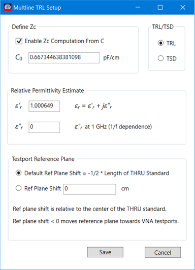

A databased standard can be used for the reflect standard. In general there is
no advantage to using a databased standard for Legacy TRL and Multiline TRL
calibrations since only an approximate value for the reflect is required.
There are a couple of instances where using a databased standard might provide
benefit. In the Legacy TRL when the Reflect Standard is used to define the
reference plane, the actual value of the reflect standard obtained from the
stamndard model is used to set the reference planes. In the Multiline TSD
calibration, the actual value of the standard model is also used to compute
the error terms.

### Calibration Standards

Legacy TRL and Multiline TRL do not support the use of databased standards for
THRU or LINE standards. Databased standards can be used for MATCH or REFLECT
standards.

#### Relationship Between Delay and Physical Length

The NIST MultiCal software defines the calibration standards using physical
lengths and relative permittivity. The Keysight implementation also defines
the same standards but uses an offset delay term to be consistent with
existing calibration standard definitions[3]. Traditionally, the offset delay
model used by both _THRU_ and _LINE_ standards has the offset defined by a
delay parameter.

Note:The delay specified for the standard offset is assumed to be equivalent
to the delay a TEM mode would face for a given physical length.

The Keysight Multiline TRL algorithm assumes the physical length is constant
and computes that value from the offset delay parameter defined in the
standard’s model. The physical length is obtained using the real part of the
relative permittivity estimate (see Multiline TRL Setup dialog above) and then
held constant even while the Multiline TRL algorithm adjusts the relative
permittivity during subsequent computations.

### Calibration Reference Z0

Both Legacy TRL and Multiline TRL algorithms assume the characteristic
impedance for the _THRU_ and _LINE_ standards is the same. The computations
optimize the error terms for the characteristic impedance of the standards.
There are multiple impedance terms that are used by both the Legacy TRL and
Multiline TRL algorithms. There is an additional impedance term
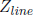 that is not defined in the calibration
kit but is computed by the TRL algorithms. It is inherently subject to the
assumptions that all of the THRU and LINE standards have the same
characteristic impedance. When Line Z0 is selected as the reference _Z_ 0
setting, the characteristic impedance of the measurement system after
calibration is simply .

For Legacy TRL, when Connector Z0 is selected an impedance transformation is
applied which assumes that the Offset _Z_ 0 of the LINE standard is equal to
 and the math to transform from Offset
_Z_ 0 of the LINE standard to _Z_ 0 of the Connector is applied. The following
summarizes the effect of settings on the impedance computations:

  * If the user selects Connector **Z0** for **Calibration Reference** _Z_ 0 then the following applies: 
    * If the user selects **Enable** _Z_ c **Computation From C** then  is computed from _C_ 0 and . 

    * If the user unchecks **Enable** _Z_ c **Computation From C** then  is set equal to Offset _Z_ 0 of the THRU standard. 

    * Regardless of whether **Enable** _Z_ c **Computation From C** is checked or unchecked there is an additional impedance transform from  to Connector _Z_ 0. 

  * If the user selects **Line Z0** for **Calibration Reference** _Z_ 0 then  is set equal to Offset _Z_ 0 of the THRU standard. There is no additional impedance transform from  to Connector _Z_ 0. 

#### Line Z0

If the user selects Line Z0 in the Calibration Reference Z0 section of the TRL
tab, the computed error terms are used without any additional impedance
transform. Additionally, when the user selects Line Z0, the Define Zc section
in the Multiline TRL Setup dialog is disabled.

#### Connector Z0

There is a slight difference in behavior between Legacy TRL and Multiline TRL
due to the additional Define Zc section in the Multiline TRL Setup dialog.

Legacy TRL uses the definition of Offset _Z_ 0 and Offset Loss specified in
the _LINE_ standard model. If this is not equal to the Connector Z0 specified
on the Connectors tab (shown below) an impedance transform is applied to the
error terms.

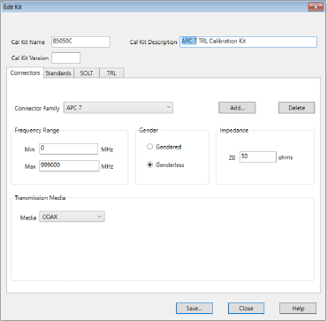

Multiline TRL uses the definition of Offset _Z_ 0 specified in the _THRU_
standard model. If **Enable Zc computation from C** is checked in the
Multiline TRL Setup dialog an additional impedance transform is done to
account for the low frequency dispersion specified by C0.

Note: There are papers published to explain details for determining the low
frequency dispersion from the characterization of the propagation constant and
an estimate of C0[4][5][6]. This also uses the characterization of the
relative permittivity which covers the full frequency range of the Multiline
TRL algorithm. The transmission line capacitance can also be characterized by
additional measurements[7]

If the Offset _Z_ 0 specified in the _THRU_ standard model is different from
the Connector Z0 specified on the Connectors tab the error terms are modified
by an impedance transform. A default value for C0 is computed assuming a
coaxial transmission structure using characteristic impedance specified by
Offset _Z_ 0 for the _THRU_ standard model. Inputting a negative value for C0
will cause the default value to be reinserted.

Note: There is also an interaction between er’ and C0. If C0 is equal to the
default value changes to er’ will update C0. If a user has specified a
different value for C0 no change to C0 will be made when changes to er’ are
made.

### Testport Reference Plane

The testport reference plane options differ between the Legacy TRL and
Multiline TRL options. The initial calibrations for both Legacy TRL and
Multiline TRL both assume the reference plane is in the middle of the _THRU_
standard. This becomes significant for the LRL case where the delay of the
_THRU_ standard is greater than zero.

#### Legacy TRL

Legacy TRL has the option to use either the _THRU_ standard or the _REFLECT_
standard to set the reference plane after calibration. If the _THRU_ standard
is selected the reference plane for each testport will be rotated towards the
VNA testport by half the delay of the _THRU_ standard. If LRL line auto
characterization is checked, the propagation constant computed during the TRL
calibration will be used to estimate the rotation based on the delays
specified by the _THRU_ and _LINE_ standards; otherwise, the modeled behavior
of the _THRU_ standard will be used.

#### Multiline TRL

When Multiline TRL is selected the ability to select LRL line auto
characterization is disabled because Multiline TRL only uses LRL line auto
characterization. The ability to select the _REFLECT_ standard to be used to
define the testport is not an option with Multiline TRL; however, there is an
additional option of defining an arbitrary reference plane. A negative number
input for the reference plane shifts the testport towards the VNA testports.

The default behavior is to shift the testport reference plane to the edge of
the _THRU_ standard like with behavior similar to the Legacy TRL behavior with
the testport reference plane set by the _THRU_ standard and having LRL line
auto characterization active.

### Multiline TRL Diagnostic Traces

The diagnostic traces are available in the Cal Set viewer. The trace also
shows the transition between the portion of the frequency range that did a TRM
calibration and the portion that did a Multiline TRL calibration.

Multline TRL has diagnostic traces that provide insight into the calibration
as shown below.

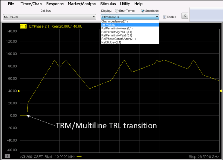

The traces are the same as traces provided by the NIST MultiCal software.
These traces can be accessed from the Cal Set Viewer under the Standards
group.

Note: The default format for viewing the traces is log magnitude. The
diagnostic traces make the most sense when viewed in real or imaginary format.
The indicated units for each diagnostic trace is simply a number (U); when
looking at the various diagnostic traces the screen doesn’t include units such
as degrees or ohms.

The included diagnostic traces are:

  * **CharImpedance**(Characteristic Impedance of line) is the estimate _Z_ 0 of the transmission media. A fundamental assumption of both the Legacy TRL algorithm and the Multline TRL algorithm is that the characteristic impedance of the _THRU_ and _LINE_ standards are the same. If **Enable Zc computation from C** is selected for the calibration kit, CharImpedance will include the effects of low frequency dispersion and transmission line loss; otherwise it will show the Offset _Z_ 0 term specified for the _THRU_ standard. 
  * **EffPhase**(Effective Phase Delay (best pair)) provides an estimate of the effective phase delay difference between the best pair of standards taken from the collection of the _THRU_ standard and all of the _LINE_ standard. Note it will not always be the _THRU_ standard with one of the _LINE_ standards; often it is based on the combination of two _LINE_ standards. Optimal phase difference is 90◦. 
  * **RelPermittivityMean**(Effective dielectric constant (mean)) is an estimate of the complex relative permittivity () given as 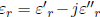 where 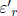 is the real part and 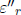 is the imaginary part. Strictly speaking, this is not the mean of each of the **RelPermittivityPair**(n); pairs of lines with the best effective phase delay have influence.
  * **RelPermittivityPair** _(n)_(Effective dielectric constant (_n_ th pair)) is an estimate of the complex relative permittivity () between the _THRU_ and multiple _LINE_ standards paired with the _THRU_ or _LINE_ standard that has the best effective phase difference with the rest of the _THRU_ and/or _LINE_ standards. These are the terms that are combined to give the estimate of **RelPermittivityMean**. The number of pairs is equal to the number of _LINE_ standards.
  * **RelPhaseConst &Atten **(Relative Phase Constant and Attenuation) provides information about the propagation constant given as 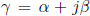 where  is the attenuation constant and  is the phase constant. The transmission through a line of length _l_ in cm is given as 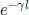. The data is normalized to frequency such that the real part of **RelPhaseConst &Atten** represents 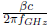 and the imaginary part of **RelPhaseConst &Atten** represents 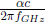 expressed in dB where _c_ is the speed of light in a vacuum and _f_ GHz is the frequency in GHz. 
  * RelStdDev (Standard Deviation) provides a relative standard deviation for the calibration process. It is related to uncertainty of the calibration process with lower numbers indicating lower uncertainty. It is a normalized value and is not a numeric representation of the uncertainty. More details are provided in the paper by DeGroot, Jargon and Marks[2].

The diagnostic traces only have a non-zero value in the frequency range where
the Multline TRL algorithm is used. The transition between TRM and Multiline
TRL is seen in the diagnostic trace above.

### Procedure to Define the Calibration Kit

The following steps are recommended when creating a new calibration kit to be
used with Multiport TRL calibrations.

  1. Determine the nominal effective relative permittivity. If using a substrate or PC board, this should account for both the effect of the substrate permittivity and air. This is the number that should be placed in the Relative Permittivity Estimate shown in the Multiline TRL Setup dialog. It will be used when estimating the Offset Delay of the calibration standards. All devices in the calibration kit are assumed to use the same relative permittivity estimate. 
  2. Define the connectors. It can be beneficial to define multiple connectors when the topology of the calibration kit is intended to have a particular standard be used only with a probe in a fixed location. In that case it could be beneficial to provide unique connector names to be associated with that probe. For example, you might end up with Probe A, Probe B, Probe C, etc. 
  3. Define the characteristic impedance of the connectors. This is the final system impedance desired after calibration. Generally, all of the connectors in the calibration kit would have the same characteristic impedance.

Note: This is not a fixed requirement when the calibration kit is used for
multiport calibrations (more than 2 testports); what is required is that all
connectors used to define the standards for a Multiline TRL calibration (or
Legacy TRL calibration) must have the same characteristic impedance. For
example, consider the case where TRL calibrations are intended between ports A
and B and between ports C and D. Assume Probe A is intended to be connected to
port A, Probe B to port B, Probe C to port C and Probe D to port D; the
characteristic impedance defined for Probe A must be the same as Probe B and
the characteristic impedance defined for Probe C must be the same as Probe D
but the characteristic impedance defined for Probe A can be different than the
characteristic impedance defined for Probe C.

  4. Avoid using meander lines or bent lines for standards intended to be used as either the _THRU_ standard or a _LINE_ standard. It is possible to include bent lines needed during a multiport calibration but the bent lines would be included in the UNKNOWN THRU kit class under the SOLT tab in the Edit kit dialog. The SOLT tab is next to the TRL tab.
  5. Measure the physical lengths of the standards in cm. This would include the standard to be used as a _THRU_. All of the _THRU_ and _LINE_ standards should be defined using the THRU standard model. Specify the parameters for each standard: 
     * Specify the Label and Description.
     * Select the connectors.
     * Specify the frequency range. The _THRU_ standard should be specified over the full frequency range of the calibration. The _LINE_ standards should have a minimum frequency selected to ensure a minimum phase difference from the _THRU_ standard of approximately 20 degrees. 
     * The offset delay should be computed using the real part of the relative permittivity estimate () that will be defined on the Multiline TRL Setup dialog. The delay in picoseconds (_psec_) for the _i_ th standard with length Li in cm is computed as 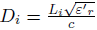 where 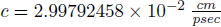.
     * The Offset _Z_ 0 should be the nominal characteristic impedance of the _THRU_ and _LINE_ standards. They should all be set to the same value. In many cases, it will be the same value as the characteristic impedance defined for the connectors. 
     * The offset loss can be specified. It is not critical to specify this accurately since the Multline TRL calibration will estimate the loss of the propagation independent of this estimate.
     * If the Delay is specified as 0 _psec_ it makes sense to check the Virtual Device box. This causes the calibration prompts to indicate connecting the testports directly to each other rather than including the device label and description. 
  6. Assign calibration kit class definitions by selecting the TRL tab.
     * A single _THRU_ standard should be selected. 

Note: In the case where multiple TRL sets of calibration standards are
defined, there should be a single _THRU_ standard for each set. Using the
previous example, there would be a _THRU_ defined with Probe A and Probe B
connectors and another _THRU_ defined with Probe C and Probe D connectors.

     * Multiple _LINE_ standards can be selected. 
     * If the frequency range of usage is lower than the lowest frequency for the _LINE_ standards add _MATCH_ standards. There should be a single _MATCH_ standard for each port connector. The model for each _MATCH_ standard should be the same. 
     * Add the _REFLECT_ standards. There should be a _REFLECT_ standard for each port connector. If the calibration kit is intended for Multiline TRL calibrations the _REFLECT_ standards should all have the same model. If the calibration kit is intended for Multiline TSD the _REFLECT_ standards do not have to have the same model. For Multiline TSD calibrations only the first standard listed that matches the connectors required during the calibration will be used. 

  7. Check the _Multiline TRL_ checkbox. 
  8. Specify the calibration reference Z0. Usually Connector _Z_ 0 is selected which includes the impedance transform between the Offset _Z_ 0 defined and the Connector _Z_ 0. It also includes the transform for _Z_ c defined in the Multiline TRL Setup dialog. 
  9. Press _MLTRL Setup..._ to open the Multiline TRL Setup dialog.
     * Define Zc. Check the Enable Zc Computation from C checkbox to account for low frequency dispersion. When setting up a calibration kit for waveguide, uncheck the Check the Enable Zc Computation from C checkbox since the cutoff frequency is used instead.
     * Specify _C_ 0. If defining a coaxial calibration kit, the default value is usually adequate. If the value has been modified, the default value can be automatically re-entered by inputting a negative number in the _C_ 0 field. Sometimes the value for C0 nees to be determined by an iterative process. There are papers published that explain details for determining the low frequency dispersion from the characterization of the propagation constant and an estimate of C0[4][5][6]. 
     * Make sure the values input for the relative permittivity estimate match the value used to estimate the offset delay for the _THRU_ and _LINE_ standards. 
     * Specify either TRL or TSD.
     * Specify the testport reference plane as desired.
  10. If doing an multiport calibration, add additional THRU standards with offset delays specified. These standards are usually loopback THRU standards or bent in order to connect ports that are not directly opposing each other. Add these standards to the UNKNOWN THRU kit class. 

## References

[1] | R. B. Marks, “A multiline method of network analyzer calibration,” _IEEE Transactions on Microwave Theory and Techniques_ , vol. 39, no. 7, pp. 1205–1215, 1991.   
---|---  
[2] | D. C. DeGroot, J. A. Jargon, and R. B. Marks, “Multiline TRL revealed,” in _60th_ ARFTG Conference Digest, Fall 2002., pp. 131–155.  
[3] | Keysight Technologies, _Specifying Calibration Standards and Kits for Keysight Vector Network Analyzers_ , Dec. 2019. [Online]. Available: https://www.keysight.com.   
[4] | D. F. Williams, U. Arz, and H. Grabinski, “Characteristic-impedance measurement error on lossy substrates,” _IEEE Microwave and Wireless Components Letters_ , vol. 11, no. 7, pp. 299–301, 2001\.   
[5] | R. B. Marks and D. F. Williams, “Characteristic impedance determination using propagation constant measurement,” _IEEE Microwave and Guided Wave Letters_ , vol. 1, no. 6, pp. 141–143, 1991\.   
[6] | D. F. Williams and R. B. Marks, “On-wafer impedance measurement on lossy substrates,” _IEEE Microwave and Guided Wave Letters_ , vol. 4, no. 6, pp. 175–176,  
1994\.  
[7] | “Transmission line capacitance measurement,” _IEEE Microwave and Guided_ Wave Letters, vol. 1, no. 9, pp. 243–245, 1991.

