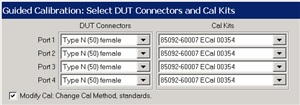
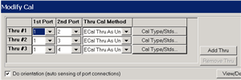

# Perform a 4-Port Cal with One 2-Port ECal Module

* * *

You can perform a 4-port calibration with a 2-Port ECal Module. When all four
DUT connectors are the same type and gender, the calibration can occur with
only four connections, the same number of connections you would make with a
4-port ECal module.

  * The ECal module must span the frequency range of the measurement.

  * The ECal module must have connectors that match the DUT connectors. Because we are using a 2-port ECal module, this means that the DUT must have only TWO unique connector types and gender. When the DUT has more than two connector types/genders, you can select a different cal kit for each port using SmartCal.

Important Note: DO NOT connect/disconnect USB devices during ECal
calibrations. Doing so may cause problems with the calibration.

### Procedure

  1. Connect the 2-port ECal module to a VNA USB port.

  2. Press Cal > Main > Other Cals > Smart Cal....

  3. Select 4 Port Cal, then click Next to see the following dialog:

  4. Select the DUT Connectors for each port. In this example, all four DUT connectors are Type N, female.

  5. Select the attached ECal module. We are using a 85092-60007 ECal module.

  6. Select Modify Cal (Show Advanced Settings for ECal) then click Next to see the following dialog:

  7. For the fewest number of physical connections, select the default port assignments.

     * The 1st Port selection for each port pair is 1.

     * For single-ended (standard) measurements, THREE is the minimum number of Thru connections. For Balanced measurements, FOUR Thru connections should be made. [Learn more](../S1_Settings/Balanced_Measurements.md#Calibrating).

     * For higher accuracy, select Add Thru. The Cal Wizard will add another port pair which results in more physical connections.

  8. Select ECal Thru as Unknown. This is the most accurate and easiest Thru Cal Method. [Learn more](Calibration_THRU_Methods.md#ECal).

  9. You may need to clear Do Orientation when calibrating at low power levels. [Learn more](Using_ECal.md#Advanced_Settings_ECal_help2). This will add additional connection steps.

  10. Follow the prompts to complete the calibration:

     1. Connect ECal to ports 1 and 2. Click Measure.

     2. Connect ECal to ports 1 and 3. Click Measure.

     3. Connect ECal to ports 1 and 4. Click Measure.

  11. At the Specify Delay dialogs, click OK. This is the measured delay for each of the Thru connections in the ECal module. [Learn more](Calibration_Wizard.md#Nominal).

  12. Click either Save As User Cal Set, or Finish.

* * *

