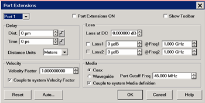
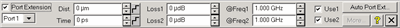
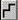
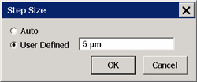
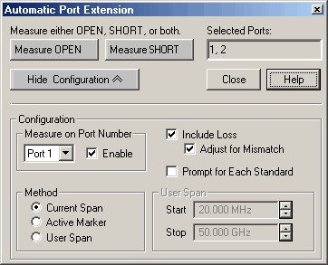

# Port Extensions

* * *

Port extensions allow you to electrically move the measurement reference plane
after you have performed a calibration.

Note: This feature is available in
[GCA](../Applications/Gain_Compression_Application.md),
[GCX](../Applications/Gain_Compression_for_Converters.md), [Spectrum
Analyzer](../Applications/Spectrum_Analyzer.htm), and standard (S-Parameter)
channels.

  * [Why and How to use Port Extensions](Port_Extensions.md#Why)

  * [Manual Port Extensions Procedure](Port_Extensions.md#Manual)

  * [Port Extensions dialog and Toolbar](Port_Extensions.md#PortDiag)

  * [Step Size dialog](Port_Extensions.md#StepSize)

  * [Automatic Port Extension dialog](Port_Extensions.md#AutoPortExtensions)

### See Also

[Data Flow Map](../Programming/Data_Access_Map.md)

Fixture Compensation features

[Phase Accuracy](../S2_Opt/Phase_Accy.md)

[Comparing the VNA Delay
Functions](../Tutorials/Comparing_the_PNA_Delay_Functions.htm)

[Other Calibration Topics](Calibration.md)

### Why use Port Extensions

  1. You are unable to perform a calibration directly at your device because it is in a test fixture. Perform a calibration at a convenient place, then use port extensions to compensate for the time delay (phase shift), and optionally the loss, caused by the fixture.

  2. You have already performed a calibration, and then decide that you need to add a length of transmission line in the measurement configuration. Use port extensions to "tell" the analyzer you have added the length to a specific port.

### Important Note: Port Extensions and VNA Data Flow

See [VNA Data Flow diagram](../Programming/DataMapSet.md) Normally, Port
Extensions are applied to individual S-parameters in the Phase Correction
process and only applies to displayed S-parameters. However, when Fixturing is
ON or when making a [Balanced
Measurement](../S1_Settings/Balanced_Measurements.htm), Port Extension
compensation is applied in the Apply Error Terms process which affects ALL
S-parameters, whether displayed or not. This allows all underlying
S-parameters to have proper extensions applied.  Therefore, when using Port
Extensions with features that require more than a single S-parameter (such as
k-factor in equation editor), do one of the following:

  * Enable Fixturing \- Individual Fixturing features are NOT required to be enabled.
  * Use [8510 Mode Data Processing](../S4_Collect/8510_Mode.md).

When Port Extension compensation is applied in the Apply Error Terms process,
after a [Data-to-Memory](../S4_Collect/Math_Operations.md#math) operation has
been performed, further changes to Port Extensions settings will NOT be
applied to the Memory trace.  
---  
  
### How to use Port Extensions

  * If you know the electrical length of the fixture or additional transmission line, enter the value directly to the Time setting.

  * If you know the physical length of the fixture or additional transmission line, enter the value directly to the Distance setting.

  * If you do NOT know either the electrical or physical length of the fixture or additional transmission line, you must be able to connect an OPEN or SHORT to the new reference plane - in place of the DUT. In most cases, removing the DUT will leave a suitable OPEN at the new reference plane.

  * Port Extensions can then be added manually (as follows), or by using Automatic Port Extensions.

### Manual Port Extensions Procedure

  1. Select a calibrated S11 measurement.

  2. Select Phase format.

  3. With an OPEN or SHORT at the calibration reference plane, verify that the phase across the frequency span is at or near zero.

  4. Connect the fixture or added transmission line and attach an OPEN or SHORT in place of the DUT. In most cases, removing the DUT will leave a suitable OPEN at the new reference plane. On the Port Extension toolbar or dialog, increase either Time or Distance until the phase response is flat across the frequency span of interest.

  5. If you know the loss of the additional transmission line, enter the Loss Compensation values using either one or two data points.

Note: Most OPEN and SHORT standards have delay. Therefore, adjusting delay
with this method results in a delay equal to two times the delay of the OPEN
or SHORT.

### How to set Port Extensions  
  
---  
Using Hardkey/SoftTab/Softkey  
  
  1. Press Cal > Port Extension > Port Extensions....

  
  
  
Port Extensions dialog and Toolbar help |   
---|---  
 
Note: This feature is available to
[GCA](../Applications/Gain_Compression_Application.md),
[GCX](../Applications/Gain_Compression_for_Converters.md), [Spectrum
Analyzer](../Applications/Spectrum_Analyzer.htm), and standard (S-Parameter)
channels. Port extensions settings affect all measurements on the active
channel that are associated with a particular port. [Learn Why and How to use
Port Extensions](Port_Extensions.htm) (scroll up). Port Select a port for
delay and loss values. Port Extensions settings affect ALL measurements on the
active channel that are associated with a particular port. Port Extension
Turns ON and OFF port extensions on all ports. Show Toolbar  Check to show the
Port Extensions toolbar. The toolbar allows you to make adjustments to the
port extensions while showing more of the screen. This is the only way to show
or hide the toolbar.

### Delay

Enter delay in either Distance or Time by entering a value or clicking the
up/down arrows. Click  to start the [Step
Size](Port_Extensions.htm#StepSize) dialog. Time The amount of port extension
delay in time. Enter a positive value. Distance The amount of port extension
delay in physical length. Enter a positive value. Distance Units (Dialog ONLY)
Select from Meters, Inches, or Feet. The Step Size setting will not change
automatically. [Learn more.](Port_Extensions.md#StepSize)

### Loss

The following settings allow the entire frequency span to be corrected for
loss. Loss at DC Offsets the entire frequency span by this value. Loss1 or
Use1 must also be checked. To compensate for loss at DC, enter a positive
value which causes the trace to shift in the positive (up) direction. Loss
@Frequency Check the box, and enter values for Loss and Frequency When Loss1
or Loss1/Loss2 are used, a curved-fit algorithm is used as follows: Loss1
ONLY: Loss(f) = Loss1 * (f/Freq1) ^ 0.5 Loss1 and Loss2: Set the lower
frequency to Loss1, and the higher frequency to Loss2. Loss(f) = Loss1 *
(f/Freq1) ^ n Where: n = log10 [abs(Loss1/Loss2)] / log10 (Freq1/Freq2) Note:
abs = absolute value

### Velocity

Velocity Factor For each port, sets the velocity factor that applies to the
medium of the device that was inserted after the measurement calibration. The
value for a polyethylene dielectric cable is 0.66 and 0.7 for PTFE dielectric.
1.0 corresponds to the speed of light in a vacuum. Couple to system Velocity
Factor When unchecked, the Velocity Factor is set for only the specified port
and only for Port Extensions. When checked, sets the Velocity Factor for all
ports. In addition, changing this value also changes this setting for the
[Electrical Delay](../S2_Opt/Phase_Accy.md#ElectricalDiag) and [Time Domain
Distance Marker](../Time/TimeDomain.htm#Distance) features.

### Media

For each port, select the media of the added transmission line or fixturing.
Coax Select when the fixture or added transmission line is coax. Also specify
the velocity factor of the coax. Waveguide / Cutoff Frequency Select when the
fixture or added transmission line is waveguide. Also enter cutoff (minimum)
frequency of the waveguide. Note: when using a Waveguide cal Kit, set [System
Z0](../System/System_Impedance.htm) to 1 ohm before calibrating. Couple to
system Media Definition. When unchecked, the Waveguide Cutoff Frequency is set
for only the specified port and only for Port Extensions. When checked, sets
the Waveguide Cutoff Frequency for all ports. In addition, changing this value
also changes this setting for the [Electrical
Delay](../S2_Opt/Phase_Accy.htm#ElectricalDiag) feature. Reset All port
extensions settings are changed to preset values. The Port Extension ON / OFF
state is NOT affected. Auto Ext. Starts the Automatic Port Extensions dialog
box Note: Individual receiver port extensions (A,B, and so forth) cannot be
set.  
  
Step Size dialog box help |   
---|---  
 Changes the step size that occurs when
the Time or Dist up/down arrows are pressed on the Port Extension toolbar. The
Units for step size are changed on the Port Extension dialog. Auto Step Size
is set to the default value. User Defined Enter a step size value, then click
OK. This value remains the same when the units are changed. For example if a
step size of 12 is entered on this dialog, then you change the units from
Inches to Feet, the step size of 12 inches becomes 12 feet, not 1 feet.
Therefore, change the units first, then set the step size. Learn about [Port
Extensions](Port_Extensions.htm) (scroll up)  
  
Automatic Port Extension dialog box help  
---  
 Automatic Port Extension AUTOMATICALLY
performs the same operation as Manual Port Extension. By connecting a SHORT or
OPEN, the reference plane is automatically moved to the point at which the
standard is connected. In addition, Automatic Port Extension will optionally
measure and compensate for the loss of the additional transmission line. Auto
Port Extension is NOT available when:

  * Sweep type is set to power sweep
  * Frequency Offset is ON
  * Media is set to Waveguide

Note: Turn OFF [Equations](../S4_Collect/Equation_Editor.md) that may exist
on the active trace when using Automatic Port Extensions.

### Auto Port Extensions Procedure

  1. Connect the added transmission line or fixture. Attach an OPEN or SHORT to all affected ports at the new reference plane. In most cases, removing the DUT will leave a suitable OPEN at the new reference plane.
  2. On the Port Extension toolbar, click Auto Port Ext. Click Show Configuration to make additional settings.
  3. Click Measure to perform the port extension calculations. The resulting delay and loss settings are entered into the port extension toolbar. These settings are saved with Instrument Save or you can manually record the values and enter them again when required.

### Settings

Measure either OPEN, SHORT, or both Press a button to make the measurement of
the reflection standard. Measure either OPEN or SHORT depending on which is
most convenient. An ideal OPEN and SHORT, with zero loss and delay, is
assumed. Therefore, accuracy is most affected by the quality of the standard.
In most cases, removing the DUT will leave a suitable OPEN at the new
reference plane. When measuring both OPEN and SHORT standards, the average of
the two is used and will slightly improve accuracy. Selected Ports Indicates
the ports that currently have automatic port extension enabled. By default,
ALL analyzer ports are enabled. To disable a port, see Measure on Port Number
below. Note: Port Extensions settings affect ALL measurements on the active
channel that are associated with a particular port. Show/Hide Configuration
Press to either show or hide the following configuration settings in the
dialog box.

### Measure on Port Number

Select port number to enable or disable automatic port extension. Enable Check
to enable the specified port. All enabled ports will have their reference
plane automatically adjusted after performing Automatic Port Extension.
Include Loss Check to automatically measure the loss in the additional
transmission line and apply compensation. To calculate loss compensation,
frequencies at 1/4 and 3/4 through the frequency range are usually used as
Freq1 and Freq2 values. Learn more about Loss Compensation. Adjust for
Mismatch Only available when Include Loss is checked. Mismatch adds ripple to
the S11 and S22 traces. If the ripple is large, S11 and S22 can appear greater
than 0 dB which leads to numeric instabilities in using the S-parameters.
Adjust for mismatch increases the loss of the fixture so that the peak of the
ripples is below 0 dB. While this adds more error (all the error is negative)
it does allow the S-parameters to be used in simulators without numerical
instabilities. Check - Offsets the trace to cause all of the data points to be
at or below zero. Clear - Most accurate application of the curve-fit
calculation, but allows positive responses. Prompt for Each Standard Check to
invoke a prompt when the Measure OPEN or SHORT button is pressed. The prompt
will indicate which standard to connect to which port.

### Method

Select the span of data points which will be used to determine correction
values for phase and loss (optional). If a portion of the current frequency
span does not have flat or linear response, you can eliminate this portion
from the calculations by using a reduced User Span. To calculate loss
compensation, Current Span and User Span methods usually use frequencies at
1/4 and 3/4 through the frequency range as Freq1 and Freq2 values. See Loss
Compensation to learn more about how loss is calculated. Current Span Use the
entire frequency span to determine phase and loss values. Active Marker Use
only the frequency at the active marker, and one data point higher in
frequency, to calculate phase and loss values. If a marker is not present, one
will be created in the center of the frequency span. User Span Use the
following User Span settings to determine phase and loss values.

### User Span

Start Enter start frequency of the user span. Stop Enter stop frequency of the
user span. Learn about [Port Extensions](Port_Extensions.md) (scroll up). See
also [Comparing Delay
Functions](../Tutorials/Comparing_the_PNA_Delay_Functions.htm)  
  
* * *

  

