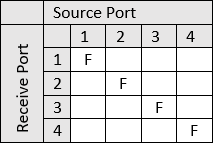
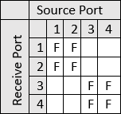
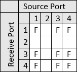
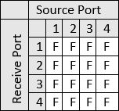
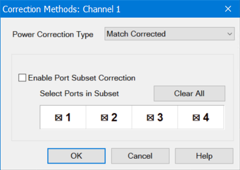
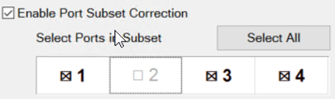
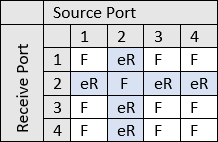
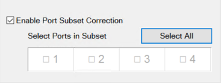
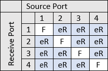
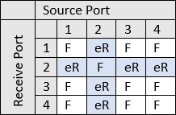

# Port Sub-Setting Examples

S-Parameter error correction is described by the number of ports contributing
to the measurement: 1,2,3 or 4 port corrections are common. They can be
represented in a visual shorthand like the matrix below.

Source ports occupy each column. Receiver ports occupy each row.

**Example 1** : this table shows four independent 1 port calibrations. (F1)
All reflection measurements S11, S22, S33, S44 will all be Full 1 Port
corrected.

**Example 2** : this table shows two independent 2 port calibrations. The
parameters that occupy the blank cells (S13, S14, S23, S24, S31, S32, S41,
S42) are uncorrected.

**Example 3** : Full 3P correction for ports 1, 3 and 4. Any port 2 parameters
will be uncorrected.

**Example 4** : Full 4P correction. All S-Parameters across the first four
ports are corrected.

Calibrating all ports of the network analyzer allows measurement flexibility
but it may not be appropriate for all test conditions. Port Subsetting can be
used to devolve a multi-port to fewer ports as needed. This is useful in the
following situations:

  * when a calibration includes ports that are not connected to the DUT.

  * When it is safer or more accurate to only acquire data in one direction which can be the case with high power amplifiers and when there is substantial loss at the DUT output port.

By default, Port Subsetting is disabled and all ports are selected as denoted
by the “X” in the port indicators. Enabling port subsetting with all ports
included is the same as turning port subsetting OFF. Below we show some
examples of subsetting a full 4P correction.

## Example: Active 4-Port Calibration

The following examples assume there is an active 4 Port calibration.

An active 4 Port calibration:

**Example 5:** To subset the calibration to ports 1,3 and 4,  de-select port 2
and Enable port subsetting.

This yields a correction grid like Example 3 above, except the shaded cells
are no longer empty.

The multiport correction is devolved from 4 ports to 3. But what happens when
measurements involving port 2 are created?

Because the calset already contains error terms for port 2, the best result
for port 2 measurements is as follows:

  * Enhanced Response (eR) correction to transmission terms (S21, S32, S42, S12, S32, S42)

  * 1 Port correction (F1) to S22.

These corrections give a much better result than leaving the parameter
uncorrected _while not requiring any extra acquisition time._ This is
sometimes referred to as “Best Effort”.

## Example: Subsetting by De-Selecting All Ports

This is a convenient way to reduce a multiport correction to a set of single
port corrections.

This example yields the following correction grid.

Example 6: Our original 4 port correction has been devolved to a set of one
port and enhanced response corrections. Again, because we have the error terms
this grid produces the best measurement results without sweeping multiple
source ports. (Best effort).

## Port Sub-Setting SCPI Commands

Note: With SCPI you have more control over the grid.

[SENS:CORR:METHod:PORT:SUBSet:FULL:VALue](../Programming/GP-
IB_Command_Finder/Sense/Sense_Correction.htm#SENSe:CORRection:METHods:PORT:SUBSet:FULL:VALue)

  * This command sets the ports that are **_included_** in the subsetting.

[SENS:CORR:METHod:PORT:SUBSet:RESP:VALue](../Programming/GP-
IB_Command_Finder/Sense/Sense_Correction.htm#SENSe:CORRection:METHods:PORT:SUBSet:RESPonse:VALue)

  * This command sets which ports are included the “best effort” treatment.

Note: The ports lists for these two commands must be mutually exclusive.

### _SCPI Example: Assuming a 4 port calset, port subset to a 3 port cal on
ports 1,3,4_

This set of commands yields the following grid.

SENS:CORR:METHod:PORT:SUBSet:FULL:VAL 1,3,4

SENS:CORR:METHod:PORT:SUBSet:RESP:VAL 0

This set of commands yields the following grid.

The same result occurs when you subset to ports 1,3,4 from the dialog.

SENS:CORR:METHod:PORT:SUBSet:FULL:VAL 1,3,4

SENS:CORR:METHod:PORT:SUBSet:RESP:VAL 2

