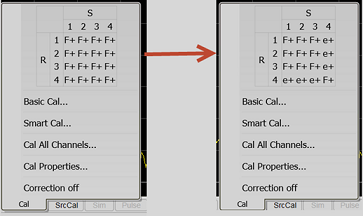

# Port Subset Correction (Devolve Calibration)

* * *

It is often convenient to calibrate all the ports of the instrument so that
corrected data is available at every port. However, applying the resulting
calset results in every port being swept. This level of correction is
appropriate if every port is connected to the DUT. However, sweeping ports
that are disconnected unnecessarily slows down measurement throughput. To
remedy this situation, the user can tell the instrument to exclude selected
ports from the correction process. This is called "port sub-setting" or
"devolve calibration". This process does not modify the calset in any way.
There are two settings associated with port sub-setting: an on/off state, and
the list of ports that should be included in the correction for the channel.

Port sub-setting values are independent of calset selection. They are
essentially a mask that is applied to the calset.

## Restricting correction to Enabled Ports

For example, on a 4 port instrument, the user is measuring two DUTs. Device #1
is connected to ports 1 and 2. Device #2 is connected to ports 3 and 4. The
two devices are not interconnected in any way. Channel 1 is used to measure
device #1. Channel 2 is used to measure device #2. If you apply a 4 port
calset to each of these channels, both channels will sweep all 4 ports. Port
sub-setting can be used to reduce the level of the correction for each
channel.

Channel | Port subset values | Measurements | Correction applied  
---|---|---|---  
Channel 1 | ON, ports 1 and 2 enabled | S11, S21, S12, S22 | Full 2 Port (1,2)  
Channel 2 | ON, ports 3 and 4 enabled | S33, S43, S34, S44 | Full 2 Port (3,4)  
  
In this condition, when the user performs a 4 port calibration and applies the
same user calset to both channels. Channel 1 sweeps ports 1 and 2. Channel 2
sweeps ports 3 and 4.

## Best Effort on Disabled Ports

If measurements are added to the channel that utilize ports that are disabled
in port sub-setting, those measurements will be corrected on a "best effort"
basis: some correction may be applied depending on the contents of the calset.
The level of correction is limited to enhanced response calibration or simple
response calibration.

Channel | Port subset values | Measurements | Correction applied  
---|---|---|---  
Channel 1 | ON, ports 1 and 2 enabled | S11, S21, S12, S22 | Full 2 Port (1,2)  
S43 | Enhanced Response(4,3)  
Channel 2 | ON, ports 3 and 4 enabled | S33, S43, S34, S44 | Full 2P(3,4)  
S11 | 1 Port (1)  
  
This "best effort" correction cannot be turned off using the dialog. But there
are SCPI commands for disabling this feature.

See [SENS:CORR:METH:PORT:SUBS:FULL:VAL](../Programming/GP-
IB_Command_Finder/Sense/Sense_Correction.htm#SENSe:CORRection:METHods:PORT:SUBSet:FULL:VALue)
and [SENS:CORR:METH:PORT:SUBS:RESP:VAL](../Programming/GP-
IB_Command_Finder/Sense/Sense_Correction.htm#SENSe:CORRection:METHods:PORT:SUBSet:RESPonse:VALue).

The correction pop up pane, accessed from the status bar, indicates port by
port correction methods for VNA with 12 or less test ports. This table is
updated when the port subset correction is turned on to reflect the correction
methods being applied. In the image below, the pane indicates a full 4 Port
calibration. On the right, the table indicates the methods after the
correction was devolved to ports 1,2,3.

