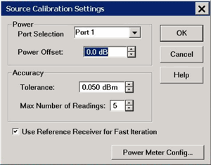

# Power Cal for Applications

* * *

This dialog appears when the Source Cal Settings button is clicked from [Swept
IMD](../Applications/Swept_IMD.htm) and [GCA](../Applications/GCA_Cal.md)
calibrations.

Source Calibration Settings - dialog box help  
---  
 Note: Be sure that the frequency
range of your power sensor covers the frequency range of your measurement.
This does NOT occur automatically. [See Important First-time USB connection
note](../Front_Panel/XTour.htm#FirstTimeNote).

### Power

Port Selection Select the port for which the Source Cal settings will apply.
Power Offset Allows you to specify a gain or loss (in dB) to account for
components you connect between the source and the reference plane of your
measurement. For example, specify 10 dB to account for a 10 dB amplifier in
the path to your DUT. Following the calibration, the VNA power readouts are
adjusted to this value. Power Level of the calibration is set within the
Application. This can be from the Cal Wizard page, or from the power level
setting of the source or port.

### Accuracy

At each data point, power is measured using the specified Power Meter Settling
Tolerance and adjusted, until the reading is within this Accuracy Tolerance or
the Max Number of Readings has been met. The last power reading is plotted on
the screen against the Tolerance limit lines. Tolerance Sets the maximum
desired deviation from the specified Cal Power level. Max Number of Readings
Sets the maximum number of readings to take at each data point for iterating
the source power. Use Reference Receiver for Fast Iteration When checked, the
first reading at each data point uses a power meter to calibrate the reference
receiver. Subsequent readings, if necessary to meet your accuracy requirement,
are measured using the reference receiver. This technique is much faster than
using the power meter with almost no degradation in accuracy. Note: Do NOT use
the Reference Receiver for Fast Iteration feature if there is a component
before the power sensor that exhibits non-linear behavior, such as a power
amplifier in compression Power Meter Config Invokes the [Power Meter
Settings](PwrCalibration.htm#MeterSettings) dialog box. From this dialog, you
can configure two power sensors to cover the frequency range of interest.
Learn more about standard [Source Power
Cal](PwrCalibration.htm#SourcePowerCal).  
  
* * *

