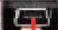
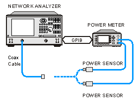
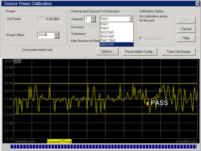
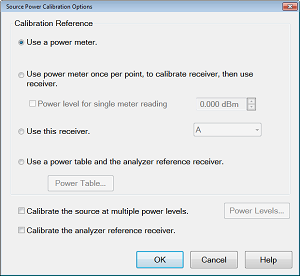
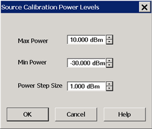
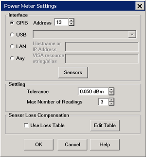
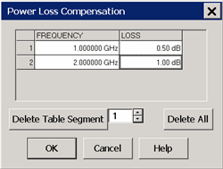
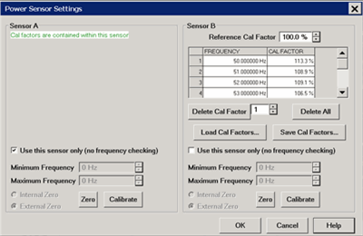
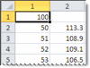
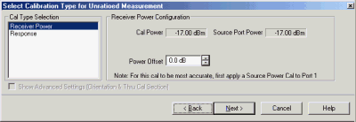

# Power Calibration

* * *

Note: It is recommended that [SmartCal](Calibration_Wizard.md#GuidedCal) be
used instead of the following Power Calibration procedures. The procedures in
this topic are for those who cannot change their existing test
program/procedure with their installed-base PNAs.

Note: Source and Receiver Power Calibrations are NOT available in
M937xA/P937xA PXI.

Source and Receiver Power Calibrations work together to provide very accurate
power levels from the source, and very accurate power measurements from the
VNA receivers.

  * [Source Power Calibration Overview](PwrCalibration.md#SourcePowerCal)

  * [Supported Power Meters and Sensors](PwrCalibration.md#TestEquipmentRequired)

  * [How to perform Source Power Calibration](PwrCalibration.md#PerformSourcePowerCal)

  * [Setup](PwrCalibration.md#PerformSourcePowerCal)

  * [Source Power Cal dialog](PwrCalibration.md#SourcePowerCalDiagIm)

  *     * [Source Power Calibration Options dialog](PwrCalibration.md#spcOptionsIm)

    * [Power Meter Settings dialog](PwrCalibration.md#pwrMeterIm)

    * [Power Loss Compensation dialog](PwrCalibration.md#pLossCompIm)

    * [Power Sensor Settings dialog](PwrCalibration.md#pSensorIm) (Zero / Calibrate)

  * [Copy a Source Power Calibration to other Channels](PwrCalibration.md#Apply)

  * [Saving a Source Power Calibration](PwrCalibration.md#SavingSource)

  * [Reducing Time to Complete a Source Power Calibration](PwrCalibration.md#OptimizingMeasurement)

  * [Receiver Power Calibration](PwrCalibration.md#ReceiverPowerCal)

  * [Saving Receiver Cals](PwrCalibration.md#Saving)

### Other Source Power Cal choices

  * Guided Power Cal can be performed during an S-parameter Guided Calibration. [Learn more](Guided_Power_Calibration.md).

  * Receiver Leveling can be used to provide 'real-time' source power cal. [Learn more.](../S1_Settings/Receiver_Leveling.md)

  * See Also: [Configure an Power Meter As a Receiver (PMAR)](../System/Configure_a_Power_Meter_As_Receiver.md)

[See other Calibration Topics](Calibration.md)

Source Power Calibration Overview

Note: Source and Receiver Power Calibrations are NOT available in M937xA PXI.

Perform Source Power Calibration when you need accurate power levels at some
point in the measurement path between the VNA test ports. For example, you
need to characterize the gain of an amplifier across a frequency range at a
specified input power. You would perform a source power cal at the input of
the amplifier to ensure the exact power level into the amplifier across the
frequency range.

Using a Source Power Cal, you can expect the power at the point of calibration
to be within the range of the uncertainty of the power meter and sensor that
is used.

Source Power Calibration...

  * Is independent of measurement type. It corrects the VNA source regardless of which receivers are being used in a measurement. Therefore, it can be used with both [ratio or non-ratio measurements](../S1_Settings/Measurement_Parameters.md).

  * Applies ONLY to those measurements on the selected channel that use the test port that was specified as the Source for the calibration. For example, if you specify Channel 1 and Port 1 as the source to be calibrated, only those measurements on channel 1 that use port 1 as the source will be corrected.

  * Can be used in conjunction with other measurement calibrations, such as a full 2-port calibration. For highest accuracy, perform the measurement calibration AFTER the source calibration.

  * Can be used with [Power Sweep](../S1_Settings/Sweep.md#power) type. Source Power Cal will correct the power at all power levels across the power sweep.

  * Can be used with [Port Power Uncoupled.](../S1_Settings/Power_Level.md#Power_Coupling)

  * Forces [sweep mode to Stepped](../S1_Settings/Sweep.md#Stepped) on measurements with source power correction turned ON.

  * An external source can be calibrated using Source Power Cal.

### Overview of How it works:

[See Important First-time USB connection
note](../Front_Panel/XTour.htm#FirstTimeNote).

[Click to see the detailed
procedure](PwrCalibration.htm#PerformSourcePowerCal)

  1. Specify the measurement settings (frequency range, IFBW and so forth).

  2. Start Source Power Calibration.

Note: When using a Keysight N848X power sensor (sensors that do NOT have
built-in calibration factors), enter the Cal Factors using the [Power Sensor
Settings](PwrCalibration.htm#SensorDiag) dialog, because the VNA instructs the
power meter to NOT use the Cal Factor tables internal to the power meter.

  3. Connect a power meter sensor to the point at which you want a known power level. This may be at the input or output of your device, or some other point between the test ports.

  4. The VNA source is stepped through the specified frequency range, and power is measured with the power meter. At each data point, the source power is adjusted until the measured power is within your specified accuracy level.

  5. When complete, the power meter is preset. The source power calibration can be [saved as part of the instrument state](PwrCalibration.md#Saving).

  6. The power meter is removed and the measurement path reconnected.

  7. The calibration is automatically applied to the channel. All measurements on that channel using that source port benefit from the source power cal.

  8. Perform an S-parameter calibration AFTER a Source Power Cal. The S-parameter cal is performed using the corrected stimulus power levels for the relevant ports.

Verify the source power calibration using the following procedure.

  1. Connect the power meter as it was during the source power calibration.

  2. Set the VNA to [Point Trigger](../S1_Settings/Trigger.md#state_point) mode.

  3. Trigger the VNA across the trace. Read about the behavior of the [sweep indicator](../S1_Settings/Sweep.md#sweepTimeDiag).

  4. At each data point, the power meter should read the corrected power level within the specified tolerance.

Supported Power Meters and Sensors

  * USB Power Sensors

  * LAN Power Sensors

  * Power Meters

  * Non-Keysight Power Sensors

See Keysight's [Power Meters and
Sensors](http://Keysight.com/find/powermeters) web page.

Also, to generate a list of your instrument's supported power eters and
Sensors, open a command prompt window and enter the following:

reg query "HKLM\SOFTWARE\Keysight\Network Analyzer\Power
Calibration\AvailablePowerMeterDrivers" /s

### USB Power Sensors

  * U848x Series USB Thermocouple Power Sensors (A.09.90.08 and later).

  *     * These include the following models: U8481A, U8485A, U8487A, U8488A, U8489A

    * External Calibration (connecting the sensor to the 1 mW ref port) is NOT supported.

  * U202x X-Series USB Peak and Average Power Sensors.

  *     * The VNA does NOT support peak mode in these sensors, but measures average power.

  * U2000 Series USB Power Sensors.

  * U204x X-Series USB and LAN Power Sensors.

  * U205xXA/U206xXA Series USB Power Sensors.

USB Notes:

  * From a standard power cal (this topic), only one USB power sensor can be used to cover the entire frequency span. To use multiple power sensors, perform a Guided Power Cal. [Learn how](Guided_Power_Calibration.md).

  * To select a USB power sensor for a standard power cal:

  1.      1. Connect the sensor directly to one of the VNA USB ports.

     2. From the [Source Power Cal](PwrCalibration.md#SourcePowerCalDiagIm) dialog, click Power Meter Config.

     3. On the [Power Meter Settings](PwrCalibration.md#MeterSettings) dialog, select USB.

  * [See Important First-time USB connection note](../Front_Panel/XTour.md#FirstTimeNote).

  * See note about [Zeroing USB Power Sensors](PwrCalibration.md#USBcalNote).

  * See also: [Power Meters as Receivers](../System/Configure_a_Power_Meter_As_Receiver.md) (PMAR)

### LAN Power Sensors

  * U2049XA

  * L2051XA

  * L2052XA

  * L2053XA

  * L2054XA

  * L2055XA

  * L2056XA

  * L2057XA

  * L2061XA

  * L2062XA

  * L2063XA

  * L2064XA

  * L2065XA

  * L2066XA

  * L2066XT

  * L2067XA

  * L2067XT

LAN Notes:

  * LAN power sensors can only be controlled via LAN.

  * Typical LAN ports found on a PC or Keysight instrument are used for data transfer and communication only and will not power up a U2049XA LAN Power Sensor.

  * LAN power sensors must connect to a PoE port (Power over Ethernet), which will supply DC power required to power up the sensor and to transfer data.

  * To select a LAN power sensor for a standard power cal:

  *     1. Connect the sensor to a PoE/LAN connection.

    2. From the [Source Power Cal](PwrCalibration.md#SourcePowerCalDiagIm) dialog, click Power Meter Config.

    3. On the [Power Meter Settings](PwrCalibration.md#MeterSettings) dialog, select LAN and enter the host name of the power sensor.

### Power Meters

  * P Series power meters (N1911A and N1912A) and all supported sensors.

  * EPM Series power meters (N1913A/B and N1914A/B) and all supported sensors.

  * EPM-P Series power meters (E4416A and E4417A) and all supported sensors.

  * E Series power meters (E4418 and E4419) and all supported sensors.

Power Meter Notes:

  * N1911A, 12A, 13A, and 14A power meters have a device-side USB connector  and are controlled by the VNA exactly like a USB sensor. See [USB Power Sensors](PwrCalibration.md#USB) (above). Although these meters may also have a front-panel USB port, USB sensors placed on these ports can only be accessed via SCPI. Otherwise, connect USB power sensors directly to one of the VNA USB ports.

  * Source Power Calibration operates slowly with the Keysight E930x and E932x power sensors.

  * Some Keysight power meters have a mode that emulates the command set of the 437B or 438A power meter. The VNA does NOT support this emulation mode.

  * The 82357A USB/GPIB Interface can be used to control power meters.

  * [Create a Custom Power Meter Driver](../Programming/GPIB_Example_Programs/CustomPowerMeterDriver.md) for use with other power meters.

### Non-Keysight Power Sensors

  * Rohde and **_Schwarz_** NRP-Z power sensors (limited support). [Learn how to install the drivers](../System/Install_R&S_Drivers.md).

  * VDI PM5 power meter (limited support). [Learn how to install the driver and set up the power meter](../System/Install_VDI_Drivers.md).

#### How to perform Source Power Calibration

Note: Guided Power Cal can be performed during an S-parameter Guided
Calibration. [Learn more](Guided_Power_Calibration.md).

  1. Setup your measurement (sweep type, frequency range, IFBW, and so forth). By default, a Source Power Cal is performed on the source port of the active measurement.
  2. Connect coax cable, GPIB cable, and power sensors to the VNA as shown in graphic below. 

This image does NOT apply to USB power sensors, which are connected directly
to a VNA USB port. [See Important First-time USB connection
note](../Front_Panel/XTour.htm#FirstTimeNote).

  3. Apply power to the power meter and allow 30 minutes warm-up time before beginning calibration.
  4. Select Source Power Cal as follows:

  
---  
Using Hardkey/SoftTab/Softkey  
  
  1. Press Cal > Main > Other Cals > Source Power Cal....

  
  
  
  5. Complete the Source Power Cal dialog box (below), including [Options](PwrCalibration.md#Options), [Loss Compensation](PwrCalibration.md#LossCompDiag) and [Power Sensor Settings](PwrCalibration.md#SensorDiag), as needed.

Note: When using a Keysight N848X power sensor (sensors that do NOT have
built-in calibration factors), enter the Cal Factors using the [Power Sensor
Settings](PwrCalibration.htm#SensorDiag) dialog, because the VNA instructs the
power meter to NOT use the Cal Factor tables internal to the power meter.

  6. When complete, click Take a Cal Sweep in the Source Power Cal dialog box.
  7. Follow the prompts to connect the sensors as required.
  8. At this time you can change the Source Port setting and perform a Source Power Cal on a different port.
  9. When calibration is finished, click OK. Correction is then applied and turned ON for the relevant ports on the active channel.
  10. Remove sensor.
  11. SrcPwrCal is displayed in the status bar when Source Power Correction is applied to the Active Measurement.
  12. Perform a S-parameter calibration, which would use the corrected stimulus power levels for the relevant ports.

  
  
###

### To turn Source Power Correction OFF:

  * On the Calibration menu,then click Source Power Correction on/OFF.
  * ONLY correction for the source port of the ACTIVE MEASUREMENT is turned OFF (regardless of [port power coupling setting.](../S1_Settings/Power_Level.md#Power_Coupling))

  
---  
  
### Interpolation or Extrapolation

If the original stimulus settings are changed, Interpolation or EXTRAPOLATION
is applied and SrcPwrCal* is displayed in the status bar. This is different
from [measurement calibration
interpolation](Error_Correction_and_Interpolation.htm). For example, if the
frequency span is increased, the VNA will extrapolate new correction values
rather than turn correction off. This is to protect your test device from
being overpowered by the source. If the original settings are restored, then
source power calibration returns to full correction.

Source Power Cal dialog box help  
---  
 Note: Be sure that the frequency range
of your power sensor covers the frequency range of your measurement. This does
NOT occur automatically. Cal with Frequency Extenders If you are using a power
sensor or [power
table](../IFAccess/External_Test_Head_Configuration.htm#PowerTable) to measure
power over the frequency range of a frequency extender (mmWave module), the
trace displays the measured power. This is done at the maximum RF input power
setting for the frequency extender you are calibrating. This could be +10 dBm
or +2 dBm depending on the power range you set during the source power
calibration process. The default is +11 dBm to -30 dBm with a 0.5 db step
size. This can be changed as needed. Though the displayed frequency range is
the range of the RF input, it is actually calibrating over the frequency range
of the frequency extender being used. For example, the display shows 12.5 GHz
to 18.333 GHz (RF input) but it is being calibrated from 75 GHz to 110 GHz.

### Power

Cal Power The calculated power (in dBm) at the calibration point. This value
is the specified VNA source power plus the Power Offset value. Power Offset
Allows you to specify a gain or loss (in dB) to account for components you
connect between the source and the reference plane of your measurement. These
components will remain during a measurement. For example, specify 10 dB to
account for a 10 dB amplifier in the path to your DUT. Following the
calibration, the VNA power readouts are adjusted to this value. To account for
components that will be removed when the calibration is complete, use the
[Loss Compensation table](PwrCalibration.md#pLossCompIm).

### Channel and Port Selection

Channel Specifies the channel on which to perform the calibration. This
setting defaults to the active channel. Source Port Specifies the source port
to be corrected. This setting defaults to the source port for the active
measurement. Note: External sources can be calibrated using this dialog.
[Learn more](../System/Configure_an_External_Device.md).

### Accuracy

At each data point, power is measured using the [specified Power Meter
Settling Tolerance](PwrCalibration.htm#MeterSettings), then adjusted until the
reading is within this Accuracy Tolerance or the Max Number of Readings has
been met. The last power reading is plotted on the screen against the
Tolerance limit lines. Tolerance Sets the maximum desired deviation from the
specified Cal Power level in 0.005 dB increments from 0 to 5 dB. Max Number of
Readings Sets the maximum number of readings to take at each data point for
iterating the source power. Enter a value between 1 and 1000.

### Calibration Status

Allows you to turn Source Power Cal ON | OFF and view Cal data for each port, regardless of the active measurement. This feature allows the [Internal Second Source](../S0_Start/Internal_Second_Source.md) to be calibrated and turned ON | OFF, even when being used as an incidental source in a measurement, such as an LO. Calibration ON Check to turn Source Power Calibration ON for the specified source port. The displayed text indicates when interpolation is applied for the calibration.

### Buttons

Options Invokes the [Source Power Cal Options](PwrCalibration.md#Options)
dialog. Label to the left of the button displays the current 'Options'
setting. Power Meter Config Invokes the [Power Meter
Settings](PwrCalibration.htm#MeterSettings) dialog box Take Cal Sweep Begins
source power calibration measurement. OK Applies calibration. This button is
disabled until the Take Cal Sweep has been pressed. Cancel If a sweep is in
progress, cancels the sweep. Press again to close the dialog. Attention
please: the power meter is operating in 200 r/s mode. During a measurement,
some Keysight power meters may display this message on the screen: It means
that the meter is operating in 200 readings/sec which is the fastest speed
setting for this meter. This is normal operation.

### Pass / Fail Limits

Limit lines are drawn on the Source Power Cal measurement graticule area.
These lines are at the Cal Power +/- the current setting of Accuracy
Tolerance. A FAIL during the Source Power Cal sweep means that the VNA was
unable to measure power to within the Accuracy Tolerance. Tight tolerances are
more difficult to achieve at lower Cal Power levels. When a FAIL indication
appears, increase the Max Number of Readings. If this does not cause a PASS
condition, then decrease the Accuracy Tolerance value.

### See Also

  * Learn more about [Source Power Cal](PwrCalibration.md#SourcePowerCal)
  * Learn about [External Testsets](../System/External_Testset_Control.md#interaction) and Source Power Cal.

  
  
Source Power Calibration Options dialog box help  
---  
 Provides options for
measurement of the source power. Note: At low power levels (less than -30 dBm)
most power meters are not as accurate as a VNA receiver. Calibration Reference
Choose power meter/VNA receiver to use to measure power.

  * Use a power meter. Traditional source power calibration using only a power meter to measure the source power at each data point. Most accurate (at higher power levels) and slowest method.

Note: Because the following two settings use VNA receivers to make power
measurements, they do NOT work correctly when a [Frequency
Offset](../FreqOffset/Frequency_Offset_Mode.htm#FreqOffsDiag) value is being
used.

  * Use a power meter once, to calibrate receiver, then use receiver. When checked, the first reading at each data point uses a power meter to calibrate the reference receiver. Subsequent readings, if necessary to meet your accuracy requirement, are measured using the reference receiver. This technique is much faster than using the power meter, and more accurate when measuring low power levels.

Note: Do NOT use this setting if there is a component before the power sensor
that exhibits non-linear behavior, such as a power amplifier in compression.
Use a power meter and [Calibrate the source at multiple power
levels](PwrCalibration.htm#MultPoweLevels).

  * Use this receiver. Select a VNA Receiver or a PMAR (Power Meter as Receiver).

VNA receiver - For highest accuracy, first calibrate the receiver by
performing a source power cal using a power meter, then a [receiver
cal](PwrCalibration.htm#ReceiverPowerCal). That receiver can then be used to
quickly calibrate other VNA source ports, or used on another channel with
different stimulus settings. This would be useful, for example, if the power
level of the measurement was below the sensitivity of the power sensor.
Calibrate the VNA receiver using a source power cal that is within the
sensitivity of the sensor. Then, use the calibrated receiver to perform a
second source power cal at the reduced power level.

  1.      * The VNA receiver is specified using either standard receiver notation or [logical receiver notation](../S1_Settings/Measurement_Parameters.md#RecNotation).
     * It is best to use the reference receiver for the source port to be calibrated. For example, if calibrating source port 2, specify "R2" or "a2" which is the same port 2 reference receiver using [logical receiver notation](../S1_Settings/Measurement_Parameters.md#RecNotation).
     * To ensure an accurate source power cal, the frequency range over which the receiver was calibrated must be the same or larger than the "receiver only" source power calibration.
     * All accuracy and settling tolerance and number of reading settings apply just as they do with a power meter reading.

PMAR Device - The power meter/sensor must first be configured. [Learn how to
Configure a PMAR device.](../System/Configure_an_External_Device.htm)

  * Use a power table and the analyzer reference receiver Used to provide power leveling with mmWave test set and modules. [Learn more.](../IFAccess/External_Test_Head_Configuration.md#SPCwMM)

Calibrate the source at multiple power levels  Used primarily with [mmWave
measurements](../IFAccess/External_Test_Head_Configuration.htm#Leveled). This
feature can also be used with standard VNA measurements when a component is
used in the source path such as a booster amp which does NOT have linear gain
or loss over frequency. If this is not true for your setup but want to improve
your source power accuracy, consider using the [Receiver
Leveling](../S1_Settings/Receiver_Leveling.htm) feature. When checked, source
power is measured using the specified 'Cal Reference' device (power
meter/sensor or VNA receiver) and iterated on a sweep-to-sweep basis to
construct a 2-dimensional power table: Power IN, Power OUT, over all
frequencies.

  * Click Power Levels to launch the [Source Cal Power Levels dialog box](PwrCalibration.md#SPCPowerLevels) to set the power levels at which source power is to be measured.
  * The source power cal is saved, but the power table is NOT accessible.

Calibrate the analyzer reference receiver Check to calibrate the appropriate
reference receiver to the power level that is measured at the calibration
plane. Do this to make very accurate measurements using the calibrated
reference receiver. This cal is done in addition to the standard source power
cal using the any of the methods listed above. At the end of the source power
cal measurement sweep, you can optionally save the reference receiver cal to a
Cal Set to be recalled at a later time. The Cal is saved when the OK button is
clicked to close the Source Power Cal dialog.  
  
Source Cal Power Levels dialog box help  
---  
 This dialog appears when you
click Power Levels on the [Source Power Cal Options
dialog](PwrCalibration.htm#spcOptionsIm). Specify the power levels at which
the Source Power will be calibrated. These values should be set to a few dB
more or less than the measurement power levels. Max Power \- The highest power
level at which to calibrate. This value should be a few dB higher than the
highest power level of your measurement. Note: Setting the Max Power will
override power settings entered manually in a [Power
Table](../IFAccess/External_Test_Head_Configuration.htm#SPCwMM) (InputPower).
Therefore, when using a power table, set the Max Power value to the same value
shown in the [Power
Table](../IFAccess/External_Test_Head_Configuration.htm#SPCwMM) (InputPower).
Min Power \- The lowest power level at which to calibrate. This value should
be a few dB lower than the lowest power level of your measurement. Power Step
\- Calibrate at every incremental power level, between the Max and Min Power
settings.  
  
Power Meter Settings dialog box help  
---  
 This dialog appears when you click
the Power Meter Config button on many dialog boxes.

### Communication

  * GPIB / Address Select GPIB power meter. Then select the address for the power meter. Default is 13. The VNA will search VISA interfaces that are configured in the Keysight IO Libraries on the VNA. Note: Use this selection when using a 82357A USB/GPIB Interface,
  * USB VNA scans for USB power sensors or [N191x device-side USB power meters](PwrCalibration.md#TestEquipmentRequired). Select a power sensor from the list. Only ONE USB power sensor can be configured to cover the entire frequency range of the calibration. To use multiple power sensors, perform a [Guided Power Cal](Guided_Power_Calibration.md).
  * LAN Specify the Hostname or IP address of the Power Meter.
  * Any This can be used if you wish to spell out the exact **VISA resource string/alias** for your power meter’s I/O connection, for GPIB, USB, LAN or any other I/O protocol supported by VISA. For example, you must use this to use a VDI PM5 power meter, and the VISA resource string/alias in that case must be **ASRL3::INSTR**.

Note: The VDI PM5 driver software must be installed to use VDI power sensors.
Refer to [Install VDI PM5 Driver](../System/Install_VDI_Drivers.md). Sensors
Invokes the [power sensor settings](PwrCalibration.md#SensorDiag) dialog box.

### Settling

These Settling settings do not apply when a VNA receiver is the power
measurement device. Each power meter reading is "settled" when either:

  * two consecutive meter readings are within this Tolerance value or
  * when the Max Number of Readings has been met.

The readings that were taken are averaged together to become the "settled"
reading. The settled reading is then compared to the [Accuracy Tolerance
requirements](PwrCalibration.htm#Source) (tolerance and max readings)
specified on the Source Power Cal dialog box. Tolerance When consecutive power
meter readings are within this value of each other, then the reading is
considered settled. Max Number of Readings Sets the maximum number of readings
the power meter will take to achieve settling.

### Sensor Loss Compensation

Use Loss Table Select this checkbox to apply loss data to Source Power
calibration correction (such as for an adapter on the power sensor). Edit
Table Invokes the [Power Loss Compensation](PwrCalibration.md#LossCompDiag)
dialog box.  
  
Power Loss Compensation dialog box help  
---  
 To Add a Row to the table, click on
a row in the table and press the down arrow on either the VNA front panel or
keyboard. To Edit a value, double-click in the cell to be edited. Compensates
for losses that occur when using an adapter or coupler to connect the power
sensor to the measurement port. These components will be removed when the
calibration is complete. To account for components that will remain during the
measurement, use the [Power Offset setting](PwrCalibration.md#SourceDiag).
The Frequency / Loss pairs define the amount of loss for the entire frequency
range. For example, using the entries in the above dialog image:

  * 0.5 dB is used to compensate power sensor measurements up to 1 GHz.
  * Each data point between 1 GHz to 2 GHz is linearly interpolated between 0.5 dB and 1 dB.
  * 1 dB is used above 2 GHz.
  * A single frequency/loss segment is applied to the entire frequency range.

|  Beginning with A.09.80, enter up to 9999 segments to achieve greater
accuracy. Previously the limit was 100. Note: Large segment counts with one or
more power sensors can result in long load and close times for the VNA
Application.  
---  
  
Frequency Enter a frequency in Hz.

Loss Enter a loss as a POSITIVE value in dB. To compensate for gain, use
NEGATIVE values.

Delete Table Segment Deletes row indicated in the field.

Delete All Deletes all data in the table.

The Power Loss Compensation table survives VNA Preset and Power OFF. To NOT
use Loss compensation, clear the Use Loss table checkbox on the [Power Meter
Settings](PwrCalibration.htm#MeterSettings) dialog.  
  
Power Sensor Settings dialog box help  
---  
 This dialog appears when you click
the Sensors button on the [Power Meter Settings
dialog](PwrCalibration.htm#MeterSettings). Note: Be sure that the frequency
range of your power sensor covers the frequency range of your measurement.
This does NOT occur automatically. Sensor A (B) Displays one of the following
messages depending on type of sensor.

  * Not connected The VNA is not detecting a power sensor.
  * Cal factors are contained within this sensor This message is displayed when the Internal Reference Cal Factor and Cal Factor data are contained in the sensor and automatically accessed.
  * Sensor Data Allows the following entries for power sensor data:
  *     * Reference Cal Factor Specifies the sensor's Reference Cal Factor.
    * Cal Factor Table Specifies the frequency and corresponding Cal Factor for the sensor.
    * Delete Cal Factor Deletes the indicated row in the table.
    * Delete All Deletes all data in the table.
    * To Add a Row to the table, click on a row in the table and press the down arrow on either the VNA front panel or keyboard. A row is added to the bottom of the table. The table is automatically sorted by frequency when OK is pressed.

Load Cal Factors Click to load cal factors from a *.csv file that you create
from the cal factors that appear on the sensor. The first line of the file
MUST have the reference Cal Factor (typically 100), followed by Freq / Cal
Factor pairs as show in the following image:
 Save Cal Factors Click to save the cal
factor table to a *csv file. Use this sensor only Check this box to use this
sensor over the entire frequency span of the measurement, even if two sensors
are connected to power meter. Clear this box to allow entry of minimum and
maximum frequencies for the sensor. Only ONE of the two sensors can have this
box checked. You will be prompted to connect the appropriate sensor during the
power calibration. Minimum Frequency Specifies the minimum frequency range for
the sensor when using dual sensors. Maximum Frequency Specifies the maximum
frequency range for the sensor when using dual sensors.

### Zero and Calibrate the Power Sensor

For highest accuracy, Zero AND Calibrate the power sensor before measuring
data. Follow prompts that may appear. Zero - If the following settings are
'greyed', Internal or External zeroing is selected automatically based on the
power meter/sensor model. Otherwise, select the appropriate type of zeroing to
perform, then press Zero.

  * Internal Zero \- A switch inside the power sensor removes the sensor from the incident power.
  * External Zero \- Requires that you physically remove the sensor from incident power.

|

### Note: For the U2000 Series USB power sensors

Calibration is NOT available. Select External Zero ONLY when the power to be
measured is below the specified level. Otherwise, the U2000 series performs
internal zeroing automatically when needed. See your power sensor
documentation for more details.

  * U200xA - below -30 dBm
  * U200xH - below -20 dBm
  * U200xB - below 0 dBm

If your U2000 power sensor 'hangs' when external zeroing, upgrade the power
sensor firmware to Rev. A.01.02.00 or higher to fix this problem.

### Note: For the U2020 X-Series USB power sensors

The U2020 X-Series support only internal zeroing. But like the U2000 series,
they default to performing zeroing automatically when needed.  
---  
  
Calibrate \- Available when the selected sensor has calibration capability.
Calibration involves measuring an internal 1 mW source.

  * Keysight P-Series sensors and U2020 X-Series USB sensors have an internal reference so you can calibrate them without connecting to a meter’s reference port.

  * Keysight U2000 USB power sensors do not require calibrating.

  * For other sensors, refer to the documentation to determine if it has calibration capability.

Press Calibrate, then follow the prompts.  
  
Copy a Source Power Calibration to other Channels

A macro application is now available that copies a Source Power Calibration to
other channels. Once downloaded and installed on a VNA, the
[macro](../Programming/Using_Macros.md) is automatically configured up. To
learn more, click Help on the application main dialog.

Saving a Source Power Calibration

Because Source Power Cal calibrates source hardware, the calibration data is
saved as part of the Instrument State in a .csa file only. This correction is
applied to all measurements on the channel that uses the calibrated source.
See [Save Instrument State.](../S5_Output/SaveRecall.md#file_save)

Reducing Time to Complete a Source Power Calibration

The time required to perform a Source Power Calibration depends on source
power, number of points, and number of readings taken. You can reduce this
measurement time with the following methods:

  * Reduce number of points before calibration. You can reduce the number of points before the measurement, then return the number of points to its original value after calibration is complete and correction is ON. The analyzer will perform a linear interpolation, although with some loss in accuracy.

  * Use an Keysight E-Series sensor. You can obtain 40+ readings per second over GPIB with this type of sensor on the VNA.

  * Increase power to the sensor. Lower power may have longer settling time with some sensors.

  * Check [Use Reference Receiver for Iteration](PwrCalibration.md#Source).

Receiver Power Calibration

Note: Source and Receiver Power Calibrations are NOT available in M937xA PXI.

Note: A Guided Power Cal can be performed during an S-parameter Guided
Calibration. [Learn more](Guided_Power_Calibration.md).

Receiver power calibration mathematically removes frequency response errors in
the specified VNA receiver, and adjusts readings to the same, or a value
offset from, the source power calibration level. It is the same as doing a
Response Cal or Data / Memory, (Normalization) but with the data shifted to
the [Cal Power](PwrCalibration.md#ReceiverDiag) value.

Use Receiver Power Calibration to make very accurate absolute power
(amplitude) measurements.

### Receiver Power Calibration:

  * Is ONLY allowed when making absolute power ([unratioed](../S1_Settings/Measurement_Parameters.md#Unratioed_Power)) measurements.

  * Is most accurate when a source power calibration was performed first.

  * Applies to all unratioed measurements in the active channel using that receiver.

  * Can be saved in a Cal Set and later reapplied to a like measurement.

### Interpolation

Like other calibration types, if the original stimulus settings are narrowed,
interpolation is applied and C* Rcvr Pwr is displayed in the status bar. If
the original stimulus settings are made wider, the VNA will turn Receiver
Power Correction OFF.

If the original settings are restored, then receiver power calibration returns
to full correction.

#### How to perform a Receiver Power Calibration

  1. Perform a Source Power Calibration.
  2. Set the active measurement to unratioed. [Learn How](../S1_Settings/Measurement_Parameters.md#arb_ratio).
  3. Connect a THRU line from the source port to the receiver port.

  * When performing a receiver power cal on a reference receiver (source 1 and receiver R1), no connection is necessary as the receiver is internally connected to the source.
  * When the source port and receiver port are the same (receiver A, source port 1), then connect an open or short to get maximum power to the receiver. This practice is not recommended. It is best to use different ports for the source and receiver.

  4. Ensure correction for Source Power Calibration is ON as indicated by Src Pwr Cal or Src Pwr Cal* in the status bar.
  5. Start the [Calibration Wizard](Calibration_Wizard.md)

  
---  
Using Hardkey/SoftTab/Softkey  
  
  1. Set the active measurement to unratioed. _[Learn How](../s1_settings/measurement_parameters.md#arb_ratio)._
  2. Press Cal > Main > Other Cals > Receiver Power Cal....

  
  
  
Select Calibration Type for Unratioed Measurement dialog box help  
---  
 Cal Type Selection Select Receiver
Power Receiver Power Configuration Cal Power Specifies the power level to be
displayed on the measurement when complete. (Source Port Power + Power
Offset). Source Port Power Test port Power set for the measurement. [Learn how
to change Test Port Power](../S1_Settings/Power_Level.htm#powerDiag) Power
Offset Allows you to specify a gain or loss (in dB) to account for components
you connect between the source and the reference plane of your measurement
AFTER a source power cal has been performed. Following the calibration, the
VNA power readouts are adjusted to the Cal Power value. Next Click to continue
the Calibration Wizard. Notes:

  * When Receiver Power Cal is finished, 'Response' is displayed in the status bar and correction data is applied to subsequent sweeps. This is done because Receiver Power Cals are essentially Response Cals once they are stored and applied. See Saving a Receiver Power Cal below.
  * To turn correction OFF, click Cal > Main > Correction > Channel Correction OFF.

[Learn more about Receiver Power Cal (scroll
up).](PwrCalibration.htm#ReceiverPowerCal)  
  
Saving a Receiver Power Calibration

Beginning with VNA Revision 5.0, Receiver Power Cal is saved to a [Cal
Register](Cal_Sets.htm#Registers) and optionally to a [User Cal
Set](Cal_Sets.htm). It can be applied to measurements in the same way as other
Cal Types. Previously, Receiver Power Cal data was saved as part of an
Instrument State and was only applied to the measurement on which it was
performed.

[Learn more about Saving VNA files
types.](../S5_Output/SaveRecall.htm#About_Saving)

* * *

