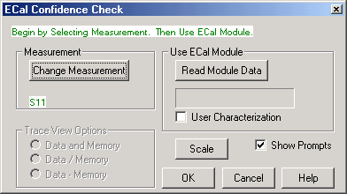

# Validity of a Calibration

* * *

This section helps you determine if your calibration is valid and how the
analyzer displays correction level information for your measurement.

  * [Frequency Response of Calibration Standards](Quest_Cal.md#StdFreqRespnse)

  * [Validating a Calibration](Quest_Cal.md#ValidateCal)

  * [Quick Check](Quest_Cal.md#PerformQuickCheck)

  * [ECal Confidence Check](Quest_Cal.md#AboutECal)

  * Determining Effects of Not Terminating Unused ECal Ports

  * [Verification Kit](Quest_Cal.md#UseVerificationKit)

[See other Calibration Topics](Calibration.md)

### Frequency Response of Calibration Standards

In order for the response of a calibration standard to show as a dot on the
[smith chart display format](../S1_Settings/Data_Format.md#Smith_Chart), it
must have no phase delay with respect to frequency. The only standards that
exhibit such "perfect" response are the following:

  * 7-mm short (with no offset)
  * Type-N male short (with no offset)

There are two reasons why other types of calibration standards show phase
delay after calibration:

  1. The reference plane of the standard is electrically offset from the mating plane of the test port. Such devices exhibit the properties of a small length of transmission line, including a certain amount of phase shift.
  2. The standard is an open termination, which by definition exhibits a certain amount of fringe capacitance and therefore phase shift. Open terminations which are offset from the mating plane will exhibit a phase shift due to the offset in addition to the phase shift caused by the fringe capacitance.

The most important point to remember is that all standards are measured in
order to remove [systematic errors](Errors.md#errsys) from subsequent device
measurements. As a result, if calibration standards with delay and fringe
capacitance are measured as a device after a calibration, they will NOT appear
to be "perfect". This is an indication that your analyzer is calibrated
accurately and working properly.  
---  
  
Validating a Calibration

At the completion of a calibration or selection of a stored Cal Set,
validation can accomplish the following:

Improve Measurement Accuracy – Once a measurement calibration has been
performed, its performance should be checked before making device
measurements. There are several sources of error that can invalidate a
calibration: bad cables, dirty or worn calibration standards that no longer
behave like the modeled standards, and operator error.

Verify Accuracy of Interpolation – You should validate the calibration if you
are testing a device and the measurements are uncertain because of
interpolation. For more information see [Interpolation
Accuracy](Error_Correction_and_Interpolation.htm#InterpolationAccuracy).

Verify Accuracy of Cal Standards – To check accuracy, a device with a known
magnitude and phase response should be measured.

Quick Check

For this test, all you need are a few calibration standards. The device used
should not be one of the calibration standards; a measurement of one of these
standards is merely a measure of repeatability.

The following reflection and transmission Quick Check tests can be applied to
all test ports.

### To verify reflection measurements, perform the following steps:

  1. Connect either an OPEN or SHORT standard to port 1. The magnitude of S11 should be close to 0 dB (within a few tenths of a dB).

  2. Connect a load calibration standard to port 1. The magnitude of S11 should be less than the specified calibrated directivity of the analyzer (typically less than -30 dB).

### To verify transmission measurements:

  1. Connect a THRU cable (or known device representative of your measurement) from port 1 to port 2. Verify the loss characteristics are equivalent to the known performance of the cable or device.

  2. To verify S21 isolation, connect two loads: one on port 1 and one on port 2. Measure the magnitude of S21 and verify that it is less than the specified isolation (typically less than -80 dB).

Note: To get a more accurate range of expected values for these measurements,
consult the analyzer's specifications.

ECal Confidence Check

ECal Confidence Check is a method to check the accuracy of a calibration
performed with mechanical standards or an ECal module. The confidence check
allows you to measure an impedance state in the ECal module (called the
confidence state), and compare it with factory measured data stored in the
module.

In order for this test to be valid, the test ports of the ECal module must
connect directly to the calibration reference plane (without adapters).

Note: In the N469x series of 2-port ECal modules, from the module minimum
frequency up to approximately 2 GHz, the confidence state has a very high
amount of transmission loss. In this frequency range, calibrated measurements
of transmission S-parameters for the confidence state may vary much more than
expected from the Keysight-characterized data in the measurement memory trace.
When comparing the measurement trace and memory trace you, ignore the data for
frequencies up to 2 GHz.

#### How to Perform ECal Confidence Check:

  1. Connect ECal module to the analyzer with the USB cable. See [Connect ECal Module to the VNA](Using_ECal.md#Connect). Note: Terminate any unused ECAL ports with a 50 ohm load. See below.
  2. Allow the module to warm up for 15 minutes or until the module indicates READY.

Note: N755xA series ECal modules do not require a warm-up period.

  3. Do one of the following to start ECal Confidence Check

  
---  
Using Hardkey/SoftTab/Softkey  
  
  1. Press Cal > Cal Sets & Cal Kits > ECal > ECal Confidence Check....

  
  
On the following ECal Confidence Check dialog box:

  2. Click Read Module Data. The following occurs:

  1.      * ECal module is set to "confidence state".
     * Analyzer reads and displays stored data.
     * Analyzer measures and displays "confidence state".

  3. To view a different parameter, select Change Measurement and select the check box for the desired parameter. The default is the active channel parameter.
  4. Select the viewing option in the Trace View Options block.
  5. Compare the stored and measured data for each measurement parameter.

Notes:

  * After exiting ECal Confidence Check, the ECal module remains in the same impedance state and the factory (or user-characterized) data is still stored in the memory trace. Therefore, you can save both the data and memory trace as a *.csv files and import them to a spreadsheet. [Learn how.](../S5_Output/SaveRecall.md#csv)
  * If the two traces show excessive difference, there may be a loose or dirty connection at the test ports or damage to the test cables. Carefully inspect the cables and connections. Then clean and gage each connector, and re-calibrate if needed.
  * The User Characterization setting selects the user-characterization data instead of the factory characterization data (available when a User-Characterization is stored in the ECal module).

  
  
Determining Effects of Not Terminating Unused ECal Ports

The following procedure can be used to determine the calibration errors when
unused ECal ports are not terminated.

  1. Connect the ECal module to one VNA test port through an adapter (eliminates the possibility of cable movement errors being included) and leave the unconnected port(s) open.

  2. Perform a 1-port cal (use 100 Hz IFBW) then save the calset.

  3. Connect a load(s) to the unconnected port(s) of the ECal module.

  4. Perform a 1-port cal then save the calset.

  5. Compare the calset in step 2 with the calset in step 4 using [Calset Viewer](Errors.md#Monitoring) to evaluate the effect of leaving the unused ECal ports open.

ECal Confidence Check dialog box help  
---  
 Compares the accuracy of corrected
(calibrated) data with stored data in the ECal module. For the check to be
valid, the module test ports must connect directly to the calibration
reference plane (without an adapter). [Learn more about ECal Confidence
Check.](Quest_Cal.htm#AboutECal) Measurement Change Measurement Opens the
Measure dialog box. Use ECal Module Read Module Data

  * Copies stored data from the ECal module to Memory.
  * Changes state of ECal module to confidence state.
  * Measures and displays confidence state and Memory trace.
  * Displays the factory and user characterizations data stored in the ECal module. [Learn more](Using_ECal.md#SelectModuleAndChar).

Scale Opens the Scale dialog box. Show Prompts Check to show a reminder for
the connection (default).

### Trace View Options

Data and Memory Trace Displays current measurement data and Memory trace. Data
/ Memory Performs an operation where the current measurement data is divided
by the data in memory. Data + Memory Performs an operation where the current
measurement data is added to the data in memory.  
  
Verification Kit

Measuring known devices, other than calibration standards, is a
straightforward way of verifying that the network analyzer system is operating
properly. Verification kits use accurately known verification standards with
well-defined magnitude and phase response. These kits include precision
airlines, mismatch airlines, and precision fixed attenuators. Traceable
measurement data is shipped with each kit on disk and verification kits may be
re-certified by Keysight.

See [Analyzer Accessories](../Support/Analyzer_Accessories.md) for a list of
Keysight verification kits.

* * *

