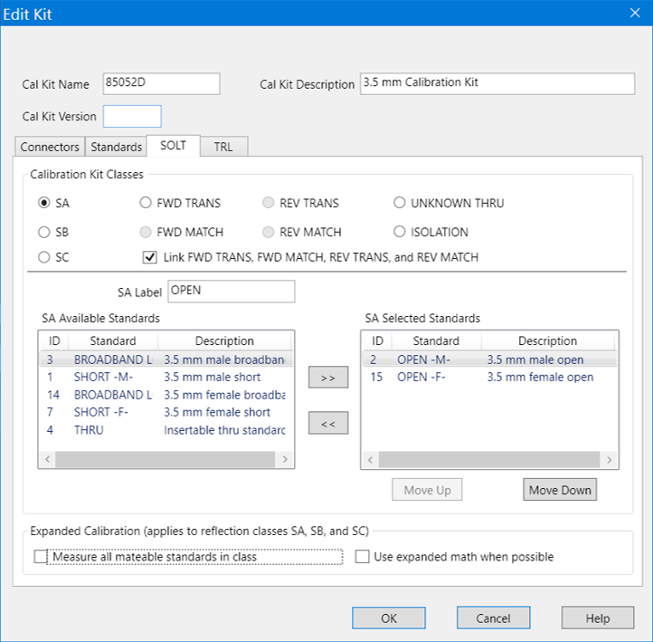

# SOLT Tab

* * *

Note: This dialog looks similar to the dialog that appears after the [Cal
Wizard View / Modify dialog](Calibration_Wizard.htm#ModifyCal). However,
setting changes in that dialog affect ONLY the calibration that is in
progress. These settings, accessed through Modify Cal Kit, changes the cal kit
for all future calibrations that use this cal kit.

Allows you to assign single or multiple standards to SOLT Calibration Classes.

Click the [TRL tab](TRL_Tab.md) to assign standards to TRL Calibration
Classes.

  1. For each Cal Kit Class, select Available Standards from the left list, then click >> to copy the standard to the Cal Kit.

  2. Use MOVE UP and MOVE DOWN to change the ORDER of the standards. The order is used in guided calibrations to determine which standards in that class will be used in calibrations that involve the frequency ranges over which the standards are defined. Guided cals will include standards in the order in which they appear in this class list, and in the case where standards in the class list have frequency ranges that overlap, the order also determines which standard is used for frequencies in the overlap range. For example, let's assume that you define a broadband Short from Min Freq.= 0 Hz and Max Freq.= 999 GHz, and that standard is listed first in the SB or TRL REFLECT class. If you then list a frequency-banded Short with the same connector below the broadband short in those same classes, then guided calibrations would not use the frequency-banded Shorts because the broadband Shorts would always be given priority.

### SOLT <cal class> Label

The cal standard category label that appears in the VNA’s user interface
during unguided SOLT calibrations.

### Calibration Kit Classes

For each calibration class, select Available Standards, then click >> to move
to the Selected Standards list.

  * SA \- OPEN Standards (standards in the SA class are not always Opens)

  * SB \- SHORT Standards

  * SC \- LOAD Standards

  * FWD / REV Trans and Match \- THRU Standards. Most Cal Kits do NOT include a physical THRU standard, but assume that an Insertable Thru will be used.

  * UNKNOWN THRU \- Unknown Thru Cal is the preferred THRU method of calibrating the analyzer to measure a non-insertable device. The Unknown Thru calibration is also known as Short-Open-Load-Reciprocal Thru (SOLR) calibration. [Learn more](Calibration_THRU_Methods.md#UnknownThru).

  * ISOLATION - Isolation standard. For VNA analyzers, ISOLATION calibration is not usually recommended. It could be beneficial in some situations where custom user-supplied test set hardware is being used.

* * *

Link FWD TRANS, FWD MATCH, REV TRANS, and REV MATCH Check to automatically
assign the standard definition for FWD TRANS to FWD MATCH, REV MATCH, and REV
TRANS. Clear to separately assign FWD MATCH, REV MATCH and REV TRANS classes
(SOLT calibrations only).

* * *

### Expanded Calibration

The following two check boxes apply ONLY during Guided Calibrations. For
Unguided Calibration, these check boxes are ignored, including the case where
the multiple standards dialog box is presented.

Measure all mateable standards in class Check this box to attain the very
highest accuracy possible. For example, if a cal kit contains several load
standards, during the calibration process you will be prompted to measure each
of the standards. This could require a significant amount of calibration time.
When checked, the "Use expanded math when possible" box is also checked
automatically.

Use expanded math when possible Some kits contain multiple calibration
standards of the same type that together cover a very wide frequency range.
(For example: multiple shorts, or a lowband load and a sliding load.) If a
calibration requires more than one standard to cover the calibration frequency
range, there can be regions of overlapping measurements. When this checkbox is
selected, the VNA automatically computes the most accurate measurement in the
overlap regions using a "weighted least squares fit" algorithm. This function
improves accuracy without slowing the calibration speed.

  * Manually select this checkbox only when using a cal kit that contains multiple standards of the same type. (For example: multiple shorts, or a lowband load and a sliding load.)

  * The checkbox is cleared by default when a polynomial model is selected from the cal kit menu.

  * The checkbox is selected by default when the 85058B or 85058E data-based model is selected from the cal kit menu.

* * *

