# Standards Tab

* * *

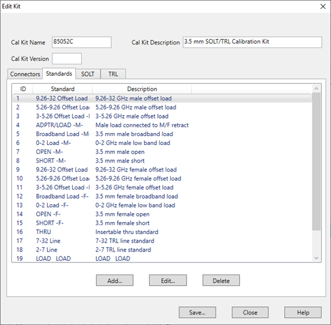

Allows you to Add, Edit or Delete cal standards in a cal kit.

### Add Standard (Open, Short, Load, Thru, or Data-based)

Add Standard dialog box help  
---  
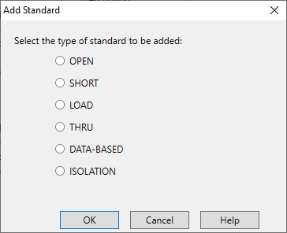 Allows you to add standards to
the calibration kit file. Choose from:

  * [OPEN](Standards_Tab.md#Open)
  * [SHORT](Standards_Tab.md#Short)
  * [LOAD](Standards_Tab.md#Load)
  * [THRU](Standards_Tab.md#Thru)
  * [DATA-BASED](Standards_Tab.md#DataBased)
  * [ISOLATION](Standards_Tab.md#Isolation)

  
  
Standards dialog box help  
---  
The following fields apply to ALL standard types:
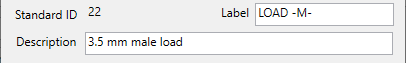 The other areas of the dialog
change depending on the type of standard selected.

### Identification

Standard ID Number in list of standards Label Type of standard. This usually
appears in prompts for standards. Description Description of standard.

* * *

The following fields apply to ALL standard types EXCEPT the Isolation type:
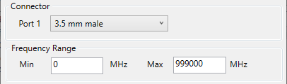

### Connector

Indicates the type and gender (Male, Female, None) of the standard. Thru and
Isolation standards have two connectors. Data-Based standards MAY have two
connectors.

### Frequency Range

Min Defines the lowest frequency at which the standard is used for
calibration. Max Defines the highest frequency at which the standard is used
for calibration.

* * *

The following selections (see image below) apply to transmission line
parameters. 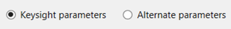

### Keysight parameters/Alternate parameters

Keysight parameters Create calibration kit files using the Keysight model.
[Learn more](Translating_8510_Models.md). Alternate parameters Create
calibration kit files using other vendor models. The selections for delay will
change. The selections for open capacitance and short inductance terms will
also change between Keysight parameters and Alternate parameters. [Learn
more](Translating_8510_Models.htm). The Delay Characteristics fields apply to
MOST standard types: 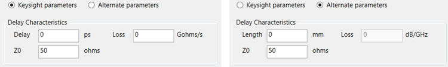

### Delay Characteristics

Delay (Keysight parameters) Defines the one-way travel time from the
calibration plane to the standard termination in ps for one-port standards and
the one-way travel time through the standard for two-port standards. Length
(Alternate parameters) Defines the two-way travel electrical length from the
calibration plane to the standard termination in mm for one-port standards and
the one-way travel electrical length through the standard for two-port
standards. [Learn
more](Translating_8510_Models.htm#Conversion_from_Keysight_to_Alternate_Parameters).
Z0 Defines the impedance of the standard. Loss (Keysight parameters) Defines
the one-way energy loss in Gohms/s for both one-port standards and two-port
standards. Loss (Alternate parameters) Defines the two-way energy loss in
dB/GHz for one-port standards. Defines the one-way energy loss in dB/GHz for
two-port standards.

* * *

Other fields are unique to standard type Choose from:

  * [OPEN](Standards_Tab.md#Open)
  * [SHORT](Standards_Tab.md#Short)
  * [LOAD](Standards_Tab.md#Load)
  * [THRU](Standards_Tab.md#Thru)
  * [DATA-BASED](Standards_Tab.md#DataBased)
  * [ISOLATION](Standards_Tab.md#Isolation)

  
  
### Open Standard

C0, C1, C2, C3 Specifies the fringing capacitance.

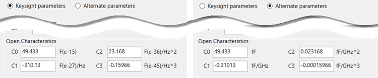

These are the unique fields of the dialog. [See the areas that are common to
all standards.](Standards_Tab.htm#EditStandardsDiag)

* * *

### Short Standard

L0, L1, L2, L3 Specifies the residual inductance.

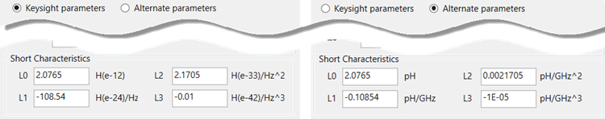

* * *

### Load Standard

Choose from the following

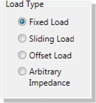

Fixed Load Specifies the load type as Fixed. The fixed load is assumed to be a
perfect termination without reflection.

Sliding Load

A sliding load is defined by making multiple measurements of the device with
the sliding load element positioned at various marked positions of a long
transmission line. The transmission line is assumed to have zero reflections
and the load element has a finite reflection that can be mathematically
removed using a least squares circle fitting method.

A sliding load cal can be very accurate when performed perfectly. It can also
be very inaccurate when not using proper technique. For accurate results,
closely follow the users manual instructions for the sliding load.

### Arbitrary Impedance

Specifies the load type that has an impedance value different from system Z0.
An arbitrary impedance device is similar to a fixed load except that the load
impedance is NOT perfect. Early firmware releases of the VNA series used a
fixed resistance value. A complex terminating impedance has been added to
allow for more accurate modeling of circuit board or on-wafer devices.

The following Complex Impedance settings are available ONLY when Arbitrary
Impedance is selected.

  1.      * Real The real portion of the impedance value.

     * Imaginary The imaginary portion of the impedance value.

Offset Load

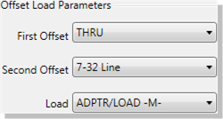

Using an Offset Load standard results in a more accurate calibration than with
a Broadband Load. Therefore, when performing a calibration using one of the
modified Cal Kit definitions, you may be prompted to connect more standards
than before this change. To revert to using the Broadband Load Standard
without offset, do the following:

  1. Press Cal > Cal Sets & Cal Kits > Cal Kit....

  2. At the Manage Cal Kit dialog box, click Edit....

  3. Select the SOLT tab.

  4. Under the Calibration Kit Classes, select SC (Loads)

  5. Under Selected Standards, select Broadband Load, then click Move Up until the standard is at the top of the list. This will ensure that the Broadband Load is used first.

About Offset Load

An offset load is a compound standard consisting of a load element and two
known offset elements (transmission lines) of different length. The shorter
offset element can be a zero-length (Flush-thru) offset. The load element is
defined as a 1-port reflection standard. An offset load standard is used when
the response of the offset elements are more precisely known than the response
of the load element. This is the case with waveguide. Measurement of an offset
load standard consists of two measurements, one with each of the two offset
elements terminated by the load element. The frequency range of the offset
load standard should be set so that there will be at least a 20 degree
separation between the expected response of each measurement.

To specify more than two offset elements, define multiple offset load
standards. In cases where more than two offsets are used, the frequency range
may be extended as the internal algorithm at each frequency will search
through all of the possible combinations of offsets to find the pair with the
widest expected separation to use in determining the actual response of the
load element.

The following Offset Load settings are available ONLY when Offset Load is
selected.

  1.      * First Offset Standard

     * Second Offset Standard 

     * Load Standard 

* * *

### Thru Standard

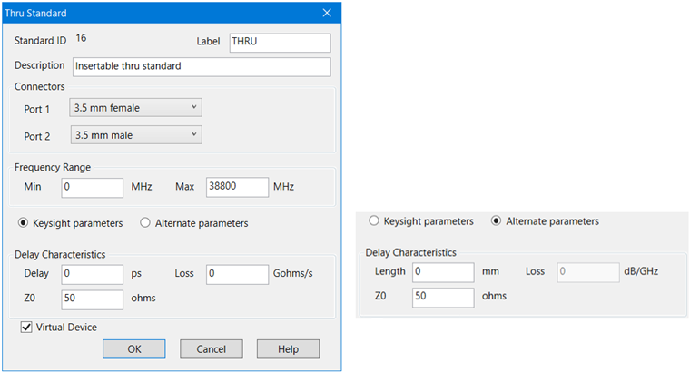

Connectors \- Defines connector type at both ends of the Thru standard.

Virtual Device

Most cal kits have only one Thru standard definition for SOLT calibrations.
For these cases, use the default selections (checked for zero-length Thrus and
cleared for non-zero-length Thrus).

This checkbox is used to make forward and reverse measurements of your Thru
standard for the same pair of ports in two separate steps.

When checked, calibration prompts involving that Thru will omit the
Description. For example “Connect port 1 to port 2”. This is the common prompt
for Flush-Thru standards.

When cleared, calibration prompts for that Thru will include the Description.
For example “Connect <standard description> between ports 1 and 2”. This is
NOT common for zero-length (Flush) Thru standards.

To make forward and reverse measurements of your Thru standard for the same
pair of ports as two separate steps, do the following:

  1. Create separate definitions of the Thru standard(s) using the same settings, except for the Label and Description. Clear this checkbox for BOTH definitions.

  2. For one Thru definition, in the label and description include the word 'FORWARD' to prompt the operator to use this standard for the forward measurement. Assign this standard to the SOLT “FWD TRANS” and “FWD MATCH” classes of the cal kit.

  3. For the Thru definition, in the label and description include the word 'REVERSE' to prompt the operator to use this standard for the reverse measurement. Assign this standard to the SOLT “REV TRANS” and “REV MATCH” classes of the cal kit.

  4. When you perform SOLT calibrations using this cal kit, the forward measurements of the Thru will be measured in one connection step, and the reverse measurements in another. 

* * *

### Data-Based Standard

Learn about the relative accuracy of [Databased versus Polynomial Cal
Kits](Accurate.htm#databased_cal_model).

The modified file can then be uploaded into the VNA.

Upload Data From File

Click Load Data File, then navigate to the *.dat or *.dsd file which is
provided with the data-based Cal Kit. Both Response data and Accuracy
(Uncertainty) data is provided in a single *dat or *.dsd file.

For Advanced Users

Response data can be loaded from a *.s2p or *.cti file.

Confidence factor data can be loaded from a *.cti file. Starting with Option
S93015A/B, you can also load data from a *.dsd (S-parameter Data Standard
Definition) file. The *.dsd file contains both Response data and Accuracy
(Uncertainty) data where the accuracy data is in covariant form. Learn more
about [Dynamic Uncertainty](Dynamic_Uncertainty.md). The confidence factor
helps prioritize standards used during Expanded calibration and is usually
related to the standard model uncertainty.

### Virtual Device

This checkbox is displayed for a Data-Based cal standard when the standard has
been defined to have 2 ports.

  * When Cleared (default) calibration prompts for that standard will include it’s Description. For example “Connect <standard description> between ports 1 and 2”. 

  * When Checked, calibration prompts for that standard will NOT include its Description, so the prompt will be worded as if the data-based standard is a zero-length Thru connection. For example “Connect port 1 to port 2”.

* * *

### Isolation Standard

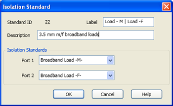

The pair of loads are considered one standard.

Both loads are connected to the VNA and measured with the same prompt.

* * *

