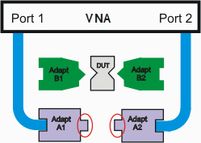
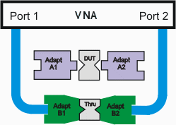
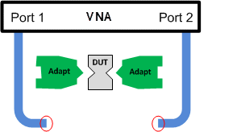
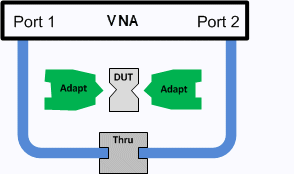
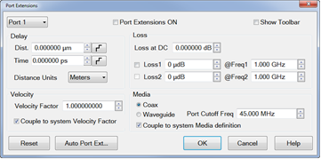
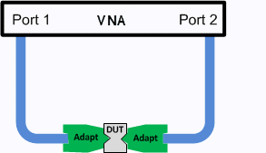

# Swap Adapters and Offset Delay Calibration Methods

* * *

The Swap Adapters or Offset Delay calibration method is used when you do NOT
have calibration standards with the same connector type as your DUT. In this
case, the Offset Delay is the preferred calibration method over the Swap
Adapters method.

The Swap Adapters calibration method (also known as Swap Equal Adapters and
Equal Length Adapters) was used in the past as a quick alternative to the more
tedious [adapter removal](Calibration_THRU_Methods.md#AdapterRemoval) method.
This method requires that the adapters be of equal electrical length. There
are two adapters for each port. The swap equal adapter method implicitly
assumes the adapters have identical return loss. The finite return loss of
each adapter on each port degrades both the residual directivity and residual
match terms. The offset delay calibration only has one adapter. The return
loss of this one adapter will degrade the residual directivity and residual
match error terms.

Note: For any other reason, these calibration methods are NOT recommended
because the [Unknown Thru](Calibration_THRU_Methods.md#UnknownThru) method is
more convenient AND more accurate.

The Offset Delay calibration method uses the available standards for
calibration then adds offset delay to the measurement plane to account for
each adapter used. This eliminates the need for adapters with equal electrical
length and is preferred over the Swap Adapters method.

## Swap Adapters Procedure

The following is an example procedure showing how to perform a Swap Adapters
2-port calibration for a non-insertable DUT. The DUT has 2.92 mm connectors.
You do NOT have 2.92 mm calibration standards, but you DO have 2.4 mm
standards and adapters that have the same electrical delay as the 2.92 mm
adapters.

Adapters A1 and A2 = test port to 2.4 mm adapters

Adapters B1 and B2 = test port to 2.92 mm adapters

  1. Start the Cal Wizard and select Guided (Smart) Cal. Note: The VNA will NOT prompt you to connect the adapters by name or when to swap the adapters.

  
---  
  
  2. Specify the connector type and gender and Cal Kit of the adapter that you will be using (2.4 mm) - NOT the connector type of the DUT (2.92 mm). By specifying the connector gender, you are also specifying the Thru method (flush thru for insertable and Unknown Thru for non-insertable.) For example, when both DUT ports have female connectors, we will perform an Unknown Thru cal.

  
  
  3. When prompted for reflection standards on port 1, connect the Open, Short, and Load standards to Adapter A1.
  4. When prompted for reflection standards on port 2, connect the Open, Short, and Load standards to Adapter A2.

|   
  
  5. When prompted for a Thru connection, swap Adapter A1 and A2 for B1 and B2. Connect the Thru device. This could be any device that meets the requirements of the [Unknown Thru standard.](Calibration_THRU_Methods.md#UnknownThru) In the case of a non-insertable DUT, connect B1 and B2.

|   
  
  6. Make DUT measurements with Adapters B1 and B2 in place.

|   
  
## Offset Delay Procedure

The following is an example procedure showing how to perform a 2-port
calibration for a non-insertable DUT using Offset Delay to account for the
added delay of two adapters. The DUT has 2.92 mm connectors. You do NOT have
2.92 mm calibration standards, but you DO have 2.4 mm standards and adapters.

Adapters = test port to 2.4 mm (female)-to-2.92 mm (male) adapters

  1. Start the Cal Wizard and select Guided (Smart) Cal.

  
---  
  
  2. Specify the connector type and gender and Cal Kit that you will be using (2.4 mm) - NOT the connector type of the DUT (2.92 mm). By specifying the connector gender, you are also specifying the Thru method (flush thru for insertable and Unknown Thru for non-insertable.) For example, when both DUT ports have female connectors, we will perform an Unknown Thru cal.

  
  
  3. When prompted for reflection standards on port 1, connect the Open, Short, and Load standards.
  4. When prompted for reflection standards on port 2, connect the Open, Short, and Load standards.

|   
  
  5. When prompted for a Thru connection, connect the Thru device between port 1 and port 2. This could be any device that meets the requirements of the [Unknown Thru standard.](Calibration_THRU_Methods.md#UnknownThru) In this example of a non-insertable DUT, a female-to-female 2.4 mm barrel adapter is used as the Thru device.

|   
  
  6. Click on Response, Cal, then select Port Extension. The Port Extension dialog is used to electrically move the measurement reference plane after you have performed a calibration to account for the two adapters. Learn more about [Port Extensions](Port_Extensions.md).
  7. Select Port 1 and enter the delay of the adapter connected to Port 1.
  8. Select Port 2 and enter the delay of the adapter connected to Port 2.
  9. Click OK.

|   
  
  10. Make DUT measurements with Adapters and DUT in place.

|   
  
* * *

