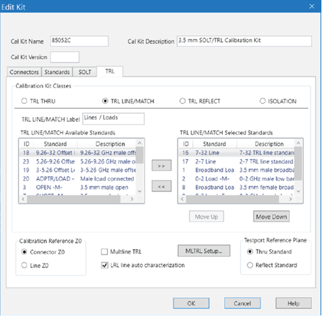

# TRL Tab

* * *

### 

Allows you to assign single or multiple standards to Calibration Classes.

  1. For each Cal Kit Class, select Available Standards from the left list, then click >> to copy the standard to the Cal Kit.

  2. Use MOVE UP and MOVE DOWN to change the ORDER of the standards. The order is used in guided calibrations to determine which standards in that class will be used in calibrations that involve the frequency ranges over which the standards are defined. Guided cals will include standards in the order in which they appear in this class list, and in the case where standards in the class list have frequency ranges that overlap, the order also determines which standard is used for frequencies in the overlap range. For example, let's assume that you define a broadband Short from Min Freq.= 0 Hz and Max Freq.= 999 GHz, and that standard is listed first in the SB or TRL REFLECT class. If you then list a frequency-banded Short with the same connector below the broadband short in those same classes, then guided calibrations would not use the frequency-banded Shorts because the broadband Shorts would always be given priority.

Note: The TRL LINE/MATCH class has a slight exception to these prioritization
behaviors. In general, Line standards are given a higher priority than Match
standards. So if a Line standard and a Match standard are defined to have the
same frequency range and the Match standard is listed above the Line standard
in the class order, a guided TRL cal will still prefer to use the Line
standard rather than the Match standard.

### TRL <cal class> Label

The cal standard category label that appears in the VNA’s user interface
during unguided TRL calibrations.

## Cal Kit Classes

  * For VNA analyzers, ISOLATION calibration is not usually recommended. It could be beneficial in some situations where custom user-supplied test set hardware is being used.

### TRL THRU

Note: All THRU calibration methods are supported in a TRL Cal EXCEPT Unknown
Thru.

  * The THRU standard can be either a zero-length or non-zero length. However, a zero-length THRU is more accurate because it has zero loss and no reflections, by definition.

  * The THRU standard cannot be the same electrical length as the LINE standard.

  * If the insertion phase and electrical length are well-defined, the THRU standard may be used to set the reference plane.

  * The THRU standard and LINE standard have the same characteristic impedance and are perfectly matched. They define the reference impedance of the calibration.

  * If a THRU standard with the correct connectors is NOT available, an adapter removal cal can be performed.

### TRL REFLECT

  * The REFLECT standard can be anything with a high reflection, as long as it is the same when connected to one or more VNA ports.

  * The REFLECT standard on each port is identical.

  * The actual magnitude of the reflection need not be known.

  * The phase of the reflection standard must be known within 1/4 wavelength.

  * If the magnitude and phase of the reflection standard are well-defined, the standard may be used to set the reference plane.

### TRL LINE

The LINE and THRU standards establish the reference impedance for the
measurement after the calibration is completed. TRL calibration is limited by
the following restrictions of the LINE standard:

  * Must be of the same impedance and propagation constant as the THRU standard.

  * The electrical length need only be specified within 1/4 wavelength.

  * Cannot be the same length as the THRU standard.

  * A TRL cal with broad frequency coverage requires multiple LINE standards. For example, a span from 2 GHz to 26 GHz requires two line standards.

  * Must be an appropriate electrical length for the frequency range: at each frequency, the phase difference between the THRU and the LINE should be greater than 20 degrees and less than 160 degrees. This means in practice that a single LINE standard is only usable over an 8:1 frequency range (Frequency Span / Start Frequency). Therefore, for broad frequency coverage, multiple lines are required.

  * At low frequencies, the LINE standard can become too long for practical use. The optimal length of the LINE standard is 1/4 wavelength at the geometric mean of the frequency span (square root of f1 x f2).

Note: The TRL LINE standard must have a delay that is greater than 0 (zero)
ps. Otherwise, calibration correction calculations will contain unpredictable
results.

### TRL MATCH

If the LINE standard of appropriate length or loss cannot be fabricated, a
MATCH standard may be used instead of the LINE.

  * The MATCH standard is a low-reflection termination connected to both Port 1 and Port 2.

  * The MATCH standard may be defined as an infinite length transmission line OR as a 1-port low reflect termination, such as a load.

  * When defined as an infinite length transmission line, both test ports must be terminated by a MATCH standard at the same time. When defined as a 1-port load standard, the loads are measured separately. The loads are assumed to have the same characteristics.

  * The impedance of the MATCH standard becomes the reference impedance for the measurement. For best results, use the same load on both ports. The load may be defined using the data-based definition, the arbitrary impedance definition, or the fixed load definition.

* * *

### Calibration Reference Z0 (TRL only)

Connector Z0 The connector impedance is used as the reference impedance.
Choose when the desired test port impedance differs from the impedance of the
LINE standard. Also, choose when skin effect impedance correction is desired
for coax lines.

Line Z0 The impedance of the line standard is used as the reference impedance,
or center of the Smith Chart. Any reflection from the line standard is assumed
to be part of the directivity error.

### Multiline TRL

For information about setting up and using a calibration kit definition that
will cause the VNA to do a Multiline TRL, refer to the [Multiline TRL
Calibration](Multiline_TRL_Calibration.htm) topic.

### Testport Reference Plane (TRL only)

Thru Standard The THRU standard definition is used to establish the
measurement reference plane. Select if the THRU standard is zero-length or
very short.

Reflect Standard The REFLECT standard definition is used to establish the
position of the measurement reference plane. Select if the THRU standard is
not appropriate AND the delay of the REFLECT standard is well defined.

Also, select If a flush short is used for the REFLECT standard because a flush
short provides a more accurate phase reference than a Thru standard.

### LRL line auto characterization

Note: This setting ONLY applies if an LRL Cal Kit is being modified AND
Testport Reference Plane is set to Thru Standard AND the TRL Thru class
standard and the TRL Line/Match class standard both have the same values for
Offset Z0 and Loss. Otherwise, this setting is ignored.

  * Check the box to allow the VNA to automatically correct for line loss and dispersion characteristics.

  * Clear the box if anomalies appear during a calibrated measurement which may indicate different loss and impedance values for the Line standards.

* * *

