# Transmission Line Alternate Parameters

Alternate parameters facilitate creating Keysight calibration kit definitions
using parameters specified by other vendors. In all cases, the fundamental
representation in the calibration *. xkt file will remain unchanged. The
CalKit editor is modified to permit representation in multiple forms. This has
the benefit that the standalone version of the CalKit editor can be used to
create calibration kit files that are compatible with older versions of
firmware.

In this topic:

  * Conversion from Keysight to Alternate Parameters
  * Open Calibration Standard Parameters
  * Short Calibration Standard Parameters
  * Load Calibration Standard Parameters
  * Thru Calibration Standard Parameters

## Conversion from Keysight to Alternate Parameters

All of the differences are simply a scale factor with the exception of the
offset loss term used in the alternate parameters. The Keysight parameters are
orthogonal which permits a single loss term to be computed and used for
multiple lengths of line. The alternate offset characteristics are not
orthogonal as the alternate loss term (LdB GHz−1) is impacted by both offset
length and offset Z0. Conversion from the Keysight offset loss term (LGΩs−1)
to the alternate loss term for one-port standards is given as:

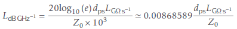

where e  2.718 281 828
459 is the base of the natural logarithm and dps is the offset delay in ps.
Conversion in the opposite direction for one-port standards yields:

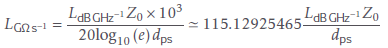

Conversion from the Keysight offset loss term (LGΩs−1) to the alternate loss
term for two-port standards is given as:

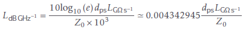

Conversion in the opposite direction for two-port standards yields:

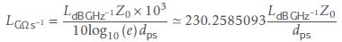

The alternate offset term (LdB GHz−1) accounts for the loss along the forward
and the reverse path for one-port standards while the Keysight offset loss
term (LGΩs−1) represents the one-way loss for both one-port and two-port
standards.

The conversion between the Keysight offset delay term and the alternate offset
length term is defined by

This implies the alternate Offset Length is an electrical length related to
the physical length l by

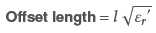

## Open Calibration Standard Parameters

An OPEN calibration standard is based on the terminated transmission line
model where the termination impedance ZT is defined by polynomial coefficients
that represent a capacitance model.

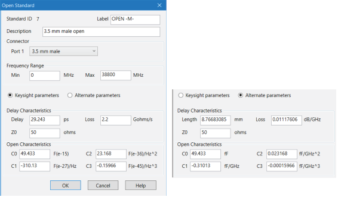

Open circuits radiate at high frequencies. This effectively increases the
electrical length of the device and can be modeled as a frequency dependent
capacitor, Copen, (also known as fringing capacitance). At low frequencies, a
fixed capacitance value may be sufficient; this would use only the C0 term.
Most network analyzers use a third order polynomial capacitance model.
Radiation loss is assumed to be insignificant.

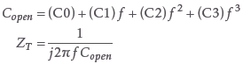

Keysight Parameters |  Alternate Parameters  
---|---  
C0 is in units of 10-15 F |  C0 is in units of fF  
C1 is in units of 10-27 F/Hz |  C1 is in units of fF/GHz  
C2 is in units of 10-36 F/Hz2 |  C2 is in units of fF/GHz2  
C3 is in units of 10-45 F/Hz3 |  C3 is in units of fF/GHz3  
  
## Short Calibration Standard Parameters

An SHORT calibration standard is based on the terminated transmission line
model where the termination impedance ZT is defined by polynomial coefficients
that represent an inductance model.

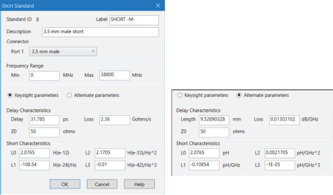

Many vector network analyzers assume that the short is an ideal short and has
a reflection coefficient of –1. This may be adequate at low frequencies and
for large connector sizes, such as 7 mm and larger. However, at higher
frequencies and for smaller connectors, 3.5 mm and smaller, at least a third
order polynomial inductance model, Lshort , is required. Loss of the short
circuit is assumed to be insignificant.

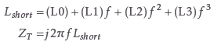

Keysight Parameters |  Alternate Parameters  
---|---  
L0 is in units of 10-12 H |  L0 is in units of pH  
L1 is in units of 10-24 H/Hz |  L1 is in units of pH/GHz  
L2 is in units of 10-33 H/Hz2 |  L2 is in units of pH/GHz2  
L3 is in units of 10-42 H/Hz3 |  L3 is in units of pH/GHz3  
  
## Load Calibration Standard Parameters

Four types of LOAD standards are available: a fixed load, sliding load,
arbitrary impedance and offset load. The fixed load and arbitrary impedance
load are based on the terminated transmission line model.

#### Fixed Load

The default setting for fixed load is Offset delay= 0, Offset loss= 0, and
Offset Z0 = Zref ; i.e. a perfect termination, ΓT = 0. However, if an offset
transmission line with a finite delay and loss is specified, and an Offset Z0
is not equal to the reference impedance (Zref ), the total reflection is NOT
zero.

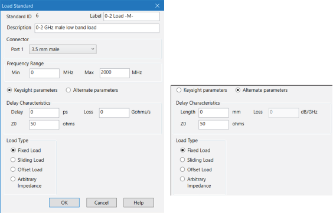

#### Sliding Load

A sliding load is defined by making multiple measurements of the device with
the sliding load element positioned at various marked positions of a long
transmission line. The transmission line is assumed to have zero reflections
and the load element has a finite reflection that can be mathematically
removed, using a least-squares-circle-fitting method. For best results, move
the load element in the same direction. Also, slide in non-uniform increments.
A sliding load triggers prompts for multiple slide positioning and
measurements. A minimum of 6 slide positions is recommended.

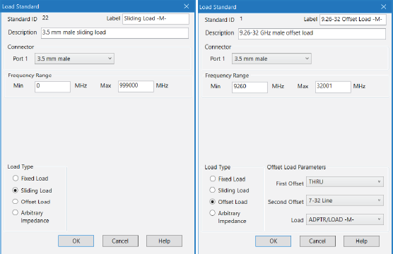

#### Offset load

An offset load can be considered a compound standard consisting of 2 known
offsets (transmission lines) of different lengths and a load element. The
definition of the offsets is the same as all offset transmission lines. The
shorter of the two offsets can be a zero length offset. The load element is
defined as a one-port reflection standard. An offset load standard is used
when the response of the offset standards are known more precisely than the
response of the load element.

Measurement of an offset load standard consists of two measurements, one with
each offset terminated by the load element. The frequency range of the offset
load standard should be set so that there will be at least a 20° separation
between the expected response of each measurement. In cases where more than
two offsets are used the frequency range may be extended as the internal
algorithm at each frequency will search through all of the possible
combinations of offsets to find the pair with the widest expected separation
(to use in determining the actual response of the load element.)

When specifying more than two offsets, the user should define multiple offset
load standards. When assigning multiple offset load standards to SOLT classes
for the VNA. it is usually beneficial to specify “use expanded math when
possible”.

#### Arbitrary impedance

An arbitrary impedance device is similar to a fixed load except that the load
impedance is NOT perfect.

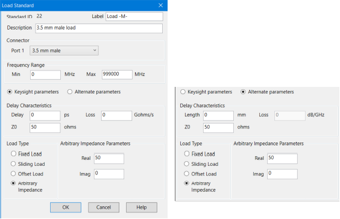

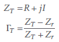

## Thru Calibration Standard Parameters

The thru standard is based on the transmission line model.

The following dialogs show the parameters associated with the thru standard. The Virtual Device checkbox is set to indicate that the standard being modeled doesn’t include a physical device. An example of a virtual device is the flush thru standard where the VNA testports are directly connected to each other. This signals the calibration software to create the appropriate descriptions of the calibration topology. For the flush thru standard checking Virtual Device causes the prompt to be PORT 1 | PORT 2 rather than PORT 1 | THRU | PORT 2.

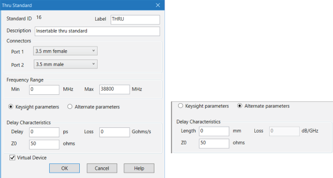

* * *

