# Using ECal

* * *

This topic discusses all aspects of performing an ECal:

  * [ECal Overview](Using_ECal.md#About)

  * [Connect ECal Module to the Analyzer](Using_ECal.md#Connect)

  * [How to Perform a Calibration Using ECal](Using_ECal.md#CalProcedure1)

### See Also:

[ECal User-Characterization](ECal_User_Characterization.md)

[Perform a 4-Port Cal with ONE 2-Port ECal
Module](Perform_a_4-Port_Cal_with_a_2-Port_ECal_Module.htm)

[Restore ECal Module Memory](ECal_User_Characterization.md#Restore)

[See other Calibration Topics](Calibration.md)

ECal Overview

ECal is a complete solid-state calibration solution. Every ECal module
contains electronic standards that are automatically switched into position
during a measurement calibration. These electronic standards have been
measured at the factory and the data stored within the memory of the ECal
module. The analyzer uses this stored data, along with the measured data, to
calculate the error terms for a measurement calibration.

ECal modules are available in 2-port and 4-port models and a variety of
connector types, covering many frequency ranges. See [Analyzer
Accessories](../Support/Analyzer_Accessories.htm#ElectronicCal) for more about
available ECal modules and ordering information.

You can perform the following calibrations with ECal:

  * 1-Port Reflection calibration

  * Full 2-Port calibration

  * Full 3-Port calibration

  * And so forth...

Verify the validity of a mechanical or ECal calibration with [ECal confidence
check](Quest_Cal.htm#AboutECal).

### Care and Handling of ECal Modules

You can improve accuracy, repeatability, and avoid costly repair of equipment
in the following ways.

  * Practice proper connector care. See [Connector Care](../Tutorials/Connector_Care.md).

  * Protect equipment against ESD damage. Read [Electrostatic Discharge Protection](../Tutorials/esd.md).

### Power Level into an ECal module

  * NEVER exceed the following Damage levels to the ECal module.

  * For highest accuracy, do not exceed the following ECal Compression levels when calibrating:

Model | Compression level | Damage level  
---|---|---  
N469x series | -5 dBm | +10 dBm  
N4432x series N4433x series N443xD series | -7 dBm | +20 dBm  
N4431B | +7 dBm | +20 dBm  
N755xA series | -15 dBm | +10 dBm  
N756xA series | -10 dBm | +15 dBm  
8509x series | +9 dBm | +20 dBm  
  
The power level can be increased after calibration with minimal impact on
measurement accuracy.

Connect ECal Module to the Analyzer

ECal modules are controlled and powered through a USB connection. When you
connect the module, the type of module, frequency range, and connector type
are automatically recognized.

Important Note: DO NOT connect/disconnect USB devices during ECal
calibrations. Doing so may cause problems with the calibration.

[See Important First-time USB connection
note](../Front_Panel/XTour.htm#FirstTimeNote).

ECal modules connect to the USB port on the front or rear panel of the VNA.

ECal Module USB Port Analyzer Front Panel USB Port

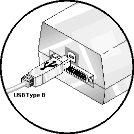
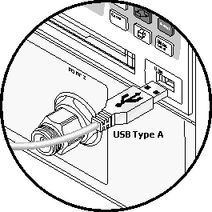

Notes:

  * Unused ECal modules that have completed a calibration may remain connected to the USB port.

  * You can connect and disconnect the ECal module while the analyzer is operating. However, DO NOT connect or disconnect the module while data transfer is in progress. This can result in damage or at least corrupted data.

#### N756xA ECal Connection

N756xA Multi-port ECal module does not support the [auto port
orientation](Using_ECal.htm#AutoPortOrientation) but executes the connection
check when Do orientation is checked. The following measures must be taken to
ensure the calibration is performed properly:

  * N756xA ECal port must be connected from the port A on the first unit. Do not skip a port on the Ecal.

  * The VNA port number and N756xA ECal port number must be sequential each other.

  * In Cal All, the rules are applied on all ports in channels, not each channel. Example: Cal All can execute on the setup (Ch1: port 1/4/7, Ch2: port 2/5/7, Ch3: 3/6/9) in the connection example below.

  * In the multi-unit configuration, the units must be ordered sequentially by the serial number

"Unable to orient Ecal" is displayed if the Do Orientation is checked and the
connection is incorrect.

Connection Example

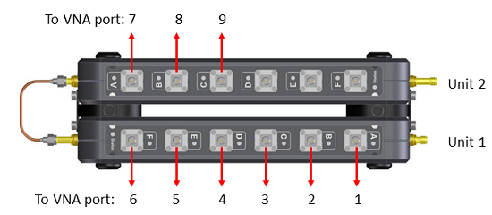

  * The serial number of unit 1 should be smaller than the one of unit 2.

Correct Connection Examples

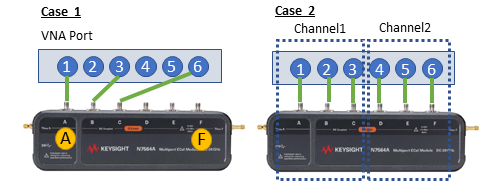

Case 1: Skipping VNA ports is acceptable

Case 2: Use "CAL ALL" instead of Smart Cal or Ecal (under Other Cals) . The
Smart Cal and Ecal cannot execute on Channel 2. Because the channel 2 starts
from the port C on Ecal.

Incorrect Connection Examples

Case 1: The port C is skipped.

Case 2: The port connection is not sequential.

Case 3: The connection does not start from the port A of unit 1. (In the
multi-unit configuration, the units must be ordered sequentially by the serial
number.)

### How to Perform a Calibration Using ECal

Select an ECal module that has connectors of the same type and gender as the
DUT. If such an ECal module is not available, a module with connectors
different from the DUT can be used by using [Advanced
Settings](Using_ECal.htm#Advanced_Settings_ECal_help2) or [User
Characterization](ECal_User_Characterization.htm). See Also: [Perform a 4-Port
Cal with ONE 2-Port ECal
Module](Perform_a_4-Port_Cal_with_a_2-Port_ECal_Module.htm) Connect the ECal
module ports to the analyzer ports. During the calibration process the
analyzer can either automatically detect how the ECal module is connected, or
the orientation can be performed manually.

  1. Connect the ECal module USB cable to the analyzer USB. See [Connect ECal Module to USB](Using_ECal.md#Connect).
  2. Allow the module to warm up until it indicates READY.

Note: N755xA series ECal modules do not require a warm-up period.

  3. Enter the analyzer settings. See [Set Up Measurements](../S1_Settings/Select_a_Measurement_State.md).
  4. Do one of the following to start the [Calibration Wizard](Calibration_Wizard.md#Using_cal_wizard)

  
---  
Using Hardkey/SoftTab/Softkey  
  
  1. Press Cal > Main > Other Cals > Ecal....

  
  
  
  2. In the [Guided Calibration Wizard](calibration_wizard.md#GuidedCal) dialog box (step 2), select ECal option from the Cal Kits combo box.

  
  
Select Calibration Ports and ECal Module dialog box help  
---  
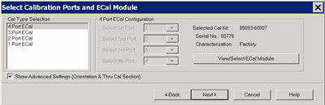 Allows you to select calibration
type and settings. Cal Type Selection / Configuration Select the number of
ports to calibrate. Then select the port number configuration. 4 Port ECal 3
Port ECal 2 Port ECal 1 Port ECal- (Reflection) Advanced Settings are not
available. View/Select ECal Module Click to Select the ECal module if more
than one ECal module is connected to the USB. Also, [Select the User
Characterization](Using_ECal.htm#Select) within the module. Learn more about
[User Characterization](ECal_User_Characterization.md). Show Advanced
Settings Check to display the [Advanced
Settings](Using_ECal.htm#Advanced_Settings_ECal_help2) when Next is clicked.
Calibrate source and receiver power Check to perform a Guided Power
Calibration. [Learn more.](Guided_Power_Calibration.md) Back Return to [Cal
Wizard Begin](Calibration_Wizard.htm#Calibration_Wiz_help) dialog. Note: ECal
isolation is not performed. The inherent isolation of the analyzer is better
than that attained with correction using an ECal module. Note: Terminate any
unused ECal ports with a 50 ohm load. Refer to [Determining Effects of Not
Terminating Unused ECal Ports](Quest_Cal.htm#Open_ECal_Ports). Note: Do not
connect any USB memory during ECal calibration.  
  
ECal module not found dialog box help  
---  
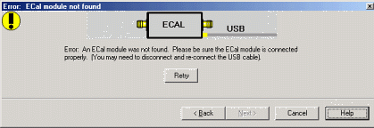 When this dialog appears, the ECal
module is not connected or has not been recognized by the network analyzer.
Retry Check the USB connections and click to continue. Notes:

  * If your ECal module is not detected, try to unplug, then reconnect to the USB.
  * When the ECal module is connected to the network analyzer for the first time, it may take approximately 30 seconds for the analyzer to recognize the module and make it available for calibration.
  * For best accuracy, allow the ECal module to warm-up until it indicates READY.
  * Keysight 8509x and N4431 ECal modules, when first connected, draw significantly more current than other modules. This could cause the USB to stop working in certain situations. [See USB limitations](../Rear_Panel/XRtour.md#usbHub).
  * See [Connect ECal Module to USB](Using_ECal.md#Connect).

  
  
Select Module and Characterization dialog box help  
---  
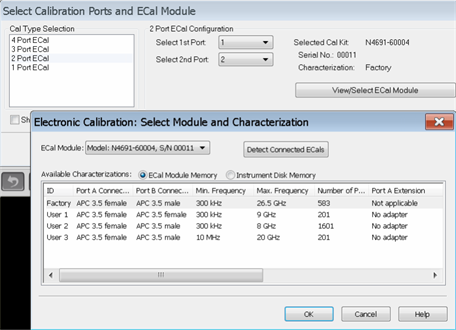 Note: User
Characterizations listed in the dialog below that have no temperature shown
cannot be temperature-compensated during calibrations. Also, this is true of
CalPod as ECal characterizations that were performed prior to this temperature
capability in the VNA firmware, because temperature was not measured-and-
recorded. However, the firmware will still recognize those and allow them to
be used for cals. 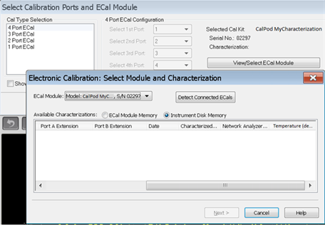 ECal
Module Select one of the ECal modules that are connected to the analyzer.
Detect Connected ECals Click to rescan the USB for ECal modules. Available
Characterizations ECal Module Memory \- Displays the factory and [user
characterizations](ECal_User_Characterization.htm) that are stored in the ECal
module. Instrument Disk Memory \- Displays the user characterizations that are
stored in Disk Memory. [Learn more User Characterizations in Disk
Memory.](ECal_User_Characterization.htm#DetailedUser) Temperature \- Displays
the temperature reading at the time a characterization was performed.  The
information in the Calset Properties dialog confirms which of those
characterizations were temperature-compensated during calibration. The
(compensated) notation for a CalPod indicates that the CalPod’s
characterization was temperature-compensated when that cal’s error terms were
computed (it also implies the factory thermal data for that CalPod must be
present on the VNA). Whereas the (uncompensated) notation indicates that
temperature-compensation could not be done for that characterization during
the cal, which could mean either that one is an older characterization that
didn’t record its temperature, or else factory thermal data for that CalPod
serial # was not installed on the VNA.  Select the characterization data to
use for the calibration. Once selected, that characterization becomes the
default selection until the analyzer is turned OFF and restarted. When
restarted, Factory again becomes the default selection.  
  
Error: Frequency Range dialog box help  
---  
 When this dialog appears, the current
cal standards (or ECAL module) does not cover the current frequency range of
the measurement. Do one of the following to correct the problem: Cal Kit Class
Category Not available with ECal modules. Frequency Change the frequency range
of the active channel. Edit Not available with ECal modules. Back Select a
different characterization that covers the required frequency range. Cancel
Re-characterize the module with an increased frequency range.  
  
Select DUT Connectors and Cal Kits dialog box help  
---  
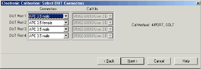 If the ECal module or selected
User Characterization has more than one connector type, then the following
dialog box is presented which allows you to describe the DUT connector type.
Otherwise, click next to proceed to [Advanced
Settings](Using_ECal.htm#Advanced_Settings_ECal_help2) (if checked) or [ECal
Steps](Using_ECal.htm#Electronic_cal_Steps_help). Connectors The available
connectors are listed for each DUT port.  
  
Advanced Settings dialog box help  
---  
  
### 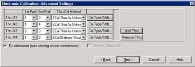

### Thru #n

Lists the proposed Thru connections to be made during the calibration process.
You can change these Thru connections to better suit your test setup.

  * The proposed Thru connections are listed automatically.
  * Additional Thru connections can be selected for higher accuracy. [Learn more](Errors.md#HowOnly3Thrus).
  * For Balanced measurements, [learn which Thru paths to select](../S1_Settings/Balanced_Measurements.md#Calibrating).

### Add Thru

Click to add a Thru connection. [Learn more](Errors.md#HowOnly3Thrus)

### Remove Thru

Select a Thru by clicking the "Thru #N" field or the "1st Port / 2nd Port"
field. Then click "Remove Thru". This selection is NOT available if the
selected Thru is required for the calibration.

### 1st Port / 2nd Port

Click to change the two ports to be included in the Thru connection. The order
of the port numbers (1st or 2nd) is not critical.

### Thru Cal Method

Lists the available Thru Cal methods for the specified port pairs. [Learn
about ECal Thru Methods](Calibration_THRU_Methods.htm#ECal)

### Cal Type/ Stds

Click to invoke the [View / Modify Properties of Cal dialog
box](Calibration_Wizard.htm#ModifyCal)

### Do orientation

When this box is checked (the default setting) the VNA automatically senses
the model and direction in which an ECal module port is connected to the VNA
ports. If power to the ECal module is too low, it will appear as if there is
no ECal module connected. If you use low power and are having this problem,
clear this check box to provide the orientation manually. Orientation occurs
first at the middle of the frequency range that you are calibrating. If a
signal is not detected, it tries again at the lowest frequency in the range.
Note: The orientation is not supported but the connection check is done for
the [N756xA Multi-port ECal](Using_ECal.md#N756xAECalConnection).

### Choose delta match

Available only when a Delta Match Cal is required.

  * Check, then click Next to invoke the [Select Cal Set for Delta Match](Calibration_Wizard.md#SelectDMCalSet) dialog box.
  * Clear - The Cal Wizard uses the [Global Delta Match Cal](Delta_Match_Calibration.md) if available.

  
  
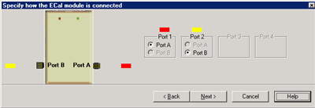

Specify how the ECal module is connected dialog box help  
---  
This dialog box appears when the Do orientation checkbox in the previous
dialog box is cleared. Click the ECal Port that is connected to each VNA port.  
  
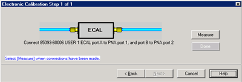

Electronic Calibration Steps dialog box help  
---  
Note: Beginning in VNA Rev. 6.0, ECal can be performed with External triggers.
[Learn more.](../S1_Settings/External_Triggering.md#ExternalDiag) Displays
the instructions for each measurement required for calibration. Measure
Measures the ECal standards. Done Click when last standard has been measured.  
  
Saving an ECal Calibration

When complete, you can save the new calibration. [Learn
how.](Calibration_Wizard.htm#SavingAll)

* * *

