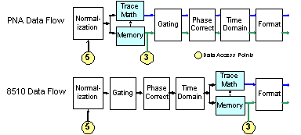

# 8510 Mode

* * *

On the [Trace Math](Math_Operations.md#MathMemorydialogbox) dialog, check
8510 Mode to simulate the Keysight 8510 data processing chain as it pertains
to Trace Math and Memory. This setting applies to all channels. When the box
is checked or cleared, the analyzer performs an [Instrument
Preset](../S1_Settings/Preset_the_Analyzer.htm) and retains its setting
through subsequent Instrument Presets.

This setting can be saved as part of an [instrument
state](../S5_Output/SaveRecall.htm#FileTypes). However, when recalled, this
setting is assumed only temporarily. When a subsequent analyzer Preset is
performed, the analyzer reverts to the setting that was in effect before the
state was recalled.

You can [set a preference](../System/Preferences.md) to always use 8510 mode.

  
---  
This image represents the relevant portion of the data flow. [See the entire
analyzer data processing chain.](../Programming/DataMapSet.htm)  
  
A settings change in any of the operations that occur after the Memory
operation on the above analyzer Data Flow diagram changes both the Data trace
and the Memory trace. For example, after storing a data trace to memory, when
you change the format for the Data Trace, the format for the Memory Trace is
also changed to the same setting.

#### How to turn ON/OFF 8510 mode  
  
---  
Using Hardkey/SoftTab/Softkey  
  
  1. Press Math > Memory > 8510 Mode.

  
No programming are available for this feature  
  
* * *

* * *

