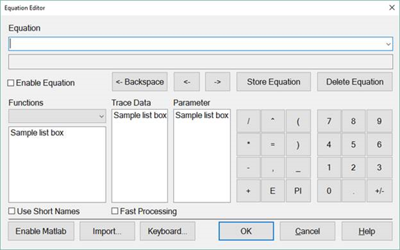
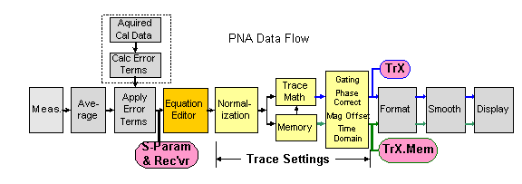
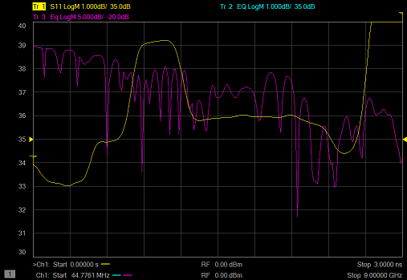

# Equation Editor

* * *

Equation Editor allows you to enter an algebraic equation that can
mathematically manipulate measured data. The results are displayed as a data
trace. Data that is used in the equation can be from the same or different
channels.

  * [Overview](Equation_Editor.md#Overview)

  * [How to start Equation Editor](Equation_Editor.md#How)

  * [Using Equation Editor](Equation_Editor.md#Using)

  * [Data that is used in Equation Editor](Equation_Editor.md#Measured)

  * [Trace Settings, Error Correction, and an Example](Equation_Editor.md#TraceSettings)

  * [Functions and Constants](Equation_Editor.md#Functions)

  * [Operators used in Equation Editor](Equation_Editor.md#Operators)

  * [Example Equations](Equation_Editor.md#Examples)

  * [Saving Equation Editor Data](Equation_Editor.md#Saving)

### See Also

[Using Noise Power Traces in Equation
Editor](../Applications/Noise_Figure.htm#UsingEquationEditor)

[Equation Editor to Compute the Dynamic Range of an IMD
Channel](Equation_Editor_Dynamic_Range_IMD.htm)

[Equation Editor Import Functions](Equation_Editor_Import_Functions.md)

[Equation Editor and MATLAB](Equation_Editor_and_MatLab.md)

[Equation Editor and Python](Equation_Editor_with_Python.md)

[External DC Meter Data Conversion](External_DC_Meter_Data_Conversion.md)

  * [BestFit.dll](Equation_Editor_Import_Functions.md#BuiltInFunctions)

  * [EqnErrorTerms.dll](Equation_Editor_Import_Functions.md#EqnErrorTerms)

  * [Expansion.dll](Equation_Editor_Import_Functions.md#Expansion)

[Other 'Analyze Data' topics](Analyze_Data.md)

Overview

Equation Editor allows you to enter an algebraic equation of standard
mathematical operators and functions, referencing data that is available in
the analyzer. Once a valid equation is entered and enabled, the display of the
active trace is replaced with the results of the equation, and updated in
real-time as new data is acquired. For equations that can be expressed with
Equation Editor's supported functions, operators, and data, there is no need
for off-line processing in a separate program.

For example, enter the equation S21 / (1 - S11). The resulting trace is
computed as each S21 data point divided by one minus the corresponding S11
data point. For a 201 point sweep setup, the computation is repeated 201
times, once for each point.

As another example, suppose you want the analyzer to make a directivity
measurement of your 3-port DUT. This is not a native measurement, but can be
achieved using the Equation Editor. The desired result is the sum and
difference of LogMag formatted traces, expressed as: S12 \+ S23 - S13.

Because Equation Editor operates on unformatted complex data, the required
equation is:

DIR = S12 * S23 / S13

DIR becomes a display label to help you identify the computed data trace.

On the equation trace, set the format to LogMag.

#### How to start Equation Editor  
  
---  
Using Hardkey/SoftTab/Softkey  
  
  1. Press Math > Analysis > Equation Editor.

  
  
Equation Editor dialog box help  
---  
 | Notes

  * Double-click, or type, the Functions, Operators, and Data to build an Equation.
  * Scroll down to learn more about [Using Equation Editor](Equation_Editor.md#Using)

  
---  
  
Equation: The field in which equations are built. Click the down arrow to the
right to use or modify equations that have been previously saved. This is
where equations are saved when you press 'Store Equation'.

Enabled Check this box to enable the equation that is currently in the
Equation field. If the Enabled box is not available, then the equation is not
valid. If a data trace is used that is from a different channel than the
Equation trace, the channels MUST have the same number of data points to be
valid.

<-Backspace Moves the cursor to the left while erasing characters.

<- Moves the cursor to the left without erasing characters.

-> Moves the cursor to the right without erasing characters.

Store Equation Press to save the current equation. To later recall the
equation, click the down arrow to the right of the equation.

Delete Equation Removes the current equation from the drop-down list.

Functions/Constants: See [descriptions of
Functions](Equation_Editor.htm#Functions).

Select the "library" of functions to view. The "built-in" library appears by
default which includes the standard functions of equation editor. Other
functions that can appear here are functions that you have written and
imported. [Learn more.](Equation_Editor_Import_Functions.md)

Operators: See [descriptions of Operators.](Equation_Editor.md#Operators)

Trace Data: Select from ALL of the currently valid displayed traces on ALL
channels. Valid displayed traces are defined as: any trace with the same
number of points as the equation trace and the trace cannot reference itself.

Parameter: Select from undisplayed data that is available ONLY from the active
channel (same channel as the equation trace). See [Data that is used in
Equations](Equation_Editor.htm#Measured).

Note: With an external test set enabled, only parameters involving ports 1
through 4 are listed. However, all available parameters can be typed directly
into the Equation field.

Use Short Names Some functions have shortened names that are entered
automatically when checked. Both long and short names can be used
interchangeably.

Fast Processing When checked, updates from trace references or marker
references will occur once per sweep. The underlying trace will still update
normally. Also, if there are no trace references or marker references in the
equation, then there is no change in behavior.

A trace reference is when the equation uses another trace (for example, “eq =
tr1 + tr2”). A marker reference is when the built-in marker functions mrkx()
or mrky() are used.

Enable Matlab Available when a full MATLAB version is installed by you on the
analyzer. [Learn more](Equation_Editor_and_MatLab.md).

Import... Click to launch the [Import
Functions](Equation_Editor_Import_Functions.htm) Dialog box.

Keyboard...: Provided to allow navigation of the entire dialog with a mouse.  
  
Using Equation Editor

### 1\. Pick a trace in which to enter the equation

  * Equation Editor works on the active trace.

  * Either create a new trace, or click the [Trace Status](../S1_Settings/Customize_Your_Analyzer_Screen.md#trace_status) button on an existing trace to make the trace active.

### 2\. Enter an equation

Start Equation Editor [See how.](Equation_Editor.md#How)

  * The equation text can be in the form of an expression (S21)/(1-S11) or an equation (DIR = S12 * S23 / S13). This topic refers to both types as equations.

  * Either type, or double-click the Functions, Operators, and Data to build an equation.

  * Functions and Constants ARE case-sensitive; Data names are NOT case sensitive.

  * [Learn more about referring to data traces.](Equation_Editor.md#Measured)

### 3\. Check for a valid equation

When a valid equation is entered, the Enabled checkbox becomes available for
checking. When the Enabled box is checked:

  * The Equation Trace becomes computed data.

  * The equation is visible on the [Trace Status](../S1_Settings/Customize_Your_Analyzer_Screen.md#trace_status) (up to about 10 characters).

  * The equation is visible in the trace [Title](../S1_Settings/Customize_Your_Analyzer_Screen.md#title) area (up to about 45 characters) when the Equation trace is active.

  * The equation is visible in the [Status Bar](../S1_Settings/Customize_Your_Analyzer_Screen.md#status_bar) at the bottom of the display. This is updated only after the equation is entered and the [Trace Status](../S1_Settings/Customize_Your_Analyzer_Screen.md#trace_status) button is clicked.

  * If an equation is NOT valid, and a trace from a different channel is used, make sure the number of data points is the same for both channels.

Learn more about the [Functions](Equation_Editor.md#Functions),
[Operators](Equation_Editor.md#Operators), and
[Data](Equation_Editor.md#Measured) that are used in Equation Editor.

Data that is used in Equation Editor

### Definitions

  * Equation trace A trace in which an equation resides.

  * Referred trace A trace that is used as data in an equation.

Example: eq=Tr2+S11 is entered into Tr1.

Tr1 becomes an equation trace.

Tr2 and S11 are both referred traces because they are used in the equation
trace.

### Notes

  * Referred traces are processed one data point at a time. For example, the expression S11/S21 means that for each data point in S11 and S21, divide point N of S11 by point N of S21.

  * Once an equation is enabled, the trace is no longer identified by its original measurement parameter. It becomes an equation trace.

  * An equation trace can NOT refer to itself. For example, an equation in Tr1 cannot refer to trace Tr1.

  * Referred traces can be selected from S-Parameters, Receiver data, [Memory traces](Math_Operations.md#MemoryTraces), and application channels. When equation editor is opened in an application channel, the corresponding application parameters can be selected.

  * [See note regarding External Test Sets.](Equation_Editor.md#ExtTS)

  * See [Using Noise Power Traces in Equation Editor](../Applications/Noise_Figure.md#UsingEquationEditor)

### There are three ways to refer to traces:

The following distinction is important when discussing the three ways to refer
to traces/data.

  * Trace \- a sequential collection of data points that are displayed on the screen.

  * Data \- analyzer measurements that are acquired but not displayed. When an equation trace refers to data that is not displayed, the analyzer will automatically acquire the data.

1. Using TrX Trace notation (for example, Tr2).

When a trace is created, check ["Show Tr
Annotation"](Equation_Editor.htm#EquationDialog) to see the Tr number of that
trace.

  * Simple - ALWAYS refers to displayed traces.

  * Must be used for referring to traces in a different channel as the equation trace.

  * All [trace settings](Equation_Editor.md#TraceSettings) are preserved in the equation trace. If you do NOT want a trace setting to be used in the equation trace, you must disable it in the referred trace.

  * If the referred trace is error corrected, then that data is corrected in the equation trace.

  * Used to refer to a memory trace (it must already be stored in memory). Append .MEM to the TrX trace identifier. For example, Tr2.mem refers to the memory trace that is stored for Tr2.

2. Using S-parameter notation (for example, S11/S21)

  * Convenient \- ALWAYS refers to data that is NOT displayed.

  * Refers to data that resides in the same channel as the equation.

  * NOT the same as referring to a displayed S11 trace using TrX notation. [See Example](Equation_Editor.md#TraceSettings).

  *     * The referred data includes NO [trace settings](Equation_Editor.md#TraceSettings).

    * If correction is applied to the channel, equation editor traces in that channel will attempt to use corrected parameter data regardless if correction is on/off for the measurement. If there is no corrected data available, then raw data will be used. TrX notation always ignores the correction state.

3. Using Receiver notation (for example AB_2); NOT case sensitive.

At least one receiver is required, followed by an underscore and a number.

  * The letters before the underscore refer to the receivers.

  *     * Letters alone refer to physical receivers.

    * Letters immediately followed by numbers refer to logical receivers. [Learn more.](../S1_Settings/Measurement_Parameters.md#RecNotation)

    * If two receivers are referenced, they are ratioed.

  * The number after the underscore refers to the source port for the measurement.

Examples

  * AR1_2 = physical receiver A / physical receiver R1 with 2 as the source port.

  * a3b4_1 = reference receiver for port 3 / test port receiver for port 4 with 1 as the source port.

[Learn more about ratioed and unratioed receiver
measurements.](../S1_Settings/Measurement_Parameters.htm#arb_ratio)

Receiver notation is like S-parameter notation in that:

  * Refers to data that is NOT displayed and resides in the same channel as the equation.

  * The referred data includes NO trace settings.

  * If correction is applied to the channel, equation editor traces in that channel will attempt to use corrected parameter data regardless if correction is on/off for the measurement. If there is no corrected data available, then raw data will be used. TrX notation always ignores the correction state.

### Referring to Traces in a different channel

When the equation trace refers to a trace on a different channel:

  * The trace must already be displayed.

  * Must refer to the trace using TrX notation.

  * The Equation trace and the referred trace MUST have the same number of data points or the Enable checkbox will not be available.

  * The Equation trace is updated when the last referred data in the same channel is acquired. Therefore, to prevent 'stale' data from being used, the Equation trace must be on a higher numbered channel than the referred trace. This is because the analyzer acquires data in ascending channel number order - first channel 1, then channel 2, and so forth. If the Equation trace is on channel 1, and it refers to a trace on channel 2, the Equation trace will update after channel 1 is finished sweeping, using 'old' data for the channel 2 trace.

### Port Extensions and Equation Editor

When using port extension with an equation, turn Fixturing ON to ensure that
the underlying parameters have port extension properly applied. Learn more.

Trace Settings, Error Correction, and an Example

This discussion highlights the differences between using S-parameter /
Receiver notation and TrX notation when referring to traces. The key to
understanding the differences is realizing that S-parameter / Receiver
notation ALWAYS refers to data that is NOT displayed.

  * Trace Settings Normalization, Trace Math, Gating, Phase and Mag Offset, Electrical Delay, Time Domain.

  * Equation Editor processing occurs on the equation trace immediately after error correction.

  * Referred Data/Trace (used in the equation) is taken from the following locations:

  * When using TrX notation, data is taken immediately before formatting . These traces are always displayed and include Trace Settings.

  * When using S-parameter / Receiver notation, data is taken immediately after error correction. This data is NOT displayed and includes NO trace settings ([see example](Equation_Editor.md#Example)).

See Equation Editor Notes at [GetData
Method](../Programming/COM_Reference/Methods/Get_Data_Method.htm) or
[GetDataByString
Method](../Programming/COM_Reference/Methods/Get_DataByString_Method.htm).

### Error-correction and Equation Editor

Using TrX notation:

  * The Trace Settings and Error-correction on the referred trace are used in the Equation trace.

  * If error correction is NOT ON, then the raw, uncorrected data is used in the equation trace.

  * To see if error correction is ON, make the trace active, then see the [Correction level in the status bar.](../S3_Cals/Error_Correction_and_Interpolation.md#Viewing)

  * Turning error correction ON/OFF on the equation trace has no meaning. The referred data that is used in the equation is ALWAYS what determines its level of correction.

Using S-parameter and Receiver notation:

  * Because the data is not displayed, NO trace settings are used in the Equation trace.

  * If correction is applied to the channel, equation editor traces in that channel will attempt to use corrected parameter data regardless if correction is on/off for the measurement. If there is no corrected data available, then raw data will be used. TrX notation always ignores the correction state.

  * When using S-parameter and Receiver notation to refer to a trace on a channel that has been calibrated with a [Response Cal](../S3_Cals/Select_Cal.md#openshort) or Receiver Cal, correction can NOT be turned ON, even though the Status Bar indicates otherwise. For example: Tr1 is an S11 measurement with a Response Cal. Tr2 is an equation trace that refers to S11. The Tr2 equation trace is NOT corrected, even though the Status Bar may indicate that it is corrected. However, if Tr2 refers to Tr1 (not S11), the Tr2 equation trace is corrected.

### Example

This example illustrates the differences when referring to a trace using
S-parameter notation and TrX notation:

  * Tr1 is an S11 measurement with no equation, 2-port correction ON, and Time Domain transform ON.

  * Tr2 is an equation trace that refers to Tr1. Tr2 is corrected because Tr1 is corrected. Tr2 is transformed because Tr1 is transformed. If transform is turned ON for Tr2, the data will be transformed AGAIN, which results in "unusual" data.

  * Tr3 is an equation trace that refers to S11. This is NOT the same as referring to Tr1. The S11 trace that is referred to is a different instance of S11 that is NOT displayed, and has NO trace settings. Notice that Tr3 data is NOT transformed, although Tr1 is transformed. Correction for Tr3 can be turned ON and OFF because a calibration was performed on the channel in which the S11 trace resides.

  * Note: X- axis annotation of the Equation trace is completely independent of the data that is presented. ONLY the data values from a referred trace are used. For example, notice that the Equation trace Tr2 has Frequency on the X-axis although the referred trace Tr1 is presented in Time.

Functions and Constants used in Equation Editor

ALL trace data that is used in Equation Editor is unformatted, complex data.
When using a mouse with the analyzer, hover over a function in the dialog to
learn how it is used. In the following table,

  * Function(scalar x) means that an automatic conversion from a complex number to its scalar magnitude is performed before passing the value to the function.
  * Function(complex x) means that the entire complex value is used.
  * a, b, c, d are arguments that are used in the function.

  
---  
  
Function/Constant | Description  
---|---  
acos(scalar a) | returns the arc cosine of a in radians  
asin(scalar a) | returns the arc sine of a in radians  
atan(scalar a) | returns the arc tangent of a in radians  
atan2 | returns the phase of complex a = (re,im) in radians has the following two argument sets:

  * atan2(complex a) - returns the phase in radians
  * atan2(scalar a, scalar b)

  
conj(complex a) | takes a and returns the complex conjugate  
cos(complex a) | takes a in radians and returns the cosine  
cpx(scalar a, scalar b) | returns a complex value (a+ib) from two scalar values  
e | returns the constant =~ 2.71828...  
exp(complex a) | returns the exponential of a  
getNumPoints() | returns the number of points for the current sweep  
im(complex a) | returns the imag part of a as the scalar part of the result (zeroes the imag part)  
kfac(complex a, complex b, complex c, complex d ) when entered in EE:  
kfac(S11,S21,S12,S22) | k-factor: k = (1 - |a|^2 - |d|^2 + |a*d-b*c|^2 ) / (2 * |b*c|) returns a scalar result - the imaginary part of the complex result is always 0  
ln(complex a) | returns the natural logarithm of a  
log10(complex a) | returns the base 10 logarithm of a  
mag(complex a) | returns sqrt(a.re*a.re+a.im*a.im)  
max(complex a, complex b, ...) | returns the complex value that has the largest magnitude of a list of values.  
max_hold(complex a) | holds the current maximums of the sweep. Disable the equation to reset. [See example](Equation_Editor.md#MaxMinHold)  
median(complex a, complex b,...) | returns the median of a list of complex values

  * The median is determined by sorting the values by magnitude, and returning the middle one.
  * If an even number of values is passed, then the smaller of the two middle values is returned.

  
min(complex a, complex b, ...) | returns the complex value that has the smallest magnitude of a list of values.  
min_hold(complex a) | holds the current minimums of the sweep. Disable the equation to reset. [See example](Equation_Editor.md#MaxMinHold)  
mrkx(a,b) | returns the x-axis value of marker number b on trace number a.  
mrky(a,b) | returns the y-axis value of marker number b on trace number a.  
mu1(complex a, complex b, complex c, complex d ) when entered in EE:  
mu1(S11,S21,S12,S22) | mu1 = (1 - |a|^2) / ( |d - conj(a) * (a*d-b*c)| + |b*c| )  
mu2( complex a, complex b, complex c, complex d ) when entered in EE:  
mu1(S11,S21,S12,S22) | mu2 = (1 - |d|^2) / ( |a - conj(d) * (a*d-b*c)| + |b*c| )  
for both mu1 and mu2 (Usually written with the Greek character μ ) | 

  * conj is the complex conjugate. For scalars a and b, conj(a+ib) = (a-ib)
  * returns a scalar result - the imaginary part of the complex result is always 0

  
phase(complex a) | returns atan2(a) in degrees  
PI | returns the numeric constant pi (3.141592), which is the ratio of the circumference of a circle to its diameter  
pow(complex a,complex b) | returns a to the power b  
re(complex a) | returns the scalar part of a (zeroes the imag part)  
sin(complex a) | takes a in radians and returns the sine  
sqrt(complex a) | returns the square root of a, with phase angle in the half-open interval (-pi/2, pi/2]  
tan(complex a) | takes a in radians and returns the tangent  
traceDataArray(complex a) | returns the entire set of points from a sweep. Function is intended to be used as an argument in an [custom function](Equation_Editor_Import_Functions.md) to allow access for data array processing.  
xAxisArray() or xAxisArray(integer a) | returns the current value of the x-axis for this channel or from a specified channel.  
xAxisIndex() | returns the current index in the sweep.  
xAxisValue() or xAxisValue(integer a) | returns the current value of the x-axis index for this channel or from a specified channel.  
  
Operators used in Equation Editor

Operator | Description  
---|---  
+ | Addition  
- | Subtraction  
* | Multiplication  
/ | Division  
( | Open parenthesis  
) | Close parenthesis  
, | Comma \- separator for arguments (as in S11, S22)  
= | Equal (optional)  
E | Exponent (as in 23.45E6)  
  
Example Equations

The following examples may help you get started with Equation Editor.

### Offset each data point in Tr2 from Tr1 by 2dB

Use the function: pow(complex a, complex b) -- returns a to the power b.

20log(a) + 2 = 20log(x)  
log( a ) + 2/20 = log( x ) // divide all by 20.  
x = 10^(log(a) + 2/20) // swap sides and take 10 to the power of both sides  
x = 10^log(a) * 10^(2/20)  
x = a * 10^(2/20)

The equation is entered into Tr2 as:

Offset=Tr1*pow(10, 2/20)

To offset by 5 dB

Offset=Tr1*pow(10, 5/20).

### Balanced Match using a 2-port analyzer

SDD11 = (S11-S21-S12+S22)/2

### Conversion loss

B_1/pow(10,-15/20)

  * B_1 is a receiver measurement;

  * -15 is the input power in dBm

### Third-order intercept point (IP3 or TOI)

TR1*sqrt(Tr1/Tr3)

  * Tr1 = input signal power

  * Tr3 = intermodulation power (both traces measured with single receivers)

### Harmonics in dBc

B_1/Tr2

  * B_1 is tuned to a harmonic frequency

  * Tr2 = power at fundamental frequency, measured with B_1 receiver

### PAE (Power Added Efficiency)

Pout - Pin / Pdc

Type the following equation into a new trace with an unratioed measurement,
such as AI1. The data format is REAL:

PAE = 100 *
(.001*pow(mag(Tr1),2)-(.001*pow(mag(Tr1),2)/pow(mag(Tr2),2)))/(Tr3*Tr4)

Where:

  * Tr1 - a trace that measures unratioed B receiver.

  * Tr2 - a corrected S21 trace (amplifier gain)

  * Tr3 - a trace that measures [ADC](../S1_Settings/ADC_Measurements.md) [voltage](../S1_Settings/ADC_Measurements.md) (AI1) across a sensing resistor.

  * Tr4 = an equation trace containing Isupp = (Tr3 / value of sensing resistor).

Data is displayed in Real format with units actually being watts.

### 1-port Insertion Loss

When it is not possible to connect both ends of a cable to the analyzer, a
1-port insertion loss measurement can be made. However, the measured loss must
be divided by 2 because the result includes the loss going down and coming
back through the cable. This assumes that the device is terminated with a
short or open to reflect all of the power. The 'divide by 2' operation (for
dB) is performed as follows using Equation Editor:

  * Tr1 - an S11 trace in log mag format.

  * Tr2 - an equation trace containing sqrt(Tr1)

### Max and Min Hold

These two functions allow you to capture and display either the Maximum or
Minimum values for each data point over multiple sweeps.

Maxhold(S21) \- displays the maximum value for each data point until reset.
Reset by disabling, then enabling the equation. This example refers to an S21
trace that is not displayed.

Saving Equation Editor Data

Equation data can be saved to the analyzer hard drive in the following
formats:

  * [Citifile (.cti)](../S5_Output/SaveRecall.md#cti) \- Equation data is saved and recalled. The file header indicates the "underlying" s-parameter trace type.

  * [PRN](../S5_Output/SaveRecall.md#prn) \- read by Spreadsheet software. Can NOT be recalled by the analyzer.

  * [CSV](../S5_Output/SaveRecall.md#csv) \- read by Spreadsheet software. Can NOT be recalled by the analyzer.

  * [MDIF](../S5_Output/SaveRecall.md#MDIF) \- compatible with Keysight ADS (Advanced Design System). Can NOT be recalled by the analyzer.

  * [Print to File](../S5_Output/Print.md#Printtofile) (bmp, jpg, png) - saves an image of the screen.

Equation data can NOT be saved in .[SnP file
format](../S5_Output/SaveRecall.htm#An *.s3p). When attempting to save an
Equation trace in .SnP format, the "underlying" S-parameter data is saved; not
Equation data.

* * *

