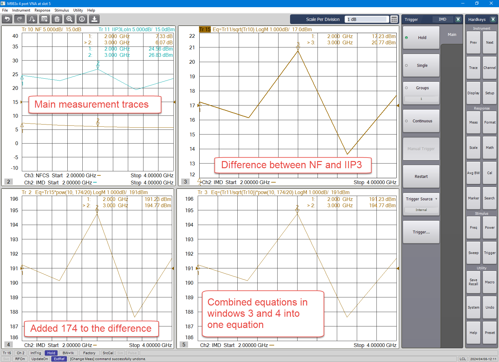

# Using the Equation Editor to Compute the Dynamic Range of an IMD Channel

* * *

## Dynamic Range calculation

IIP3-NF+174 dBm

Tr11 = IIP3

Tr10 = NF

(Tr11/sqrt(Tr10))*Pow(10,174/20)

This equation editor calculation was done in an IMD measurement class with
OIP3 as the underlying trace (or parameter). Note that the underlying trace
has an impact on the calculation. Different underlying traces (or parameters)
with the same exact question may produce different results. For example, if
the underlying trace is NF versus S21 you will get different results.

Underlying trace:

  * OIP3 in an IMD measurement class

Equation traces: IIP3 and NF:

  * Equation: (Tr11/sqrt(Tr10))*Pow(10,174/20)
  * The IIP3 or Tr11 is left as is. No function is applied to it. While it is in dBm on the display, the underlying data is in “voltage” format, so it can be left as is. 
  * Subtraction in dB becomes division in linear format, so IIP3-NF becomes IIP3/NF in the equation editor. 
  * The NF trace needs to be square rooted. This is because in the VNA software NF is a power parameter and the math is done in “voltage”, so a square root needs to be applied. 
  * The 174 dBm needs to be converted to a linear “voltage” value. To convert a power value from log to linear, use 10 to the power of the value divided by 20. 

The setup below a sample measurement. The equation is shown in two steps for
clarity.

* * *

