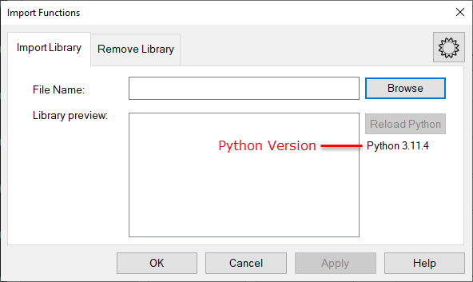
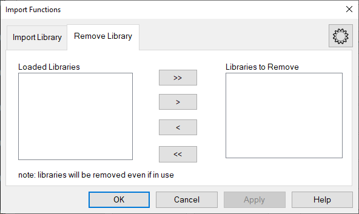
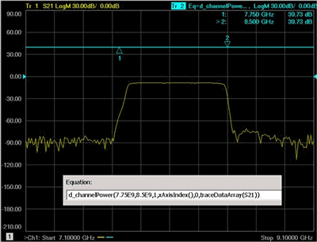
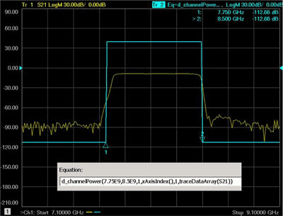

# Import Functions

* * *

Several additional functions are provided with the VNA. In addition, you can
create custom functions which are compiled into a DLL. Import these functions
for use in the Equation Editor.

Note: When building custom equations, ensure that 64-bit DLLs are built when
targeting one of the 64-bit VNA versions.

  * [How to Import Functions](Equation_Editor_Import_Functions.md#How)

  * [Supplied User Functions](Equation_Editor_Import_Functions.md#BuiltInFunctions)

  *     * [BestFit.dll](Equation_Editor_Import_Functions.md#BuiltInFunctions)

    * [EqnErrorTerms.dll](Equation_Editor_Import_Functions.md#EqnErrorTerms)

    * [Expansion.dll](Equation_Editor_Import_Functions.md#Expansion)

### See Also

[Equation Editor](Equation_Editor.md) (main topic)

[Equation Editor and Python](Equation_Editor_with_Python.md)

* * *

### How to Import Functions

From the main [Equation Editor](Equation_Editor.md#How) dialog, click Import
Functions

Import Functions dialog box help  
---  
Imports and removes libraries that are used with Equation Editor. A library is
a *.dll or *.py file that contains one or more functions. Although not all
functions are applicable to all channels or data sets, they will still appear
in the "Function/Constants" list. Once imported, each library is automatically
loaded when the VNA application starts. If a function is not found or if an
error occurs while loading, the VNA will not attempt to reload the library
when starting.

### Import Library tab

 Browse  Click to navigate to a *.dll
or *.py file on the VNA. The recommended location for the custom equation DLLs
is the “C:\Program Files\Keysight\Network Analyzer\UserFunctions” directory on
the VNA.  Library Preview Lists
the functions that are contained in the library. Reload Python Reloads all
Python modules that have been imported and produces messages whether each
module has been successful or not in being refreshed. This button is enabled
only when at least one Python file (*.py) is loaded. Python Version Label
Displays Python version number if Python is installed. If not, then it
displays "Python missing. Python modules are unavailable." This message
disappears if the user attempts to load a *.dll file instead. Click OK or
Apply to load the library.

### Remove Library tab

 Left pane  Lists the imported
libraries. These also appear in the Equation Editor main dialog and remain
until removed from the VNA. Arrows  Click the relevant arrows to move some (>)
or all (>>) libraries from the VNA. Right Pane Lists the libraries to remove.
Click OK or Apply to remove the library.  
  
## Supplied User Functions

The VNA firmware includes the following custom equation DLLs to supplement the
list of built-in functions. They are available on the VNA at:  
'C:\Program Files\Keysight\Network Analyzer\UserFunctions'.

  * BestFit.dll

  * [EqnErrorTerms.dll](Equation_Editor_Import_Functions.md#EqnErrorTerms)

  * [Expansion.dll](Equation_Editor_Import_Functions.md#Expansion)

### BestFit.dll

d_best_fit_dB() |  d_best_fit_dB(getNumPoints(),xAxisIndex(),xAxisArray(),traceDataArray(PARAM)) Draws the best fit linear regression line to data specified by PARAM. The best fit line minimizes the RSS (root-sum-square) of the trace data in log-magnitude format. The phase of the regression line is identically zero.  
---|---  
d_channelPower() |  d_channelPower(FA,FB,CHANNELNUM,xAxisIndex(),TRACETYPE,traceDataArray(PARAM)) Computes the channel power for the specified measurement on the given channel number between the given frequencies.

  * FA and FB specify the frequency start/stop values in Hz.
  * CHANNELNUM is the 1-based channel number to use.
  * PARAM indicates the measurement to compute channel power for.
  * TRACETYPE indicates how to display the computed result.
  *     * If TRACETYPE= 0, the display is a flat line with value equal to the channel power;
    * if TRACETYPE= 1 (default), the display is set to the trace minimum for frequencies outside the range from FA to FB. See examples below.
  * If CHANNELNUM is hosting an IM Spectrum measurement, the channel power is computed from the formula:

channelPower = 10Log10( (area under PARAM trace between FA and
FB)/resolutionBandwidth

  * For all other measurement types, the formula is:

channelPower = 10Log10( (area under PARAM trace between FA and FB)/IFBandwidth
) TraceType Example 1: FA=7.75 GHz, FB=8.5 GHz, CHANNELNUM=1. TRACETYPE is 0.
Computed channel power is displayed over the entire frequency range.
 TraceType Example 2: As above, but
TRACETYPE is 1 (the default). Displayed result is set to trace minimum outside
of specified range.   
d_DFLP() |  d_DFLP( FreqStart, FreqStop, xAxisIndex(), getNumPoints(), xAxisArray(), traceDataArray(PARAM)) Computes the deviation from linear phase data of the specified trace, PARAM, such that if the resulting trace is displayed in Phase format, the displayed data will be residual phase response of the parameter after the group delay slope has been removed. The FreqStart and FreqStop arguments allow the user to specify a subset of the channel span for this computation. To cover the channel’s entire span, set the FreqStart to 0 and FreqStop to a very large number such as 1E100.   
d_flatness_dB() |  d_flatness_dB(getNumPoints(),xAxisIndex(),xAxisArray(),traceDataArray(PARAM)) Computes the magnitude flatness of the trace data in PARAM, by first removing any gain slope and then normalizing the results to 0 dB.  
d_mean() |  d_mean(traceNum) Computes the mean of the specified trace and creates a resulting trace whose real part is the mean at each stimulus point. The traceNum argument should be replaced by an integer number that represents the existing trace number of the trace for which you want to compute the mean. This function does not operate on parameter names (such as S11) or trace names (such as Tr1). The result of this function is the same value displayed by the Trace Statistics analysis function.  
d_min_max_dev() |  d_min_max_dev(getNumPoints(),xAxisIndex(),xAxisArray(),traceDataArray(PARAM)) Computes the slope and intercept of the line which minimizes that maximum absolute deviation between the line and the data specified by PARAM. This is done in two phases. First, the trace data in PARAM is converted to log magnitude, and a minimum-deviation line is fitted to it. Second, the phase data in PARAM is unwrapped, and another minimum-deviation line is fitted to that. The magnitude and phase values are then combined to form a complex-valued trace. The displayed traces represent the deltas between the measured values in PARAM and the best-fit data. This function is typically used when you wish to measure worst-case deviation from linear behavior.  
d_min_max_dev_d2() |  d_min_max_dev_d2(getNumPoints(),xAxisIndex(),xAxisArray(),traceDataArray(PARAM)) Computes the parameters of the parabola which minimizes that maximum deviation between the parabola and the data specified by PARAM. This is done in two phases. First, the trace data in PARAM is converted to log magnitude, and a minimum-deviation quadratic is fitted to it. Second, the phase data in PARAM is unwrapped, and another minimum-deviation quadratic is fitted to that. The magnitude and phase values are then combined to form a complex-valued trace. The displayed traces represent the deltas between the measured values in PARAM and the best-fit data. This function is typically used when you wish to measure worst-case deviation from quadratic behavior.  
d_min_max_dev_range() |  d_min_max_dev_range(FSTART,FSTOP,xAxisIndex(),getNumPoints(),xAxisArray(),traceDataArray(PARAM)) Identical to the function d_min_max_dev(), but only operates on data in the frequency range from FSTART to FSTOP.  
d_min_sum_dev() |  d_min_sum_dev(getNumPoints(),xAxisIndex(),xAxisArray(),traceDataArray(PARAM)) Computes the slope and intercept of the line which minimizes that sum of the absolute deviations between the line and the data specified by PARAM. This is done in two phases. First, the trace data in PARAM is converted to log magnitude, and a minimum-deviation line is fitted to it. Second, the phase data in PARAM is unwrapped, and another minimum-deviation line is fitted to that. The magnitude and phase values are then combined to form a complex-valued trace. The displayed trace represents the sum of the deviations. This function is less sensitive to outliers than d_min_max_dev().  
d_tilt_dB() |  d_tilt_dB(getNumPoints(),xAxisIndex(),xAxisArray(),traceDataArray(PARAM)) – The result of the tilt() function when displayed in LogMag format is the total deltaY of the best fit line for the specified trace or parameter.  
d_unwrap() |  d_unwrap(getNumPoints(),xAxisIndex(),traceDataArray(PARAM)) The result of the unwrap() function when displayed in Real format is the unwrapped phase response of the specified trace or Parameter in degrees.  
  
### EqnErrorTerms.dll

d_Corr1P() |  d_Corr1P(chan, xAxisIndex(),rcvr, src, RAWDATA ) Computes and displays 1 port corrected data for the trace data supplied in the RAWDATA placeholder. chan - the channel of interest. xAxisIndex() \- the bucket (data point) number. rcvr - the port number of the receiver used to acquire the data. src \- the port being driven. The rcvr and src arguments are needed to select the appropriate error terms used in the correction process. RAWDATA - Select the data to be corrected by substituting in a trace number or parameter name.  
---|---  
d_DIR() |  d_DIR(chanNum, xAxisIndex(), rcvr, src) Displays the directivity term from the cal set used by the channel <chanNum>.  Set chanNum to the desired channel. Set rcvr and src to the port number for the desired directivity term.  
d_EnhResp() |  d_EnhResp(chan,xAxisIndex(),rcvr, src,RAWMATCH,RAWGAIN) Computes the corrected gain using enhanced response correction techniques. This technique is useful in cases where you want to ignore the output match of a device or the output match cannot be accurately measured. In this the raw input match and gain are supplied to equation (via RAWMATCH and RAWGAIN placeholders). To use this equation select a trace (TR n) or parameter to use in place of the raw match and gain terms. chan \- the channel number xAxisIndex() \- the bucket number (do not modify) rcv \- The port where the data is acquired. Sr \- The port being driven. The src and rcvr ports are required so that the appropriate error terms are used to calculate the result.  
d_LDM() |  d_LDM(chanNum, xAxisIndex(), rcvr, src) Displays the loadmatch term from the calset used by the channel <chanNum>.  Set chanNum to the desired channel. Set rcvr to the load port, and src to the source port for the desired load match term.  LDM(ch, xAxisIndex(), 2,1) gives you the match presented by port 2 while driving port 1.  
d_RFT() |  d_RFT(chanNum, xAxisIndex(), rcvr, src) Displays the reflection tracking term from the calset used by the channel <chanNum>.  Set chanNum to the desired channel. Set rcvr and src to the port number for the desired reflection tracking term.  
d_SRM() |  d_SRM(chanNum, xAxisIndex(), rcvr, src) Displays the sourcematch term from the calset used by the channel <chanNum>.  Set chanNum to the desired channel. Set rcvr and src to the port number for the desired source match term.  
d_TRT() |  d_TRT(chanNum, xAxisIndex(), rcvr, src) Displays the transmission tracking term from the calset used by the channel <chanNum>.  Set chanNum to the desired channel. Set rcvr to the receive port and src to the source port such that TRT( ch, xAxisIndex(), 2, 1) gives you the transmission tracking term for the port 2 input receiver driven by port 1, or in other words, the raw S21 tracking term.  
d_XTLK() |  d_XTLK(chanNum, xAxisIndex(), rcvr, src) Displays the isolation term from the calset used by the channel <chanNum>.  Set chanNum to the desired channel. Set rcvr to the receive port and src to the source port such that XTLK( ch, xAxisIndex(), 2, 1) gives you the isolation term for the port 2 input receiver while port 1 is on.  
  
### Expansion.dll

admittance(x) |  Admittance(x) = 1/x Calculate the admittance  
---|---  
max_hold(x) |  (KEY, getNumPoints(),xAxisIndex(),PARAM) Shows maximum value of each point  
min_hold(x) |  (KEY, getNumPoints(), xAxisIndex(), PARAM) Shows minimum value of each point.  
PAE(B,S21,AI1,AI2,R,SCALE) |  .001 * (B - (B/S21)) / ( SCALE^2*AI1(AI1 - AI2)/R ) Power Added Efficiency.

  * B - power out
  * S21 - corrected amplifier gain
  * AI1 - DC power supply
  * AI2 - DC power amp
  * R - resistance
  * SCALE - scale

  
reset(x) |  x - a number. Resets the max_hold() or min_hold() function. To reset a given max_hold() or min_hold() function, call reset with the same key.  
SDD11(S11,S21,S12,S22) |  (S11 - S21 - S12 + S22)/2 Differential mode reflection  
SDC11(S11,S21,S12,S22) |  (S11 - S21 + S12 - S22)/2 C to D mode conversion reflection  
SCD11(S11,S21,S12,S22) |  (S11 + S21 - S12 - S22)/2 D to C mode conversion reflection  
SCC11(S11,S21,S12,S22) |  (S21 + S12 + S11 + S22)/2 Common mode reflection  
Use the following two equations to display impedance versus frequency. Replace
'LOAD' with the value for Z0 (usually 50). Note: You can read out impedance
versus time (not using this function) by creating a marker on a [Time
Domain](../Time/TimeDomain.htm) trace, then changing the marker format to
R+jX. [Learn how](Markers.md#MarkerDiag).  
zReflect(S11,LOAD) |  LOAD*(1 + S11)/(1-S11)  
zTransfer(S21,LOAD) |  2 * LOAD * (1 - S21)/S21

