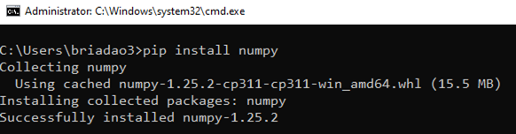
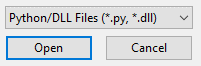
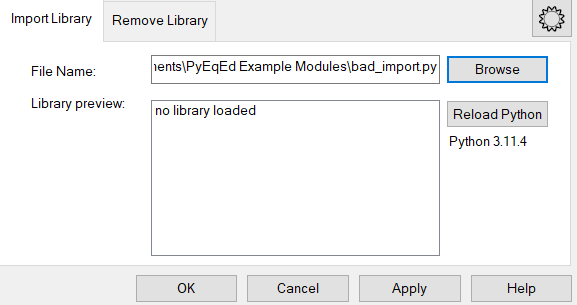
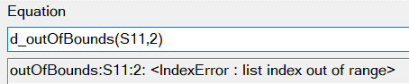
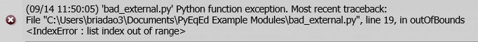

# Equation Editor and Python

* * *

The Python file extension (*.py) allows users to import custom functions from
a Python module into the equation editor. This topic comprises the following
sections:

  * Python Installation

  * Python Packages

  * Function Guidelines

  * Importing Modules

  * Running Functions

  * Miscellaneous

## Python Installation:

  * Go to [www.python.org/downloads/](http://www.python.org/downloads/ "Go to website") to download the installer for the latest version of Python 3. 
    * Launch the installer and select 'Customize installation.' In ‘Advanced Options’ make sure to add Python to the environment variables.
    * If you forget this step, you can run the installer again and modify the installation to add Python to the environment variables.
    * You can check whether Python is successfully installed by running SCPI command [CALC:EQU:LIBR:PYTH?](../Programming/GP-IB_Command_Finder/Calculate/Equation.md#LibraryPythonState) or by checking if the version number is displayed in the [Import Functions](Equation_Editor_Import_Functions.md#How) dialog.

    * You can check the version number by running SCPI command [CALC:EQU:LIBR:PYTH:VER?](../Programming/GP-IB_Command_Finder/Calculate/Equation.md#LibraryPythonVersion)

  * More: This feature relies on python3.dll, which contains the Python 3 interpreter and associated modules. If the firmware cannot find the file on the working drive, Python will not be detected and the feature will be disabled.

## Python Packages:

  * If you’ve installed Python via an installer on python.org, you should have pip. If not, you can run the installer, modify the installation, navigate to ‘Optional Features’ and select pip.

  * Install packages by running pip install <package> in Windows Command Prompt.  

  * You can see all importable Python packages and their version numbers as provided by sys.path by running SCPI command [CALC:EQU:LIBR:PYTH:MOD?](../Programming/GP-IB_Command_Finder/Calculate/Equation.md#LibraryPythonModules)

  * More: [packaging.python.org/en/latest/tutorials/installing-packages/](http://packaging.python.org/en/latest/tutorials/installing-packages/)

## Function Guidelines:

  * Argument Format: Functions should be written with the following argument constraints in mind: 
    * Input: Trace data is given as a list of Python complex objects
    * Input: Scalars are given as a single complex object
    * Output: Functions must return a list of Python complex objects with the same length as the input trace

  * Naming: Prepend two underscores to names of functions that you do not want to be visible in the Equation Editor. This is useful for making helper functions within your module.

  * Tool Tips: When a function is hovered over in the Equation Editor preview list, a tool tip will display to assist in usage. Users may add docstrings to functions to detail what the function does. Functions signatures are the tool tip by default. Any docstring provided will be appended to the function signature separated by a colon. Docstrings are string literals that occur as the first statement in a module, function, class, or method definition.  
  
See <https://peps.python.org/pep-0257/>

  * Packages: You can import external packages such as numpy and scipy in your library and use them. To install packages, see Python Packages.

  * More: To see an example library, navigate to \Program Files\Keysight\Network Analyzer\UserFunctions

    * example.py
    * numpy_example.py

## Importing Modules:

  * Import: You may import modules in the [Import Functions](Equation_Editor_Import_Functions.md#How) dialog. On Browse, the file dialog filter appear as follows:  
  
If *.py files are not included in the filter, Python is not installed. See
Python Installation.

  * Compilation Errors: With the Python module, these errors will be caught on an import attempt and its functions will not be loaded.  
  
You can check the error queue to see the traceback:  

  * Removing Modules: Modules may be removed through the Remove Library tab in the [Import Functions](Equation_Editor_Import_Functions.md#How) dialog.

  * Reloading Modules: The Reload Python button in the Import Functions dialog reloads all Python modules that have imported. This refreshes all changes that were made on the files. The Function Preview List will be populated with success or fail messages with Python modules that were attempted to be reloaded. Any compilation errors will be reported to the error queue.

## Running Functions:

  * Click on the function that you want to use and give it the appropriate arguments (trace or scalar).
  * Runtime error (fault in Python code) messages are displayed in the message bar and tracebacks are populated in the error queue.  
  

## Miscellaneous:

  * Nesting: Nesting Python functions within each other in the Equation Editor is supported but not recommended. At three levels of nesting, the VNA application may hang. If nesting is needed, it is advised to do it within the Python module itself.
  * Naming Conflicts: Functions should not be named the same name as each other across modules. The Equation Editor will use the function that is imported first if there are function naming conflicts between modules.

* * *

