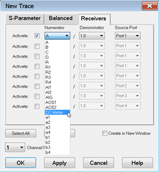
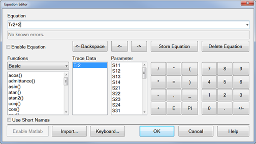
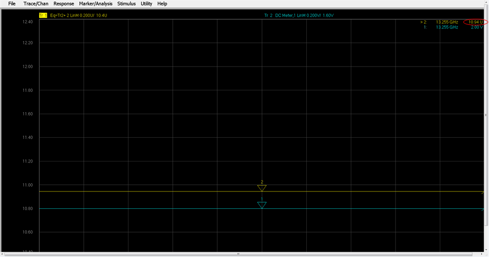
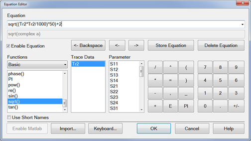
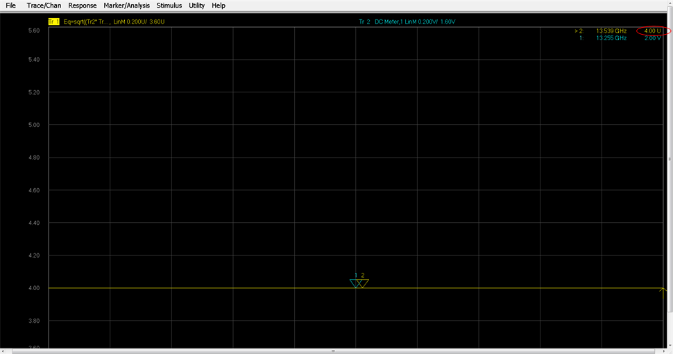

# External DC Meter Data Conversion

When creating equations using values from an external DC meter, it is
important to understand how these values are stored in the VNA's data buffers
and the conversion that occurs when used in an equation. For example, when a
voltage is read from an external DC meter, the value is displayed on the VNA
as you would expect. That is, if you are reading a voltage level of 2 V from
the DC meter in a trace, the VNA will display a level of 2 V. However, the
value stored in the VNA data buffers is not a voltage but is a unit-less
value. Voltage, Amperes, dBm, and Watts values from an external DC meter are
converted so that the format matches that of the data in the VNA internal
receivers. In this way, all of the formats within the VNA are the same. This
information is important when performing analysis using the Equation Editor
because the trace data is the converted value.

### See Also

[Equation Editor](Equation_Editor.md)

[Configure a DC Device](../System/Configure_a_DC_Device.md)

The following table shows the formats (which are selected from the Type
setting on the External DC Meter Properties dialog) and corresponding
equations that convert between external DC meter readings and the VNA
representation when using the trace data in an equation.

Note: Z0 is the characteristic impedance (typically 50 Ohms), dcMeter is the
value from the external DC meter, and pnaVal is the value stored in the VNA
data buffers. All data types are REAL.

Formats |  DC Meter to VNA Data Conversion |  VNA to DC Meter Data Conversion  
---|---|---  
V (volts - default) | +/-*sqrt((dcMeter*dcMeter/Z0)*1000) | +/-*sqrt((pnaVal*pnaVal/1000)*Z0)  
A (amperes) | +/-*sqrt((dcMeter*dcMeter*Z0)*1000) | +/-*sqrt((pnaVal*pnaVal/Z0)/1000)  
dBm | pow(10,dcMeter/20) | 20*log(pnaVal)  
W (watts) | sqrt(dcMeter*1000) | pnaVal*pnaVal/1000  
K (kelvin) | N/A |  N/A  
F (degrees) | N/A |  N/A  
C (degrees) | N/A |  N/A  
  
## External DC Meter Voltage Example

The following example shows how trace data is converted when used in an
equation. In this example, a level of 2 V is read from an external DC meter.

  1. Configure the external DC meter as described in [Configure a DC Device](../System/Configure_a_DC_Device.md).
  2. In the External DC Meter dialog, ensure that Type is set to V.
  3. Press Trace > Trace Setup >Add Trace > New Trace....
  4. In the New Trace dialog, select the Receivers tab, check Activate, click on the corresponding down arrow in the Numerator column, select the external DC meter from the drop down list, then click OK.

Note: If the external DC meter is not displayed in the list, ensure that
Active - Show in UI is checked in the External Device Configuration dialog.

  5. Trace 1 and Trace 2 should now be displayed on the VNA. Add markers to both traces. The Trace 2 marker should read 2.00 V from the external DC meter.
  6. Select Trace 1, then select Response, Format, Lin Mag.
  7. Select Response, Math, then Equation Editor....
  8. Enter the following Trace 1 equation to add a value of 2 to the Trace 2 data.

  9. Check Enable Equation, then click OK.
  10. Note that instead of a voltage level of 4.00 V, the Trace 1 marker reads 10.94 U (unit-less value).

As shown in the table above, a voltage from an external DC meter is converted
using sqrt((dcMeter*dcMeter/Z0)*1000). Therefore, substituting 2 for dcMeter
in the equation and using 50 as Z0 results in a value of 8.94. Adding a value
of 2 to the Trace 2 data, as defined in the Trace 1 equation, results in the
displayed marker value of 10.94.

  10. To ensure that the displayed value is 4 instead of 10.94, which is not useful, use the equation from the VNA to DC Meter Data Conversion column of the table above as follows:

  11. The Trace 1 marker now displays a value of 4.00 U.

