# Markers

* * *

Markers provide a numerical readout of measured data, a search capability for
specific values, and can change stimulus settings. There are 15 regular
markers and one [Reference marker](markers.md#reference) (used with Delta
markers) available per trace. This topic discusses all aspects of markers.

Note: Marker Readout can be turned ON/OFF and customized from the Customize
Display dialog box. [Learn more.](markers.md#DisplayDiag)

  * [Number of General Purpose and Reference Markers](Markers.md#Number_of_Markers)

  * Creating and Moving Markers

  * Marker Setup

  *     * [Coupling Method](markers.md#Coupled_Markers)

  * Searching with Markers

  *     * [Maximum and Minimum Search](markers.md#MaxMinSearch)

    * [Peak Search](markers.md#PeakSearch)

    * [Multi Peak Search](markers.md#MultiPeakSearch)

    * [Target Search](markers.md#TargetSearch)

    * [Multi Target Search](markers.md#MultiTargetSearch)

    * [Bandwidth and Notch Search](markers.md#Bandwidth)

    * [Compression Search](markers.md#Compression)

    * [PSAT Search](markers.md#PSat)

    * [PNOP Search](markers.md#PNOP)

    * Distortion Search (Option S93070xB Modulation Distortion only)

    * Spurious Search (Option S93031xB Phase Noise only)

  * [Search Domain](markers.md#Domain)

  * [Search Range Indicators](markers.md#SearchRangeIndicators)

  * Marker Functions (Change Instrument Settings)

  * SA Analysis Markers (Spectrum Analyzer channel markers)

  * SA Analysis Markers (Option S93070xB Modulation Distortion only)

  * [Marker Display](Markers.md#Display)

  * Marker Table

Note: Marker Readout can be turned ON / OFF and customized from the
View/Display menu. [Learn more.](Markers.md#DisplayDiag)

[Other Analyze Data topics](Analyze_Data.md)

## Creating and Moving Markers

#### How to Create Markers  
  
---  
Using Hardkey/SoftTab/Softkey | Using a mouse  
  
  1. Press Marker > Marker 1-7 / Marker 8-15 / Reference.
  2. Click left side Marker N or Reference small button.

|

  1. Move the cursor on a trace.
  2. Right-click on the trace then select Add Marker....

  
  
  
### Number of General Purpose and Reference Markers

There are 15 regular markers and one [Reference marker](Markers.md#reference)
(used with Delta markers) available per trace.

For Remote commands, there is a Preference setting to revert to the previous
behavior. [See the Preference](../System/Preferences.md#markerPref).

When developing new programs, use the [reference marker
commands](../Programming/XResponseTopic.htm#Reference_Markers) to control
reference markers. Do NOT use general purpose marker commands to control
reference markers.

### Moving a Marker

To move a marker, make the marker active by selecting its number in any of the
previous 3 methods. The active marker appears on the analyzer display as Ñ.
All of the other markers are inactive and are represented on the analyzer
display as D. Then change the stimulus value using any of the following
methods:

  * Type a value.

  * Scroll to a stimulus value using the up / down arrows. The resolution can not be changed.

  * Click the stimulus box, then use the front-panel knob.

  * Click and Drag Markers using a finger (touchscreen) or by left-clicking and holding a marker symbol. Then drag the marker to any point on the trace. This feature is NOT allowed in Smith Chart or Polar [display formats](../S1_Settings/Data_Format.md) or with a [Fixed Marker type](Markers.md#fixed).

  * Move the mouse cursor over the stimulus box, then use the mouse scroll wheel.

## Marker Setup

#### How to set the Marker Setup.  
  
---  
Using Hardkey/SoftTab/Softkey | Using a mouse  
  
  1. Press Marker > Marker Setup.
  2. Set the value or select desired setting for each softkey.

|

  1. Move the cursor on a marker.
  2. Right-click on the marker then select Marker....

  
  
Marker dialog box help |   
---|---  
 Marker Specifies the current (active) marker number that you are defining. On Check to display the marker and corresponding data on the screen. Stimulus Specifies the X-axis value of the active marker. To change stimulus value, type a value, use the up and down arrows, click in the text box and use the front-panel knob, or drag the marker on the screen. Note: When the sweep type is set to CW Time, the marker can not be set to 0 (first point of the trace on the x-axis) because the marker indicates the time to acquire the first point of the trace. Delta (and Reference) Markers Check to make the active marker display data that is relative to the reference (R) marker. There is only one reference marker per trace. All other markers can be regular markers or delta markers. When a delta marker is created, if not already displayed, the reference marker is displayed automatically. A delta marker can be activated from the [Marker dialog box](Markers.md#HowMarkerDiag) or the [Marker Toolbar](../S1_Settings/Customize_Your_Analyzer_Screen.md#markers_tb). See Also: [Number of General Purpose and Reference Markers](Markers.md#Number_of_Markers). Discrete Marker Check to display values at only the discrete points where data is measured. Clear to display values that are interpolated from the data points. The interpolated marker will report y-axis data from ANY frequency value between the start and stop frequency. Fixed Check to cause the marker to have a fixed X-axis and Y-axis position based on its placement on the trace when it was set to fixed. It does NOT move with trace data amplitude. It can be scrolled left and right on the X-axis by changing the marker stimulus value. Use this marker type to quickly monitor "before and after" changes to your test device. For example, you could use fixed markers to record the difference of test results before and after tuning a filter. Clear the box to create a Normal marker, which has a fixed stimulus position (X-axis) and responds to changes in data amplitude (Y-axis). It can be scrolled left and right on the X-axis by changing the marker stimulus value. Use this marker type with one of the marker search types to locate the desired data. (Marker) Format Displays the marker data in a format that you choose. The Trace Default setting has the same marker and grid formats. Choose from the following: | Log/Phase | Log Mag | Real | Fahrenheit  
---|---|---|---  
Linear/Phase | Linear Mag | Imaginary | Celsius  
Real/Imag | Phase | Phase Unwrapped | Noise  
R+jX (complex impedance) | SWR | Phase Positive |   
G+jB (complex admittance) | Delay | Kelvin |   
  
Noise Marker Format (IMSpectrum and SA measurement classes only) \- For
comparison purposes, electronic noise measurements are often displayed as
though the measurement was made in a 1 Hz Res BW. However, making an actual
measurement at a 1 Hz Res BW is impossible, and at 10 Hz, extremely slow.

A Noise Marker mathematically calculates the noise measurement at that single
data point as though it were made using a 1 Hz bandwidth.

To accurately measure noise, the Noise Marker should NOT be placed on, or too
close to, a signal. The distance from a signal depends on several factors. To
know if an accurate reading is being made, move the Noise Marker until
consistent measurements are displayed in adjacent data points.

Noise Marker Format (Modulation Distortion measurement class only) \- In a
Modulation Distortion channel, the noise is calculated from the current power
reading divided by the tone spacing of the modulation being used: PIn(W/Hz) =
PIn(W) / [Tone Spacing (Hz)]. This provides a noise density readout with units
compatible with the trace format. For example, if the trace is dBm, the noise
is dBm/Hz.

All Off Switches OFF all markers on the active trace.

Coupled Markers

The coupled markers feature causes markers on different traces to line up with
the markers on the selected trace. Markers are coupled by marker number, 1 to
1, 2 to 2, 3 to 3, and so forth. If the x-axis domain is the same (such as
frequency or time), coupling occurs. Trace markers in a different x-axis
domain will not be coupled. If a trace marker has no marker to couple with on
the selected trace, the marker remains independent.

Coupling Method \- Determines the scope of coupling. Choose from the
following:

  * All \- A marker on one trace is coupled to the same-numbered markers on all channels, all windows and all traces.

  * Channel \- A marker on one trace is coupled to the same numbered markers on traces which share the same channel number as the original trace.

Coupled Markers Model

This model simulates the use of coupled markers in the VNA:

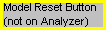  
---  
  
  
  1. Click Trace A or Trace B

  2. Click Coupled Markers

  3. Notice the following:

  1.      * Markers on the unselected trace move to the x-axis position of the selected trace.

     * If a marker number on the unselected trace has no corresponding marker on the selected trace, no movement occurs for that marker.

  4. Click Reset to run the model again. There is no Reset for coupled markers on the VNA.

  
  
Searching with Markers

You can use markers to search and return data for the following trace
criteria:

  * Max and Min: find the highest or lowest points on the trace

  * Peak, then move to other peaks (left, right, next highest)

  * Multi Peak

  * Target Value: find a specific Y-axis value

  * [Multi Target](markers.md#MultiTargetSearch):

  * [Bandwidth](Markers.md#Bandwidth) (Filters)

  * [Notch](markers.md#Bandwidth) (Filters)

  * [Compression Point](Markers.md#Compression) (Amplifiers)

  * [About PSAT and PNOP Markers](Markers.md#AboutPSATnPNOP)

  *     * [Power Saturation](Markers.md#PSat) (Amplifiers)

    * [Power Normal Operating Point](Markers.md#PNOP) (Amplifiers)

  * [Search Domain](Markers.md#domain)

  * [Search Range Indicators](markers.md#SearchRangeIndicators)

#### How to Search with Markers  
  
---  
Using Hardkey/SoftTab/Softkey | Using a mouse  
  
  1. Press Search > Main / Peak / Target / Multi Peak & Target / Bandwidth & Notch / Compression & Saturation / Normal Op Pt. / Distortion / Spurious

|

  1. Move the cursor on a marker.
  2. Right-click on the marker then select Search...to show the Marker Search Dialog box for define the search parameters.
  3. From Search Type of Marker Search dialog box, select the desired search function.
  4. Press Execute or check Tracking. [Learn more](markers.md#executing_search).

  
  
Marker Search dialog box help |   
---|---  
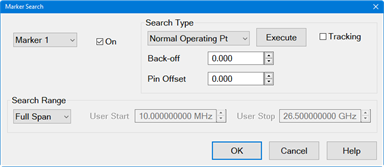 Marker Specifies the marker that
you are defining. Not available for search types that deploy specific markers.
Search Range Defines the area where the marker can move or search. For full
span, the marker searches for specified values within the full measurement
span. For user span, the marker searches for specified values within a
measurement span that you define. Learn more about Search Range.

### Search Type

Note You must either press Target Search or check Tracking to initiate all
search types. If there is no valid data match for the search type, the marker
will not move from its current position.

  * Target Search Click to cause the marker to search for the specified criteria.
  * Tracking Check to cause the marker to search for the specified criteria with each new sweep. The searches begin with the first sweep after Tracking has been checked, based on the current search type and domain information. Therefore, make sure that the search criteria are in the desired state before using the data. You cannot manually change the stimulus setting for a marker if Tracking is selected for that marker.

Maximum Marker locates the maximum (highest) data value. Minimum Marker
locates the minimum (lowest) data value.

* * *

Peak \- See below. Next Peak \- Marker locates the peak with the next lower
amplitude value relative to its starting position. Peak Right \- The marker
locates the next valid peak to the right of its starting position on the
X-axis. Peak Left \- The marker locates the next valid peak to the left of its
starting position on the X-axis. Multi Peak \- A function that search for
peaks that match the multi-peak search excursion value and multi-peak polarity
value. [Learn more about Multi Peak Search.](markers.md#MultiPeakSearch)

  * Threshold \- Minimum amplitude (dB). To be considered valid, the peak must be above the threshold level. The valley on either side can be below the threshold level.
  * Excursion The vertical distance (dB) between the peak and the valleys on both sides. To be considered a peak, data values must "fall off" from the peak on both sides by the excursion value.

* * *

Target \- A function that searches for a target that matches the pre-defined
target value and transition types (positive, negative or both (positive and
negative)) and then moves the marker to that target. [Learn more about Multi
Target Search.](markers.htm#MultiTargetSearch) Target Left \- A function
executes the search from the current marker position to the smaller stimulus
values and moves the marker to first target encountered. Target Right \- A
function executes the search from the current marker position to the larger
stimulus values and moves the marker to first target encountered. Multi Target
\- A function that search for targets that are of the multi-target value and
multi target transition value. [Learn more about Multi Target
Search.](markers.htm#MultiTargetSearch)

  1.      * Target - Value in dB.

* * *

Compression \- A function used the active marker to find the specified gain
Compression Level. [Learn more about Compression
Search.](markers.htm#Compression)

  * Compression - Value in dB.

* * *

Bandwidth and Notch searches are accessed by pressing Search > Bandwidth &
Notch > BW Ref to or Search > Bandwidth & Notch > Notch Ref to.
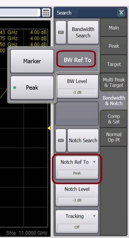 Bandwidth \- A function for
determining the bandwidth of the trace, center frequency, cut-off points (on
the higher frequency and the lower frequency sides), Q and insertion loss
based on the position of the active marker (if search mode set to Marker) or
the peak marker (if search mode set to Peak). [Learn more about Bandwidth
Search](markers.htm#Bandwidth).

  * Bandwidth peak mode search
  *     * If level is negative, search is relative to the maximum peak.
    * If level is positive, search is relative to the minimum peak.
    * Bandwidth level in dB.

Notch \- A function is used to obtain the bandwidth, center frequency, cutoff
points (high-frequency side and low-frequency side), Q and insertion loss of a
trace based on the position of the active marker (if search mode set to
Marker) or the peak (if search mode set to Peak). [Learn more about Notch
Search](markers.htm#Bandwidth).

  * Notch peak mode search
  *     * If level is negative, notch search is relative to the minimum peak.
    * If level is positive, notch search is relative to the maximum peak.
    * Notch level in dB.

The default behavior for searches based on the active marker or peak marker
can be set using the [Marker: On Preset, set BW/Notch search reference to
Peak](../System/Preferences.htm#BW_NotchPreferences) preference.

* * *

Power Saturation \- [Learn more about PSAT Search](markers.md#PSat).

  * PMax Back-off -Value in dB.

* * *

Normal Operating Pt \- The output power where the input is offset from the
back-off input power by the Pin Offset. [Learn more about PNOP
Search](markers.htm#PNOP).

  * Back-off - Value in dB.
  * Pin Offset - X-axis value in dB.

* * *

Distortion Search (Option S93070xB Modulation Distortion only) Modulation
Distortion marker searches are accessed by pressing Search > Distortion or by
selecting the search marker from the Search Type pulldown menu in the Marker
Search dialog. The Modulation Distortion application has marker search
function types similar to a standard channel. In addition, it has marker
search types specific to a Modulation Distortion channel.  ACPR Search\- ACPR
Search turns on the reference marker and 2 delta markers if the active trace
is an ACP trace and there is an ACP measurement band defined in the setup. The
reference marker covers the signal carrier range of the band, while the two
delta markers cover the ACLo and ACUp ranges. The readouts of these markers
are then ACPR values.  NPR Search\- NPR Search turns on the reference marker
and 1 delta marker if the active trace is a NPR trace and there is a NPR
measurement band defined. The reference marker covers the signal carrier range
of the band, and the delta marker covers the notch range. The readout of the
delta marker is then the NPR value.

* * *

Spurious Search (Option S93031xB Phase Noise only) Phase Noise marker searches
are accessed by pressing Search > Spurious or by selecting the search marker
from the Search Type pulldown menu in the Marker Search dialog. The Phase
Noise application has marker search function types similar to a standard
channel. In addition, it has marker search types specific to a Phase Noise
channel. Spur analysis must be enabled to use the Spurious search functions.
See [Enable Spur
Analysis](../Applications/Phase_Noise/Configuring_Phase_Noise.htm#Enable_Spur_Analysis).
Spurious Search \- Searches for spurious signals based on [spurious
settings](../Applications/Phase_Noise/Configuring_Phase_Noise.htm#Spurious_Tab).
Spurious Right >> Search \- Searches for the next spurious signal to the
right. << Spurious Left Search \- Searches for the next spurious signal to the
left. Multi Spurious Search \- Searches for multiple spurious signals. Spur
Sensibility \- Sets the spurious sensibility number.[ Learn
more](../Applications/Phase_Noise/Configuring_Phase_Noise.htm#Spur_Sensibility).  
  
## Maximum and Minimum Search

#### How to create Maximum and Minimum Search  
  
---  
Using Hardkey/SoftTab/Softkey | Using a mouse  
  
  1. Press Search > Main.
  2. Click Max Search or Min Search.
  3. Optionally click Tracking to search for the specified maximum or minimum level with each sweep. [Learn more](markers.md#executing_search).

|

  1. Move a cursor on a marker.
  2. Right-click on the marker and then select Search....
  3. From Search Type of Marker Search dialog box, select Maximum / Minimum.
  4. Press Execute or check Tracking. [Learn more](markers.md#executing_search).

  
  
  
You can search for the maximum or minimum measured value on the trace and move
a marker to that point.

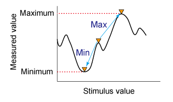

Search for maximum (Max Search) | Move active marker to point on trace where measured value is greatest.  
---|---  
Search for minimum (Min Search) | Move active marker to point on trace where measured value is lowest.  
  
Note: When the data format is in Smith chart or polar format, execute the
search only for the main response value.

## Peak Search

#### How to create Peak Search  
  
---  
Using Hardkey/SoftTab/Softkey | Using a mouse  
  
  1. Press Search > Peak.
  2. Click Peak Search to show the markers on the peak.
  3. Click Peak Right >> Search, << Peak Left Search or Next Peak Search to move the marker to the peak.
  4. Click Threshold to enter the value of peak threshold.
  5. Click Excursion to enter the lower limit value of peak excursion.
  6. Click Peak Polarity to select a [peak polarity](markers.md#PeakPolarity).
  7. Optionally click Tracking to search for the specified peak level with each sweep. [Learn more](markers.md#executing_search).

|

  1. Move a cursor on a marker.
  2. Right-click on the marker and then select Search....
  3. From Search Type of Marker Search dialog box, select Peak / Peak Left / Peak Right / Next Peak.
  4. Enter the value of Threshold and Excursion.
  5. Press Execute or check Tracking. [Learn more](markers.md#executing_search).

  
  
  
A peak is a measurement point whose value is greater or smaller than the
adjoining measurement points on its right and left sides. Peaks are classified
into the following two types depending on the difference in magnitude from the
measurement points on either side of it.

What Is a "Peak"?

You define what the analyzer considers a "peak" by selecting the following two
peak criteria settings:

  * Threshold \- Minimum amplitude (dB). To be considered valid, the peak must be above the threshold level. The valley on either side can be below the threshold level.

  * Excursion \- The vertical distance (dB) between the peak and the valleys on both sides. To be considered a peak, data values must "fall off" from the peak on both sides by the excursion value.

Peak Polarity: | Definition:  
---|---  
Positive | A peak whose measured value is greater than those of the measurement points on either side of it. Detect positive peaks which are larger than Threshold.  
Negative | A peak whose measured value is smaller than those of the measurement points on either side of it. Detect negative peaks which are smaller than Threshold.  
Both | A peak whose measured value is smaller and greater than those of the measurement points on either side of it. Threshold value is not used when polarity is set to both.  
  
### About Peak Excursion Value

The peak excursion value is the smaller of the differences in measured values
from the adjoining peaks of the opposite polarity.

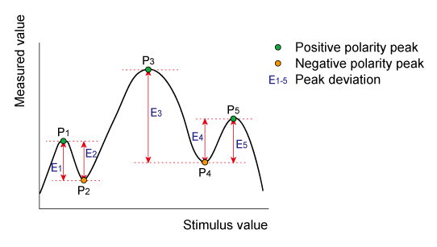

### Executing a Peak Search

The following 3 methods are available for executing the peak search:

Next Peak | Moves the marker to the maximum peak when peak polarity is Positive or Both. Moves the marker to the minimum peak when peak polarity is Negative.  
---|---  
Peak Left | Executes the search from current marker position to the smaller stimulus values and moves the marker to first peak encountered.  
Peak Right | Executes the search from current marker position to the larger stimulus values and moves the marker to first peak encountered.  
  
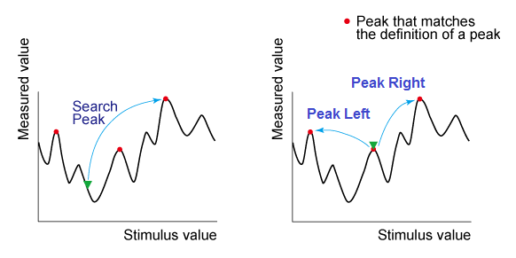

Note: Peak right, peak left and next peak may not be tracked. If these
searches are selected and then tracking is turned on, the peak tracking is
enabled.

When the data format is in Smith chart or polar format, execute the search for
the main response value of the two marker response values.

Changing the settings of [peak excursion value](markers.md#PeakExcursion) or
[peak polarity](markers.md#PeakPolarity) executes new search for multiple
peak.

Example:

Threshold Setting: -10dB  
Excursion Setting: 1dB  
Scale = 1 dB / Division  
Mouse over the graphic to find a valid peak.

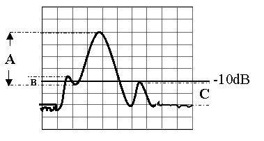

  * Peak A = Valid Peak (Above Threshold and Excursion Settings)

  * Peak B = Invalid Peak (Below Excursion Setting)

  * Peak C = Invalid Peak (Below Threshold Setting)

## Multi Peak Search

#### How to create Multi Peak Search  
  
---  
Using Hardkey/SoftTab/Softkey | Using a mouse  
  
  1. Press Search > Multi Peak & Target.
  2. Click Multi Peak Search to show the markers on the multi peaks.
  3. Click Peak Threshold to enter the value of peak threshold.
  4. Click Peak Excursion to enter the lower limit value of peak excursion.
  5. Click Peak Polarity to select a [peak polarity](markers.md#PeakPolarity).
  6. Optionally click Tracking to search for the specified multi peak level with each sweep. [Learn more](markers.md#executing_search).

|

  1. Move a cursor on a marker.
  2. Right-click on the marker and then select Search....
  3. From Search Type of Marker Search dialog box, select Multi Peak.
  4. Enter the value of Threshold and Excursion.
  5. Press Execute or check Tracking. [Learn more](markers.md#executing_search).

  
  
  
The multi peak search function enables you to display markers on multiple
peaks on traces. Depending on the number of detected peaks, markers 1 through
15 are displayed from the start frequency. The reference marker is not
affected.

Multiple peak search has threshold, excursion and
[polarity](markers.md#PeakPolarity) as user defined values. This search may
have tracking enabled.

When the multiple peak search is executed, previous markers search and
tracking are disabled and the settings for the multiple peak search are used.

Note: Do not use individual marker settings or marker domain.

Put markers on each valid peak, using up to 15 markers.

## Target Search

#### How to create Target Search  
  
---  
Using Hardkey/SoftTab/Softkey | Using a mouse  
  
  1. Press Search > Target.
  2. Click Target Search to enable the target search.
  3. Click Target Right >> Search or << Target Left Search to move the marker to the target.
  4. Click Target Value to input the value of target search.
  5. Click Transition to select a transition type.
  6. Optionally click Tracking to search for the specified target level with each sweep. [Learn more](markers.md#executing_search).

|

  1. Move a cursor on a marker.
  2. Right-click on the marker and then select Search....
  3. From Search Type of Marker Search dialog box, select Target/Target Left/Target Right.
  4. Enter the value of the Target.
  5. Press Execute or check Tracking. [Learn more](markers.md#executing_search).

  
  
  
The target search is a function that searches for a target that matches the
pre-defined target value and transition types (positive, negative or both
positive and negative) and then moves the marker to that target.

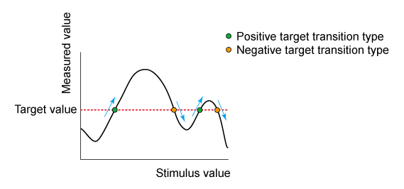

### Target Transition Types

A target is a point that has a specific measured value on the trace. Targets
can be divided into the 3 groups shown below depending on their transition
type.

Transition Type: | Function:  
---|---  
Positive | The target value is larger than the measured value immediately preceding it.  
Negative | The target value is smaller than the measured value immediately preceding it.  
Both | The conditions for either Positive or Negative transition are satisfied.  
  
### Executing a Target Search

The following 3 methods are available for executing the target search:

Target Left | Executes the search from the current marker position to the smaller stimulus values and moves the marker to first target encountered.  
---|---  
Target Right | Executes the search from the current marker position to the larger stimulus values and moves the marker to first target encountered.  
Multi Target | Executes the search for targets that are of the multi-target value and multi target transition value. See Multi Target Search.  
  
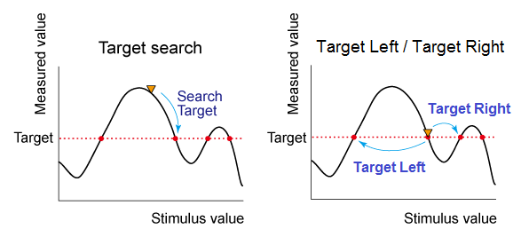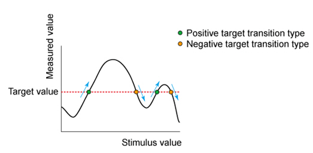

Note: Target right and target left cannot have tracking enabled. If target
left or target right is the selected search and then tracking is enabled,
target tracking is enabled.

When the data format is in Smith chart or polar format, execute the search for
the main response value of the 2 marker response values.

Changing the settings of target value or transition type executes new search
for multiple target.

The marker moves to the first occurrence of the Target value to the right of
its current position. Subsequent presses of the Target Search softkey cause
the marker to move to the next value to the right that meets the Target value.
When the marker reaches the upper end of the stimulus range, it will "wrap
around" and continue the search from the lower end of the stimulus range (left
side of the window).

  * If Discrete Marker is OFF, the marker locates the interpolated data point that equals the target value.

  * If Discrete Marker is ON and there are two data points on either side of the target value, the marker locates the data point closest to the Target value

## Multi Target Search

#### How to create Peak Search  
  
---  
Using Hardkey/SoftTab/Softkey | Using a mouse  
  
  1. Press Search > Multi Peak & Target.
  2. Click Multi Target Search to show the markers on the multi target.
  3. Click Target Value to enter the value of target.
  4. Click Transition to select a transition type.
  5. Optionally click Tracking to search for the specified multi target level with each sweep. [Learn more](markers.md#executing_search).

|

  1. Move a cursor on a marker.
  2. Right-click on the marker and then select Search....
  3. From Search Type of Marker Search dialog box, select Multi Target.
  4. Enter the value of the Target.
  5. Press Execute or check Tracking. [Learn more](markers.md#executing_search).

  
  
  
The multi target search is a function that searches for targets that match to
pre-defined target value and transition types (positive, negative or both of
positive and negative) and displays markers on the targets being searched.

Depending on the number of detected targets, markers 1 through 15 are
displayed from the start frequency. The reference marker is not affected.

When the multi target search is executed, search and tracking settings for
markers 1 through 15 are ignored and the settings for the multi target search
are used.

Note: Put markers on each found target value, using up to fifteen markers.
Reference marker is not affected. Do not use individual marker settings or
marker domain. Search range is applied.

Multiple target search has [target](markers.md#ExecTargetSearch) and
[transition types](markers.md#TransitionTypes) as user defined values. This
search may have tracking enabled. When this search is executing, previous
marker searches are disabled.

## Bandwidth and Notch Search

Bandwidth and notch search behavior depends on whether the preference called
Marker: Use single marker for marker search is set or not. When set, only one
marker is used for a marker search. Sub markers are displayed and used for
Bandwidth and Notch searches. When cleared, multiple markers are used for a
marker search. The default is cleared.

#### How to create Bandwidth and Notch Search  
  
---  
Using Hardkey/SoftTab/Softkey | Using a mouse  
  
  1. Press Search > Bandwidth & Notch.
  2. Click left side Bandwidth Search or Notch Search small button to turn it ON/OFF.
  3. For Bandwidth search, click BW Ref To > Marker or Peak.
  4. For Notch search, click Notch Ref To > Marker or Peak.
  5. Specify the BW Level or Notch Level in dB from the peak or valley where bandwidth / notch is measured.
  6. Optionally click Tracking to search for the specified bandwidth or notch level with each sweep. [Learn more](markers.md#executing_search).

|

  1. Move a cursor on a marker.
  2. Right-click on the marker and then select Search....
  3. From Search Type of Marker Search dialog, select Bandwidth or Notch.
  4. Specify the Level in dB from the peak or valley where bandwidth / notch is measured.
  5. Press Execute or check Tracking. [Learn more](markers.md#executing_search).

  
  
  
### Bandwidth Search

The bandwidth search is a function for _determining_ the bandwidth of the
trace, center frequency, cut-off points (on the higher frequency and the lower
frequency sides), Q and insertion loss based on the position of the active
marker or peak marker. The definitions of the parameters determined through
the bandwidth search are shown in below.

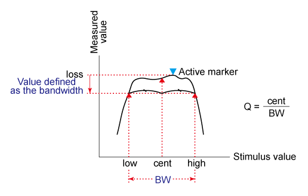

### Notch Search

The notch search function is used to _obtain_ the bandwidth, center frequency,
cutoff points (high-frequency side and low-frequency side), Q and insertion
loss of a trace based on the active marker or peak marker position. The notch
search function starts from the left side of the active marker position and
ends when points that meet the conditions are found.

The figure and the table below shows the definition of parameters obtained by
notch search function. The notch value in figure below must be specified by
the user.

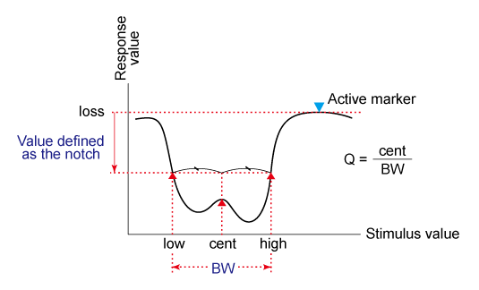

The following values are displayed for Bandwidth and Notch Search:

Bandwidth/Notch Parameter: | Definition:  
---|---  
Bandwidth (BW) | The difference in frequency between the higher frequency cut-off and lower frequency cut-off points (High \- Low).  
Center frequency (cent) | Frequency at the middle point between the lower frequency cut-off and higher frequency cut-off points. (High \+ Low)/2.  
Lower frequency cut-off point (Low) | Lower frequency of 2 measurement points, both separated by the defined bandwidth / notch value from the active marker position.  
Higher frequency cut-off point (High) | Higher frequency of 2 measurement points, both separated by the defined bandwidth / notch value from the active marker position.  
Q | Ratio of Center Frequency to Bandwidth (Center Frequency / Bandwidth).  
Insertion loss (loss) | The measured value of the position of the center frequency at the time the bandwidth/notch search is executed.  
  
  * Bandwidth / Notch Search can be used ONLY with [Log Mag display format](../s1_settings/data_format.md).

  * To use Bandwidth Search on a peak or valley other than the maximum or minimum values, change the [Search Domain](markers.md#Domain).

## Compression Search

Uses the active marker to find the specified gain Compression Level.

Note: Valid ONLY for S21 (Gain) measurements with a [Power
Sweep](../s1_settings/sweep.htm#SweepTypeDiag).

#### How to create Compresssion Search  
  
---  
Using Hardkey/SoftTab/Softkey | Using a mouse  
  
  1. Press Search > Comp & Sat.
  2. Click Compression Search to turn ON/OFF.
  3. Specify the Comp Level in dB.
  4. Optionally click Tracking to search for the specified compression level with each sweep. [Learn more](markers.md#executing_search).

|

  1. Move a cursor on a marker.
  2. Right-click on the maker and then select Search....
  3. From Search Type of Marker Search dialog box, select Compression.
  4. Enter the Y-axis (Power OUT) difference between the first point and the compression marker.
  5. Press Execute or check Tracking. [Learn more](markers.md#executing_search).

  
  
  
Linear gain is defined as the Y-axis value (gain) of the first data point of
the [Search Domain](markers.md#SearchDiag1) (Full Span by default).

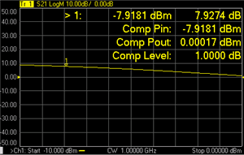

Marker > N - X-axis value and Y-axis value.

Comp Pin - Input power (marker X-axis value).

Comp Pout - Output power (Pin \+ gain).

Comp Level - Compression level found.

  * When [Discrete](markers.md#discrete) is OFF (default setting), the marker finds the exact specified compression, interpolated between the two closest data points and calculates the Comp Pin and Comp Pout value for that point.

  * The marker can move from one actual measurement point to another. Because it is interpolated, it can also move in the space between measurement points.

  * When [Discrete](markers.md#discrete) is ON (not interpolated), the marker resides on the closest data point to the requested compression level.

  * A marker moves only between actual measurement points. When a specific marker stimulus value is specified as a numerical value, the marker is placed at the measurement point closest to the specified value. A marker that is placed between interpolated points with the discrete mode off automatically moves to the nearest measurement point when the discrete mode is turned on.

Comp. Not Found - Displayed when the requested compression level is not found.

## About PSAT and PNOP Search

Compression measurements based on the Pout vs Pin curves are common in the
satellite test industry. In the case of Travelling Wave Tube (TWT) amplifiers,
PSAT markers identify the normal operating point near saturation, and the
amplifiers are operated with the power slightly backed-off approximately 0.03
to 0.1 dB. For TWT amplifiers, the saturation curve always "folds over" and
produces a maximum power out.

For Solid State Power Amplifiers (SSPA), the saturation is not as well
defined. A common reference is the Normal Operating Point, which is a power
backed-off by 8 to 10 dB from the maximum power. In this case, the normal
operating point marker replaces the Psat with the PNOP values. Also, because
the backoff is important, the backoff output and input powers are displayed
(PBO Out), (PBO in) as well as gain at back off (PBO Gain).

## Power Saturation (PSAT) Search

If the Marker: Use single marker for marker search preference is cleared, this
search uses Markers 1, 2, and 3 to quickly identify output power saturation
parameters of an amplifier. If the Marker: Use single marker for marker search
preference is set, then only one marker is used for the search and 2
notational markers are displayed. The notational markers may not be moved.
These markers are for display purposes only.

Back-off is a point at which the output power is sufficiently lower than the
saturated output power so that the device under test behaves in a more linear
fashion.

Note: Valid ONLY for Power IN vs Power OUT measurements.

#### How to make Power IN (X-axis) vs Power OUT (Y-axis) measurement  
  
---  
Using Hardkey/SoftTab/Softkey  
  
  1. Press Preset.
  2. Press Sweep > Main > Sweep Type.
  3. Select Power Sweep.
  4. Press Trace > Trace Setup > Measure... and set [Trace Meas](../s1_settings/measurement_parameters.md#Receiver) to "B" Receiver
  5. Connect DUT input to port 1.
  6. Connect DUT output to port 2.

  
  
  
#### How to create PSAT Search  
  
---  
Using Hardkey/SoftTab/Softkey | Using a mouse  
  
  1. Press Search > Comp & Sat.
  2. Click left side Saturation Search small button to turn ON/OFF.
  3. For PMax Back-Off, enter the Y-axis (Power OUT) difference between the Max Power marker (3) and the Back-off marker (2).
  4. Optionally click Tracking to search for the specified power saturation level with each sweep. [Learn more](markers.md#executing_search).

|

  1. Move a cursor on a marker.
  2. Right-click on the marker and then select Search > Search....
  3. From Search Type of Marker Search dialog box, select Power Saturation.
  4. For PMax Back-Off, enter the Y-axis (Power OUT) difference between the Max Power marker (3) and the Back-off marker (2).
  5. Press Execute or check Tracking. [Learn more](markers.md#executing_search).

  
  
  
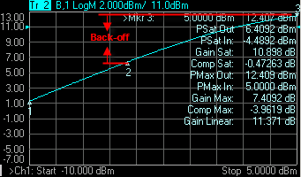

This setting uses three markers to calculate and display 10 values.

The three markers:

  * Marker 1: Linear gain; the first data point in the sweep.

  * Marker 2: Specified output power Back-off from max power.

  * Marker 3: Max Power output; usually the last data point.

The 9 displayed values:

Param | Description | Calculated from...  
---|---|---  
PSat Out | Output power at the saturation point. | Marker 2 Y-axis value  
PSat In | Input power at the saturation point. | Marker 2 X-axis value  
Gain Sat | Gain at the saturation point. | Psat Out - Psat In  
Comp Sat | Compression at the saturation point. | Gain Sat - Gain Linear  
PMax Out | Maximum output power. | Marker 3 Y-axis value  
PMax In | Input power at the maximum output power. | Marker 3 X-axis value  
Gain Max | Gain at the maximum output power. | PMax Out - PMax In  
Comp Max | Compression at the maximum output power. | Gain Max - Gain Linear  
Gain Linear | Linear gain at the first data point. | Marker 1 - Y-axis value MINUS X-axis value  
  
  * Comp. Not Found is displayed when the requested Back-off point is not found.

  * When [Discrete](markers.md#discrete) marker is NOT selected (the default setting), the three markers find an interpolated value between the two closest data points.

  * When [Discrete](markers.md#discrete) marker is selected (NOT interpolated), the three markers reside on the closest data points.

## Power Normal Operating Point (PNOP) Search

If the Marker: Use single marker for marker search preference is cleared, this
search uses Markers 1, 2, 3, and 4 to quickly identify Normal Operating Point
parameters of an amplifier. If the Marker: Use single marker for marker search
preference is set, then only one marker is used for the search and 2
notational markers are displayed. The notational markers may not be moved.
These markers are for display purposes only.

Back-off is a point at which the output power is sufficiently lower than the
saturated output power so that the device under test behaves in a more linear
fashion.

The power normal operating point is the output power where the input is offset
from the back-off input power by the Pin Offset.

Note: Valid ONLY for Power IN vs Power OUT measurements.

See [Power Saturation](markers.md#PSat) to learn how to make a Power IN
(X-axis) vs Power OUT (Y-axis) measurement.

#### How to create PNOP Search  
  
---  
Using Hardkey/SoftTab/Softkey | Using a mouse  
  
  1. Press Search > Normal Op Pt.
  2. Click left side Normal OP Search small button to turn ON/OFF .
  3. For Back-Off, enter the Y-axis (Power OUT) difference between the Max Power marker (3) and the Back-off marker (2).
  4. For Pin Offset, enter the X-axis (Power IN) difference between Back-off marker (2) and PNOP marker (4).
  5. Optionally click Tracking to search for the specified power normal operating point level with each sweep. [Learn more](markers.md#executing_search).

|

  1. Move a cursor on a marker.
  2. Right-click on the marker and then select Search > Search....
  3. From Search Type of Marker Search dialog box, select Normal Operating Pt.
  4. For Back-Off, enter the Y-axis (Power OUT) difference between the Max Power marker (3) and the Back-off marker (2).
  5. For Pin Offset, enter the X-axis (Power IN) difference between Back-off marker (2) and PNOP marker (4).
  6. Press Execute or check Tracking. [Learn more](markers.md#executing_search).

  
  
  
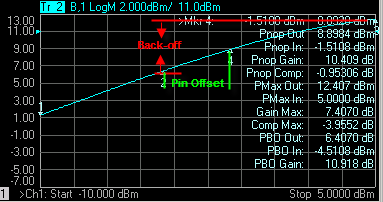

This setting uses four markers to calculate and display 12 values.

The four markers:

  * Marker 1: Linear gain; the first data point in the sweep.

  * Marker 2: Max Output Power MINUS the specified Output (Y-axis ) Back-off value in dB.

  * Marker 3: Max Output Power; usually the last data point in the sweep.

  * Marker 4: X-axis value of Back-off (Marker 2) plus the Pin Offset (X-axis) value in dB.

The 11 displayed values:

Param | Description | Calculated from...  
---|---|---  
Pnop Out | Output power at the power normal operating point. | Marker 4 Y-axis value  
Pnop In | Input power at the power normal operating point. | Marker 4 X-axis value  
Pnop Gain | Gain at the power normal operating point. | Pnop Out - Pnop In  
Pnop Comp | Compression at the power normal operating point. | Pnop Gain - Linear Gain*  
PMax Out | Maximum output power. | Marker 3 Y-axis value  
PMax In | Input power at the maximum output power. | Marker 3 X-axis value  
Gain Max | Gain at the maximum output power. | PMax Out - PMax In  
Comp Max | Compression at the maximum output power. | Gain Max - Linear Gain*  
PBO Out | Output power at the back-off point. | Marker 2 Y-axis  
PBO In | Input power at the back-off point. | Marker 2 X-axis  
PBO Gain | Gain at the back-off point. | PBO Out - PBO In  
  
*Linear Gain (not shown): Marker 1 - Y-axis value MINUS X-axis value

  * PNOP Not Found is displayed when the requested back-off level is not found.

  * When [Discrete](markers.md#discrete) marker is NOT selected (the default setting), the four markers each find an interpolated value between the two closest data points.

  * When [Discrete](markers.md#discrete) marker is selected (NOT interpolated), the four markers each reside on the closest data point.

Search Range

Search domain settings restrict the stimulus values (X-axis for rectangular
format) to a specified span. Set the User Start and User Stop stimulus
settings of these User spans. If User Start is greater than User Stop, the
marker will not move. [Learn how to set Search
Range](Markers.htm#SearchDiag1).

  * The default domain of each new marker is "full span".

  * There are 16 user-defined domains for every channel.

  * The user-defined domains can overlap.

  * More than one marker can use a defined domain.

  * Search Domain settings are shared with [Trace Statistics User Ranges](Math_Operations.md#StatisticsDialog)

The graphic below shows examples of search domains.

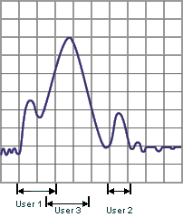

## Search Range Indicators

A search range will be indicated with a pair of small, outlined triangles
sitting on the X-axis. Although there can be multiple search ranges in use on
various markers, only the current-selected search range for the active marker
is displayed. This rule prevents the possibility of the X-axis being cluttered
with many search range triangles. This rule applies even when there are
multiple traces in a window.

Only one search range will be displayed on a grid at any time. The displayed
search range will correspond to the active trace and active marker. The color
of the range indicators will match that of the active trace.

Range indicators will appear automatically when appropriate and cannot be
disabled. The mouse or touchscreen can't be used to “click-and-drag” the
position of the range indicators which will alter the search range definition.

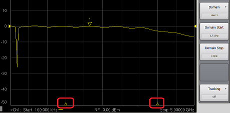

Search Within

The zoomed frequency range becomes the User 16 Search Domain span.

A marker is created if not already present on the trace. If markers are
already present on the trace, the lowest marker is moved to the found value.

  1. Left-click the mouse or use a finger, then drag across a portion of a trace.

  2. Release the mouse or lift the finger.

  3. Select Search Within.

  4. Then choose from the following:

     * Max \- A marker moves to the HIGHEST value within the zoomed range.

     * Min \- A marker moves to the LOWEST value within the zoomed range.

     * Target \- A marker moves to the first value within the zoomed range that is currently set in the [Marker Search 'Target' setting](Markers.md#Target). The same Discrete Marker rules apply as those for the standard Target Marker Search.

Marker Functions - Change Instrument Settings

The following settings change the relevant VNA settings to the position of the
active maker.

#### How to change Instrument settings using markers  
  
---  
Using Hardkey/SoftTab/Softkey | Using a mouse  
  
  1. Press Marker > Marker->Functions.

|

  1. Move a cursor on a marker.
  2. Right-click on the marker and then select Functions.
  3. Select the desired search function.
  4. Click Function... to show the Marker Function Dialog box.

  
  
Marker Function dialog box help |   
---|---  
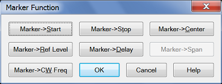 Note: Marker Functions do not work
with channels that are in [CW](../S1_Settings/Sweep.md#SweepTypeDiag) or
[Segment Sweep](../S1_Settings/Sweep.md#segment) mode. Marker =>Start Sets
the start sweep setting to the value of the active marker. Marker =>Stop Sets
the stop sweep setting to the value of the active marker. Marker =>Center Sets
the center of the sweep to the value of the active marker. Marker =>Ref Level
Sets the screen [reference level](../S1_Settings/Scale.md#Ref_Level) to the
value of the active marker. Marker =>Delay The phase slope at the active
marker stimulus position is used to adjust the line length to the receiver
input. This effectively flattens the phase trace around the active marker.
Additional Electrical Delay adjustments are required on devices without
constant group delay over the measured frequency span. You can use this to
measure the electrical length or deviation from linear phase. This feature
adds phase delay to a variation in phase versus frequency; therefore, it is
only applicable for ratioed measurements. See [Measurement
Parameters](../S1_Settings/Measurement_Parameters.htm). Marker =>Span Sets the
sweep span to the span that is defined by the [delta
marker](Markers.htm#reference) and the marker that it references. Unavailable
if there is no delta marker. Marker =>CW Freq Sets the CW frequency to the
frequency of the active marker. NOT available when the channel is in CW or
Power Sweep. Use this function to first set the CW Frequency to a value that
is known to be within the current calibrated range, THEN set [Sweep
Type](../S1_Settings/Sweep.htm#SweepTypeDiag) to Power or CW. Marker =>IM
Spectrum This feature is supported in Swept IMD/IMDX measurement classes
(channels) ONLY. The generated IMD tones and 2 input tones are measured. This
feature provides a plot of the fixed input tones and IMD tones across the
receiver frequency. Marker =>SA This feature is supported in Standard, SMC or
Swept IMD measurement classes (channels) ONLY. In this section, these are
called NA channels. With a marker residing on a trace in an NA channel,
Marker=>SA creates a new SA channel in full frequency span. A marker is
created on the trace at the same frequency as the NA channel trace. This is a
quick way to see the frequency spectrum of the NA channel at a specific
frequency. [Learn more](../Applications/Spectrum_Analyzer.md#MarkerToSA).  
  
Note: Some Marker Functions do not work with channels that are in certain
[Sweep Types](../s1_settings/sweep.md#SweepTypeDiag).

Marker Function | Sweep Type  
---|---  
Lin/Log Freq. | Segment | Power | CW Time  
Start, Stop, Center | F |  | S |   
Span | S |  | S |   
Ref Level | F | S | S | S  
Delay | F | S | S | S  
CW Freq. | S | S |  |   
  
F: Available in both Standard and SMC classes

S: Available in only Standard Class

SA Analysis Markers

The following markers are specific to Spectrum Analyzer measurement channels.

#### Spectrum Analysis markers  
  
---  
Using Hardkey/SoftTab/Softkey | Using a mouse  
  
  1. Press Marker > SA Analysis.

|

  1. Click Response.
  2. Select Marker.
  3. Select the desired marker.

  
  
  
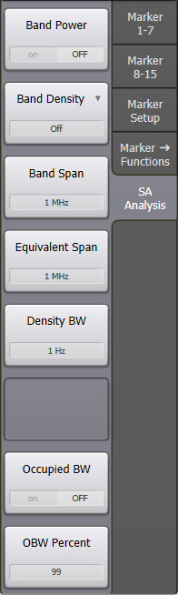

**Band Power** – Provides a readout of the total power obtained by integrating
over the specified frequency range defined by Band Span, centered at the
marker position.

The [Average](../Applications/Spectrum_Analyzer.md#Average) detector type
makes the display more consistent with Band Power markers. With this detector
type the marker readouts and the estimated power values or delta from the
display have a good match. Many legacy spectrum analyzers need to set the
detector type to average to do band power measurements. PNA-SA does not need
to select the average detector to compute the right band power measurements,
it’s only useful to check the values between marker readouts and display
estimates.

**Band Density** – Selections are **Off** , **Noise** , **Power** , **Tone,
NPR,** or **ACPR**

  * **Noise** – Provides a readout of the noise-power density (dBm/Hz) at the marker position, obtained by integrating over the specified frequency range defined by Band Span, and normalizing to the same frequency range.

  * **Power** – Provides a readout of the power density (dBm/Hz) at the marker position, obtained by integrating over the specified frequency range defined by Band Span, and normalizing to the bandwidth defined by Equivalent Span.

  * **Tone** – Provides a readout of the power density (dBm/tone) at the marker position, obtained by integrating over the specified frequency range defined by Band Span, and normalizing to the bandwidth defined by Density BW and Equivalent Span. When Density BW is set to the tone spacing of the multitone signal, and Equivalent Span is the same as Band Span, Tone Density gives dBm/tone. This feature is useful for measuring the power density of the signals inside and outside the notch for Noise Power Ratio (NPR) measurements.  For example, for measuring a 10 MHz notch with -50 dBm band power and 100 kHz tone spacing (number of tones = 10 MHz/100 kHz = 100), setting the Band Span and Equivalent Span to 10 MHz and the Density BW to 100 kHz, the result shows that each tone would be -70 dBm (-50 dBm \- 10*Log10[100]). Tone band density can also be used to measure Adjacent-Channel-Power-Ratio (ACPR).

  * **NPR** – Uses the same calculation method as **Tone** , but provides a simpler readout consisting only of marker frequency and NPR value.

  * **ACPR** \- Uses the same calculation method as **Tone** , but provides a simpler readout consisting only of marker frequency and ACPR value. 

Note: The band-density markers can be set to Delta ON mode which is very
useful for NPR and ACPR, which are defined as distortion power in a specified
band divided by in-band power. For these ratioed measurements, the reference
marker can be set to Tone Band Density, with a Band Span that covers the in-
channel bandwidth (for NPR, see Equivalent Span below to account for the
reduction in channel power due to the notch). The ACPR and NPR delta markers
will have a Band Span defined by the adjacent-channel bandwidth or the notch
bandwidth respectively.

**Band Span** – Sets the frequency range over which Band Power and Band
Density measurements are calculated.

**Equivalent Span** – Sets the frequency range over which Power and Tone Band
Density measurements are normalized. This feature is useful for calculating
the power density of a wideband signal with a notch (or multiple notches),
where the power in the notch(es) is significant and cannot be ignored.
Adjusting the Equivalent Span is essential for calculating the correct tone
powers of a noise-power-ratio (NPR) signal. For example, for a 100 MHz signal
with a 10 MHz notch, the Equivalent Span would be 90 MHz. For measuring the
power in the notch, the Equivalent Span and Band Span are the same (10 MHz in
this example).

**Density BW** – Sets the frequency range over which Tone Band Density
measurements are calculated.

**Occupied BW** – Enables/disables the frequency range that contains a defined
percentage of the overall band power as specified by OBW Percent.

**OBW Percent** – Sets the percentage used to calculate Occupied BW.

**NPR Measurement Example**

Noise-Power-Ratio (NPR) measurements are displayed using a fixed reference
marker (set to Tone Band Density) that calculates the power density of the
main signal, and a delta marker (set to NPR Band Density) that calculates the
power density of the distortion signals within the notch. The Equivalent Span
of the main signal is set to the Band Span minus the notch bandwidth – for
example, for a 100 MHz wide NPR signal with a 10 MHz notch, the Equivalent
Span would be 100 MHz - 10 MHz = 90 MHz. For the notch in this same example,
the Equivalent Span would be set to 10 MHz.

**Calculations for Band Power and Density Markers**

All the band-power and band-density markers are computed from Discrete Fourier
Transform (DFT) data, before the data is processed into the display points
shown on the screen as traces. As a result, these markers are not affected by
the number of display points, or by the detection algorithm used (average,
sample, peak, etc.). There are two ways to access the DFT data if a user
wishes to do their own calculations of power, or to perform other mathematical
processing:

  1. Set the Detector Type to Bypass, which works if the number of DFT points is below 100,003 (the trace-size limit).

  2. Use the SA Data feature (accessed via the Advanced tab of the SA Setup dialog). In general, the display points do not provide an accurate representation of band-power or band-density values. 

There are many more DFT data points than display points, and the data
reduction performed by the detection algorithm causes band-power accuracy to
degrade at signal discontinuities, where there is a wide change in power
values. In addition, when using peak detection, the algorithm takes the
largest power value of the DFT data-set to produce a single display point, so
the displayed value does not represent the average power of the band covered
for that point. For these reasons, it is impossible to compute an accurate
band-power or band-density value from display points using the peak detector.
This is why the SA band-power and band-density markers are computed from the
underlying DFT data.

SA Analysis Markers (Option S93070xBS9x070B Modulation Distortion only)

The following markers are specific to Modulation Distortion measurement
channels.

#### Modulation Distortion markers  
  
---  
Using Hardkey/SoftTab/Softkey  
  
  1. Press Marker > SA Analysis.

  
  
  
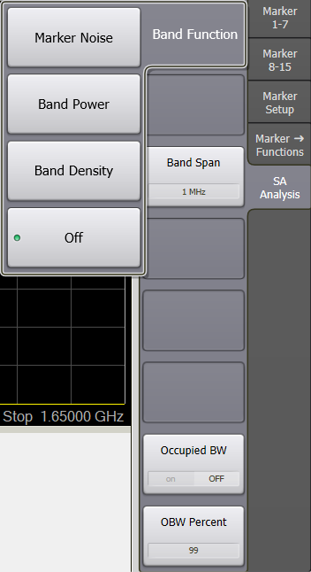

Band Function \- Selections are Off, Marker Noise, Band Power, or Band
Density.

Marker Noise \- Noise integrated over the frequency span defined by Band Span.

Band Power \- Power integrated over the frequency span defined by Band Span.
This is the total power of the signal in dBm or Watts.

Band Density \- Band power expressed in Watts divided by the integrating
bandwidth specified by Band Span. The density value is constant as span is
decreased.

Band Span \- The Band Span is used to determine total signal power within a
specified frequency span. For example, to calculate the total power of a
signal composed of 100 tones spaced 1 MHz apart over a 100 MHz span, the
signal power would be integrated over a span of 100 MHz.

**Occupied BW** – Enables/disables the frequency range that contains a defined
percentage of the overall band power as specified by OBW Percent.

**OBW Percent** – Sets the percentage used to calculate Occupied BW.

Marker Display

The marker display dialog allows you to change how markers and the associated
readout is displayed on the VNA screen. Several marker display features also
apply to [Statistics](Math_Operations.md#statistics) display.

#### How to change Marker Display settings  
  
---  
Using Hardkey/SoftTab/Softkey | Using a mouse  
  
  1. Press Marker > Marker Setup > Marker Display....

OR

  1. Press Display > Display Settings > Customize Display....
  2. Select Markers tab.

|

  1. Move a cursor to the marker data area on top right corner of grid box.
  2. Right click on the marker data display area.
  3. Select Marker Display....

OR

  1. Right click on any window area.
  2. Click Customize Display....
  3. Select Markers tab.

  
  
Customize Display dialog box help |   
---|---  
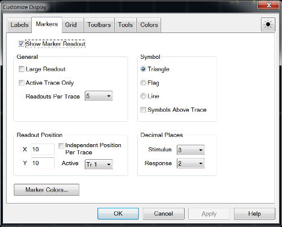 The following settings apply
to readouts of ALL currently-displayed marker, bandwidth, and [trace
statistics](Math_Operations.htm#statistics). These settings revert to their
defaults on Preset but ARE stored with [Instrument
State](../S5_Output/SaveRecall.htm#State) and [User
Preset](../S1_Settings/Preset_the_Analyzer.htm#PresetUserDefined).

#### Marker Readout

Checked - Shows readout information. Cleared - Shows NO readout information.

#### Large Readout

Checked - Shows the marker readout in large font size for easy reading.
However, all readout lines may not be visible. Cleared - Shows the marker
readout in normal font size.

#### Active Trace Only

Checked - Shows the marker readout for the active trace only. Cleared - Shows
all marker readouts.

#### Readouts Per Trace

Choose the quantity of marker readouts to show in the window for each trace.
Choose to display up to 16 readouts per trace, up to 20 readouts per window.
When more markers are present than the specified quantity of readouts, the
marker numbers for which readouts are displayed can change depending on the
marker number that is active. Readouts Per Trace can be set independently for
each window.

#### Symbol

Choose from the following marker symbols. |  Triangle |  Flag | 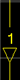 Line  
---|---|---  
  
Line symbols are NOT used on Smith or Polar [display
formats](../S1_Settings/Data_Format.htm).

Symbols can be set independently for each window.

#### Symbols Above Trace

Cleared - ONLY the active marker is displayed above the trace. Inactive
markers are displayed below the trace.

Checked - ALL marker symbols are displayed above the trace. The active marker
is always filled solid.

#### Decimal Places

Choose the marker readout resolution to display. These values also apply to
the readouts that are displayed in the [marker
table](Markers.htm#marker_table). Decimal Places can be set independently for
each window.

Stimulus (X-axis) - Choose from 2 to 6 places after the decimal point. Default
is 3.

Response (Y-axis) - choose from 1 to 4 places after the decimal point. Default
is 2.

#### Readout Position

Choose where to place the marker readouts. Marker readouts are right-justified
on the specified X-axis and Y-axis position. The default position (10.0, 10.0)
is the upper-right corner of the grid. Position (1.0,1.0) is the lower-left
corner. Readout position can also be set independently for each window.

Note: Readout Position can also be changed using a mouse by left-clicking on
the top readout and dragging to the new position.

Marker Colors Starts the Display Colors dialog with only the marker colors
available. [Learn more](../System/Display_Colors.md#dispColorDiag).  
  
Marker Table

You can display a table that provides a summary of marker data for the active
trace. The marker data is displayed in the specified format for each marker.

#### How to view the Marker Table  
  
---  
Using Hardkey/SoftTab/Softkey  
  
  1. Press Marker > Marker Setup > Marker Table.

  
  
  
* * *

