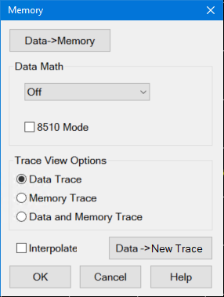
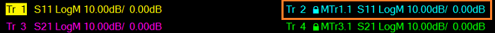
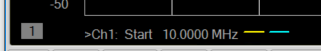
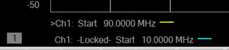
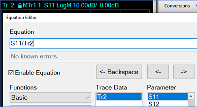
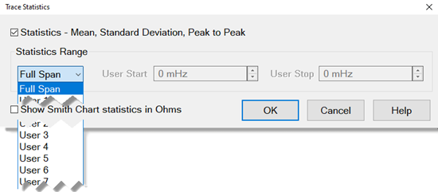

# Using Math / Memory Operations

* * *

You can perform four types of math on the active trace versus a memory trace.
In addition three statistics (Mean, Standard Deviation and Peak to Peak) can
be calculated and displayed for the active data trace.

  * [Trace Math](Math_Operations.md#math)

  * [Trace Statistics](Math_Operations.md#statistics)

  * Trace Deviation

Note: Trace Math (described here) allows you to quickly apply one of four math
operations using memory traces. [Equation Editor](Equation_Editor.md) allows
you to build custom equations using several types of traces from the same, or
different channels.

[Other Analyze Data topics](Analyze_Data.md)

Trace Math

To perform any of the math operations, you must first store a trace to memory.
You can display the memory trace using the
[View](../S1_Settings/Customize_Your_Analyzer_Screen.md) options.

Trace math is performed on the complex data before it is formatted for
display. See the [VNA data processing map](../Programming/DataMapSet.md).

Markers can be used while viewing a memory trace.

#### How to select Trace Math  
  
---  
Using Hardkey/SoftTab/Softkey | Using a mouse  
  
  1. Press Math > Memory.

|

  1. Right click on any trace status area above the grid box.
  2. Select on Memory....

  
Normalize, available only from the Memory menu, (not on the Math / Memory
dialog), performs the same function as Data=>Memory, then Data / Memory.  
  
Math / Memory dialog box help  
---  
 Normalize, available only from the
Memory menu, (not on the Math / Memory dialog), performs the same function as
Data=>Memory, then Data / Memory. Data=>Memory Puts the active data trace into
memory. You can store one memory trace for every displayed trace. Note: Many
VNA features are NOT allowed on Memory traces. For example, Memory traces can
NOT be saved to any [file type](../S5_Output/SaveRecall.md#SaveDataAs) (PRN,
SNP, CTI, CSV, MDF).

### Data Math

All math operations are performed on linear (real and imaginary) data before
being formatted. See the [VNA Data flow](../Programming/DataMapSet.md). Data
(or OFF) Does no mathematical operation. Data / Memory \- Current measurement
data is divided by the data in memory. Use for ratio comparison of two traces,
such as measurements of gain or attenuation. Learn more. Data – Memory \- Data
in memory is subtracted from the current measurement data. For example, you
can use this feature for storing a measured vector error, then subtracting
this error from the DUT measurement. Learn more. Data + Memory \- Current
measurement data is added to the data in memory. [Learn
more](Math_Operations.htm#add_mult). Data * Memory \- Current measurement data
is multiplied by the data in memory. [Learn
more](Math_Operations.htm#add_mult).

### 8510 Mode \- [Learn more](8510_Mode.md).

### Trace View Options

Data Trace Displays ONLY the Data trace (with selected math operation
applied). Memory Trace Displays ONLY the trace that was put in memory. Data
and Memory Trace Displays BOTH the Data trace (with selected math operation
applied), and the trace that was put in memory.

### Interpolate

Note: The E5080A and M9485A do not support this function. After performing a
Data->Memory operation, memory interpolation controls whether the memory data
is interpolated or not if the start frequency, stop frequency, or Number of
Points is subsequently changed. Using the GUI control, interpolate applies to
the currently active measurement. When using the remote interfaces
([SCPI](../Programming/GP-IB_Command_Finder/Calculate/Math_Calc.md#cmi) or
[COM](../Programming/COM_Reference/Properties/InterpolateMemory_Property.md)),
the commands apply to the specified measurement. Note: Interpolate does not
support the 8510 Mode. The PNA will return to a default interpolation state
after a Preset, creating a new trace, or closing the PNA application. The
default interpolation state is set in the
[Preferences](../System/Preferences.md#Interpolate) dialog by checking or
unchecking the Memory: Interpolate ON is the default condition preference. The
factory default is unchecked. The default can also be set using the remote
interfaces ([SCPI](../Programming/GP-
IB_Command_Finder/System_Preferences.htm#SYSTem:PREFerences:ITEM:MINTerpolate)
or
[COM](../Programming/COM_Reference/Properties/InterpolateMemoryIsDefault_Property.md)).
 When unchecked, after a Data->Memory
operation the memory trace's x-y positions will not change if the start or
stop frequency is subsequently changed. In addition, if the Number of Points
in the sweep is changed after a Data->Memory operation, the memory trace will
be invalidated and disappear. If the Number of Points is changed while using
Data Math, the Memory trace will be invalidated and Data Math will be forced
to the "Off" condition.  When checked, after
a Data->Memory operation the memory trace's x-y positions will be interpolated
if the start or stop frequency is subsequently changed. In addition, if the
Number of Points in the sweep is changed after a Data->Memory operation, the
memory trace will be interpolated. Note: The PNA will not extrapolate to
stimulus values beyond the range that was present at the time of the
Data->Memory operation. Instead, the Memory data will be invalidated if the
stimulus values exceed the original range. Note: If Interpolate is checked
(ON) and stimulus conditions are different than they were at the time of
Data->Memory operation, unchecking (OFF) Interpolate will cause the Memory
trace to be either updated (using both original and current stimulus settings)
or invalidated (if Number of Points changed since Data->Memory operation). The
Memory trace will remain disabled until either Interpolate is checked (ON) or
the stimulus settings corresponding to the Data->Memory operation are
restored.

### Data->New Trace

The Data -> New Trace allows several memory traces to be saved from the same
trace data. Measurements made under different conditions can be compared. The
following are two typical use cases:

  1. Compare a DUT response before and after tuning.
  2. Compare the response of two or more DUTs.

This feature copies the trace data from the active measurement into a new,
independent trace. The new trace will not change when measurements are updated
by a new sweep. The lowest-numbered available trace number is assigned. A new
trace is created in the same channel and window. Complex data and formatted
data is copied from the original trace to the memorized (locked) trace.The
following settings are also copied: markers, transform, phase offset,
smoothing, parameter conversion, trace title, scattergram, scale, and trace
format. The only softkeys disabled for a memorized (locked) trace are the
measurement parameter softkeys (so that the measurement cannot be changed) and
the Data->New Trace softkey. Save/Recall, however, is supported for memorized
traces.

#### Trace Label

The new trace label is displayed in the Trace Annotation area as shown below:
 Tr 2 \- The first part of the
label is the same as other traces; for example, Tr 2, Tr 3, etc.
Lock\- The locked symbol indicates that the
trace will not update from sweep to sweep. MTr1.1 S11 \- Displays the
following information: MTr1 \- 1 Indicates the original trace number. .1 \-
The number after period indicates the number of copies of the trace that exist
after this new trace has been added.  S11 \- Original trace parameter that was
being measured when Data -> New Trace was pressed. The [Trace
Title](../S1_Settings/Customize_Your_Analyzer_Screen.htm#TraceTitle) feature
allows the parameter name to be customized. In the example above, Tr4 is
copied from Tr3 and is the first copy.

#### X-Axis Label

If the memorized trace is shown in the same window as the original trace, and
if the swept conditions have not changed, then the memorized trace will share
x-axis labels with the original trace as shown below:
 Ch1 sweep settings
unchanged Tr 1 (Yellow) - original trace Tr 2 (Blue) - memorized trace If the
memorized trace is shown in the same window as the original trace but sweep
settings _have_ changed since it was created, then the memorized trace will be
displayed on a separate line of x-axis labels. The memorized trace line will
still show “ChX” where X is the channel number of the original trace. It also
indicates that these are prior, locked stimulus settings.
 Ch1 sweep settings
changed Tr 1 (Yellow) - original trace Tr 2 (Blue) - memorized trace If the
memorized trace is shown in a different window than the original trace, and
there are no other traces in that window from the original channel with the
same swept conditions, then the memorized trace will be displayed on a
separate line of x-axis labels.  Ch1 sweep setting changed or unchanged Tr 3
(Yellow) - original trace in Window 2 from Ch2 Tr 2 (Blue) - memorized trace
from Tr 1 and Ch1

### Equation Editor

This new trace is also available in the [Equation Editor](Equation_Editor.md)
for math operations. It will appear in the same way that other traces appear
as shown below: 
[Learn more about Trace Math](Math_Operations.md#math) (scroll up)  
  
(Data / Memory) and (Data - Memory)

(Data / Memory) and (Data - Memory) math operations are performed on linear
data before it is formatted. Because data is often viewed in log format, it is
not always clear which of the two math operations should be used. Remember:
dividing linear data is the same as subtracting logarithmic data. The
following illustrates, in general, when to use each operation.

Use Data / Memory for normalization purposes, such as when comparing S21
traces "before" and "after" a change is made or measurement of trace noise. In
the following table, the Data/Mem values intuitively show the differences
between traces. It is not obvious what Data-Mem is displaying.

S21 values to compare | Data/Mem | Data-Mem  
---|---|---  
0.5 dB and 0.6 dB | 0.1 dB | -39 dB  
0.5 dB and 0.7 dB | 0.2 dB | -33 dB  
  
Use Data - Memory to show the relative differences between two signals. Use
for comparison of very small signals, such as the S11 match of two connectors.

In the following table, Data/Mem shows both pairs of connectors to have the
same 2 dB difference. However, the second pair of connectors have much better
S11 performance (-50 and -52) and the relative significance is shown in the
Data-Mem values.

S11 values to compare | Data/Mem | Data-Mem  
---|---|---  
-10 dB and -12 dB | 2 dB | -24 dB  
-50 dB and -52 dB | 2 dB | -64 dB  
  
Data * Memory and Data + Memory

Use Data * Memory and Data + Memory to perform math on an active data trace
using data from your own formulas or algorithms rather than data from a
measurement. For example, if you want to simulate the gain of a theoretical
amplifier placed in series before the DUT, you could do the following:

  1. Create an algorithm that would characterize the frequency response of the theoretical amplifier.

  2. Enter complex data pairs that correspond to the number of data points for your data trace.

  3. Load the data pairs into memory with SCPI or COM commands. The analyzer maps the complex pairs to correspond to the stimulus values at the actual measurement points.

  4. Use the data + memory or data * memory function to add or multiply the frequency response data to the measured data from the active data trace.

Note: The data trace must be configured before you attempt to load the memory.

Trace Statistics

You can calculate and display statistics for the active data trace. These
statistics are:

  * Mean

  * Standard deviation

  * Peak-to-peak values

You can calculate statistics for the full stimulus span or for part of it by
using User Ranges.

You can define up to 16 user ranges per channel. These user ranges are the
same as the [Search Domain](Markers.md#domain) specified for a marker search
in that same channel. They use the same memory registers and thus share the
same stimulus spans.

The user ranges for a channel can overlap each other.

A convenient use for trace statistics is to find the peak-to-peak value of
passband ripple without searching separately for the minimum and maximum
values.

The trace statistics are calculated based on the format used to display the
data.

  * [Rectangular data formats](../S1_Settings/Data_Format.md#Rec_display_form) are calculated from the scalar data represented in the display

  * [Polar](../S1_Settings/Data_Format.md#Polar) or [Smith Chart](../S1_Settings/Data_Format.md#Smith_Chart) formats are calculated from the data as it would be displayed in [Log Mag](../S1_Settings/Data_Format.md#Log_Mag) format. In Smith Chart format, the Trace Statistics dialog provides the option of displaying impedance in ohms.

[See how to make Trace Statistics display settings.](Markers.md#DisplayDiag)

#### How to activate Trace Statistics  
  
---  
Using Hardkey/SoftTab/Softkey  
  
  1. Press Math > Analysis > Statistics....

  
  
Trace Statistics dialog box help  
---  
 [See how to
make Trace Statistics display settings.](Markers.htm#DisplayDiag) Statistics
Check to display mean, standard deviation, and peak to peak values for the
active trace. Span Specifies the span of the active trace where data is
collected for a math operation. You can select Full Span, or define up to 16
user spans per channel with Start and Stop. You can also define the user spans
from the Search Domain selector on the [Marker Search dialog
box](Markers.htm#domain). User Start Defines the start of a user span. User
Stop Defines the stop of a user span. Show Smith Chart statistics in Ohms
Check this box to change statistics from Log Mag (dB) to impedance (ohms).
[Learn more about Trace Statistics](Math_Operations.md#statistics) (scroll
up)  
  
Trace Deviation

You can calculate deviation from a least-best fit line. The choices are:

  * Off

  * Linear - Fit to 1st order curve minimizing RSS deviation.

  * Parabolic - Fit to 2nd order curve minimizing RSS deviation.

  * Cubic - Fit to 3rd order curve minimizing RSS deviation.

#### How to activate Trace Deviation  
  
---  
Using Hardkey/SoftTab/Softkey  
  
  1. Press Math > Analysis > Trace Deviation

  
  
  
* * *

