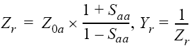
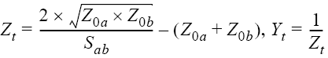
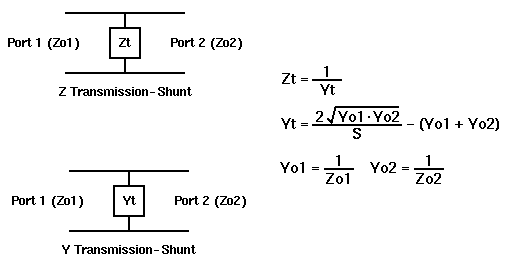

# Performing Parameter Conversion of Measurement Results

  * Overview

  * Selecting Conversion Target Parameter

[Other 'Analyze Data' topics](analyze_data.md)

## Overview

You can use the parameter conversion function to convert the measurement
results of the S-parameter (Sab) to the following parameters.

  * Equivalent impedance (Zr) and equivalent admittance (Yr) in reflection measurement  
  

  * Equivalent impedance (Zt) and equivalent admittance (Yt) in transmission measurement  
  

  * Inverse S-parameter (1/Sab)

where:

Z0a: Characteristic impedance of port a

Z0b: Characteristic impedance of port b

  * Z/Y Transmission Shunt  
  
  

  * Conjugation  
  
Conjugation converts the measurement value to complex conjugate number.  

When the fixture simulator function is ON and the port impedance function is
ON, the value set in the port impedance conversion is used. In other cases,
the system Z0 (preset value: 50 Ω) is used.

## Selecting Conversion Target Parameter

  1. Press Meas > Meas Setup > Conversions

  2. Select function.

Softkey | Function  
---|---  
Off | Off  
Z-Reflection | Impedance (Zr) in reflection measurement  
Z-Transmit | Impedance (Zt) in transmission measurement  
Z-Trans-Shunt | Impedance (Zt) Transmission Shunt  
Y-Reflection | Admittance (Yr) in reflection measurement  
Y-Transmit | Admittance (Yt) in transmission measurement  
Y-Trans-Shunt | Admittance (Yt) Transmission Shunt  
1/S | Inverse S-parameter  
Conjugation | Complex conjugate number  
  
* * *

