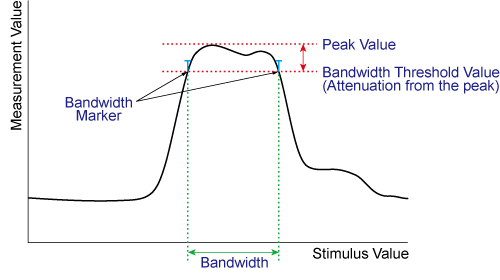
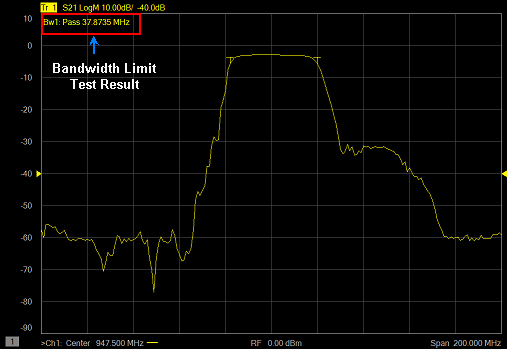
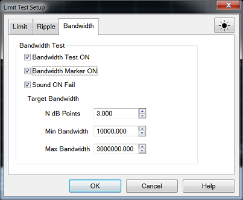

# Use Bandwidth Limit Test

  * [Overview](use_bandwidth_limit_test.md#OverviewBW)

  * [Displaying Bandwidth Limit Test Results](use_bandwidth_limit_test.md#DisplayBW)

  * [Bandwidth Limit Test Setup](use_bandwidth_limit_test.md#BWSetup)

[Other 'Analyze Data' topics](analyze_data.md)

## Overview

The bandwidth limit test function can be used for testing bandwidth for the
band-pass filters.

The bandwidth test find the peak of a signal in the passband and locates a
point on each side of the passband at an amplitude below the peak specified in
test setup. The frequency between these two points is the bandwidth of the
filter. Then, the obtained bandwidth is compared to minimum and maximum
allowable bandwidth that you specify beforehand.

## Displaying Bandwidth Limit Test Results

### Test Result for Trace

The test result for the trace will be indicated as Pass, Wide or Narrow in the
upper-left area of the graph by following BWn. "n" denotes the trace number.
You can also display the bandwidth value. If a trace is unsatisfactory, test
results and bandwidth markers are displayed by red color.

### Global Pass/Fail

The Global Pass/Fail setting in the limit tab is applied to bandwidth limit
test. It will be judged as failed if one or more unsatisfactory trace exists
in any of the bandwidth test within the channel.

## Bandwidth Limit Test Setup

You must set up the bandwidth threshold and the upper and lower limits before
you can use the bandwidth limit test function. You can specify the threshold,
upper limit and lower limit for each trace.

#### How to set Bandwidth Limit Setup  
  
---  
Using Hardkey/SoftTab/Softkey  
  
  1. Press Channel or Trace to select the trace on which you want to apply the bandwidth limit test function.
  2. Press Math > Analysis.
  3. Click Limits... and then select Bandwidth tab on the dialog box.

  
  
Bandwidth Test Setup Dialog Box Help  
---  
 Bandwidth Test Bandwidth Test ON \- Check
the box to set the bandwidth limit test ON or OFF. Bandwidth Marker ON \-
Check the box to make the bandwidth marker visible on the screen (Test still
runs even though the bandwidth marker does not turns on). Sound ON Fail \-
Check the box to turn ON when the bandwidth limit test is FAIL. Target
Bandwidth N dB Points \- Specify the bandwidth threshold in dB unit. Min
Bandwidth \- Enter the lower limit for the bandwidth in Hz unit. Max Bandwidth
\- Enter the upper limit for the bandwidth in Hz unit. Note: If the data
format is Smith chart or polar, the test is skipped.  
  
* * *

